    <picture>
    <source media="(prefers-color-scheme: dark)" srcset="banner-dark.svg">
    <source media="(prefers-color-scheme: light)" srcset="banner-light.svg">
    
    </picture>

Открытая база конспектов по дисциплинам computer science: лекции, переводы, разборы. Сайт собирается на Hugo и публикуется через GitHub Pages.

> **Дисклеймер.** Конспекты предоставляются «как есть» — это студенческие записи, не официальные материалы курсов. Они могут содержать неточности, пропуски и субъективные интерпретации. Перед экзаменом сверяйтесь с первоисточниками и лекциями преподавателя.

## Содержание

| Дисциплина | Преподаватель |
|---|---|
| [Математическая статистика](https://botaemeveryday.github.io/notes/posts/math-stats/) | Лимар И. А. |
| [Операционные системы](https://botaemeveryday.github.io/notes/posts/operation-systems/) | Маятин А. В. |
| [Технологии программирования на Java](https://botaemeveryday.github.io/notes/posts/java/) | Макаревич Р. Д. |
| [Базы данных](https://botaemeveryday.github.io/notes/posts/databases/) | Мацнев Н. И. |
| [Программирование на C++](https://botaemeveryday.github.io/notes/posts/cpp-sem2/) | Хвастунов А. П. |
| [Основы Программирования](https://botaemeveryday.github.io/notes/posts/cpp-sem1/) | Хвастунов А. П. |

## Как принять участие

Проект открыт для правок. Pull request'ы приветствуются в любом объёме — от опечатки до загрузки собственных конспектов.

- **Опечатка или неточность** — issue или сразу PR.
- **Дополнение конспекта** — правьте `content/posts/<курс>/<лекция>/index.md`.
- **Новая лекция** — добавьте директорию по образцу соседних.
- **Новый курс** — создайте директорию в `content/posts/` с `_index.md`.
- **Свои конспекты по курсу, который уже есть** — отдельная папка, связывается через `subject`.

Требования к структуре, front matter и шорткодам — в **[CONTRIBUTING.md](CONTRIBUTING.md)**. Каждый PR прогоняется через проверку front matter, сборку сайта и поиск битых ссылок; собранный сайт можно скачать из артефактов прогона.

## Лицензия

Код — MIT, см. [LICENSE.md](LICENSE.md). Тексты конспектов принадлежат их авторам.