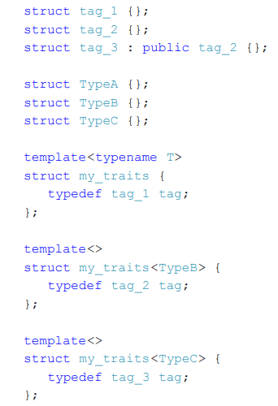
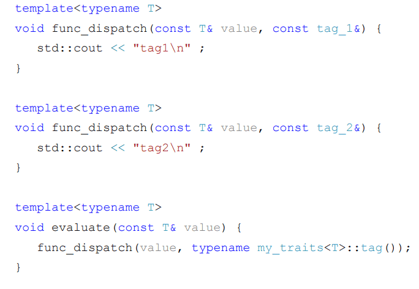

**2 семестр** \
Основы программирования. 

<!--more-->

```cpp

template <typename T>
class CSimpleAllocator {
public:
	pointer allocate(size_type size) {
		pointer result = static_cast <pointer> (malloc (size * sizeof(T)))
		if (result == nullptr) {
			//error
		}
		std::cout << "Allocate count" << size << " elenemts. Pointer" << result << std::endl;
		return result;
	}
	void deallocate (pointer p, size_type n) {
		std::cout << "Deallocate pointer: " << p << std::endl;
		free(p);
	}
}
```
**Зачем вообще всё это?** - https://habr.com/ru/articles/274827/ \
**Доп. инфа** - https://habr.com/ru/articles/505632/

### Allocator
\- это **класс, который отвечает за абстрагирование выделения и освобождения памяти для различных объектов**. Он предоставляет механизм для выделения и построения объектов, а также для освобождения и уничтожения этих объектов.
- У меня есть 2 новых метода:
	- хочу отдать память для н элементов для типа `Т`
	- у меня есть указатель, который я делал, теперь я хочу его удалить
- Часто может возникать потребность написать свой аллокатор (к примеру для листа выделять ноду)
	- если на каждую вставку вызывать маллок, то это не оптимально (обращаться к системе, брать память, мапить её на виртуальную таблицу)
	- долго и неудобно таскать с собой кеш процессора на разные участки памяти
	- Выводы: 
		- нужно аллоцировать память не каждый раз при аллокации. Т.е. единожды выделить память на много, а потом выдавать память, которую выделили ранее.
		- если выделить память на стеке, то обращение к ней будет быстрее
		- ex. Выделить массив памяти, а потом возвращать первый свободный элемент
			- указатель первого свободного элемента может выйти за пределы массива
- `rebind` объясняет компилятору, как имея аллокатор типа `Т` получить аллокатор типа U. То есть внутри реализации одного контейнера получаем ещё один аллокатор. 

Аллоцируем память каждый раз 

Тут игрались с аллокатором…

### StackAllocator

```cpp
#include <iostream>
#include <vector>

template<typename T, size_t SIZE>
class CStackAllocator {
public:
    typedef size_t size_type ;
    typedef ptrdiff_t difference_type ;
    typedef T* pointer ;
    typedef const T* const_pointer ;
    typedef T& reference ;
    typedef const T& const_reference ;
    typedef T value_type ;

    template<typename U>
    struct rebind
    {
        typedef CStackAllocator<T, SIZE> other;
    };
	// есть например std::list, какую память мы хотим выделять для листа? под одно число? - нет;  если добавляем еще один эллемент то нам нужно помимо value еще и 2 указателя (prev и next) . Т.е. аллокатор умеет выделять только под инты (или другой класс), поэтому нам нужен rebind

    pointer allocate(size_type n) {
        pointer result = buffer_ + size_;
        std::cout << "Allocate " << result << "  " <<  n << std::endl;
        size_ += n;
        return result;
    }
    void deallocate(pointer p, size_type n) {
        std::cout << "Deallocate " << p << " " << n << std::endl;
    }

private:
    T buffer_[SIZE];
    size_t size_ = 0;
};

int main(int, char**){
	StackAllocator<int, 100> al
	std::vector<int, StackAllocator<int,10>> v { };
    for(int i = 0; i < 10; ++i)
        v.push_back(i);
}
```

**Аллокаторы** - абстракция, которая знает про тип `Т` и для этого типа по умолчанию либо даёт память от `Size` элементов тип `T`


> [!quote] Как это грубо говоря работает
> у меня есть указатель на `n` элементов типа `T` верни мне память 


По сути мы передаём ответственность за память другим сущностям

Есть лист. Когда происходит вставка в лист, лист знает что он двусвязный список. Должны взять где-то память под ноду листа (значение и указатели)

Аллокатор эту память возвращает (ответственность на листе не лежит)

Аллокатор для проивзольного типа `Т` делает `malloc`. Есть память возвращают, то делает `free`

`std::allocator` работает примерно также

В векторе есть `capacity`, `size`,

- Адаптеры контейнеров - адаптируют контейнеры под другие интерфейсы:
	- стек
	- очередь
	- приоритетная очередь
- Адаптеры итераторов - это отдельный вид итераторов со специальным поведением. Они упрощают работу с контейнерами и бывают очень полезны в стандартных алгоритмах. (могут делать итераторы из других объектов) ([[https://pvs-studio.ru/ru/blog/terms/6561/?ysclid=m81qej4kj6941528928|дополнительная информация]])
	- `back_insert_iterator`
		- удовлетворяет требованиям выходного итератора
	- `front_insert_iterator`
	- `insert_iterator`
- Потоковые итераторы (см слайд)
    - Часто бывает, что поток содержит однотипные элементы. В таких случаях потоковые итераторы позволяют работать с потоком как с контейнером и использовать стандартные алгоритмы.
- Tag Dispatch Idiom (см слайд)


Как бы делаем теги для выбора разных перегрузок.. я хз...
- `iterator_traits`
Для разных итераторов использовать алгоритмы по-разному
- `inout_iterator_tag`