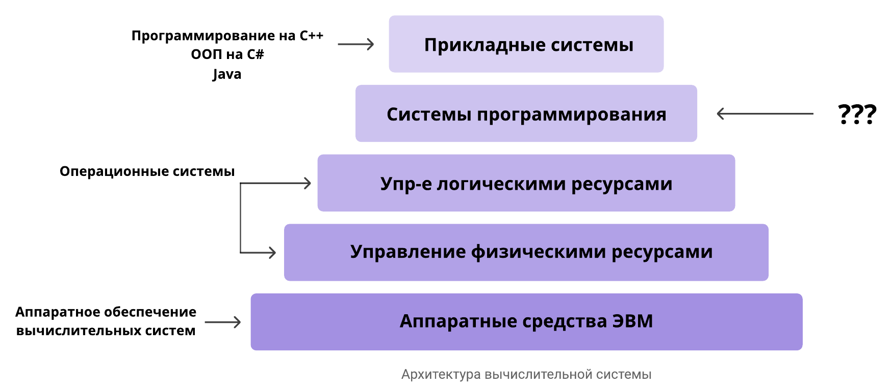
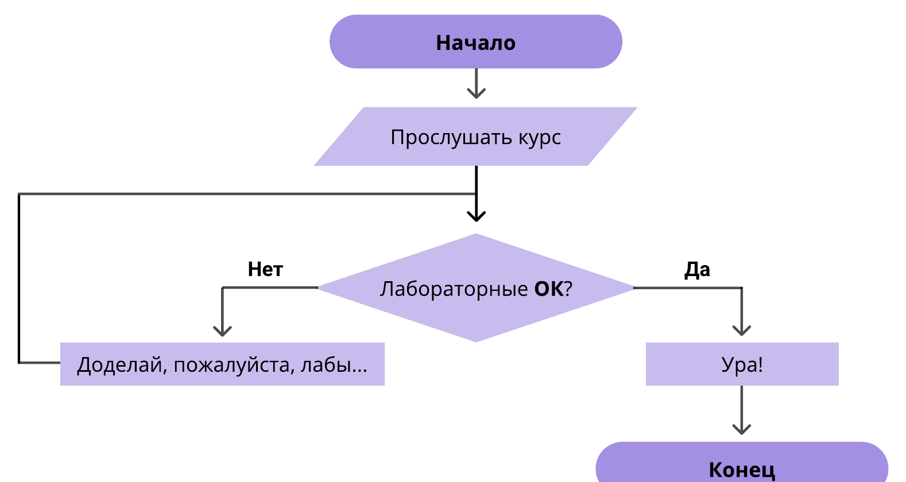
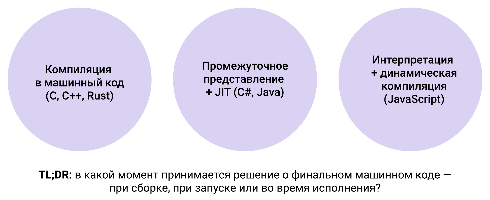

## О курсе

Курс «Платформы и среды выполнения языков программирования» ведёт Александра Михайловна Титова, старший специалист по технологическому обучению в Nexign.

Изначально курс задумывался как более современная и прикладная версия курса по компиляторам. Классические курсы по компиляторам — это жёсткая теория системного программирования, которая в работе нужна очень немногим: это узкая сфера, с задачами из которой большинство разработчиков просто не сталкивается. Курс переработан под учебный план так, чтобы быть максимально прикладным и актуальным для современного рынка IT.

### Место курса в учебном плане



Если посмотреть на «пирамидку» архитектуры вычислительной системы, почти все её уровни уже знакомы:

- **прикладные системы** — языки программирования (C++, C#, Java);
- **управление логическими и физическими ресурсами** — курс по операционным системам;
- **аппаратные средства ЭВМ** — курс по архитектуре.

Не затронута пока только вторая сверху ступень — **системы программирования**. Здесь и располагается этот курс: системное программирование, исполнение программ на определённых платформах и в определённых средах, оптимизация под эти платформы и вообще понимание процессов, которые происходят между моментом, когда код написан на высокоуровневом языке, и моментом, когда программа запущена. Визуально эту часть мы почти не наблюдаем (если не использовать специальные опции в терминале), но именно от неё зависит, будет ли программа в итоге работать эффективно и надёжно.

| Уже знаем | Узнаем в этом курсе |
| --- | --- |
| Ассемблерные инструкции | Как конструкции ЯП транслируются в машинные инструкции |
| Регистры, стек вызовов | Как среды выполнения управляют памятью и исполнением |
| Процессы, виртуальная память | Как анализировать бинарные файлы без исходного кода |
| Системные вызовы | Как оптимизировать код под своё железо |
| Фон-неймановская модель, цикл выборки-исполнения | |
| Синтаксис и семантика C++, C#, Java | |

Про каждый пункт справа:

- **Трансляция** — что происходит между кодом на C++ и ассемблером / машинными командами.
- **Управление памятью и исполнением** — в процессе сборки и запуска под капотом происходит очень много интересного: сохранение данных программы и самой программы в памяти и связывание всего этого в единый организм.
- **Элементы реверс-инжиниринга** — классическая ситуация: приходит какая-то экзешка, непонятно, что это и откуда; в песочнице запустили — понятнее не стало. Хочется понять, что внутри, какие библиотеки она использует, какие там модули. Будет одна или две CTF-like лабы, где нужно «развинтить по гайкам» чёрный ящик. Взламывать учить не будут, но инструментарий посмотрим — дальше всё на вашей совести.
- **Оптимизация под железо** — как под специфическое железо (в современном мире встречается достаточно часто), так и под более стандартные, широко используемые платформы, без углубления в редкие.

### Цели и задачи

**Цель:** получить глубокое понимание внутренних механизмов современных языков и систем программирования для создания эффективных решений с учётом специфики и ограничений аппаратного обеспечения.

Для этого нужно:

- получить представление о жизненном цикле программы от исходного кода до исполнения на процессоре;
- изучить архитектуру и принципы работы виртуальных машин и сред выполнения на примере CLR, JVM и V8;
- освоить методы анализа объектных файлов (промежуточных файлов, которые появляются, когда программа уже начала собираться, но ещё не запущена), таблиц символов и структур данных времени выполнения;
- получить практические навыки реверс-инжиниринга исполняемых файлов;
- изучить особенности языков критических систем и их сред выполнения — чем они отличаются от сред языков общего назначения (Rust и в том числе «локальные» языки: как с ними жить, если столкнётесь, и для чего они могут пригодиться);
- освоить методы профилирования и низкоуровневой оптимизации — уже не на уровне языка, а на уровне его трансляции в машинные команды.

### Зачем это нужно

1. **Многоязычность производственных систем.** Практически ни одна компания, даже маленькая, не работает с одним языком: фронтенд, бэкенд, отдельно прикрученный скриптовый язык для автоматизации и так далее. В больших компаниях пишут на десятках языков. Пример из жизни: на собеседовании в Google на вопрос «какой язык у вас основной?» ответ был — пишем на 10 языках одновременно, сложно сказать, какой основной. Важный навык — понимать, какой язык для каких задач используется, и уметь обосновать выбор языка под конкретную задачу.
2. **Разнообразие и специфика платформ.** Программы запускаются на огромном количестве разного железа. Иногда это радикальные истории (процессоры «Эльбрус», которые, как ни странно, в определённых сферах встречаются достаточно часто), но чаще у заказчика просто стоит какая-нибудь смешная железяка, и он хочет, чтобы всё работало именно на ней. Тогда крутиться приходится за счёт оптимизации под железо. Сюда же относятся критические системы, где крайне важны надёжность, производительность или и то и другое, — системы гражданской и военной инфраструктуры (например, софт для управления инфраструктурой городов; есть прекрасный кейс про метро).
3. **Экономика облачных вычислений.** Головная боль 2026 года (и предыдущих): брать в аренду облачные серверы вместо своих стало выгодно — пока не посчитаешь стоимость вычислений. Часто оказывается, что дешевле было купить что-то своё. Та же история сейчас повторяется с ИИ: внезапно нанять джуна оказывается дешевле, чем тратить миллионы токенов без вразумительного результата. Поэтому важно уметь оценить целесообразность и отрегулировать всё по производительности.
4. **Безопасность и анализ ПО.** Реверс-инжиниринг, чёрные ящики, CTF, анализ вредоносного ПО. В вакансиях вирусных аналитиков практически всегда есть требования про работу с бинарниками, анализ исполняемых файлов, дизассемблирование. Навыки полезные, хоть и применяются реже предыдущих.
5. **Эволюция моделей исполнения.** Современные среды исполнения становятся всё умнее и практически превращаются в отдельную инфраструктуру. Это сильно упрощает жизнь, но за упрощение платим потерей контроля. Когда сборщик мусора управляет памятью за нас, жить хорошо и весело — до первой утечки памяти. С ИИ-инструментами то же самое — до первого серьёзного бага.

**Бонус:** общие стандартные задачи сейчас достаточно хорошо решают ИИ (или джуны). Чтобы что-то из себя представлять как разработчик, нужно уметь решать специфические отраслевые задачи: не просто «прогаем на C++», а «прогаем на C++, владеем определёнными библиотеками и технологиями под определённое ПО в определённой предметной области». Тогда проблем с трудоустройством не будет — вы знаете, чего хотите, и можете объяснить это работодателю. Для специфических задач нужны специфические инструменты и глубокое понимание того, как они работают.

### Структура курса

| № | Раздел |
| --- | --- |
| 1 | **Жизненный цикл программы:** препроцессинг, компиляция, статическая и динамическая компоновка, объектные файлы |
| 2 | **Ландшафт памяти:** типизация объектов и размещение в памяти, выравнивание данных и стоимость аллокаций |
| 3 | **Исполнение программ:** компилируемые, интерпретируемые и JIT-языки, байткод, виртуальные машины |
| 4 | **Ассемблер для разработчика:** чтение, оптимизация, Compiler Explorer |
| 5 | **Основы реверс-инжиниринга:** анализ исполняемых файлов, дизассемблирование |
| 6 | **Языки критических систем:** Rust, Ada, Erlang |
| 7 | **Низкоуровневая оптимизация:** кэш-промахи, векторизация, профилирование |

Пара уточнений:

- **Ландшафт памяти** — как объекты (например, C++) размещаются в памяти и как с этим размещением работать ради экономии памяти и повышения эффективности программы.
- **Исполнение программ** — заодно немного залезем в виртуализацию.
- **Ассемблер** — снова, но в этот раз без написания кода: интересует чтение ассемблерных листингов, оптимизации и раскрутка чёрных ящиков.
- **Низкоуровневая оптимизация** — без углубления в конкретные системы (с критическими системами будут работать не все), но с разбором логики и процессов: как действовать, если столкнулся с такой задачей, и что может помочь.

### Аттестация



Курс засчитывается по выполнению практических работ — мини-лабораторок, которые выдаются каждую неделю. Если к концу курса лабы сделаны (с погрешностью в 1–2), вопросов нет. Если доказательств работы в семестре в виде артефактов лабораторок нет — будут вопросики, и решаться всё будет экзаменом или доделыванием лаб.

Вместо лабораторок можно прийти с рабочими проектами, если они действительно коррелируют с темой курса, — это нужно будет доказать. Подойдут интересные кейсы с разными языками, которые можно раскрыть и которые не покрывает NDA.

Практика поделена на две подгруппы только потому, что всех сложно уместить в одну аудиторию или конференцию. Можно приходить с другой подгруппой, если так удобнее, — содержание практически то же самое.

### Источники

Книги и материалы по технологиям устаревают быстрее, чем издаются, поэтому читать имеет смысл либо что-то по-настоящему фундаментальное (хардкорные книги по классической теории), либо что-то необычное и действительно интересное.

**Теория**

- Брайант Р., О'Халларон Д. «Компьютерные системы: архитектура и программирование», 3-е изд. — любимая книга преподавателя. Интересуют главы по компоновке и виртуальной памяти. Возможно, уже встречалась в курсах по архитектуре или ОС.

**C#**

- The Book of the Runtime (BOTR) — официальный сборник документации.
- Станислав Сидристый, «Архитектура платформы .NET» — хардкор на русском, лежит на GitHub: <https://github.com/sidristij/dotnetbook/>. Если работаете с C#, замечательное чтиво.

(Рихтер — тоже вариант. Что эффективнее, книги или документация, — вопрос того, как вам легче усваивается.)

**Java**

- The Java Virtual Machine Specification, Java SE 26 Edition — спецификация JVM.

**Для самостоятельного изучения**

- Материалы конференций: CppCon, RustConf, Highload++. Сейчас это один из самых полезных вариантов: там можно подцепить техники и технологии, которые прямо сейчас используются в индустрии и которым не научат ни в вузе, ни на этих занятиях.

## Раздел 1. Жизненный цикл программы и модели исполнения

Часть материала будет пересекаться с уже изученным — считаем это возможностью освежить знания и, может быть, узнать что-то новое.

### Среда исполнения

**Среда исполнения (runtime)** — слой программного обеспечения между скомпилированной программой и операционной системой или аппаратурой.

Встречаются оба названия — «среда исполнения» и «среда выполнения»; вероятно, это косяк перевода. По-английски в любом случае runtime.

```
исходный код → промежуточный или машинный код → среда исполнения → ОС → железо
```

Среда исполнения — это слой между программой как кодом и программой как алгоритмом, исполняющимся на железе. Он часто выпадает из поля зрения, но крайне важен.

**Функции среды исполнения:**

- **Управление памятью** — выделение (аллокация), очистка, сборка мусора. От этого напрямую зависят эффективность программы, производительность и баги, которые можно словить.
- **Разрешение вызовов и связывание компонентов** — как программа из «стены кода» или модулей превращается в кусочки промежуточного или машинного кода, которые связываются между собой и вызываются в нужные моменты.
- **Обеспечение безопасности и изоляции** — за ОС в этом плане среда, конечно, не вылезет, но часть функций, в первую очередь безопасность памяти, берёт на себя.
- **Оптимизация кода во время исполнения** — интуитивно кажется, что когда программа написана, все оптимизации уже проведены и больше ничего сделать нельзя. В эту ловушку особенно попадают те, кто пишет в основном на компилируемых языках (на плюсах). Но в некоторых средах код продолжает оптимизироваться во время исполнения — оптимизировать можно не только до сборки, но и после.
- **Взаимодействие с операционной системой** — самая понятная функция.

### Модели исполнения



Вспоминаем: есть компилируемые языки, интерпретируемые и языки с промежуточным представлением (транслируют код не в машинный код, а в байткод и запускают его на виртуальной машине — среде выполнения, которая представляет собой практически полноценную систему).

Отсюда три модели:

1. **Компиляция в машинный код** — C, C++, Rust.
2. **Промежуточное представление + JIT** (Just-in-Time compilation) — C#, Java; языки, использующие виртуализацию.
3. **Интерпретация + динамическая компиляция** — скриптовые языки: JavaScript, Python. Они не собираются в экзешник, а берутся и запускаются по ходу дела.

**Основная разница между моделями — в какой момент принимается решение о финальном машинном коде:** при сборке, при запуске или во время исполнения.

#### Модель 1: компиляция в машинный код

```
Исходный код → компилятор → машинный код целевой архитектуры → исполняемый файл → загрузка ОС → исполнение
```

То есть: есть файл `.cpp`, открываем IDE, консоль или инструменты сборки, компилируем, получаем машинный код под целевую архитектуру (под нашу машину), получаем исполняемый файл, загружаем его в ОС — и он исполняется под её контролем.

**Примеры:** C, C++, Rust, Go.

Уже здесь можно заметить: языки этой модели работают быстро и позволяют достаточно глубоко работать если не прямо с железом, то хотя бы с памятью. C и C++ позволяют писать очень высокоэффективные программы, Rust очень хорошо работает с памятью (владение), но по другой парадигме, Go позволяет делать высокопроизводительные серверные вычисления. Они такие именно потому, что компилируемые.

**Характеристики:**

- **Финальный машинный код известен до запуска.** После сборки большая часть кода зафиксирована и уже оптимизирована компилятором под целевую платформу (с некоторыми оговорками про динамическую компоновку — это будет в разделе про линковку).
- **Среда выполнения минимальна:** загрузчик ОС, стандартная библиотека, аллокатор. За счёт этого и прирост скорости: во-первых, не нужно проходить через промежуточную ступень рантайма, во-вторых, особенности конкретной платформы уже учтены при сборке. Фактически никакой задержки от «движка».
- **Управление памятью ручное или детерминированное** (владение в Rust). C и C++ позволяют работать с памятью достаточно прицельно.

Оговорка про Go: управление памятью там автоматическое. Здесь играет роль архитектура самого языка — техническая возможность работать с памятью напрямую есть, но её часто ограничивают на уровне языка, чтобы программисты не стреляли себе в ноги (как шутят про C и C++).

**Где применяются:** высокопроизводительные вычисления и real-time системы. Под real-time в 2026 году, как ни странно, в первую очередь подразумеваются компьютерные игры, а также быстрые серверные вычисления для систем с высокой нагрузкой.

#### Модель 2: промежуточное представление

```
Исходный код → компилятор → промежуточный код (байткод) → среда исполнения (CLR/JVM) → JIT-компилятор → машинный код → исполнение
```

Начинается всё так же — исходный код, компилятор, — но собирается он не в финальный машинный код, а в промежуточный код (байткод), который запускается в среде исполнения. Дальше подключается JIT-компиляция — «допиливание» кода уже в процессе исполнения. То есть магия происходит уже после того, как программа вроде бы собрана.

> **JIT-компиляция** (Just-In-Time compilation, компиляция «точно в нужное время») — производимая во время выполнения процедура преобразования интерпретируемого варианта исполнения программы в программу на языке процессора.

**Примеры:** C#, Java.

**Характеристики:**

- **Промежуточный код переносим между архитектурами.** Он пишется не для конечной целевой платформы, а по сути для виртуальной машины. Программа на компилируемом языке, собранная под конкретную платформу, будет там работать супербыстро, но если её перетащить на другую архитектуру, никто не гарантирует, что она вообще заработает, а тем более заработает хорошо. Если нужна переносимость — вторая модель может оказаться оптимальнее.
- **Финальный машинный код порождается при запуске или во время исполнения.**
- **Управление памятью автоматическое:** сборщик мусора.

**Где применяются:** более «бизнесовые» и масштабируемые приложения. Их пилят не под конкретную платформу, чтобы работали очень быстро и надёжно, а под множество разных платформ — чтобы работали везде и у всех. Эта разница напрямую вытекает из моделей исполнения.

#### Модель 3: интерпретация

```
Исходный код → парсер → промежуточное представление → интерпретатор → оптимизирующий компилятор для горячих участков → машинный код → исполнение
```

**Примеры:** JavaScript, Python — самые распространённые. С Python, если заглянуть под капот, тоже всё интересно. Есть популярная шутка, что Python написан на C, — на самом деле это не шутка (в зависимости от реализации).

**Характеристики:**

- **Код анализируется при запуске**, этапа предварительной сборки (компиляции) нет.
- **Интерпретатор выполняет код сразу**, горячие участки компилируются.
- **Управление памятью автоматическое:** сборщик мусора.

Отсюда растут и преимущества, и недостатки. На Python очень здорово прототипировать: что бы ты ни написал, оно будет работать — буквально на коленке. Отчасти поэтому он стал популярным для ML и Data Science: можно быстренько что-то накидать, и оно заработает, не нужно углубляться в архитектуру и быть «супертрушным» программистом. Такими языками могут пользоваться люди, которые знают предметную область, но не сильно шарят в разработке, потому что язык многое делает за них.

Обратная сторона: в критических системах, где надёжность важнее скорости разработки, Python вряд ли устроит. Код можно писать и запускать построчно (контекст от строчки к строчке, как в Jupyter), и в какой-то момент Python просто не знает, что будет дальше, — никакой детерминированности. Это здорово в одних задачах и совсем не здорово в других.

#### Сравнение моделей

| Критерий | Компиляция в машинный код | Промежуточный код + JIT | Интерпретация + динамическая компиляция |
| --- | --- | --- | --- |
| Примеры языков | C, C++, Rust | C#, Java | JavaScript |
| Момент получения машинного кода | При сборке | При запуске / во время исполнения | Во время исполнения |
| Переносимость | Под целевую архитектуру | Высокая | Высокая |
| Управление памятью | Ручное / детерминированное | Сборщик мусора | Сборщик мусора |
| Среда выполнения | Минимальная | Полноценная VM | Движок |
| Время запуска | Быстрое | Среднее | Зависит от движка |

Если нужно ручное и достаточно строгое управление памятью — искать его, скорее всего, стоит в компилируемых языках. Сюда же можно отнести абстрактную категорию скорости выполнения задач. Отсюда же ответ на вопрос, почему олимпиадные задачи пишут на плюсах: плюсы просто быстрые и позволяют легко и комфортно (тут можно поспорить) оптимизировать скорость работы. На Python можно быстро накидать решение практически чего угодно, но оно не пройдёт по времени, и толку не будет.

### Три состояния программы

1. **Программа как текст** — исходный код, читаемый человеком.
2. **Программа как данные** — объектный файл, сборка, байткод; структуры, готовые к компоновке или загрузке (в том числе байткод, готовый к запуску на виртуальной машине).
3. **Программа как процесс** — код, размещённый в памяти и исполняемый процессором.

**Вопрос:** какие преобразования переводят программу из одного состояния в другое? Получается такой конечный автомат в миниатюре.

### Общая схема трансляции

Процесс перехода от исходного кода к исполняемому процессу в памяти называется **трансляцией**. Конвейер (в общем виде, на примере компилируемых языков):

```
Исходный код → препроцессор → компилятор → ассемблер → объектный файл → компоновщик → исполняемый файл → загрузчик → процесс в памяти
```

Компоновку также называют линковкой — термины часто взаимозаменяются.

### Артефакты трансляции

**Артефакты** — всё, что на разных этапах трансляции получает физическое отражение в памяти компьютера. Чаще всего это файлы с разными расширениями.

| Этап | Команда | Результирующий файл | Содержимое |
| --- | --- | --- | --- |
| Препроцессинг | `gcc -E` | `.i` | Текст с раскрытыми директивами |
| Компиляция | `gcc -S` | `.s` | Код на языке ассемблера |
| Ассемблирование | `gcc -c` | `.o` | Машинный код, объектный файл |
| Компоновка | `gcc` | исполняемый файл | Готовая к запуску программа |

- `.i` — по сути тот же исходный код, но с раскрытыми моментами, которые понятны на этапе статического анализа: директивы препроцессора, макросы, `#ifdef` и т. д.
- `.s` — ассемблерный код.
- `.o` — объектный файл: частично машинный код, частично инструкции целевой платформы. Достаточно страшная мешанина, но у неё есть структура.
- Исполняемый файл — на этапе компоновки вся «объектная ерунда» становится готовой к запуску программой. Статической и динамической компоновке будет посвящена отдельная лекция: процесс очень интересный, там многое можно понять — и много где можно накосячить.

Первая лабораторная — как раз пройти все эти шаги по этапам, заглянуть во все артефакты и посмотреть, что там появляется, откуда и почему.

### Препроцессинг

Что делает препроцессор:

- раскрывает директивы `#include`;
- раскрывает макросы `#define`;
- обрабатывает условную компиляцию (`#ifdef`, `#ifndef`, `#endif`);
- удаляет то, что не пойдёт в программу, например комментарии.

```c
// Исходный код:
#define SQUARE(x) x * x
int r = SQUARE(2 + 3);

// После раскрытия:
int r = 2 + 3 * 2 + 3;
```

```bash
gcc -E source.c -o source.i
```

Флаг `-E` задаёт, на каком этапе остановить трансляцию, — после препроцессинга. На выходе файл `source.i` со всеми развёртками.

### Компиляция: фронтенд

После препроцессинга идёт более сложный анализ кода — компиляция. Она делится на условные фронтенд и бэкенд.

1. **Лексический анализ** — разбиение текста на токены: ключевые слова, идентификаторы, операторы, литералы. Смысл термина «токен» практически такой же, как в языковых моделях, — единица информации. Грамматики языков программирования анализируются во многом так же, как нормальные человеческие языки.
2. **Синтаксический анализ** — построение дерева разбора (абстрактного синтаксического дерева).
3. **Семантический анализ** — проверка типов, областей видимости, генерация промежуточного представления.

```bash
gcc -S source.i -o source.s
```

Флаг `-S` останавливает трансляцию после компиляции — можно открыть `.s` и посмотреть, во что превратились инструкции на высокоуровневом языке. Иногда они превращаются во что-то крайне интересное. Есть мем про «преступления против программирования» (programming war crimes) — как раз про то, как компиляторы иногда неочевидно преобразуют код в ассемблерные инструкции. Иногда это регламентируется странными стандартами, о которых вы понятия не имеете. Очень полезно туда заглянуть, ужаснуться, понять, что так можно было, — и что-то поменять или, наоборот, не менять.

### Компиляция: бэкенд

Бэкенд отвечает за оптимизацию и подготовку артефактов, связанных с целевой платформой:

- оптимизации промежуточного представления;
- распределение регистров;
- планирование инструкций;
- генерация кода на языке ассемблера или машинного кода.

### Ассемблирование

Ассемблер преобразует код на языке ассемблера в машинный код. Ассемблер ещё более-менее читабелен, и на нём даже можно программировать (хоть это и неприятно), а машинный код понятен машине, но человеком практически не читается.

Что делает ассемблер:

- преобразует код на языке ассемблера в машинный код;
- формирует объектный файл с секциями кода и данных;
- создаёт таблицу символов.

```
Ассемблер:     mov dword [ebp-12], 2
Машинный код:  c7 45 f4 02 00 00 00
```

```bash
gcc -c source.s -o source.o
```

Внутри `.o` будет не очень читабельно, но довольно интересно. Подробно — в следующих разделах.

### Пример: сборка из двух модулей

Стандартная программа из двух файлов: в `main.c` лежит функция `main`, в `sum.c` — функция, которую из `main` вызывают.

```bash
gcc -Og -o prog main.c sum.c
```

Что делает драйвер GCC:

1. Препроцессор: `main.c → main.i`.
2. Компилятор: `main.i → main.s`.
3. Ассемблер: `main.s → main.o`.
4. Компоновщик: `main.o + sum.o + системные объектные файлы → prog`.

### Что дальше?

```
Объектные файлы → компоновщик → исполняемый файл → загрузчик ОС → процесс в памяти
```

Компоновщик (линковщик) связывает объектные файлы между собой и с целевой платформой.

### Управляемые (managed) среды

Общие черты:

- автоматическое управление памятью (сборщик мусора);
- переносимый промежуточный код (байткод);
- метаданные и рефлексия;
- динамическая загрузка компонентов — догрузка и дооптимизация кода уже во время исполнения;
- оптимизация кода во время исполнения (JIT);
- обработка исключений и безопасность.

**Примеры:** CLR, JVM, V8.

Про управляемые среды можно запилить отдельную лекцию — понятие очень широкое, там много всего происходит. Подробнее — в книгах из списка источников (по .NET, CLR и т. д.), это скорее дополнительное ответвление курса.

### Какие ещё бывают среды

- **Неуправляемые (native / unmanaged)** — код компилируется прямо в машинный код и работает с памятью напрямую (C, C++).
- **Изолированные / контейнеризованные (containers)** — окружения уровня ОС (например, Docker), которые изолируют приложение и его зависимости, но используют ядро хоста. Запускаются не столько на целевой машине, сколько на промежуточной, подогнанной под наши задачи. Про виртуализацию и контейнеризацию будет дополнительно позже.
- **Облачные / бессерверные (serverless / FaaS)** — среды вроде AWS Lambda или Яндекс.Функций, которые запускают код по событию, полностью скрывая инфраструктуру. Используются в первую очередь для веб-приложений в инфраструктуре облачного провайдера. Если работаете с ними — стоит почитать дополнительно.

### Байткод

Байткод — ещё одно промежуточное представление (вдобавок к объектному и ассемблерному коду).

- Байткод — **переносимое** промежуточное представление, исполняемое виртуальной машиной. Ассемблер специфичен для конкретной архитектуры, объектный код — для конкретной платформы (практически для конкретной машины), а байткод исполняется на виртуальной машине, которую можно развернуть в другом месте, и всё будет работать.
- Позволяет запускать один и тот же код на разных архитектурах без перекомпиляции. Эта деталь часто играет большую роль при выборе языка под задачу.
- Используется в JVM, CLR, V8, а также в других системах.
- Виртуальная машина может быть реализована как интерпретатор, как JIT-компилятор или как комбинация обоих подходов.

Комбинированные подходы сейчас практически везде превалируют: идеальных эталонных примеров какой-то одной из трёх моделей в современных системах почти не встречается. Современные среды выполнения чаще всего комбинированные и берут лучшее от разных моделей.

### Компоновка в управляемых средах

- **В компилируемых языках** компоновка выполняется на этапе сборки и создаёт исполняемый файл. Код привязывается к конкретной платформе: выделяются конкретные области памяти, связи между модулями и т. д. (будут и задачки на ручную компоновку).
- **В управляемых средах** разрешение зависимостей выполняется динамически, на этапе выполнения: среда сама находит сборки или (в случае Java) классы, подгружает их на лету и связывает типы.
- **Преимущество:** обновление компонентов без пересборки всего приложения. В C++, если что-то где-то поменялось, пересобирать нужно всё: меняется структура программы, расположение объектов в памяти, адреса — старые файлы уже не применить, нужно заново линковать. В управляемых средах так делать не надо, и в больших проектах это очень приятно — модуль можно присоединить прямо в процессе.
- **Особенность:** за всё приходится платить — нужна среда выполнения, толстая прослойка, на загрузку и поддержание которой тратятся ресурсы. С этим сейчас борются, тоже комбинируя подходы (например, Bazel кэширует сборку).

## TL;DR

1. Программа проходит цепочку преобразований: исходный код, промежуточное представление (от объектных файлов до байткода), машинный код, исполнение.
2. Среда выполнения — посредник между высокоуровневыми абстракциями языка и аппаратурой.
3. Существуют различные модели исполнения: компиляция в машинный код, промежуточный код с JIT, интерпретация с динамической компиляцией.
4. Границы между моделями размываются в современных реализациях. Универсального подхода в ближайшее время вряд ли появится — подходы будут комбинироваться, поэтому важно понимать их плюсы и минусы.
5. Понимание этих механизмов необходимо для оптимизации, диагностики ошибок и обеспечения безопасности.

## Проверить себя

1. Чем среда выполнения отличается от компилятора?
2. В какой момент получается финальный машинный код в компилируемых языках, в языках с JIT, в интерпретируемых языках?
3. Что такое байткод и какие преимущества он даёт?
4. Чем объектный файл отличается от исполняемого?
5. Какие этапы проходит исходный код до получения исполняемого файла?

Если какой-то из вопросов пока непонятен — стоит что-то ещё посмотреть, спросить или почитать.

## Что дальше

На следующей лекции — объектные файлы, один из самых интересных артефактов: структура переносимых объектных файлов на примере ELF в Unix-подобных ОС, какие там есть разделы, для чего они служат и как это читать. Затем две лекции по рабочей программе — статическая и динамическая компоновка, то есть привязка кода к конкретной машине: прежде чем переходить к оптимизации, нужно понять, как эта привязка происходит.
