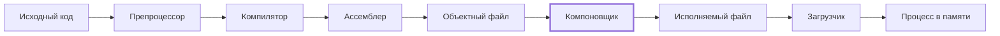
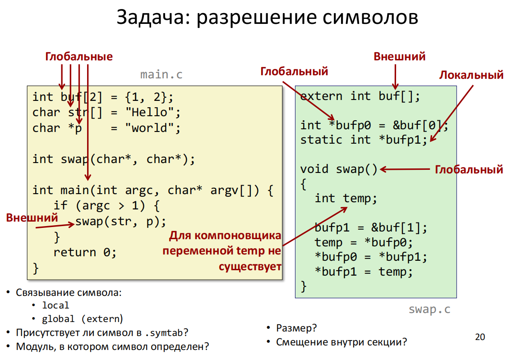
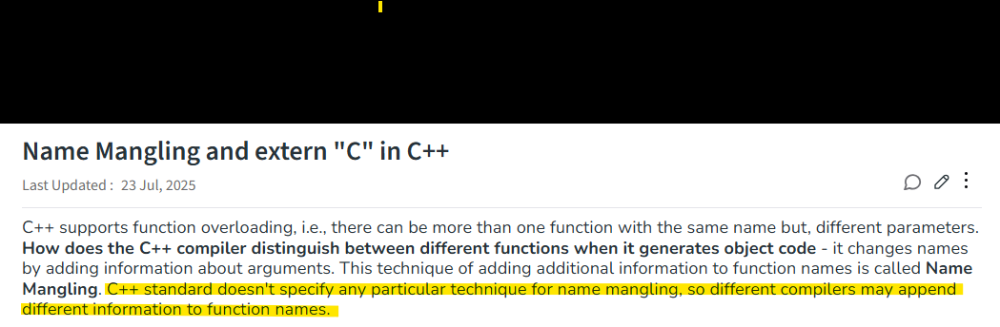
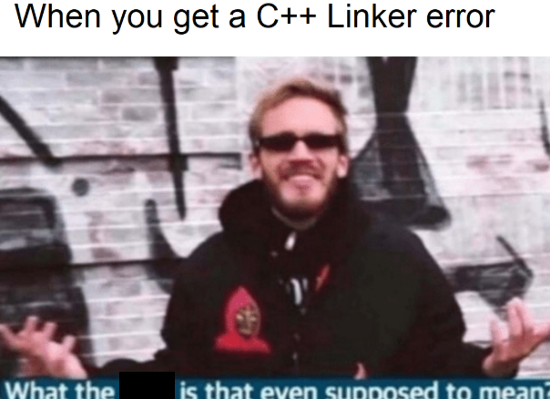

## Где мы находимся

Продолжаем раздел «Жизненный цикл программы» и идём дальше по конвейеру трансляции. В прошлый раз разбирали объектные файлы: какие в них есть секции, как разные части программы по ним раскладываются и как в объектник можно заглянуть. Теперь доходим до следующей стадии — **компоновки**.



После ассемблера у нас есть объектные файлы со скомпилированным кодом модулей. Но запускать это ещё нельзя: пока что это **перемещаемые** объектные файлы — отдельные кусочки, которые надо связать между собой. Этим и занимается компоновщик (он же линковщик; «компоновка» и «линковка» — одно и то же).

На практике компоновщик раскладывает инструкции и данные по адресам — пока не в памяти во время исполнения, а внутри собираемого исполняемого файла. До этого у всего были относительные адреса, теперь появляются абсолютные.

> Вспоминаем аналогию с домом из конструктора. Его собирали по частям, и ступеньки лестницы считались от начала крыльца. Но в итоговом доме лестница вовсе не обязательно окажется в самом начале: перед ней могут встать другие модули, после неё тоже. Значит, ступеньки придётся пересчитать уже абсолютно, и их номера поменяются. С кодом при компоновке происходит то же самое.

### Что получает компоновщик

На входе у компоновщика:

- **секции** объектных файлов;
- **таблицы символов**;
- **записи релокаций** — информация о том, как модули будут «переезжать» туда, где должны оказаться в итоговом файле.

Часть ссылок при этом ещё не разрешена. Если мы вызываем функцию из другого модуля, в объектнике есть только пометка «это надо где-то найти», а где именно и по какому адресу — непонятно.

Отсюда **две задачи компоновщика**:

1. **Разрешение символов** — под символами в первую очередь понимаем переменные и функции (на более низком уровне всё сводится к данным и инструкциям).
2. **Релокация (перемещение)** — размещение кода и данных по адресам в исполняемом файле.

Итого компоновщик собирает итоговый макет программы из модулей, которые собраны внутри себя, но не состыкованы между собой. Такой конструктор внутри конструктора.

## Символы объектного файла

Символы делим не по их смыслу внутри кода, а по их смыслу **для компоновщика**. А для компоновщика главная ценность — связи между модулями. Поэтому символы бывают:

| Вид | Что это |
|---|---|
| **Глобальные** | определения, доступные другим единицам трансляции (другим модулям) |
| **Локальные** | определены и используются в одном и том же модуле, никуда наружу не уходят — самый простой вариант |
| **Неопределённые** | символы, для которых в данном `.o` нет определения |

> [!WARNING]
> Локальная переменная функции ≠ локальный символ компоновщика.

Термины «глобальный» и «локальный» здесь пересекаются с терминами языка, но значат не всегда то же самое. Локальная переменная функции вообще не становится символом: вспоминаем пример с прошлого занятия, где такая переменная анонимно уезжала на стек и там делала свою работу.

С неопределёнными символами проще всего зайти так: определение у символа где-то есть, просто не в этом файле. Вероятно, оно встретится в другом объектнике, и **для того** файла оно уже будет глобальным. То есть один и тот же символ для своего модуля — глобальный, а для модуля, который его использует, — внешний (неопределённый). Поэтому локальность и глобальность всегда рассматриваем относительно конкретного модуля.

### Пример: main.c и swap.c

Хороший пример со слайда курса ВМК МГУ:



*Источник: http://asmcourse.cs.msu.ru*

Что здесь происходит:

- В `main.c` глобальные символы — функция `main` и **инициализированные** глобальные переменные `buf`, `str`, `p`.
- Вызов `swap(str, p)` в `main.c` — **внешний** символ: функция определена в соседнем модуле.
- В `swap.c` тот же `swap` уже **глобальный**: он там определён и доступен другим модулям — например, `main.c`, который его вызывает.
- В обратную сторону то же самое: `buf` глобален в `main.c`, а в `swap.c` он подключается через `extern` и для этого модуля является внешним.
- `static int *bufp1` — локальный символ модуля `swap.c`.
- `temp` — локальная переменная функции; для компоновщика её просто не существует.

Работа компоновщика — со всем этим разобраться. Видит он в `main.o` внешний `swap` — значит, надо найти `swap` в другом модуле и решить, что с ним делать. А если кандидатов на `swap` найдётся несколько, ещё и выбрать, какой брать. В любом случае `swap` должен получить адрес в исполняемом файле.

## Strong, weak и common символы

Есть ещё одна классификация, похожая по смыслу на предыдущую, но смысл здесь сдвигается от отдельных объектников к процессу компоновки в целом. Она нужна, чтобы расставить **приоритеты**: пока компоновщик не дошёл до другого модуля, он не знает, будет ли там один кандидат на символ, несколько, и какой из них главнее.

| Механизм | Представление / смысл |
|---|---|
| **Strong definition** | функции и инициализированные глобальные переменные |
| **Weak definition** | неинициализированные глобальные переменные (`STB_WEAK`) — у них более низкий приоритет |
| **Common symbol** | `SHN_COMMON`, типичный результат `-fcommon` для tentative definition в C |

С сильными всё более-менее понятно (хотя с функциями есть зарытая собака — перегрузки, о них ниже). Слабые по сравнению с сильными менее важны для компоновщика — не то чтобы совсем неважны, но приоритет у них ниже.

**Common-символы** — самые неприятные и ошибкогенерящие ребята. Это, так сказать, всё, что не пошло в первые две категории. Именно здесь кроется основная часть проблем, связанных с компоновщиком: что-то уехало в common, и с этим потом надо как-то жить. В современных стандартах от common-символов всеми силами пытаются избавиться (флаги `-fcommon` / `-fno-common`, об этом в конце).

## Правила разрешения символов

Для GNU ELF-компоновки правила довольно простые:

1. **Несколько сильных определений одного символа** → ошибка линковки. Одна из самых понятных: например, в разных модулях определили функции с одинаковыми именами и наборами параметров. Компоновщик не знает, какую брать, и прямо об этом говорит.
2. **Одно сильное + слабые** → сильное имеет приоритет. Например, в одном модуле инициализированная глобальная переменная, в другом — неинициализированная с тем же именем. Компоновщик закроет глаза на неинициализированную, сделает вид, что её не видел, и возьмёт вариант с меньшей неопределённостью.
3. **Несколько слабых** → выбор за компоновщиком. Тут уже интересно, но грустно: результат зависит от версии, от конкретного компоновщика, от архитектуры. Своего рода undefined behavior, только не на уровне языка, а на уровне сборки.
4. **Common-символы** обрабатываются отдельно. Если они не запрещены (а сейчас чаще всего запрещены по умолчанию), несколько common-определений могут **объединиться** — компоновщик посчитает их одним объектом. Если же где-то есть более сильное определение, common игнорируются и выбор делается по предыдущим правилам.

То есть: три приоритета, правила разрешения и, в худшем случае, ситуации, когда приходится полагаться на компоновщик или разгребать всё вручную.

### Пример: как `x` затирает `y`

Самый грустный вариант на практике:

```c
// module1.c
int y = 15212;
int x = 15213;
```

```c
// module2.c
double x;
void f(void) { x = -0.0; }
```

Разбираем по правилам:

- `module1.c`: `int y = 15212;` и `int x = 15213;` — инициализированные переменные → **сильные** символы.
- `module2.c`: `double x;` — неинициализированная переменная → **слабый** символ. Но в объектнике `module2.o` он остаётся, и функция `f` его использует.
- Одно сильное и слабое определение → выбирается **сильное**, то есть `int x` из первого модуля.

Дальше вызывается `f()` из `module2.c`. Компилятор сгенерировал для неё код, исходя из того, что `x` — это `double`, то есть **8 байт**, а не 4, как в первом модуле. Компоновщик же решил, что `double x` — ерунда какая-то, слабый символ и вообще не инициализирован. В итоге код для `double x` работает с памятью обычного `int x`, залезает на соседнюю ячейку и затирает `y`.

Обратите внимание, что там не просто `0`, а `-0.0` — это влияет на бит знака. То есть в `x` будут не просто нули во всех битах, а ещё и единичка в знаковом бите. Она-то и уезжает в `y`.

**В худшем случае:** `x = 0`, `y = 0x80000000`.

(То, что `double` может зацепить соседние ячейки памяти, мы уже немного задевали на предыдущих занятиях — вот теперь понятно, почему.)

Самое опасное в этой ерунде — **ни одной ошибки** вы не увидите: ни от компилятора, ни от компоновщика. Если всё не споткнулось о флаги и стандарты и прошло незамеченным, память просто тихо попортится.

> [!NOTE]
> - **Исторический сценарий:** несовместимые определения `x` могут быть объединены.
> - **Современный сценарий:** зависит от платформы, но успешная линковка **не гарантирует** корректности программы.
>
> На современных платформах такое чаще всего запрещено флагами по умолчанию — но не факт. В сложных проектах с большим количеством модулей на эту ошибку вполне можно напороться: баг не исчез полностью.

## Дальше больше: name mangling в C++

Ещё одна проблема разрешения символов — **перегруженные функции**. Немного исторического контекста: идея компилятора, компоновщика и сборки объектных файлов создавалась во времена чистого C, когда никакого навороченного функционала, например классов, не было. И компоновщик даже сейчас, в 2026 году, если его не ткнуть носом, ничего не знает про ваши классы и про то, что со всей этой красотой делать. В том числе — что делать с перегрузками.

Решается это топорно: функциям присваиваются **специальные разные имена**. Вспоминаем историю с переменными `x` в двух разных функциях, которые при сборке превращались в `x.1` и `x.2`. Вся магия с областями видимости доступна нам, а компилятор и особенно компоновщик — сущности более древние и хтонические, они про всё это знать не знают. Поэтому они создают себе удобные разные имена и дальше работают с ними как с просто разными функциями.



Ключевое со слайда: стандарт C++ не задаёт конкретную технику name mangling, поэтому разные компиляторы могут дописывать к именам функций разную информацию.

История интересная и тоже довольно ошибкогенерящая — можно погуглить по словам **name mangling C++**. Это как раз и про разрешение внешних символов, и про проблемы обратной совместимости C и C++ (`extern "C"`).

**Мораль:** компоновщик знает о программе гораздо меньше, чем знали мы, когда писали высокоуровневый код. Всё превратилось в объектники, в объектниках всё стало символами и ссылками — и работает компоновщик с ними именно как с символами и ссылками.

## Дальше больше: статические библиотеки

**Проблема.** В больших проектах много модулей и библиотек. Если подтягивать файлы через препроцессор (как мы видели, когда обсуждали препроцессор), они переезжают в объектник соответствующего модуля и занимают там огромное количество места; плюс возникают проблемы с повторным включением, которые обычно решаются `#pragma once`. Но засовывать в каждый исполняемый файл, скажем, всю стандартную библиотеку чаще всего не хочется.

Можно собрать библиотеки отдельно и отдать компоновщику кучу объектных файлов — но он за это спасибо не скажет, и дальше снова бьёмся с проблемами линковки. Передавать компоновщику сотни `.o` неудобно, а хранить копии стандартных функций (например, libc) в каждом исполняемом файле расточительно.

**Решение:** статическая библиотека. В GNU-системах программирования это архив — `.a` в Linux.

**Однако:** в каждый отдельный модуль библиотеку мы больше не тащим, но при компоновке её код всё равно уезжает в исполняемый файл. Это увеличивает его размер, а обновление библиотеки (например, смена версии) обычно требует пересобрать программу.

Про динамические библиотеки — на следующей лекции. А статические интересны сейчас тем, что их компоновка — это огромное количество работы компоновщика и огромное количество потенциальных конфликтов символов.

## Алгоритм разрешения ссылок

Ключевой принцип: входные файлы обрабатываются **строго слева направо**.

У компоновщика есть три «корзиночки»:

- **E** — множество `.o` файлов, которые войдут в итоговый файл;
- **U** — множество неразрешённых ссылок (`UND`);
- **D** — множество уже определённых символов.

Как символы попадают в **U**: идя по списку слева направо, компоновщик встречает ссылку на внешний символ — например, на тот же `swap` из `main`. Где этот `swap`, пока непонятно, а запрос на него уже есть, так что символ ложится в корзинку неразрешённых.

**При встрече архива** компоновщик извлекает из него только те `.o` файлы, в которых есть определения символов, лежащих сейчас в **U**. Дальше разбирается с приоритетами (какой кандидат лучше подходит), выбирает идеального кандидата и фиксирует адрес: вот отсюда из `main` прыгаем по такому-то адресу, там будет нужный `swap`. Разрешённое перекладывается в следующую корзинку, и процесс идёт дальше: новые символы без кандидата снова попадают в **U** и ищутся по следующим библиотекам.

Процесс простой прямо до топорности. С одной стороны, это помогает избежать части ошибок: чем проще процесс, тем меньше мест, где можно накосячить. С другой — современные языки и системы программирования (здесь в основном говорим про C-подобные, так что скорее про стандарты) сильно ушли вперёд, и этот процесс зачастую уже не вполне решает свою задачу. Логика отсюда ведёт к динамическим библиотекам, где нужное достаётся уже во время исполнения — плюсы и минусы обоих подходов обсудим в следующий раз.

### Классика: ошибка порядка линковки

**Сценарий А (правильно):** `gcc main.o -L. -lmylib`

1. Видит `main.o`, добавляет в **E**, видит `UND` на `my_func`, добавляет в **U**. С `main` закончил: символ есть, но он внешний, а библиотеку компоновщик ещё не встретил.
2. Видит `-lmylib`, находит `my_func` в архиве, извлекает `mylib.o`, добавляет в **E**. **U** очищается.

Компоновщик доволен своей работой, мы тоже.

**Сценарий Б (ошибка):** `gcc -L. -lmylib main.o`

1. Видит `-lmylib`. **U** пусто — искать нечего, из архива ничего не берёт.
2. Видит `main.o`, добавляет в **E**, видит `UND` на `my_func`.
3. Конец ввода. **U** не пусто → `undefined reference to 'my_func'`.

Вернуться назад и пересмотреть все библиотеки компоновщик не может — это было бы очень неэффективно. Поэтому он не находит ничего умнее, чем сказать `undefined reference`. А нам дальше пересматривать процесс сборки и искать, где перепутались модули.

Скорее всего, вручную одной командой мы собирать не будем — будет какой-нибудь CMake, — и в таком случае это не мы переставили библиотеку и `main` местами, а так сложилась сборка. Совершенно дурацкая ошибка, в которую трудно поверить в современных реалиях разработки, — но она действительно бывает. Идея трансляции во многом стоит на классических принципах тех времён, когда многих сегодняшних проблем ещё не было, поэтому схватить их сейчас легко.

## Современный контекст



Мемов про ошибки линковщика очень много — очень весёлая история. И чаще всего не очень понятно, что со всеми ними делать.

Что делать: современные стандарты и компиляторы стараются защитить нас от этих ошибок на уровне базовых настроек.

- **Эволюция компиляторов:** начиная с **GCC 10 (2020 год** — внезапно, не так давно) флаг `-fno-common` включён по умолчанию. Проблемы «что-то уехало в common, компоновщик там что-то навертел без нашего ведома и ничего не сказал» в идеале не будет — если мы сами не попросим эту возможность включить и не выстрелим себе в ногу.
- **Что это даёт:** все неинициализированные глобальные переменные теперь считаются сильными.
- **Связь с C++:** One Definition Rule (ODR). На уровне языка те же проблемы решаются через `inline`-переменные или анонимные `namespace`. Но тут, как всегда, depends.

С одной стороны, это плюс. С другой — иногда, чтобы воспроизвести какое-то поведение, common-символы могут понадобиться: это скорее экспериментальный вариант, вроде лабораторок. Более жизненный вариант — специфические, например переносимые, устройства: там этой страховки может не быть вообще, или мы сами будем её сознательно отключать. И тогда снова упираемся во все прекрасные и не очень возможности нахватать ошибок компоновки.

### Пример из курса МГУ про common

Вернёмся к примеру с `main.c` и `swap.c`: если принудительно не включён `-fno-common`, буфер `buf` может уехать в common-символы. Тогда он не будет отнесён ни к какой секции объектного файла, но при построении исполняемого файла память под него всё равно будет выделена — как и для символов из `.bss`.

Этот пример, правда, довольно искусственный: поведение здесь классическое, скорее из древних версий сишного компилятора, когда проблем было больше. Пример получше и поближе к реальным проектам ещё будет.

## Где статическая компоновка нужна на практике

**Встраиваемые системы (embedded).** Микроконтроллеры, современные системы интернета вещей (IoT) — платформы, которые не являются ни сервером, ни машиной, за которой сидит пользователь или оператор. У них часто специфическая архитектура и сильно ограниченные возможности, поэтому писать под них весело. Динамических библиотек там может не быть вовсе — придётся линковать всё статически. Порядок линковки там играет большую роль: из-за ограниченной памяти критичен даже размер исполняемого файла, просто запихнуть все нужные модули статическими библиотеками будет слишком жирно, и оптимизировать приходится уже на этапе компоновки.

**Очень большие проекты** — обратная ситуация: не маленький проект на маленькую платформу, а огромный проект сам по себе. Это системы управления реальными объектами, реалтайм, системы обработки больших объёмов данных (например, связанные с БД) и, как ни странно, **игры и игровые движки**. Современные игры весят и 100, и 200 гигабайт со всеми ассетами, и чтобы с этим бороться, используются разные хитрости, в том числе в компоновке:

- не хочется, чтобы всё это занимало огромное количество места на компьютере пользователя;
- не хочется, чтобы при добавлении модуля весь огромный проект собирался сотню лет;
- кодовая база огромная и трудно отслеживаемая: добавив новый модуль в игру, которая вышла много лет назад, бывает практически невозможно понять, вызовет ли конкретный символ конфликт. Тем более что часть исходников может быть вообще утеряна.

> [!TIP]
> Момент с утерянными исходниками как раз симулирован во **второй лабе**: остались только объектники, вы дописали новый модуль, а он с этими объектниками конфликтует. Заглянуть в исходный код объектников нельзя — его потеряли до вашего прихода в компанию. Это совершенно невыдуманный случай: модули работают, докопаться до их исходников невозможно, и писать приходится с их учётом.

## Итог

Компоновка — довольно нудная часть раздела: чем ближе к процессам под капотом, тем душнее. Но важно знать, что она есть, что она происходит, и держать в уме, какие проблемы могут возникнуть. Если не лезть в дебри — сложные по архитектуре программы с кучей модулей или специфические целевые платформы (что сейчас бывает не так уж редко), — то хотя бы помнить о том, что такие ошибки существуют.

**Дальше:**

- **Следующая лекция** — динамическая компоновка: динамические разделяемые библиотеки, разрешение конфликтов имён и перемещение в их присутствии. Это ближе к современным реалиям и особенно интересно с точки зрения исполнения программ.
- **Через лекцию** — второй раздел, про **память**: как всё, что мы накомпоновали в исполняемые файлы, раскладывается по реальной физической памяти компьютера. Будет побольше практики и поменьше фундаментальной теории.

Практики по компоновке на этом занятии не было: воспроизвести ошибку порядка линковки и посмотреть на ошибки линкера предстоит своими руками в лабораторной.
