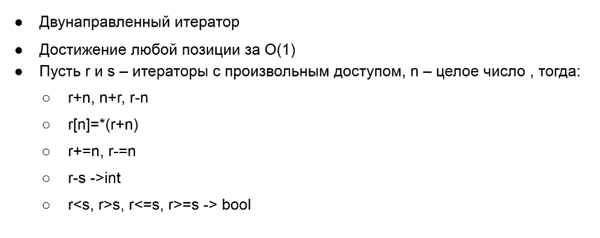
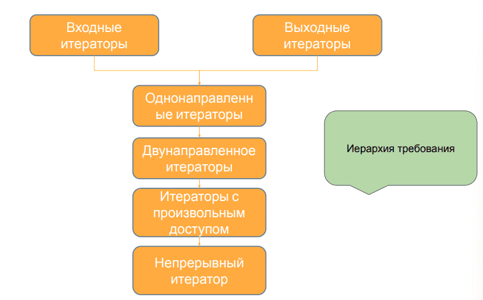
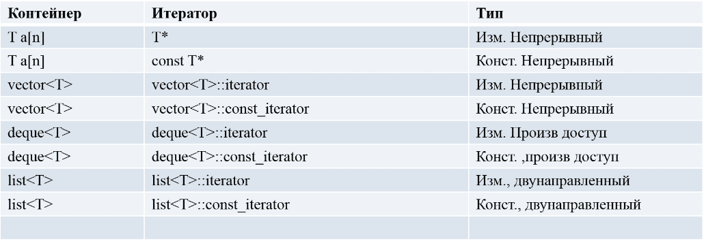
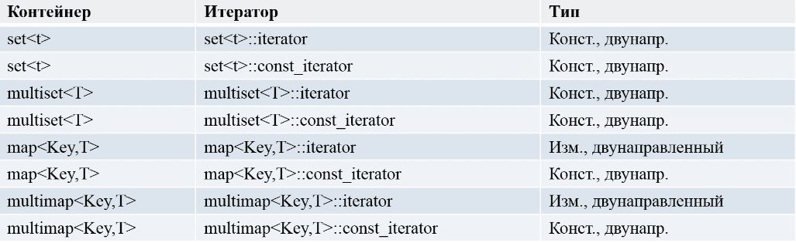
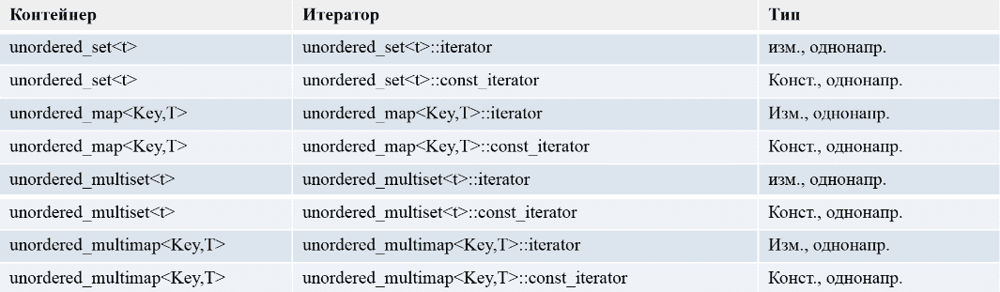
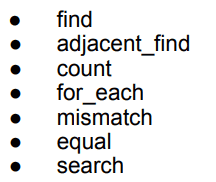
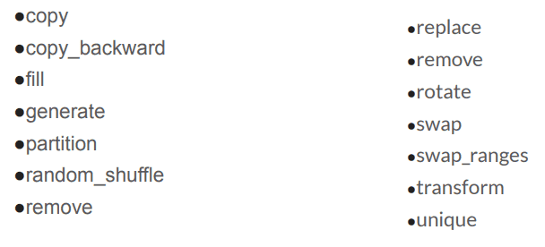

**2 семестр** \
Основы программирования. 

<!--more-->
### STL библиотека

- Библиотека обобщенных компонент:
    Контейнеры
    Обобщенные алгоритмы
    Итераторы
    Функциональные объекты
    Адаптеры
    Аллокаторы
    Вспомогательные функции
- Гарантии производительности - везде где можно задать вопрос про асимптотику, она известна.

### Контейнеры
**Последовательностей**
- `vector<T>`
- `deque<T>`
- `list<T>`
- `array<T>`
- `forward_list<T>`

**Ассоциативные** (ключ - значение)
- `set<T>`
- `map<T>`

**Неупорядоченные ассоциативные** (аналоги ассоциативных, но представляют что-то собой что-то вроде хеш-таблицы)
- `unordered_set`
- `unordered_map`

### Обобщённые алгоритмы
дают обобщённые алгоритмы, которые работают на всех контейнерах. Типовые, задачи, которые нужно постоянно решать
- `Find`
- `Max`
- `Merge`
- `Replace`
- `Sort`
- `...`
	  
Контейнеры заменяют массив с его недостатками (фиксированная длина, выделение памяти на стеке). 

Ассоциативные контейнеры позволяют хранить пару ключ значение, где значение может не присутствовать.

Неупорядоченные ассоциативные контейнеры представляют собой пару ключ значение, но внутри являются хеш таблицей.

###  Итераторы
Итераторы это:
- Указателеобразные объекты - что-то, что очень похоже на указатель, но с другой стороны это объект
- Нужны для связи алгоритмов и контейнеров!!!
- диапазон итераторов `[first,last)` (называется корректным диапазоном)
- Категории итераторов (и [Named Requirements](https://en.cppreference.com/w/cpp/named_req/Iterator|LegacyIterator))
- [входные](https://en.cppreference.com/w/cpp/named_req/OutputIterator|LegacyInputIterator)
- [выходные](https://en.cppreference.com/w/cpp/named_req/InputIterator|LegacyOutputIterator)
- [однонаправленные](https://en.cppreference.com/w/cpp/named_req/ForwardIterator|LegacyForwardIterator)
- [двунаправленные](https://en.cppreference.com/w/cpp/named_req/BidirectionalIterator|LegacyBidirectionalIterator)
- [произвольного доступа](https://en.cppreference.com/w/cpp/named_req/RandomAccessIterator|LegacyRandomAccessIterator)
- [непрерывные](https://en.cppreference.com/w/cpp/named_req/ContiguousIterator|LegacyContiguousIterator)

###  Входной итератор
-  **Функция** `find` `(O(n))`
	- Шаблонная функция (тип итератора и тип величины)
	- Переменная - итератор должна иметь префиксный инкремент и должны сравниваться по != и иметь операцию разыменования, причём должна быть возможность сравнить с величиной, но нет требования перезаписи

```cpp
template<typename InputIterator, typename T>
InputIterator find(
	InputIterator first,
	InputIterator last,
	const T& value
) {
while (first!=last && *first != value)
	++first;
return first;
}
```

**Требования к входному итератору**
- `operator!=`
- `++iterator` и `iterator++`
- `value = *iterator`
- `operator==`
- `O(1)`

###  Выходной итератор

- Функция `Copy` `(O(n))`
	- Здесь теперь с помощью оператора звёздочка мы записываем значения
	  
```cpp
template <typename InputIterator, typename OutputIterator>
OutputIterator copy(
	InputIterator first,
	InputIterator last,
	OutputIterator result
) {
	while (first != last) {
		*result = *first;
		++ first;
		++result;
	}
	return result;
}
```

**Требования к выходному итератору**
- `*iterator = value`
- `++iterator` и `iterator++`
- `operator!=` (?)
- O(1)

- Указатель одновременно может являться, как входным, так и выходным итератором

###  Однонаправленный итератор
- Однонаправленный итератор - всё, что угодно, что соответсвует входному и выходному, но можно сохранять в него для последующего использования (не удалится и тп)
-  Пример: функция `replace` `O(n)`

```cpp
template <typename ForwardIterator, typename T>
void replace (
	ForwardIterator first,
	ForwardIterator last,
	const T& x,
	const T& y
) {
	while (first != last) {
		if (*first == x)
			*first = y;
			
		++first;
	}
}
```

###  Двунаправленный итератор
**Требования**:
- `++iterator` и `iterator++`
- `--iterator` и `iterator--`
- `*iterator = value`
- `value = *iterator`
(однонаправленный + `operator--`)

- Пример: функция `std::reverse`
###  Итератор с произвольным доступом
- Нужно как-то понимать расстояние между бегин и енд
	- Двигаться на произвольное расстояние
	- Двунаправленный итератор
	- Требования (см слайд) (фактически нужно всё то, что и для указателя)
	- 
	- (как бы есть разрывы)
- Пример: функция `std::binary_search`

###  Непрерывный итератор
	- Итератор с произвольным доступом
	- Возможность получать адрес памяти `(*(a+n) = )`, чего не было в произвольном
	- Нужно, чтобы все итераторы лежали в непрерывном куске памяти
	- (гарантия что располагаются последовательно)

- Указатель - непрерывный итератор

Входные выходные / Выходные итераторы → Однонаправленные итераторы → Двунаправленные итераторы → Итераторы с произвольным доступом → Непрерывный итератор

- **Итераторы**:
	- Любой контейнер STD описывает предоставляемые ему итератор
	- Предоставляет разные типы итераторов (вект - непрерыв, очередь - произв и тд)
	- Любой обобщённый STD алгоритм внутри себя включает описание категории итератора, с которым он готов работать
	- Интерфейсы контейнеров и алгоритмов STL спроектированы так, чтобы поддерживать эффективные комбинации и препятствовать неэффективным. Т.е. гарантируется, что бинарный работает за лог н, потому что итераторы - итераторы с произвольным доступом. Иначе бы асимптотика не сохранялась
	- Итераторы - связующее звено между алгоритмами и контейнерами, но при этом из-за разных требований алгоримтов, не все могут быть связаны. Но если алгоритм требует лишь входной итератор, то это значит, что мы можем использовать его и с контейнером с итератором более высокой иерархии итераторов, например произвольный
- `iterator/const_itetrator`
	- для константных контейнеров нужно использовать константные итераторы
- (Табличка со слайда с контейнерами)




###  Обобщённые алгоритмы
- **Обобщённые алгоритмы**
	- Неизменяемые
	- Изменяемые
	- Связанные
	- Обобщённые
- **Алгоритмы с предикатами** - алгоритмы, которые используют функцию/функтор в ходе алгоритма, которую можно передать самому
	- Функтор `greater` используется в таких алгоритмах
	- в `std::sort` можно положить как функцию, так и функтор
- **Неизменяемые** - чисто что-то получает из объектов
	- 
	- `find` и `find_if` - находит первое вхождение элемента(модификаци с `_if`)
		- Разница в том, что есть третий объект - функция/функтор
	- `std::count` - сколько заданных значений O(n)
- **Изменяющие алгоритмы** - что-то делают с объектами
	- 
	- `fill/fill_n` - заполняет элементом. который передан
		- `_n` - сколько раз
	- `generate` - заполняет диапазон значениями, генерируемыми предоставленной функцией O(n)

###  Erase - remove idiom
`remove()` - просто кидает все (заданные значения) в конец и возвращает новый конец контейнера. С памятью ничего не делает

```cpp
template<typename Iterator, typename T>
Iterator remove(Iterator first, Iterator last, const T& value)
	Iterator end = last - 1;
	if(*end == value)
		--end;
	while(first != last) {
		if(*last ==value)
			std::swap(first,last);
		--last;
	}
}
```

- как он будет устроен
- какое требование будет к итератору
Требования
- быстро
- минимальная категория итератора

`erase()` - позволяет почистить элементы на определённом промежутке. 
**Идиома в том, чтобы почистить вектор нужно использовать обе функции.**

**Теоретико-множественные операции** - смотрим на любой контейнер, как на множество
`includes` - содержатся ли элементы одного диапазона контейнера в другом диапазоне другого контейнера
`set_union`  - делает объединение диапазонов и заполняет контейнер
имеют операции
`set_intersection` - пересечение
`set_difference` - разность 
`set_symetric_difference` - симметрическая разность

**Обобщенные числовые алгоритмы**
`accumulate` (должен быть бинарный оператор, который получает какую-то переменную и изменяет её с контейнером)
`partial_sum`
`adjacent_difference`
`inner_product` - скалярное произведение двух диапозонов (как векторы)
(Сумма обратных степеней двойки - подумать)

STD состоит из контейнеров и алгоритмов. Каждый алгоритм требует какой-то итератор. Каждый итератор - определённый набор требований. Разные контейнеры поставляют разные категории итераторов, а алгоритмы требуют разные категории итераторов. Это всё даёт гарантии на асимптотики
