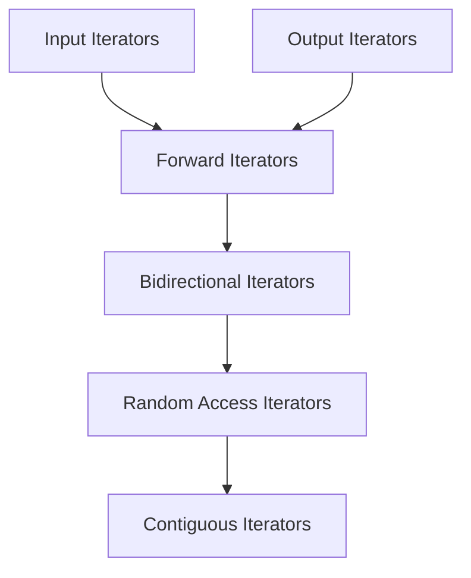

## STL — Standard Template Library

Библиотека обобщённых компонентов:
- Контейнеры
- Обобщённые алгоритмы
- Итераторы
- Функциональные объекты
- Адаптеры
- Аллокаторы
- Вспомогательные функции

**Гарантии производительности:** везде, где можно задать вопрос про асимптотику, она зафиксирована стандартом.

## Контейнеры

**Последовательные (sequence):**
- `vector<T>`
- `deque<T>`
- `list<T>`
- `array<T>`
- `forward_list<T>`

**Ассоциативные** (ключ → значение):
- `set<T>`
- `map<Key, T>`

**Неупорядоченные ассоциативные** (на основе хеш-таблицы):
- `unordered_set<T>`
- `unordered_map<Key, T>`

Контейнеры заменяют массив с его недостатками (фиксированная длина, выделение на стеке).
Ассоциативные хранят пары ключ–значение, **значения может и не быть** (в `set`).
Неупорядоченные ассоциативные — это пары ключ–значение поверх хеш-таблицы.

## Обобщённые алгоритмы

Работают на любых контейнерах, поддерживающих нужную категорию итератора:
- `find`, `max`, `merge`, `replace`, `sort`, …

## Итераторы

**Итераторы** — это:
- Указателеобразные объекты: похожи на указатели, но при этом полноценные объекты со своим интерфейсом.
- Связующее звено между алгоритмами и контейнерами.
- Работают с **диапазонами** `[first, last)` — корректный диапазон полуоткрытый: `first` входит, `last` — нет.

### Категории (от слабых к сильным)
- [входные (Input)](https://en.cppreference.com/w/cpp/named_req/InputIterator)
- [выходные (Output)](https://en.cppreference.com/w/cpp/named_req/OutputIterator)
- [однонаправленные (Forward)](https://en.cppreference.com/w/cpp/named_req/ForwardIterator)
- [двунаправленные (Bidirectional)](https://en.cppreference.com/w/cpp/named_req/BidirectionalIterator)
- [произвольного доступа (Random Access)](https://en.cppreference.com/w/cpp/named_req/RandomAccessIterator)
- [непрерывные (Contiguous)](https://en.cppreference.com/w/cpp/named_req/ContiguousIterator)

### Входной итератор — `find` (O(n))

```cpp
template<typename InputIterator, typename T>
InputIterator find(
    InputIterator first,
    InputIterator last,
    const T& value
) {
    while (first != last && *first != value)
        ++first;
    return first;
}
```

**Требования к входному итератору:**
- `operator==`, `operator!=`
- `++iterator` и `iterator++`
- `value = *iterator` (разыменование для чтения)
- Все операции — `O(1)`

### Выходной итератор — `copy` (O(n))

Через `*iterator` теперь не читают, а **пишут**.

```cpp
template<typename InputIterator, typename OutputIterator>
OutputIterator copy(
    InputIterator first,
    InputIterator last,
    OutputIterator result
) {
    while (first != last) {
        *result = *first;
        ++first;
        ++result;
    }
    return result;
}
```

**Требования к выходному итератору:**
- `*iterator = value`
- `++iterator` и `iterator++`
- `O(1)`

> Обычный указатель `T*` одновременно удовлетворяет требованиям и входного, и выходного итератора.

### Однонаправленный итератор — `replace` (O(n))

Всё то же, что у входного/выходного, но итератор можно **сохранить и переиспользовать** — он не «портится» от прохода.

```cpp
template<typename ForwardIterator, typename T>
void replace(
    ForwardIterator first,
    ForwardIterator last,
    const T& x,
    const T& y
) {
    while (first != last) {
        if (*first == x)
            *first = y;
        ++first;
    }
}
```

### Двунаправленный итератор

Однонаправленный + умеет идти назад.

**Требования:**
- `++iterator`, `iterator++`
- `--iterator`, `iterator--`
- чтение и запись через `*iterator`

**Пример алгоритма:** `std::reverse`.

### Итератор с произвольным доступом

Двунаправленный + умеет прыгать на произвольное расстояние за O(1).

Для итераторов `r`, `s` и целого `n`:
- `r + n`, `n + r`, `r - n`
- `r[n] == *(r + n)`
- `r += n`, `r -= n`
- `r - s` → целое число
- `r < s`, `r > s`, `r <= s`, `r >= s`

При этом итераторы **не обязаны** лежать в памяти подряд (могут быть «разрывы» — как в `deque`).

**Пример:** `std::binary_search`.

### Непрерывный итератор (Contiguous)

Произвольного доступа + гарантия, что элементы **физически лежат подряд в памяти**. Можно получать сырой адрес: `&*(it + n) == &*(it) + n`.

Обычный указатель `T*` — это непрерывный итератор.



### Связь итераторов с алгоритмами и контейнерами

- Каждый контейнер описывает, какие итераторы он предоставляет.
- Каждый алгоритм описывает, какая категория итератора ему нужна.
- Интерфейсы STL спроектированы так, чтобы **поддерживать эффективные комбинации** и не давать неэффективные. Например, `binary_search` требует random-access — поэтому он гарантированно работает за O(log n).
- Если алгоритм требует **входной** итератор, то с ним можно использовать любой более сильный (forward, bidirectional, random-access, contiguous).

`iterator` vs `const_iterator` — для константных контейнеров используются константные итераторы.

| Container       | Iterator Type                   | Category                 |
|----------------|--------------------------------|---------------------------|
| `T a[n]`       | `T*`                           | mutable, contiguous       |
| `T a[n]`       | `const T*`                     | const, contiguous         |
| `vector<T>`    | `vector<T>::iterator`          | mutable, contiguous       |
| `vector<T>`    | `vector<T>::const_iterator`    | const, contiguous         |
| `deque<T>`     | `deque<T>::iterator`           | mutable, random access    |
| `deque<T>`     | `deque<T>::const_iterator`     | const, random access      |
| `list<T>`      | `list<T>::iterator`            | mutable, bidirectional    |
| `list<T>`      | `list<T>::const_iterator`      | const, bidirectional      |

| Container       | Iterator Type                   | Category                 |
|----------------|--------------------------------|---------------------------|
| `set<T>`       | `set<T>::iterator`             | const, bidirectional      |
| `set<T>`       | `set<T>::const_iterator`       | const, bidirectional      |
| `multiset<T>`  | `multiset<T>::iterator`        | const, bidirectional      |
| `map<Key, T>`  | `map<Key, T>::iterator`        | mutable, bidirectional    |
| `map<Key, T>`  | `map<Key, T>::const_iterator`  | const, bidirectional      |
| `multimap<Key, T>` | `multimap<Key, T>::iterator`   | mutable, bidirectional    |
| `multimap<Key, T>` | `multimap<Key, T>::const_iterator` | const, bidirectional |

| Container                    | Iterator Type                                | Category             |
|------------------------------|----------------------------------------------|----------------------|
| `unordered_set<T>`           | `unordered_set<T>::iterator`                 | mutable, forward     |
| `unordered_set<T>`           | `unordered_set<T>::const_iterator`           | const, forward       |
| `unordered_map<Key, T>`      | `unordered_map<Key, T>::iterator`            | mutable, forward     |
| `unordered_map<Key, T>`      | `unordered_map<Key, T>::const_iterator`      | const, forward       |
| `unordered_multiset<T>`      | `unordered_multiset<T>::iterator`            | mutable, forward     |
| `unordered_multiset<T>`      | `unordered_multiset<T>::const_iterator`      | const, forward       |
| `unordered_multimap<Key, T>` | `unordered_multimap<Key, T>::iterator`       | mutable, forward     |
| `unordered_multimap<Key, T>` | `unordered_multimap<Key, T>::const_iterator` | const, forward       |

## Классификация алгоритмов

- **Неизменяющие** — только читают: `find`, `find_if`, `adjacent_find`, `count`, `for_each`, `mismatch`, `equal`, `search`.
    - `find` / `find_if` — находят первое вхождение; разница в том, что `_if` принимает предикат.
    - `count` — сколько раз встречается значение, O(n).
- **Изменяющие** — модифицируют последовательность: `copy`, `copy_backward`, `fill`, `generate`, `partition`, `random_shuffle`, `remove`, `replace`, `rotate`, `swap`, `swap_ranges`, `transform`, `unique`.
    - `fill` / `fill_n` — заполняет диапазон значением; `_n` — заполняет ровно `n` элементов.
    - `generate` — заполняет результатами вызова функции, O(n).
- **С предикатами** — принимают функцию/функтор как аргумент. В `std::sort`, например, можно передать кастомный компаратор.

## Erase–remove idiom

`remove()` ничего не удаляет физически — он **перемещает «выживших» в начало** и возвращает итератор на новый конец. Размер контейнера не меняется, в хвосте — мусор.

```cpp
// Идея remove (упрощённо):
template<typename Iterator, typename T>
Iterator remove(Iterator first, Iterator last, const T& value) {
    Iterator cur = first;
    while (first != last) {
        if (*first != value) {
            *cur = *first;
            ++cur;
        }
        ++first;
    }
    return cur;
}
```

Чтобы реально стереть «отрезанный» хвост, используют `erase()` контейнера. **Идиома:**

```cpp
v.erase(std::remove(v.begin(), v.end(), value), v.end());
```

## Теоретико-множественные операции

Смотрят на отсортированные диапазоны как на множества:
- `includes` — содержится ли один в другом
- `set_union` — объединение
- `set_intersection` — пересечение
- `set_difference` — разность
- `set_symmetric_difference` — симметрическая разность

## Обобщённые числовые алгоритмы

- `accumulate` — свёртка (по умолчанию сумма, можно передать бинарный оператор)
- `partial_sum` — частичные суммы
- `adjacent_difference` — разности соседних элементов
- `inner_product` — скалярное произведение двух диапазонов

> STL = контейнеры + алгоритмы, связанные через итераторы. Каждый алгоритм требует определённую категорию итератора, разные контейнеры предоставляют разные категории — это и даёт гарантии асимптотики.