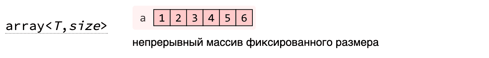
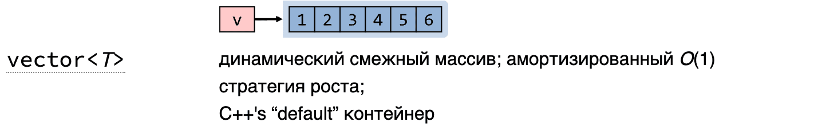
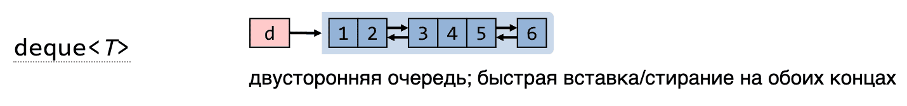
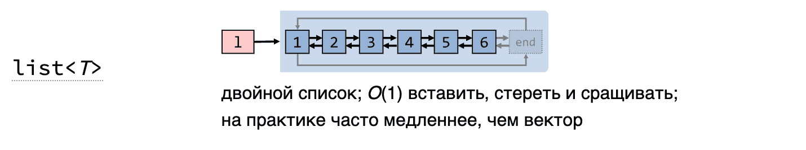
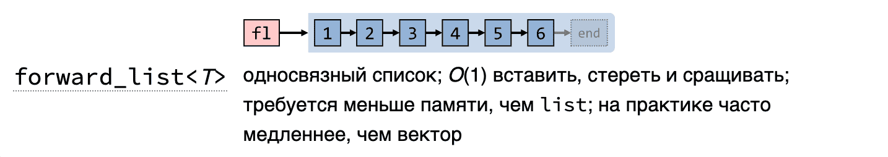
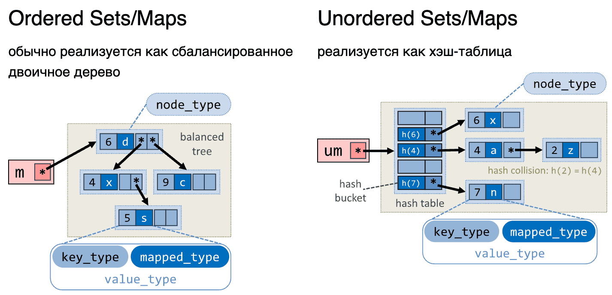

```cpp
std::vector<int>::iterator myremove(
	std::vector<int>::iterator begin,
	std::vector<int>::iterator end,
	int num
) {
	std::vector<int>::iterator cur_place = begin;
	while (begin != end) {
		if (*begin != num) {
			*cur_place = *begin;
			++cur_place;
		}
		++begin;
	}
	return cur_place;
}
```

Hand-made `remove`, но работает только на `std::vector<int>`. Шагами обобщения:
1. Шаблоны по типу элемента — но всё ещё привязка к `std::vector`.
2. Шаблонный `IterType` вместо итератора вектора — теперь работает с любым контейнером… но **не каждый** итератор подойдёт. Нужны требования (forward-итератор).

## Функциональные объекты (функторы)

**Функтор** — объект класса с перегруженным `operator()`. Параметризует алгоритм: алгоритму даём «как сравнивать» / «как складывать» / «по какому критерию фильтровать».

Стандартные функторы из `<functional>`:
- арифметические: `plus`, `minus`, `multiplies`, `divides`, `modulus`, `negate`
- сравнения: `equal_to`, `not_equal_to`, `greater`, `less`, `greater_equal`, `less_equal`
- логические: `logical_and`, `logical_or`, `logical_not`
- битовые: `bit_and`, `bit_or`, `bit_xor`

## Named Requirements

Формальное описание того, чего стандарт ожидает от типа. Описывает:
- какие вложенные типы должны быть определены;
- какие выражения должны быть валидны;
- какой набор методов должен присутствовать.

- [Container](https://en.cppreference.com/w/cpp/named_req/Container)
- [ReversibleContainer](https://en.cppreference.com/w/cpp/named_req/ReversibleContainer)
- [AllocatorAwareContainer](https://en.cppreference.com/w/cpp/named_req/AllocatorAwareContainer)
- [SequenceContainer](https://en.cppreference.com/w/cpp/named_req/SequenceContainer)
- [ContiguousContainer](https://en.cppreference.com/w/cpp/named_req/ContiguousContainer)
- [AssociativeContainer](https://en.cppreference.com/w/cpp/named_req/AssociativeContainer)
- [UnorderedAssociativeContainer](https://en.cppreference.com/w/cpp/named_req/UnorderedAssociativeContainer)

## Последовательные контейнеры

`array`, `vector`, `deque`, `forward_list`, `list` — решают проблему массива (фиксированный размер) и предоставляют разные компромиссы между скоростью доступа и скоростью вставки.

### `std::array`

Удовлетворяет: `Container`, `ReversibleContainer`, `SequenceContainer`, `ContiguousContainer`.

Реализация интерфейса `Container`:

```cpp
iterator begin()             { return iterator(data()); }
const_iterator begin() const { return const_iterator(data()); }
iterator end()               { return iterator(data() + _Size); }
const_iterator end() const   { return const_iterator(data() + _Size); }

size_type size() const     { return _Size; }
size_type max_size() const { return _Size; }
bool empty() const         { return _Size == 0; }
```

`ReversibleContainer`:

```cpp
reverse_iterator rbegin()             { return reverse_iterator(end()); }
const_reverse_iterator rbegin() const { return const_reverse_iterator(end()); }
reverse_iterator rend()               { return reverse_iterator(begin()); }
const_reverse_iterator rend() const   { return const_reverse_iterator(begin()); }
```

- `iterator` для `array` — это по сути просто указатель (поэтому `end()` = `data() + size`).
- `reverse_iterator` смотрит на контейнер «с конца к началу»: `rbegin()` возвращает «обёртку» над `end()`, которая при разыменовании даёт последний элемент.


- Классический фиксированный массив.

### `std::vector`



- Один большой непрерывный кусок памяти. Выделяется с **запасом** (`capacity` ≥ `size`).
- При вставке: если есть свободное место — добавляем, иначе делаем **реаллокацию** (обычно выделяется в ~2 раза больше памяти, всё копируется/перемещается). Реаллокация случается редко, поэтому амортизированная сложность вставки в конец — O(1).
- Предоставляет самый сильный итератор (contiguous) — работает со всеми STL-алгоритмами.
- Быстрый доступ по индексу за счёт непрерывности.
- Вставка/удаление в середину — O(n).
- Может не найтись такого большого непрерывного куска памяти.

### `std::deque`



- Похож на вектор, но память состоит из **нескольких непрерывных блоков** (массив массивов). Если не хватает — добавляется ещё один блок.
- Компромисс между вектором и списком.
- Индексация чуть медленнее (нужно понять, в каком блоке элемент).
- Вставка/удаление в середину — всё ещё неэффективна.
- Зато эффективна вставка в начало и в конец — O(1).

### `std::list`



- Двусвязный список (циклический — у некоторых реализаций).
- Эффективная вставка/удаление в любую позицию — O(1) (если есть итератор).
- Долгий доступ по индексу — O(n).
- Перерасход памяти: каждая нода хранит ещё два указателя.
- Не поддерживает все алгоритмы (только bidirectional итератор).

### `std::forward_list`



- Однонаправленный список.
- Меньше памяти, чем у `list` (один указатель на ноду вместо двух).
- Forward-итератор — самый слабый из «полноценных».

> **Цитата (китайская мудрость, 17 век до н.э.):** Если не знаешь, что выбрать — выбирай вектор. Только он не должен быть большим.

- Если нужно много вставок/удалений в середине → список.

## Ассоциативные контейнеры



Обычно реализованы как красно-чёрное дерево (но в стандарте конкретная реализация не зафиксирована — гарантируется только асимптотика).

- **`set`** — множество уникальных ключей. Требует, чтобы у типа был определён `operator<` (или передан кастомный компаратор). `operator<` определять опасно — он распространяется на весь код; иногда лучше написать функтор-компаратор.
- **`map`** — множество уникальных пар «ключ → значение». Двунаправленный итератор. Доступ по ключу, вставка, удаление — O(log n).
- **`multiset`** / **`multimap`** — то же, но допускают дубликаты ключей.

## Неупорядоченные ассоциативные контейнеры

Под капотом — хеш-таблица.

- **`unordered_map`**, **`unordered_set`** — Forward-итератор; доступ амортизированно O(1), но в худшем случае (много коллизий) — O(n). Требует хеш-функции для ключа. Памяти ест больше, чем `map`.
- **`unordered_multiset`**, **`unordered_multimap`** — с дубликатами.

## Iterator invalidation

Классическая ловушка многих контейнеров — итераторы могут стать невалидными после модификации контейнера:
- **Вектор:** реаллокация (при `push_back`, `insert`, `resize`, `reserve`) инвалидирует **все** итераторы. Иначе — только те, что были после точки вставки/удаления.
- **`deque`:** `insert`/`erase` инвалидирует все итераторы.
- **`list`, `forward_list`:** валидны почти всегда, кроме итераторов на удалённые элементы.
- **`unordered_*`:** rehash инвалидирует все итераторы.

## Allocator (введение)

**Аллокатор** — абстракция, которая отвечает за выделение и освобождение памяти от имени контейнера. Контейнер не знает деталей malloc/new — он просит у аллокатора:
- `allocate(n)` — выдай память под `n` элементов;
- `deallocate(p, n)` — освободи;
- `construct` / `destroy` — построй/разрушь объект в этой памяти.

Самый простой аллокатор оборачивает `malloc` и `free`:

```cpp
template <typename T>
class CSimpleAllocator {
public:
	pointer allocate(size_type size) {
		pointer result = static_cast<pointer>(malloc(size * sizeof(T)));
		if (result == nullptr) {
			// error
		}
		std::cout << size << " " << result << std::endl;
		return result;
	}
	void deallocate(pointer p, size_type n) {
		std::cout << p << std::endl;
		free(p);
	}
};
```

Пример использования:

```cpp
struct SPoint {
	int x;
	int y;
};

int main() {
	std::allocator_traits<CSimpleAllocator<int>> at;
	std::vector<SPoint, CSimpleAllocator<SPoint>> data;

	data.push_back({10, 20});
	data.pop_back();

	return 0;
}
```