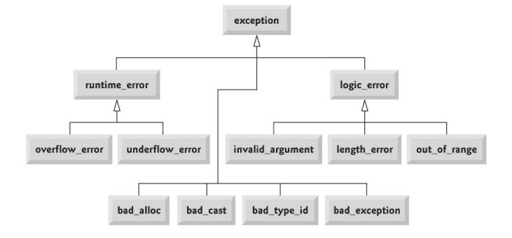
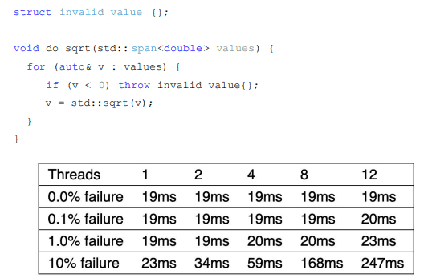

### std::exception

Базовый класс для исключений стандартной библиотеки. Кидать просто строки или числа — малоинформативно: тип исключения сам по себе — полезная информация, а уж дополнение текстовым сообщением — вообще хорошо.

```cpp
class exception { 
public: 
	exception() noexcept; 
	exception(const exception&) noexcept; 
	exception& operator=(const exception&) noexcept; 
	virtual ~exception(); 
	virtual const char* what() const noexcept; 
};
```



## Свои исключения

Наследуем от `std::exception` (или от более конкретного, например `std::runtime_error`):

```cpp
class my_exception : public std::exception { // derived from std::exception 
public: 
	my_exception(const std::string& what) 
		: what_(what){ 
	} 
	const char* what() const noexcept override { 
		return what_.c_str(); 
	}
private: 
	std::string what_; 
};
```

> [!warning] Важно!
> Не нужно бояться писать свои исключения! Они могут быть даже очень тривиальными и это не страшно.

**Example:** (очень похож на runtime error):
```cpp
int foo() { 
	throw my_exception("error"); // by rvalue 
} 

int main(int, char**) { 
	try{ 
		foo(); 
	} 
	catch(const my_exception& e) { // by const reference 
		std::cerr << e.what(); 
		std::runtime_error 
	} 
}
```

## Правила работы с исключениями

- Исключения — **исключительно для обработки ошибок**, не для бизнес-логики (механизм броска стоит дорого).
- Работа с исключениями строится вокруг **инварианта объекта** — после возможного исключения объект должен оставаться в осмысленном состоянии.
- **Кидаем по значению, ловим по ссылке** (`const&`):
	- Исключения хранятся в особом месте памяти.
	- Ловить по ссылке — чтобы избежать лишнего копирования.

### Цена исключений



Бенчмарк на разном числе потоков и разном количестве ошибок:
- **Рост по столбцам** — раскрутка стека не бесплатная: чем больше ошибок, тем больше времени тратится на unwinding.
- **Рост по строкам** — два потока **не могут обрабатывать исключения одновременно**, компилятор/рантайм сериализует обработку.

## `std::expected` (C++23)

**Идея:** объединить плюсы кодов возврата и исключений.
- Коды возврата легковесные.
- Исключения удобные, не требуют обработки в месте получения.

Шаблонный тип с двумя параметрами: тип результата при успехе и тип ошибки.

- Возвращает либо ожидаемое значение, либо ошибку.
- Накладные расходы сравнимы с кодом возврата.
- Передаёт ответственность за обработку вызывающему коду.

**Три ключевых класса:**
1. `std::expected<T, E>` — главный класс.
2. `std::unexpected<E>` — обёртка, чтобы вернуть ошибку.
3. `std::bad_expected_access` — бросается, если попытались обратиться к значению, а там лежит ошибка.

```cpp
enum class EDivError {
	DivisionByZero = 0,
};

std::expected<int, EDivError> my_div(int a, int b) {
	if (b == 0)
		return std::unexpected{EDivError::DivisionByZero};

	return a / b;
}

int main() {
	auto r = my_div(8, 0);

	// 1 способ — как с кодом возврата
	if (r)
		std::cout << *r << std::endl;

	// 2 способ — ловим исключение
	try {
		std::cout << r.value() << std::endl;
	} catch (std::bad_expected_access& err) {
		std::cout << err.what() << std::endl;
	}

	return 0;
}
```

Как обычно, **идеального решения нет** — приходится выбирать:
1. **Исключения** — единообразная обработка, но не в месте возникновения.
2. **Коды возврата** — обработка сразу в месте возникновения, но неединообразна.
3. **`std::expected`** — комбинированный подход.

## Пример: пишем `to_uint`

```cpp
uint32_t to_uint(std::string_view str) {
    uint32_t result = 0;
    for (char c : str) {
        result *= 10;
        result += c - '0';
    }
    return result;
}

int main(int, char**) {
    std::cout << to_uint("100500") << std::endl;
}
```

Тут проблема: если в строке что-то кроме цифр — поведение странное. Варианты обработки (см. [презу](https://github.com/is-itmo-c-24/lectures/blob/main/2025.03.05/Lecture%2016.%20Error%20Handling.pdf)):

**(а) Просто проверить, цифра ли символ; иначе вернуть то, что вышло до этого момента:** странный результат — обработано не всё, и непонятно, что вернётся.

**(б) Возвращаем `bool`, а значение — через ссылку:** не отвечает на вопрос «что случилось».

**(в) Через `errno` (C-стиль):**

```cpp
uint32_t to_uint(std::string_view str) {
    uint32_t result = 0;
    if (str.empty()) {
        errno = EINVAL;
        return result;
    }

    for (char c : str) {
        if (c < '0' || c > '9') {
            errno = EDOM;
            return result;
        }
        result *= 10;
        result += c - '0';
    }

    return result;
}
```

**(г) Проброс исключения:**

```cpp
uint32_t to_uint(std::string_view str) {
    uint32_t result = 0;
    if (str.empty())
        throw std::invalid_argument("String is empty");

    for (char c : str) {
        if (c < '0' || c > '9')
            throw std::invalid_argument(std::format("Argument {} is not a number", str));

        result *= 10;
        result += c - '0';
    }

    return result;
}
```

**(д) `std::optional`** — похоже на (б): хранит либо значение, либо «ничего» (`std::nullopt`):

```cpp
std::optional<uint32_t> to_uint(std::string_view str) {
    if (str.empty())
        return {};

    uint32_t result = 0;
    for (char c : str) {
        if (c < '0' || c > '9')
            return {};
        result *= 10;
        result += c - '0';
    }
    return result;
}
```

**(е) `std::expected`:**

```cpp
std::expected<uint32_t, std::invalid_argument> to_uint(std::string_view str) {
    if (str.empty())
        return std::unexpected{std::invalid_argument("String is empty")};

    uint32_t result = 0;
    for (char c : str) {
        if (c < '0' || c > '9')
            return std::unexpected{
                std::invalid_argument{std::format("Argument {} is not a number", str)}
            };
        result *= 10;
        result += c - '0';
    }
    return result;
}
```

### Вывод

В зависимости от того, как удобнее обрабатывать ошибки — есть три (плюс один) варианта:
- коды возврата
- исключения
- `std::expected`
- (либо `std::optional`)