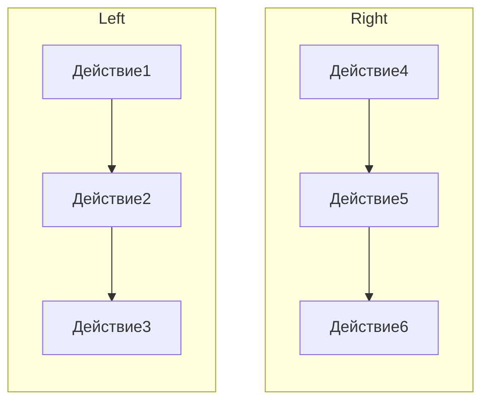
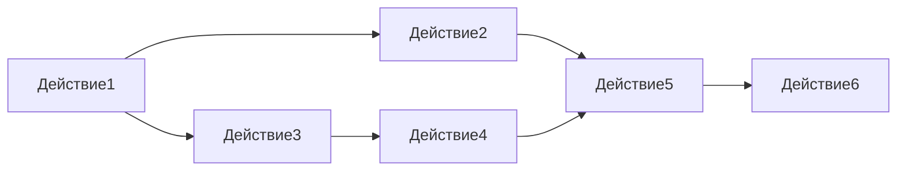

## Закон Мура и почему появилась многопоточка

**Закон Мура:** число транзисторов на микрочипах удваивается каждые ~2 года.
Это значило, что одна и та же программа со временем работала ~в 2 раза быстрее (ну, не совсем, но как-то так).

В какой-то момент уперлись в физический барьер — уменьшать размер транзисторов дальше тяжело. Придумали: вместо повышения производительности **одного ядра** — делать **многоядерные** процессоры.

То есть появилась физическая возможность производить несколько вычислений за один такт. Однопоточные программы это **не используют**.

**Однопоточка:**


**Многопоточка (две независимые цепочки):**



В реальных программах — обычно граф зависимостей:



*(Лаба про расписания be like.)*

## Concurrency vs Parallelism

- **Parallelism** — физическое выполнение нескольких действий **одновременно** (требует нескольких ядер).
- **Concurrency** — выполнение двух или более задач **одновременно с точки зрения логики**: они могут чередоваться на одном ядре, но программа структурирована так, чтобы они «шли параллельно».


В курсе фокус на **concurrency** — нас не очень волнует количество ядер, важно научиться запускать независимые потоки выполнения.

С чего начнём? Конечно же, с Hello World!

```cpp
#include <thread>
#include <iostream>

int main(int argc, char** argv) {
    std::thread tr([]() { std::cout << "Hello World" << std::endl; });
    tr.join();
    return 0;
}
```

## `std::thread`

Прикольная библиотека для многопоточки. Основное API:
- Конструктор принимает функцию/лямбду и её аргументы — запускает новый поток.
- `join()` — заблокировать текущий поток, пока запущенный не завершится.
- `detach()` — отвязать поток (он продолжит работать самостоятельно, мы про него «забываем»).

## Processes vs Threads

**Раньше:** каждая программа = отдельный **процесс** (отдельный поток выполнения), процессы изолированы — не могут читать память друг друга.

**Сейчас:** программа может запускать несколько **потоков** внутри одного процесса (потоки делят память).


- Каждый процесс содержит хотя бы один поток.
- Потоки **шарят общие ресурсы** процесса (память, файловые дескрипторы и т.д.).
- У потоков **общее виртуальное адресное пространство**, но у каждого свой стек.

```cpp
#include <iostream>
#include <thread>

int main(int argc, char* argv[]) {
    for (int i = 0; i < 4; ++i) {
        std::thread tr{
            []() {
                int i = 0;
                std::cout << &i << "\n";
            }
        };
        tr.detach();
    }

    std::getchar();
}
```

**Вывод (адреса локальной переменной в каждом потоке):**
```
0x16d28af34
0x16d3a2f34
0x16d316f34
0x16d1fef34
```

Видно, что **у каждого потока — свой стек**, поэтому одинаковая локальная переменная лежит по разным адресам.

## Sequential vs Parallel

Заполняем 1 миллиард элементов в векторе через `rand`:
- sequential: ~20 секунд
- parallel:   ~14 секунд

Вынесли аллокацию вектора из обеих веток (раньше аллокация была и в sequential, и в parallel; теперь она в `main`, и оба варианта работают с одним `values`):
- sequential: ~8 секунд
- parallel:   ~2 секунды

> **Мораль:** memory allocation — дорого; всегда стоит учитывать её при сравнении.

## Закон Амдала


Не все алгоритмы хорошо параллелятся. Например, **bubble sort** — параллелится плохо: на каждом шаге зависимость от предыдущего. Чем больше доля **последовательного** кода — тем меньше выигрыш от параллелизма (что и формализует закон Амдала).

## Проблемы многопоточки

### Race Condition (гонка)

Ошибка проектирования многопоточной системы, при которой результат зависит от того, **в каком порядке выполняются части кода**.

**Классика:** 4 потока делают `result += data[i]`.
Под капотом каждый поток:
1. Читает `result` в регистр.
2. Читает `data[i]` в другой регистр.
3. Складывает.
4. Записывает обратно в `result`.

Если несколько потоков делают это одновременно, чтения «перекрываются» — потерянные обновления, сумма получается неправильной.

**Решения:**
- **`mutex`** — позволяет защитить часть данных от одновременного доступа. Поток захватил мьютекс — остальные ждут. После разблокировки — следующий.
    - Локальные `result` в каждом потоке, потом одно сложение под мьютексом — гораздо эффективнее, чем мьютекс на каждом инкременте.
- **Condition variables** — позволяют потоку ожидать наступления условия.
- **Semaphores** — счётный мьютекс (разрешает доступ N потокам одновременно).
- **`std::atomic`**:
    - Низкоуровневые инструкции процессора.
    - Хорошо подходит для простых операций (`add`, `store`, `exchange`).
    - Не подходит для сложных синхронизаций.
    - Имеет полные и частичные специализации.

### Deadlock


Ситуация в многозадачной среде, когда несколько процессов **бесконечно ждут ресурсов**, которые занимают сами эти процессы (поток A держит ресурс X и ждёт Y, поток B держит Y и ждёт X — оба замерли навсегда).

### Livelock

Ситуация, в которой система **не застревает** (как при дедлоке), а **занимается бесполезной работой** — состояние меняется, но полезного прогресса нет. Классическая аналогия: два человека в коридоре пытаются разойтись, шагают одновременно в одну и ту же сторону, потом одновременно в другую — двигаются, но не расходятся.

## Thread Pool

Механизм, который **эффективно управляет потоками и переиспользует их**. Предоставляет ограниченное число заранее созданных потоков, готовых выполнять задачи из общей очереди. Это решает две проблемы:
- Не платим за создание/уничтожение потока на каждую задачу.
- Не создаём бесконтрольно тысячи потоков — пул ограничен.

*(По коду из презентации — см. слайды.)*