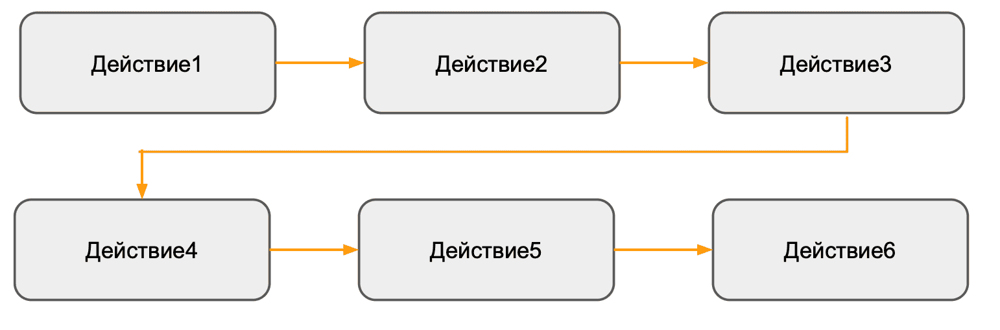
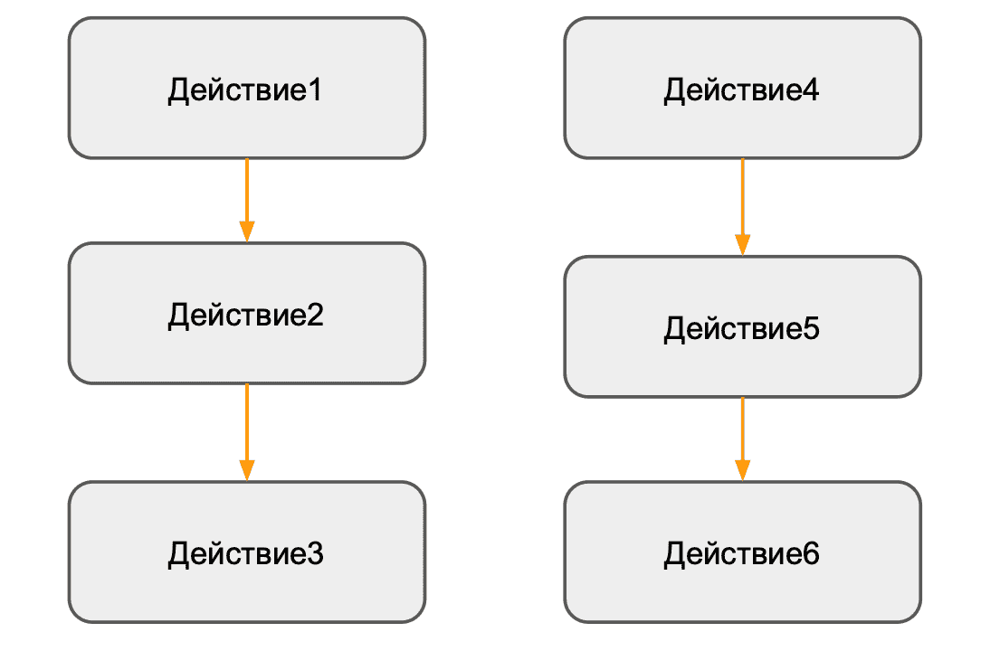
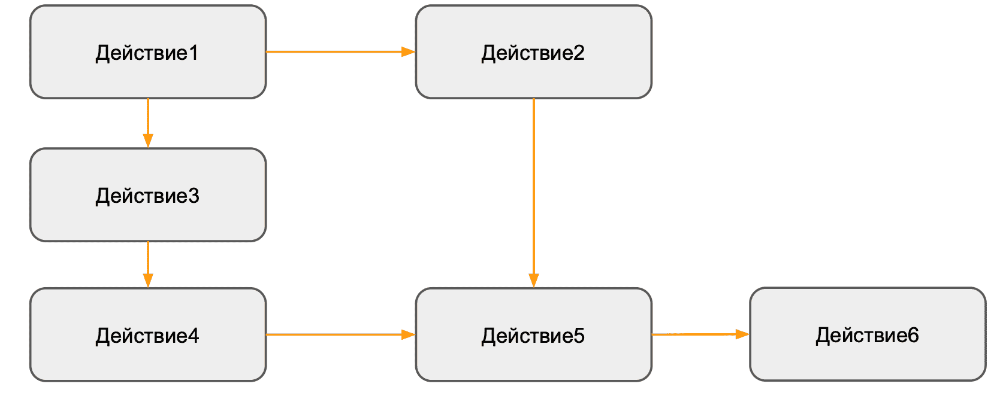
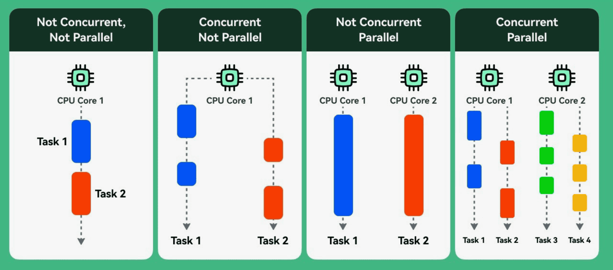
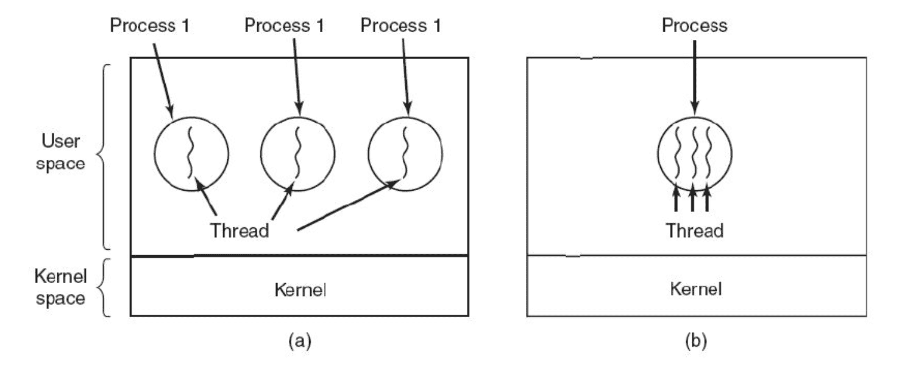
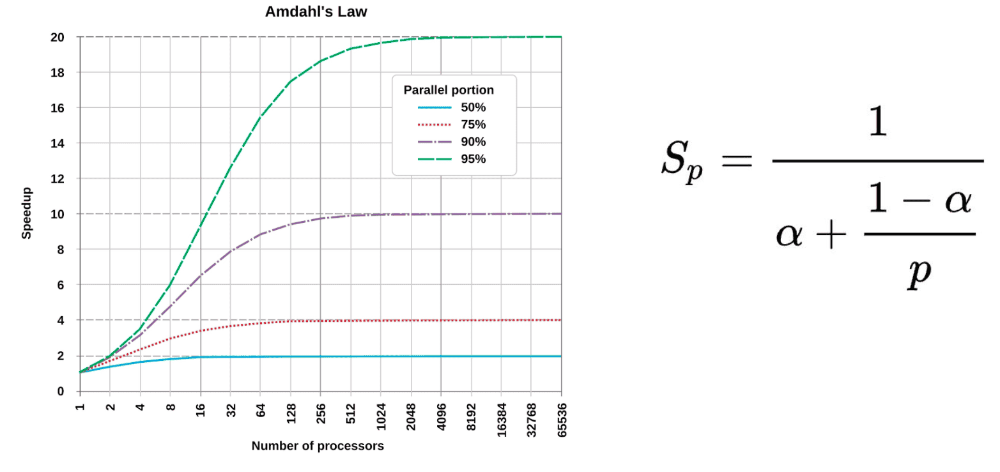

**Закон мура**: число транзисторов на микрочипах удваивается каждые 2 года.

это значит, что одна программа начинала работать в ~2 раза быстрее (ну вообще нет… но ладно)

в какой-то момент уперлись в физический барьер и уменьшать размер транзисторов сложно

придумали, а давайте будем не увеличивать производительность 1 ядра, а делать процессоры многоядерными

т.е. появилась физическая возможность производить несколько вычислений в 1 такт => то как мы писали программы ранее не подходит, так как они однопоточные

**однопоточка:**


**многопоточка**

но на самом деле в более сложных программках

(лаба про расписания be like)

### Concurrency vs Parallelism
**Parallelism** - физическое выполнение нескольких действий одновременно
**Concurrency** - выполнение двух или более задач одновременно 


Мы будем трогать Concurrency, так как мы не будем сильно зацикливаться над количеством ядер. Нам нужно только научится запускать независимые потоки выполнения

С чего начнём осваивать? Конечно же с Hello World на многопоточке!!! Юхуууу

```cpp
#include <thread>
#include <iostream>

int main(int argc, char** argv) {
	std::thread tr([](){std::cout << "Hello World" << std::endl;});
	tr.join();
return 0;
}
```

### std::thread
прикольная библиотека для многопоточки
…
### Processes vs threads
раньше: каждая программа - отдельный процесс-поток выполнения (процессы не могут трогать память друг друга)

сейчас программа может запускать несколько потоков внутри процесса (и потоки имеют единую память)

    

- Каждый процесс содержит хотя бы один поток
- Потоки шарят между собой общие ресурсы процесс (памят, файловые дескрипторы и тд)
- У потоков общее виртуальное адресное пространство

```cpp
#include <iostream>  
#include <thread>  
  
int main(int argc, char *argv[]) {  
    for (int i = 0; i < 4; ++i) {  
        std::thread tr{  
            []() {  
                int i = 0;  
                std::cout << &i << "\n";  
            }  
        };  
        tr.detach();  
    }  
  
    std:getchar();  
}
```

вывод:
```c
0x16d28af34
0x16d3a2f34
0x16d316f34
0x16d1fef34
```


### sequintal vs parallel

заполняем 1 миллиард элементов в векторе с помощью рандома 
sequintal - 20 секунд
parallel - 14 секунд 

вынесли аллокацию из двух вараций (она была и в sequintal и в parallel, а теперь только в main и пользуемся одним values для того и другого )
sequintal - 8 секунд
parallel - 2 секунд 

### Закон Амдала

много алгоритмов не параллелятся: 
- бабл сорт

### Проблемы многопоточки

#### Race Condition
Ошибка проектирования многопоточной системы или приложения, при которой работа системы или приложения зависит от того, в каком порядке выполняются части кода.

Основная проблема - гонка за временем
4 потока делают result += data[i]

т.е. поток берёт result в один регистр, data[i] в другой регистр и кладёт результат в result
в это время тоже самое делают другие потоки

получается один записывает результат, другой результат, а что теряется? а теряется то их сумма 

выход? - делать локальные резалты для каждого потока, а потом сумму резалтов используя мьютекс – заблокировали переменную одним потоком, все остальные ждут когда разблокируем, складываем, открываем и теперь тоже самое делает другой поток

как еще решать?
- mutex (уже было, да)
	- позволяет защитить часть данных от одновременного обращение из разных потоков
- condition variables
- semaphores
- atomic
	- низкоуровневые инструкции процессор
	- хорошо подходит для простых операций (add, store,exchange)
	- не подходит для сложных синхронизаций
	- имеет полные и частичные специализации
### DeadLock

- Ситуация в многозадачной среде, при которой несколько процессов находятся в состояние бесконечного ожидания ресурсов, занятых самими этими процессами
### LiveLock

- Ситуация в которой система не «застревает» (как в обычной взаимной блокировке), а занимается бесполезной работой, её состояние постоянно меняется — но, тем не менее, она «зациклилась», не производит никакой полезной работы
### Thread Pool
это механизм, который позволяет эффективно управлять и переиспользовать потоки выполнения. Он предоставляет ограниченное количество заранее созданных потоков, которые могут выполнять задачи из пула 

про это не конспектил, но в презенташки кодик вроде понятный, артёмка моисеенко пообещал что не будет такого…