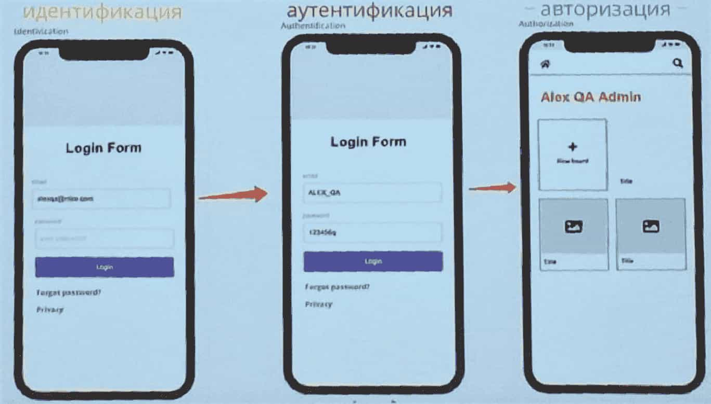
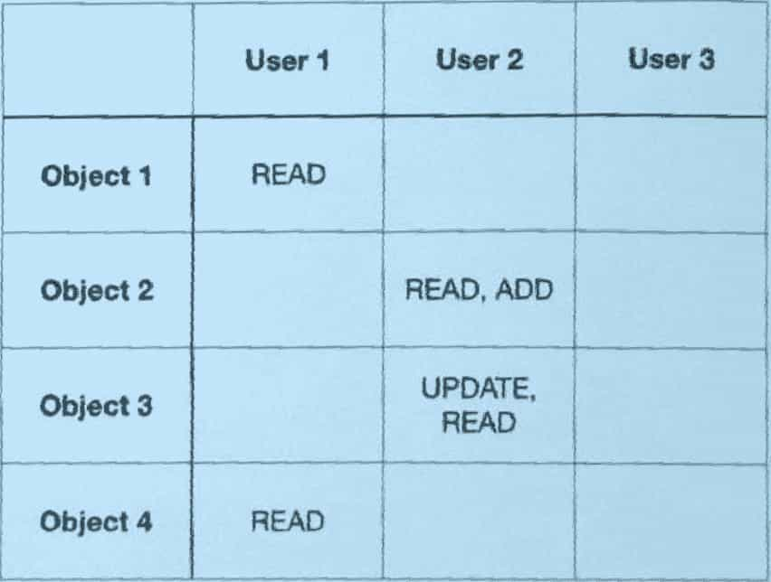
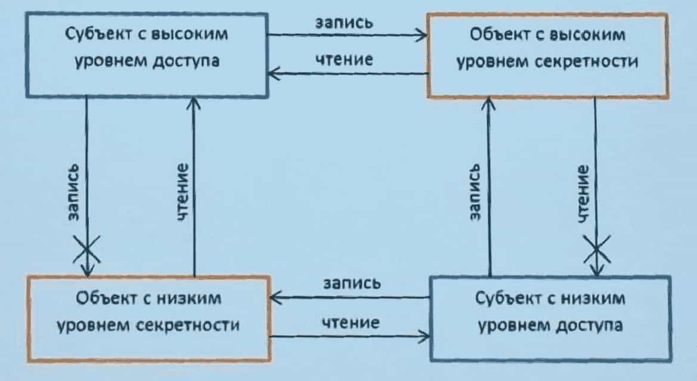

# Лекция 10. Безопасная система

## Что такое безопасная система?

> Безопасная система — это система, которая защищена от несанкционированного доступа, использования, раскрытия, нарушения, модификации или уничтожения, тем самым обеспечивая **конфиденциальность, целостность и доступность** данных и функций.

## CIA Triad

- **Confidentiality** — конфиденциальность.
- **Integrity** — целостность.
- **Availability** — доступность.

## Определение пользователя

- **Идентификация** — процесс, когда информационная система определяет, существует конкретный пользователь или нет, с помощью **идентификатора** (логин, e-mail, номер телефона и т.п.).
- **Аутентификация** — процесс, когда пользователь вводит ключ (пароль, пин-код и т.п.), подтверждая своё право на доступ к учётной записи.
- **Авторизация** — процесс определения того, какие действия позволено совершать аутентифицированному пользователю.



## Факторы идентификации (аутентификации)

- **То, что субъект знает** (пароль, PIN, ответ на секретный вопрос).
- **То, что субъекту принадлежит** (телефон, ключ, токен).
- **То, что является неотъемлемой характеристикой субъекта** (биометрия: отпечаток, лицо, голос).

### Многофакторная аутентификация

> Если для входа требуются пароль и, например, ответ на секретный вопрос (который тоже является «знанием»), то это **не многофакторная аутентификация**, а лишь двухэтапная проверка в рамках одного фактора. Настоящая MFA — это сочетание факторов **из разных категорий**.

## Авторизация



---

## Дискреционная модель доступа (DAC)

- Каждый объект имеет **владельца**.
- Владелец полностью контролирует доступ к своему объекту.
- Права доступа определяются на основе **списков контроля доступа (ACL)**.

```sql
SELECT * FROM pg_class;
```

### Виды привилегий

- `SYSTEM PRIVILEGES`
- `DATABASE PRIVILEGES`
- `SCHEMA PRIVILEGES`
- `TABLE PRIVILEGES`
- `COLUMN PRIVILEGES`
- `ROW-LEVEL PRIVILEGES`

### Владелец объекта

- В PostgreSQL каждый объект БД имеет владельца, который создаёт этот объект. Владелец обладает полным контролем над объектом.
- По умолчанию владелец может **передавать свои права** другим ролям.

### Пользователи и группы

Реализованы через **концепцию ролей**. В этой системе каждая роль может выступать как в роли пользователя, так и в роли группы пользователей.

### Роли

- В PostgreSQL «пользователь» — частный случай роли. Каждая роль может иметь или не иметь возможность входа в систему (`LOGIN`). Если у роли установлено `LOGIN`, она может использоваться как учётная запись.
- Роли могут быть **членами других ролей** (например, роль `developers` для всех разработчиков с общими привилегиями).

```sql
CREATE ROLE name [attr1, attr2, ...];
ALTER ROLE developer WITH PASSWORD 'newsecret';
```

Атрибуты:
- `LOGIN`
- `SUPERUSER`
- `CREATEDB`
- `CREATEROLE`
- `PASSWORD 'secret'`

### Наследование привилегий

Роль, являющаяся членом другой роли, по умолчанию автоматически наследует все привилегии родительской роли.

```sql
GRANT role1 TO role2;
REVOKE role1 FROM role2;
```

### Смена владельца

```sql
ALTER {obj} OWNER TO {role1};
```

Сменить владельца может сам владелец и роли, в которые он входит.

### Привилегии таблиц

- `SELECT`
- `INSERT`
- `UPDATE`
- `REFERENCES`
- `DELETE`
- `TRUNCATE`
- `TRIGGER`

### Привилегии БД

- `CREATE`
- `CONNECT`
- `TEMPORARY`

<!-- Оффтоп: TRUNCATE
- TRUNCATE не проверяет каждую строку для удаления, а просто освобождает данные, удаляя содержимое таблицы целиком.
- Вместо логирования каждого удаления строки, TRUNCATE записывает в журнал меньший объём информации.
- При использовании TRUNCATE не вызываются триггеры, определённые для операций удаления.
- Если TRUNCATE выполняется в транзакционном блоке, операция может быть отменена командой ROLLBACK до фиксации.
-->

### Привилегии схем

- `CREATE`
- `USAGE`

Права доступа к схеме влияют на возможность создания новых объектов, но сами по себе **не контролируют** доступ к уже существующим объектам. Для этого назначаются привилегии непосредственно на уровне объектов.

### Схема `public`

- Создаётся по умолчанию при создании новой базы данных.
- Объекты в ней доступны всем пользователям, если не настроены отдельные ограничения.
- При создании объектов без явного указания схемы они автоматически создаются в `public`.

### Стандартные БД (шаблоны)

- При создании новой БД без явного указания шаблона используется база `template1`.
- **Template** — «чистая» база данных, которая не изменялась после установки PostgreSQL. Она содержит минимальное количество объектов и служит эталоном.

---

## Мандатная модель доступа (MAC)



**Mandatory Access Control (MAC)** используется в системах, где требуется высший уровень безопасности и централизованный контроль. В отличие от дискреционной модели, где владелец решает, кому предоставить доступ, в MAC доступ определяется **системными политиками**.

Ключевые принципы:
- **«Нет права давать права»** — пользователь не может перераспределять доступ по своему усмотрению.
- **Протоколирование ВСЕХ действий.**
- **Защита от копирования.**

## Шифрование БД

- **Прозрачное шифрование** (Transparent Data Encryption, TDE) — шифрование на уровне файлов БД.
- **На уровне столбцов** — шифруются конкретные чувствительные поля.
- **На уровне приложения** — данные шифруются ещё до отправки в БД.

## Угроза действий привилегированных пользователей

Защита от злоупотреблений администраторами:
- **Принцип разделения обязанностей** — критические действия требуют участия нескольких ролей.
- **Принцип наименьших привилегий** — каждому даётся ровно столько прав, сколько нужно для выполнения работы.

---

## Хранимые процедуры и функции

### Подпрограммы PL/pgSQL

```sql
CREATE [OR REPLACE] FUNCTION name(param1 type1, param2 type2, ...)
RETURNS return_type AS $$
DECLARE
    -- объявление переменных
BEGIN
    -- тело функции
    RETURN value;
END;
$$ LANGUAGE plpgsql;
```

### Использование `OUT`-аргумента

```sql
CREATE OR REPLACE FUNCTION get_user_info(IN p_id INT, OUT p_name TEXT, OUT p_email TEXT)
AS $$
BEGIN
    SELECT name, email INTO p_name, p_email
    FROM users
    WHERE id = p_id;
END;
$$ LANGUAGE plpgsql;

SELECT * FROM get_user_info(1);
```

### Условные операторы

- `IF` — возвращает или не возвращает значение в зависимости от ветки.
- `CASE` *(в форме оператора)* — **не возвращает** значение, выбирает блок инструкций для выполнения.

#### `IF`

```sql
IF condition THEN
    -- операторы
ELSIF condition2 THEN
    -- операторы
ELSE
    -- операторы
END IF;
```

### Циклы

- `FOR`
- `WHILE`
- `LOOP`

Циклы поддерживают операторы `EXIT` и `CONTINUE`.

#### `FOR`

```sql
FOR counter IN 1..10 LOOP
    RAISE NOTICE 'counter: %', counter;
END LOOP;

FOR row IN SELECT * FROM users LOOP
    RAISE NOTICE 'user: %', row.name;
END LOOP;
```

---

## Триггеры

> Триггеры используются, когда мы хотим выполнить действия **в момент изменения данных**.

```sql
CREATE TRIGGER trigger_name
{BEFORE | AFTER} {INSERT | UPDATE | DELETE}
ON table_name
[FOR EACH {ROW | STATEMENT}]
[WHEN (condition)]
EXECUTE FUNCTION function_name();
```

Опции триггера:
- **`BEFORE` / `AFTER`** — выполняется перед действием или после. Если используем `BEFORE`, можно менять данные.
- **`FROM` (точнее `ON`)** — на какую таблицу вешается триггер.
- **`FOR ROW` / `FOR STATEMENT`** — на каждую изменённую строку или на весь запрос целиком. У `STATEMENT`-триггера нет информации об изменённых данных.
- **`WHEN`** — содержит условие, определяющее, будет ли вызываться функция.

### Специальные переменные триггера

- `NEW` — содержит новую строку.
- `OLD` — содержит старую строку.
- `TG_NAME` — название триггера.
- `TG_OP` — название операции (`INSERT`, `UPDATE`, `DELETE`).
- `TG_TABLE_NAME` — название таблицы.

### Пример триггера

```sql
CREATE OR REPLACE FUNCTION log_changes() RETURNS TRIGGER AS $$
BEGIN
    INSERT INTO audit_log(table_name, operation, changed_at)
    VALUES (TG_TABLE_NAME, TG_OP, now());
    RETURN NEW;
END;
$$ LANGUAGE plpgsql;

CREATE TRIGGER trg_log_changes
AFTER INSERT OR UPDATE OR DELETE ON users
FOR EACH ROW
EXECUTE FUNCTION log_changes();
```

### Плюсы хранимых процедур и триггеров

- Инкапсуляция функциональности.
- Изоляция пользователей от таблиц (доступ только через процедуры).
- В некоторых случаях ускорение выполнения (за счёт предкомпиляции).

### Минусы

- Повышение нагрузки на БД.
- Миграция между СУБД вызывает проблемы — **обратной совместимости нет совсем**.

### Состояние, Strict, Diagnostics

```sql
-- STRICT: функция не вызывается, если хотя бы один аргумент NULL —
-- сразу возвращается NULL без выполнения тела
CREATE OR REPLACE FUNCTION safe_divide(a INT, b INT)
RETURNS INT AS $$
BEGIN
    RETURN a / b;
END;
$$ LANGUAGE plpgsql STRICT;
```

```sql
-- GET DIAGNOSTICS: получение информации о результате последней операции
DO $$
DECLARE
    rows_affected INT;
BEGIN
    UPDATE users SET active = true WHERE id > 0;
    GET DIAGNOSTICS rows_affected = ROW_COUNT;
    RAISE NOTICE 'Изменено строк: %', rows_affected;
END $$;
```

```sql
-- FOUND: булева переменная, показывающая,
-- вернул ли последний оператор хотя бы одну строку
BEGIN
    SELECT * INTO rec FROM users WHERE id = 1;
    IF NOT FOUND THEN
        RAISE NOTICE 'Пользователь не найден';
    END IF;
END;
```

```sql
-- Обработка исключений
BEGIN
    -- операторы
EXCEPTION
    WHEN division_by_zero THEN
        RAISE NOTICE 'Деление на ноль';
    WHEN OTHERS THEN
        RAISE NOTICE 'Ошибка: %', SQLERRM;
END;
```

---

## Функция vs Процедура

| Функция | Процедура |
| --- | --- |
| Имеет возвращаемый тип и возвращает значение | Может не возвращать значение или возвращать через `OUT`-параметры |
| Использование DML-запросов внутри **невозможно** (только `SELECT`) | Использование DML-запросов **возможно** |
| Вызов хранимой процедуры из функции **невозможен** | Управление транзакциями (`COMMIT`, `ROLLBACK`) возможно внутри процедуры |
| Вызов функции внутри `SELECT`-запросов **возможен** | Вызов хранимой процедуры из `SELECT`-запросов **невозможен** |

### Создание функции

```sql
CREATE OR REPLACE FUNCTION add_numbers(a INT, b INT)
RETURNS INT AS $$
BEGIN
    RETURN a + b;
END;
$$ LANGUAGE plpgsql;

SELECT add_numbers(2, 3);
```

```sql
CREATE OR REPLACE PROCEDURE transfer_funds(from_id INT, to_id INT, amount NUMERIC)
AS $$
BEGIN
    UPDATE accounts SET balance = balance - amount WHERE id = from_id;
    UPDATE accounts SET balance = balance + amount WHERE id = to_id;
    COMMIT;
END;
$$ LANGUAGE plpgsql;

CALL transfer_funds(1, 2, 100);
```

**Особенности функций:**
- Могут состоять из нескольких операторов SQL.
- Значение возвращается через `RETURN`.
- **Нельзя** использовать операторы управления транзакциями (`BEGIN`, `COMMIT`, `ROLLBACK`).
- **Нельзя** использовать служебные команды (например, `CREATE INDEX`).

```sql
CREATE OR REPLACE FUNCTION get_full_name(first_name TEXT, last_name TEXT)
RETURNS TEXT AS $$
BEGIN
    RETURN first_name || ' ' || last_name;
END;
$$ LANGUAGE plpgsql;
```

```sql
DROP FUNCTION IF EXISTS get_full_name(TEXT, TEXT);
DROP PROCEDURE IF EXISTS transfer_funds(INT, INT, NUMERIC);
```

### Типы параметров

- `IN` — входной (по умолчанию).
- `OUT` — выходной.
- `INOUT` — и входной, и выходной.
- `RETURN` — возвращаемое значение (для функций).

### Привилегии доступа

- **`SECURITY DEFINER`** — функция выполняется с правами **создателя** (definer).
- **`SECURITY INVOKER`** — функция выполняется с правами **вызывающего** (invoker), по умолчанию.

```sql
CREATE OR REPLACE FUNCTION admin_only_action()
RETURNS VOID AS $$
BEGIN
    DELETE FROM sensitive_table;
END;
$$ LANGUAGE plpgsql SECURITY DEFINER;
```

> Это **перегрузка процедур**, а не функций; в процедурах нет `RETURN`, только `IN` и `OUT`.

```sql
CREATE OR REPLACE PROCEDURE process(p INT)
AS $$ BEGIN RAISE NOTICE 'int: %', p; END; $$ LANGUAGE plpgsql;

CREATE OR REPLACE PROCEDURE process(p TEXT)
AS $$ BEGIN RAISE NOTICE 'text: %', p; END; $$ LANGUAGE plpgsql;

CALL process(5);
CALL process('hello');
```

### Категории изменчивости

- **`VOLATILE`** — возвращаемое значение может произвольно меняться на одних и тех же входных. (По умолчанию.)
- **`STABLE`** — значение не меняется в рамках одного оператора, функция не может менять таблицы. Оптимизатор может кешировать результаты в пределах команды.
- **`IMMUTABLE`** — значение не меняется, функция детерминирована, функция не может менять таблицы. Может вызываться на этапе планирования запроса.

```sql
CREATE OR REPLACE FUNCTION random_value()
RETURNS FLOAT AS $$
BEGIN
    RETURN random();
END;
$$ LANGUAGE plpgsql VOLATILE;
```

```sql
CREATE OR REPLACE FUNCTION get_current_setting(key TEXT)
RETURNS TEXT AS $$
BEGIN
    RETURN current_setting(key);
END;
$$ LANGUAGE plpgsql STABLE;
```

```sql
CREATE OR REPLACE FUNCTION square(x NUMERIC)
RETURNS NUMERIC AS $$
BEGIN
    RETURN x * x;
END;
$$ LANGUAGE plpgsql IMMUTABLE;
```

---

## PL/pgSQL

**PL/pgSQL** — загружаемый процедурный язык для системы управления базами данных PostgreSQL:
- может быть использован для создания функций, процедур и триггеров;
- добавляет структуры управления к языку SQL;
- наследует все пользовательские типы, функции, процедуры и операторы;
- прост в использовании.

### Структура блока

- Метка (опционально);
- Секция объявления переменных;
- Операторы;
- Обработка исключительных ситуаций.

### Форма блока

```sql
[<<label>>]
[DECLARE
    declarations]
BEGIN
    statements
[EXCEPTION
    WHEN condition THEN
        handler_statements]
END [label];
```