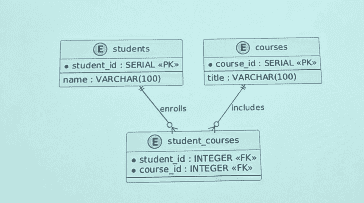
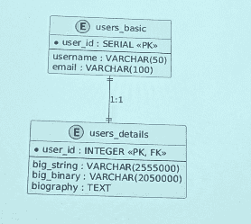
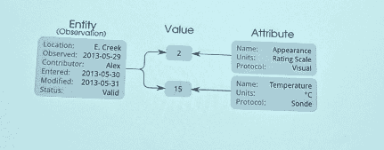

- само проектирование по факту - это 1-2 лекции и 1 лаба
-  корректнее сказать, что курс - это продвинутые бдшки
	- проектирования будет не так много (чисто одну схему спроектировать и всё)
	- по большей части инфраструктурные бдшки
	- деплоймент, тестирование и тд
- за основу курса - постргрес
	- будут другие, но свяжем с постгресом
- будем всё делать внутри контейнеров -> докер
- лаба только после теории на лекции(ура победа)
- исповедуем agile_методолгоию
- особо лабораторных нет.
	- чисто один большой проект, который будем постоянно дорабатывать
- базовый минимум - тройка, не больше
- просрок дедлайна = не возможно получить больше тройки
- сдача всего проекта где-то в мае
	- чаще всего, если и есть правки, то они небольшие и достаточно будет просто сделать пару коммитов и всё
- дедлайны по этапам чисто на отправку кода
- правки после дедлайна этапа - нормально
- скорее всего будут консультации, а не чисто практики
- любой язык
- этапы проекта
	1. подготовка и проектирование
	2. развертывание
	3. эксплуатация и мониторинг

- Дядя Никита не знает, как описать один из этапов(второй, кажется)
	- поэтому, если раньше всех реализуешь этот этап, то дядя Никита поставит фулл
- не совсем важно, как ты каждый этап будешь реализовывать. Главное, чтобы была решена цель
- экзамен:
	-  даём ещё одно задание(этап 4)
	- его дают к экзамену. К экзамену его нужно сделать защитить
		- теорию нужно тоже знать, причём с первого семестра тоже
- заказчика нет, бизнеса тоже
	- поэтому делаем сами себе тз
- насчёт бдшек проще подключиться к pgadmin, который будет самостоятельно генерить актуальную диаграмму
	- это проще, чем поддерживать доку(никто вообще её не поддерживает)
- если функциональное требование не меняет схему бд, то это требование можно не добавлять
- с презы третий пункт можно опустить, потому что к бд не имеет никакого отношения. Это больше фронт

### Подготовка к проектированию

- бизнес-документация (бизнес-требования, Vision Document)
- Техническая документация (Спецификация требований)
- Диаграммы и модели
- Схема БД

#### Функциональные требования

- мост между заказчиком и разработчиком
- позовляет чётко и понятно описать цели и задачу
- описывают поведение системы
- должны быть проверяемы (можно однозначно понять, выполнено требование или нет)
- то, что влияет на схему БД (сущности, связи, атрибуты), важно фиксировать в ФТ
- Примеры:
	- система должна позволять пользоватлею зарегистрироваться, указав адрес электронной почты (или номер телефона), имя пользователя и пароль
	- при регистрации должна осуществляться валидация введённых данных и отправка подтверждения (например email с подтверждением)
	- ~~пользователь должен иметь возможность просматривать и редактировать свой профиль: ....~~ это не относится к бд
	- пользователь может подписываться на других пользователей и видеть список своих подписок и подписчиков

### Проектирование

- $ концептуальный уровень
	- ? выделение сущностей
		- большая часть существительных из документации - наши сущности
	- ? какие у них свойства
	- ? определить связи
	- чаще всего отображается в нотации Чена
		- можно использовать другие ресурсы plant uml
		- можно на листочке
	- (вроде как его вообще этот этап сильно интересовать не будет с диаграммкой)
- $ логическое проектирование
	- ? преобразование ER-модели в реляционную схему
		- сущности -> отношения, name
		- свойства -> тип данных и name
	- ? нормализация(3нф)
	- ? выбор первичных ключей, определение внешних ключей и ограничений целостности
	- ? уточнение типов данных, допустимых значений, уникальности
		- db diagrams
			- позволяет описывать разметку, генерировать схему, диаграмму, отмечены ключи
			- её можно перекинуть в sql
	- ( а вот здесь уже важнее)
- $ физический уровень
	- по факту его как бы нет (соединён с логическим, так как у разных субд разные типы данных)
	- (схема на картинке - хуйня)
		- форейн-кеев нет
		- лайки хуёвенькие
		- в диалоге нет ключиков
		- нейминг важен!!!
	- индексы накидывать на физическом уровне не нужно(?)
		- вообще нужно, но мы этого не делаем
	- (этого уровня нет - совмещён с логическим)

## Нейминг

- Стиль: snake_case
- Таблицы называем во множественном числе
- Столбцы называем в единственном числе
- PK: название_таблицы_id
- FK: то же им, что и у PK в целевой таблице

## Паттерны

- ? много-ко-многим
	- делаем дополнительное отношение, которое хранит форейн кеи на другие отношения
		- пишется достаточно просто (2 джойна)
		- можем докинуть ещё доп информацию(дата, например)
		- можно накидывать дополнительные проверки (например, уникальность записи)
			- нет дублирования данных
				- проблемы 1нф исключаем(?)
			- удобно хранить атрибуты связи
			- проще запросы и ограничения
			- масштабируемость
		- очень частая вещь
		
- ? вертикальное разделение
	- делим сущность на 2 отношения и связь между ними 1 к 1
	- чтобы не было одного большого отношения, к которому будет тяжело и долго всё подгружать(индексы, запросы и тд)
		- производительность
		- безопасность
			- какие-то данные, которые хотим скрыть, можем вынести в отдельное отношенеи и накинуть дополнительное ограничение на доступ
		- разделение по частоте изменения
			- если какая-то часть свойств сущности часто меняется, а другая нет. Проще поделить на два подмножества
		
- ? фиксированный набор значений
	- если 2 состояния - это чисто булеан(первое, что приходит в голову)
		- а вот мужское/женское, так себе... вылет\прилёт...
	- а если много больше двух
		- дни недели, месяцы года, статусы объекта, школьная оценка и тд
		- Различные подходы:
			- ограничение на уровне кода (самый простой, но нежелательный(если ограничения связаны с данными, а не с бизнес-правилами), но на самом деле часто используется)
				- в целом удобно, так как при изменениях не нужно делать миграцию
				- дублирование правил, если приложений несколько(разные языки, сервисы)
				- при расхождении кода и БД возможны некорректные данные(несогласованность данных)
			- условные обозначения (тоже часто используются)
				- чисто договоримся внутри организации
					- 0 - черновик
					- 1 - опубликован
					- и тд
					- парсим потом на бэке/фронте
						- % если говорим о данных, то в рамках бд
						- % если на бизнес-правила, то на бэке
				- очень просто внедрить, не трогая схему и код
				- бд не проверяет значения - легко внести ошибочный код
				- нет единого источника правды
					- в целом используется, но не совсем удобно.
					- Бывает интуитивно не понятна градация
			- ограничение (первый из нормальных кейсов, нормальная тема, особенно, если нужно, чтобы данные находились в определённом формате)
				- написать какой-то чек
					- особенно, если хотим, чтобы данные хранились в определённом формате
					- можем вообще писать очень сложные условия
				- но если придётся добавлять значение, придётся делать миграцию. некомфортик
				- проверка в бд, защита от любых клиентов
				- можно задать сложные условия (диапазоны, выражения, несколько столбцов)
				- длинный список чеков неудобно
				- нельзя хранить описание, порядок, атрибуты
				- чеки могут дублироваться (один и тот же набор нужен в нескольких таблицах)
				- но в целом круто
			- enum
				- создаём отдельный тип с фиксированным списком значений (postgres: CREATE TYPE status_enum AS ENUM ('draft', 'published'))
				- если хотим сравнивать значения между собой - круто
					- например дни недели, оценки
				- один столбец, понятный тип в схеме (нет проблем с дублированием)
				- лаконично
				- по памяти немного занимает
				- чёткий тип
				- можем использовать в разных столбцах, значит и пропадает проблема дублирования
				- добавление/удаление - миграция
				- если хотим менять порядок/вставлять в середину - нужно создавать заново тип заново и придётся обновлять все данные
				- порядок и список значений зашиты в схему, сложнее менять со временем
				- не во всех субд они есть
			- триггер
				- процедура в бд, выполняема до или после insert/update, где проверяются поля(например, что значение из допустимого списка)
				- можем сделать чекер на основе триггера
				- можем делать сложные запросы со сложной логикой на разных отношениях: кросс-табличные проверки, каскады, расчёты
				- одна точка проверки для всех операций с таблицей
				- можно подставлять значения, логировать
				- большая проблема - очень неявные
					- зайдя в субд, ты особо не будешь заходить и понимать эти тригеры
					- сложнее писать и отлаживать: логика спрятана в БД
				- выполняется при каждрй изменённой строке
				- не все разработчики смторят триггеры при изменении таблицы
				- перенос на другую субд сложнее
				- выполняется при каждом изменении, что может замедлять(ну как-то пох)
			- справочник
				- таблица допустимых значений, в рабочих таблицах - внешний ключ на эту таблицу
				- очень хороший вариант
					- допустим хранить дни недели на трёх разных языках.
					- вот вообще без проблем
					- просто кладём это всё в одно отношение
					- и при желании будем круто брать нужное значение
				- целостность через FK: нельзя сослаться на несуществующее значение
				- нормализация: нормализованная модель; один источник правды для набора значений
				- можно ссылаться из разных отношений
				- очень удобно добавлять атрибуты: название, описание, порядок, флаги
				- добавление нового значения - insert, без смены типа или check
				- не можем сравнивать
				- каждый запрос требует join ( в целом не критично, особенно когда маленькое число записей)
				- можно менять разными способами (миграции, админка, seed)
					- это нужно продумать. Кто и как может менять справочник
- (у нас прода не будет, поэтому придётся данные генерить, стараясь сделать так, чтобы они были около настоящими)
- ? EaV entity-attribute-value

	- предназначен для моделирования объектов, обладающих большим количеством потенциальных атрибутов, из которых лишь небольшая часть применяется к каждому объекту
		- например отчёт какой-нибудь, в котором большое число операций с кодами и можно попадать в разные формочки отчёта и могут иметь разные атрибуты
		- но при этом нам нужно эти данные вернуть
		- или например маркетплейс, на котором много разных продуктов, где у всех товаров есть название и цена.
		- а все остальные свойства разные для каждого продукта(набор их)
		- вот тогда создаём 3 отношения:
			- сущности (уникальный идентификатор объекта, (айди))
			- атрибуты этой сущности (имя или тип свойства объекта(цвет, вес, рост))
			- значения атрибутов этой сущности(конкретное значение атрибута(красный, 5 кг, 180 см))
	- полностью теряется нормализация
	- проблемы с производительностью
		- но на удивление применяется...
	- проблемы с типом даннами
		- там, где value могут находиться вообще абсолютно разные данные
		- можно упороться и сделать число атрибутов равное числу типов
	- запросы будут тяжёлыми
	- позволяет хранить данные с динамической изменяемой структурой, когда новые атрибуты могут добавляться без необходимости изменения структуры таблицы
	- если у большинства объектов имеется лишь небольшое подмножество возможных атрибутов, использование ESV помогает избежать множества пустых столбцов в таблице
	- в системах, где свойства объектов часто изменяются (например мед системы, каталоги продуктов с различными характеристиками), EAV позволяет легко адаптироваться к новым требованиям
	- для получения полного набора атрибутов одного объекта часто требуется сведение множества строк в одну запись, что усложняет SQL-запросы
	- все значения хранятся в одном столбце, что может затруднять валидацию и обработку данных на уровне базы
	- реализовать ограничения и проверки целостности данных сложнее, чем в традиционных реляционных моделях с фиксированными столбцами
- ? граф
	- проблема в том, что любой обход по дереву - это рекурсивный джоин(асимптотика около экспоненты)
	- apache age - плагин в постгресе для использования графовых бд внутри постгреса
		- выершины и рёбра внутри той же бд
		- запросы на cypher внутри SQL:...
		- обход графа, пути, фильтрация по свойтсвам
		- данные графа хранятся в обычных таблицах PostgreSQL, можно совмещать с обычным SQL и JOIN
- ? полиморфные связи
- представим, что у нас есть какая-то иерархия. Допусти есть комментарии, которые могут быть и к постам и к фото и тд. Сущность одна, а имеет несколько связей. Как делать такое? Например иметь несколько атрибутов. Parent_type - отношение. parent_id - конкретный кортёж
	-  одна ассоциация - несколько типов сущностей
	- в БД: parent_type+parent_id
	- нет FK, сложные запросы, риск "сирот" и мусора в данных
	- отдельная таблица связи на каждый тип или общая таблица "родителей"
	- join по разным таблицам в зависимости от parent_type (CASE + несколько LEFT JOIN)
	- индексы и разбор планов сложнее
	- не просто связи, а связи с иерархией
	- нет форейн кея. Целостности на уровне бд нет
	- можем сделать составной индекс
	- можем усилить контроль:
		- в приложении: строгая валидация при создании/обновлении; удаление родителя только через, который заодно чистит комментарии
		- сделать тригеры или периодические скрипты на поиск "сирот"
		- составной индекс (commentable_type, commentable_id) для выборки "все комментарии к этому посту"
	- а можно сделать отдельную таблицу на связи на каждый тип родителя
		- Настоящие FK - целостность, каскады, нельзя оставить "сироту"
		- тогда запросы будут проще. join по одной таблице
		- удобные индексы
		- классическая реляционная модель
		- больше таблиц
		- общие запросы ("все комментарии пользователя ко всему") - union по нескольки таблицам
		- но будет много доп отношений
- реализации иерархической структуры:
	- список смежных вершин
	- ребёнок имеет ссылку на родителя
		- нужно знать кол-во уровней
		- легко вносить изменения
		- Плюсы: простая схема, легко добавить/переместить узел, мало изменений при обновлении
		- но придётся писать рекурсивный запрос. Если большая глубина, то выполняться будет очень медленно
	- nested set
	- просто строка, которая хранит айдишники на себя и предков(или уровень...)
		- удобно читать любого объёма
		- предполагается, что данные меняться не будут (тяжело подвергаются изменениям)
		- легко работать по диапозону
		- если добавлять что-то новое, то дерево придётся полностью перестраивать. Кошмар просто
		- Схема: у каждого узла два числа - left_bound и right_bound. Для любого узла все потомки имеют bounds внутри его диапозона; обход "потомки" - where left_bound > N and right_bound < M
		- без рекурсии - сравнение границ
		- вставка/удаление/перемещение узла требует персчёта границ у многих строк - сложно и тяжело при частых изменениях
		- использовать когда дерево почти не меняется, зато часто нужны запросы по поддеревьям
	- materialized path
		- сложно добавлять в середину дерева
		- один запрос без рекурсии
		- очень быстро искать по поддереву
		- при переносе поддерева нужно обновлять path у всех потомков; длина пути ограничена; выбор разделителя и формата
		- использовать когда часто нужны выборки "все предки/потомки", дерево больше читают, чем меняют
- json
	- атрибуты с переменными набором: товарные опции, теги,метаданные
	- конфиг, настройки: одна запись - один json-объект
	- может быть альтернативой для eav
	- можно засунуть конфиг в json Объект
	- события, логи: каждое событие - документ со своей структурой
	- кэш ответа API: созранённый ответ внешнего сервиса
	- временные/редко запрашиваемы данные: черновики, доп поля без жёсткой схемы
- Звезда
	- схема "звезда" - модель данных для аналитики и хранилищ (DWH): в центре таблица фактов, вокруг неё таблицы измерений
	- таблица фактов: события или измеримые показатели (продажи, клик, заказы). Содержит меры (числа для агрегации: сумма, количество) и внешние ключи на измерения (дата, товар, магазин, клиент и тд)
	- таблицы измерений: атрибуты описательные (название, категория, иерархия)
	- (snow flake - расширенная звезда) (нам не надо)
		- добавятся ещё связи
