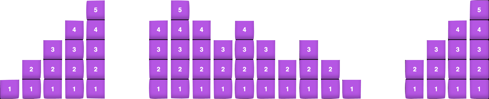
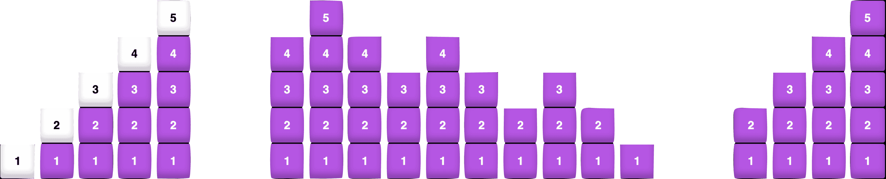
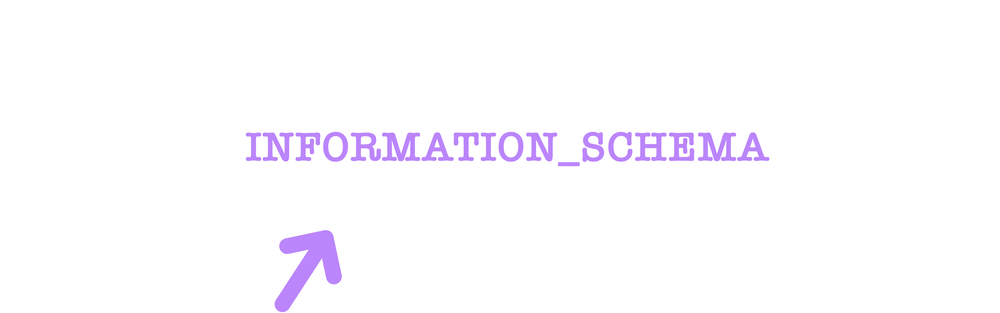
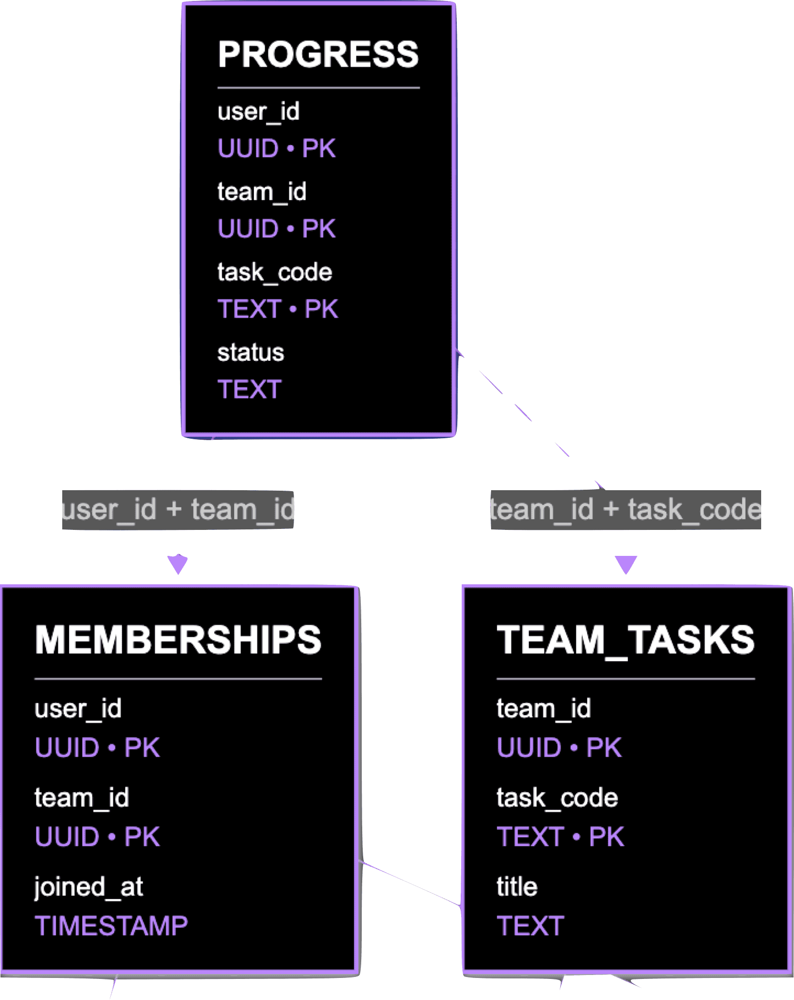
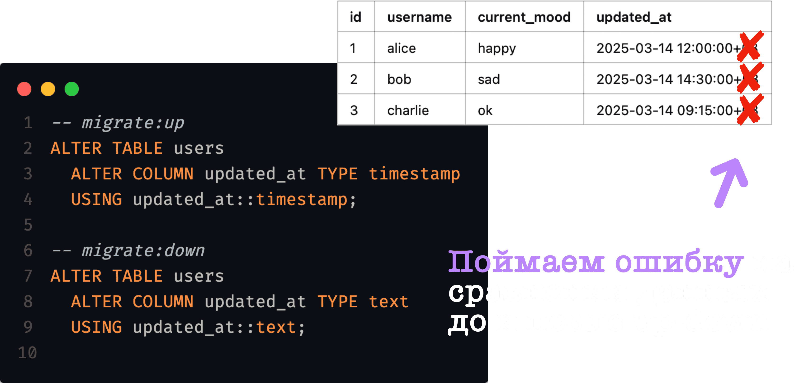
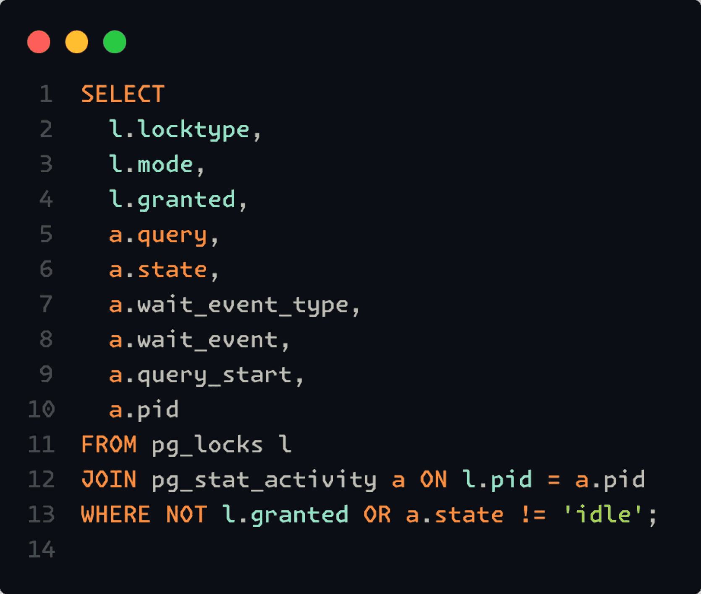

Пора тестировать миграции

- Андрей Карчевский
- Работает в поисковом портале Яндекса, работает над внедрением ML в продуктовые команды

Тема Лекции: Как тестировать миграции?

Что вообще такое миграции? Это по сути SQL-скрипт, который изменяет состояние бд в новое инвариантное состояние

Есть миграция наверх - migrate:up. Скрипт который позволяет перейти к более новой версии

Но так же принято указывать - migrate:down. Скрипт, который позволяет откатиться от новой версии к старой

Вопрос от Наговинина: Надо ли

У некоторых команд в Озоне вообще не принято migrate:dow. Они “катаются” только наверх. У нас есть набор упорядоченных скриптов, который приводит бд к продовому состоянию

Есть голая бд, в докере развернули, после этого специальным движком для накатки миграций прошлись и накатили каждую миграцию последовательно, восстановив схему, которая сейчас есть на проде

А зачем вообще миграции нужно тестировать?

Пайплайн внедрнеия фич без тестирования

Есть разработчик, который прикатывает новую фичу. После того как он написал какой-то код, он отправляет его на код ревью. После есть возможно какое-то код ревью, от архитектора. Всё протестили локально, но упс, случился какой-то инцидент. Нужно иметь возможность откатиться

В чём была проблема?

1. Больно ревьюить
	- Глазами можем посмотреть строчек 400-500 кода. Тысячи строк кода даже сама команда постгресса не сможет отсмотреть
2. Деградация пайплайна
3. Postmortem
	- методология разбора проблем, случившихся на проде

TTM (time to market) - кол-во времени от написания тикета до выкатки в прод. Если начинаем ругать сотрудников за быструю реализацию функционала, то TTM упадёт сильно, ведь инженеры станут бояться писать код

Между человеческим фактором и сломанной базой ничего нет.

Первая идея. Давайте просто автоматизируем накатку и откатку на тестовом стенде

| Column       | Type   | Constraints | Default |
| ------------ | ------ | ----------- | ------- |
| id           | SERIAL | PRIMARY KEY |         |
| username     | TEXT   | NOT NULL    |         |
| current_mood | mood   | NOT NULL    | ‘ok’    |
| updated_at   | TEXT   | NOT NULL    |         |

```sql
// migrate:up
ALTER TYPE mood ADD VALUE ‘happy’ AFTER ‘ok’
// migrate:down

```

Запустили migrate:up – всё хорошо

Запустили migrate:down – всё хорошо

Но что если еще раз запустим migrate:up?

Упс. Ошибка. Мы не можем создать еще раз ‘happy’, ведь он уже есть

Выходит что `migrate:down` еще более важен чем `migrate:up`. Ведь он отвечает за приведение к **инварианту**

Staircase-тест

1. накатываем все миграции 
2. итеративный down > up > down до depth: int = 0
3. накатываем откаченное
 

Снапшоты схем

- snap1
- up
- down
- snap2

Проверяем равны ли snap1 == snap2. Если нет - тогда миграции сломаны и не равны

Staircase + Снапшоты



Беленьким - фиксируем состояния

- up
- down
- сравниваем схемы

Как брать снапшоты?
ISO/IEC 9075-11 — стандарт, описывающий SQL. Каждая глава стоит 200 баксов

У INFORMATION_SCHEMA под капотом более 30 view \[вьюх\] и они сравниваются 


Как делать staircase тест?
Check here: https://github.com/realkarych/seqwall

Промежуточные итоги
1. идемпотентность != соблюдение инварианта
2. используй снапшот-тесты

Что по эффективности?

Все тесты катаются на голой бд, следовательно миграционные тесты будут достаточно быстрыми. Помимо этого можно настроить глубину отката

А что с данными? 
1. Генерировать данные с помощью библиотек (faker / greenmask / hypothesis / regex)
2. не репрезентативно
3. данные устаревают
4. больно с внешними фидами (не знаем что у фида под капотом в генерации данных)
5. невозможно на больших и связанных схемах



Сэмплируем данные
1. тащим данные с прода
2. нужна инфраструктура
3. хорошо сэмплировать — сложно (как сэмплировать? взять первые сто или последние сто? а как понять всё ли разнообразие данных покрыли?)
4. скорость тестов VS объем данных VS актуальность данных (нужно регулярно подтягивать данные из прода, чтобы не устарели)
5. используем greenmask / свой велосипед

Генерация VS Сэмплы?

Генерируем, если:
- нет возможности сэмплировать (запрет безопасников и т.д.)
- мало схем, слабые связи
- данные семантически-очевидны (хеши, почты, имена, id…) 
Сэмплируем, если:
- много схем
- сложные связи, составные ключи
- внешние фиды и неочевидные констрейнты

Данные нашли, а что дальше?

Какие бывают миграции?
- Возвратные – после up-down данные те же
- Невозвратные – up влечёт потерю данных (дропаем какую-то таблицу, хоть и восстановим таблицу down-грейдом, но ведь данные не восстановтяся)

Data snapshots

- snap1
- up
- down
- snap2

Но снапшотим не информационную схему, а данные



Как брать снапшоты?
- есть утилитика `pg_dump `


Выводы 
- Тестировать без данных – сомнительно 
- Отлавливаем невозвратные миграции  (и назначем ревьювера)
- для сэмплов используем pg_dump + diff / самописный диффер

Ну теперь-то точно проблем нет? 

Команда ALTER берёт access exclusive lock. Во время двух операций не можем ни читать ни писать в табличку. Из 100 элементов всё сработало за 5 миллисекунд. Выкладываем в прод, а там 10 миллионов записей? Накатили на прод и положили бд на час

Ловим локи в рантайме
- pg_locks & pg_stat_activity
 
 Этим кодом можем получить все локи
 - Ловим локи статикой squawk позволит подсветить ошибочки 