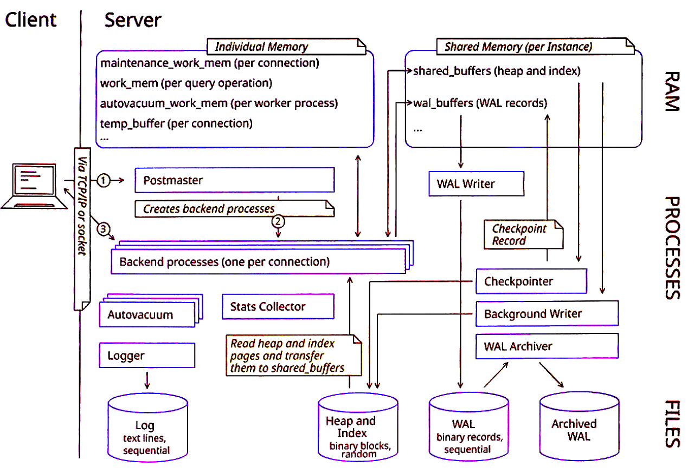
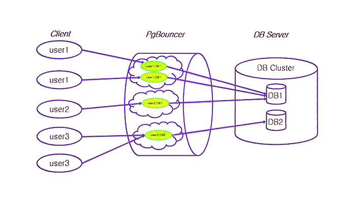

# Архитектура postgresql



## Frontend

- Frontend включает в себя собственно клиентское приложение и библиотеку LIBPQ, реализующую интерфейс связи с сервером
- Библиотека LIBPQ отвечает за установление соединения с сервером и передачу SQL-запросов

**TCP протокол** - проверяет передачу пакетов (если отправили что-либо, то ждём подтверждение, происходит хендшейк)

**UDP протокол** - не проверяет передачу пакетов (если отправили что-то, то не ждём подтвержедние)

## Драйверы языка

- psycopg2, ruby-pg — драйверы, которые берут за основу библиотеку LIBPQ и поверх неё пишут условный интерфейс взаимодействия для приложения написанного на том же питоне
- asyncpg, pgx, Npgsql, rust-postgres — драйверы, которые сами реализуют протокол общения, для более удобнго управления с корутинами. Фичи протокола не так часто подтягиваются.

## Фаза инициализации

- **StartupPacket**: указывает версию протокола, имя пользователя и базу данных, к которой хочет подключиться.
- **Authentication Request**: Сервер смотрит в pg_hba.conf и отвечает запросом на аутентификацию.
- **PasswordMessage**: Клиент отправляет хеш-пароля.
- **AuthenticationOk**: Если всё хорошо, сервер подтверждает успех.
- **BackendkeyData**: Сервер присылает уникальные РID процесса и секретный ключ. (Нужно для отмены запроса)
- **ReadyForQuery**: Финальное сообщение о готовности.

## Фаза работы

- **Simple Query**: Клиент отправляет сообщение с типом '0', в теле которого просто лежит текст SQL-Запроса.
- **Extended Query**: разбивает выполнение на несколько шагов:
- **Parse**: Клиент отправляет строку запроса с плейсхолдерами ($1). Сервер парсит его и создаёт prepared statement.
- **Bind**: Клиент привязывает конкретные значения к параметрам ($1 = 5) и создаёт portal (объект, готовый к выполнению).
- **Describe**: Запрос информации о полях результата.
- **Execute**: Команда на выполнение портала.
- **Sуnc**: Сигнал о том, что текущая последовательность команд закончена и сервер может вернуться в состояние ожидания.

## Backend-процессы

- Для каждого нового подключения Postmaster порождает отдельный процесс, который обрабатывает SQL-запросы, выполняет планирование и возвращает результаты клиенту. Такой подход позволяет изолировать сессии и повышать стабильность системы.
- Каждый backend-процесс имеет свою локальную память, которая настраивается параметрами вроде work_mem (для сортировок и хеш-таблиц) и maintnance_work_mem (для задач обслуживания)
- Background workers, Background proccess

## PgBouncer

Обеспечивает connection pooling


## Фоновые процессы - Autovacuum
- Автоматиечски очищает и реорганизует таблицы, удаляя устаревшие данные и освобождая место.
- Появился в 8.1 Запускается VACUUM и ANALYZE
- Табличное “раздувание”
- Переполнение счетчика транзакций
- Не блокирует таблицы

…

## Фоновые процессы - Checkpointer
- Если вы видите LOG: checkpoints are occurring too frequently, значит, max_wal_size слишком мал относительно

## Фоновые процессы - WAL Writer
- обеспечивает запись журналов предзаписи для обеспечения надежности и целостности данных
- Он сбрасывает буфер каждые wal_writer_delay миллисекунд (по умолчанию 200 мс)

## Фоновые процессы - Background Writer
- Пишет измененные страницы буферного кэша на диск в фоновом режиме.
- Он постоянно, в фоновом режиме, понемногу записывает грязные страницы, поддерживая достаточный запас чистых буферов. Backend-процессы в большинстве случаев находит чистый буфер мгновенно и не участвует в записи

## Фоновые процессы - Stats Collector
- Собирает статистику выполнения запросов и использования ресурсов. 
- Бекенды передают статистику
- Данные хранятся в pg_stat_* и pg_statio_
- С 14 версии теперь этим занимаются сами бекенды

## Фоновые процессы - Stats Collector
- количество последовательных сканирований (seq scans), сканирований п о индексам ( index scans ), проитанных и изменённых строк.
- Информация о VACUUM и ANALYZE
- Вызовы пользовательских функций: количество вызовов 
…

## pg_stat_statements
- calls: количество выполнений данного запроа
- total_exec_time, min_exec_time, max_exec_time, mean_exec_time, stddev_exec_time: Статистика по времени выполнения (в миллисекундах). Это ключевые метрики для поиска медленных запросов
- total_plan_time, min_plan_time, … (если track_planning включен): Статистика по времени планирования
- rows: Общее количество затронутых или возвращенных строк
…

## Поиск самых медленных запросов

```sql
SELECT
	total_exec_time::int,
	calls,
	mean_exec_time::int,
	query
FROM pg_stat_statistics
ORDER BY total_exec_time DESC
LIMIT 10;
```


## Память буферизация - Shared Memory
- Shared buffers
- WAL Buffer
- CLOG
- Locks
- temp_buffers

## Память и буферизация - Локальная память процесса
- Каждый backend-процесс имеет свою локальную память для обработки запросов. Параметры типа work_mem определяют, сколько памяти выделяется для сортировки, хэш-операций идругих операций в рамках одного запроа
- maintenance_wokr_mem - для операций обсулживания (VACUUM, CREATE INDEX)
- temp_buffers – для временных таблиц

## PGDATA
- base/ — каталог с данными каждой базы данных
- global/ глобальные объекты (роли, табличные пространства)
- pg_wal/ — журнал предзаписи (WAL)
- pg_stat_tmp/ — временные файлы статистики
- postgresql.conf — конфигурационный файл
- pg_hba.conf — настройки аутентификации клиентов.

## Storage Manager
- этот компонент отвечает за чтение и запись данных с диска. Он обеспечивает взаимодействие между shared buffers и файловой системой

## Logical Replication Launcher
- Отвечает за управление работой логической репликации
- Когда вы создаете подписку, Launcher замечает это и порождает необходимые рабочие процессы.
- Если какой-то рабочий процесс неожиданно завершился, Launcher обнаружит это и перезапустит его.
- следит за тем, чтобы количество запущенных процессов не превышало установленные лимиты
- Table Synchronization Worker, Apply Worker

## WAL Archiver
- фоновый процесс, который отвечает за копирование заполненных сегментов журнала прездаписи (WAL) в долговременное хранилище 
- Обеспечивает сохранность всех изменений базы данных для возможности восстановления на любой момент времени (Point-In_time recovery, PITR)
- archive_mode = on

https://pgtune.fariton.ru/