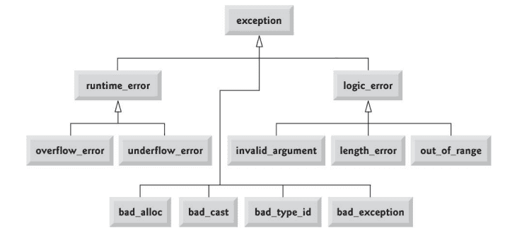
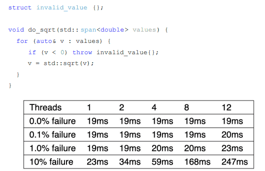
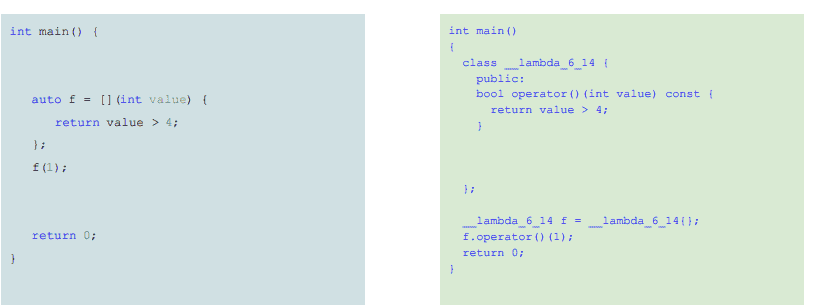
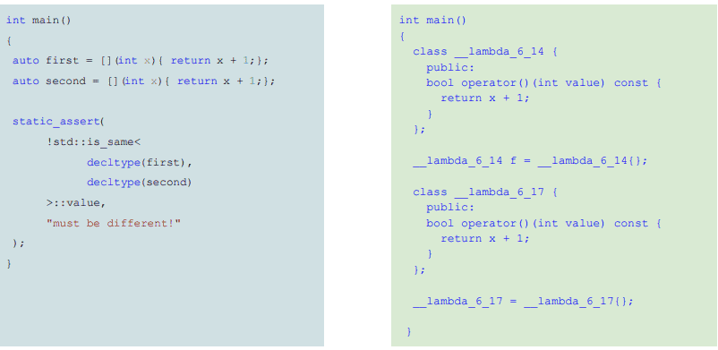

**2 семестр** \
Основы программирования. 

<!--more-->

### std::exception

`std::exception` - базовый класс для исключений стандартной библиотеки
Кидать стандартные типы или циферки - малоинформативно. 
**Тип эксепшена является полезной информацией, но дополнение сообщением - вообще кул**

```cpp
class exception { 
public: 
	exception() noexcept; 
	exception(const exception&) noexcept; 
	exception& operator=(const exception&) noexcept; 
	virtual ~exception(); 
	virtual const char* what() const noexcept; 
};
```



**Если мы хотим написать своё исключение, то наследуем его от:**

```cpp
class my_exception : public std::exception { // derived from std::exception 
public: 
	my_exception(const std::string& what) 
		: what_(what){ 
	} 
	const char* what() const noexcept override { 
		return what_.c_str(); 
	}
private: 
	std::string what_; 
};
```

> [!warning] Важно!
> Не нужно бояться писать свои исключения! Они могут быть даже очень тривиальными и это не страшно.

**Example:** (очень похож на runtime error):
```cpp
int foo() { 
	throw my_exception("error"); // by rvalue 
} 

int main(int, char**) { 
	try{ 
		foo(); 
	} 
	catch(const my_exception& e) { // by const reference 
		std::cerr << e.what(); 
		std::runtime_error 
	} 
}
```


### Exception:
 - Исключения нужны исключительно для обработки ошибок(не нужно использовать их для своей бизнес-логики)
	1. Механизм кидания исключений стоит дорого
- Работа с исключениями должна строиться вокруг инварианта объекта
- Исключения кидаем по значению, а ловим по ссылке (это оптимальнее всего)
	1. исключения хранятся в особенном месте памяти
	2. а по ссылке ловим для избежания лишнего копирования

- Исключения - это достаточно дорогая штука
 
 Запуская данную программу на разных количествах потоках и с разным количеством ошибок
 
- ! **Почему увеличивается число по столбцам?** Потому что свёртка стека небесплатная
 - ! **Почему увеличивается число по строчкам?** Потому что у нас не может быть несколько исключений одновременно и компилятор обеспечивает обработку исключений из разных потоков неодновременно.

### std::expected

-  Идея - объединим коды возврата и исключения
	- коды возврата легковесные
	- исключения суперудобные и не требует обработки в месте получения
- Тогда давайте создадим шаблонный тип - параметры: тип возвращаемого  значение, которое мы хотим получать из метода, а второй - тип ошибки, если метод сработал неправильно
- Лишняя плата за добавочный тип и лишние вызовы

- Позволяет возвращать либо ожидаемое значение, либо ошибку
- Накладные расходы сравнимы с кодом возврата
- Передаёт ответственность за обработку вызывающему коду
- Три ключевых класса:
	1. std::expected - главный класс (тип значения, тип ошибки)
	2. std::unexpected - класс, который мы возвращаем с ошибкой, если она произошла
	3. std::bad_expected_access - если мы попытались обратиться к значению, которое является ошибкой
```cpp
enum class EDivError { 
	DevisionByZero = 0, 
}; 
	
std::expected<int, EDivError>  my_div(int a, int b) { 
	if(b == 0) 
		return std::unexpected{EDivError::DevisionByZero}; 
		
	return a/b; 
}

int main() { 
	auto r = my_div(8, 0); 
	if(r) 
		std::cout << *r << std::endl; //1 способ (похожий на код возврата)


	try { 
		std::cout << r.value() << std::endl; 
	} catch (std::bad_expected_access& err) { 
		std::cout << err.what() << std::endl; 
	} // 2 способ (прямо-таки ловим исключение)
	
	return 0; 
	
}
```

Как и обычно у нас нет идеального решения. Нужно что-то выбирать
1. Исключения позволяют обрабатывать ошибки единообразно, но не в месте возникновения 
2. Коды возврата позволяют обработать ошибку сразу при возникновении но не единообразно 
3. `std::expected` позволяет иметь комбинированный подход


**А теперь напишем функцию `to_uint`**
```cpp
uint32_t to_uint(std:: string_view str) {
	uint32_t result = 0; 
	for(char c : str) { 
		result *= 10;
		result += c - '0'; 
	} 
	
	return result; 
	
} 

int main(int, char**){ 
	std::cout << to_uint("100500") << std::endl; 
}

```

Варианты выхода из ситуации (см [презу](https://github.com/is-itmo-c-24/lectures/blob/main/2025.03.05/Lecture%2016.%20Error%20Handling.pdf)):
- Просто проверять цифра ли наш символ. Иначе возвращаем то, что получилось до этого момента (вообще странный результат. Обработает не всё да и непонятно, что вернёт в каких случаях)
- Возвращаем `bool`, а значение получаем по ссылке (не отвечает на вопрос, что случилось)
- Делаем с помощью `errno` (C - стиль)

```cpp
uint32_t to_uint(std::ng_view str)str) {
	uint32_t result = 0; 
	if(str.empty()) { 
		 errno = EINVAL; 
		 return result; 
	 } 
	 
	 for(char c : str) { 
		 if(c < '0' || c > '9') { 
			 errno = EDOM; 
			 return result; 
		 } 
		
		result *= 10; 
		result += c - '0'; 
	} 
	
	return result;
}
```
- Проброс исключения
```cpp
uint32_t to_uint(std:: string_view str) { 
	uint32_t result = 0; 
	if(str.empty()) 
		throw std::invalid_argument("String is empty"); 
		
	for(char c : str) { 
		if(c < '0' || c > '9') 
			throw std::invalid_argument(std::format("Argument () is not a number", str)}; 
			
		result *= 10; 
		result += c - '0'; 
	} 
	
	return result; 

}
```
- Используем` std::optional` (похоже на второй вариант. `std optinal` - класс, который умеет хранить значение типа, который мы передали по шаблону и храним ли мы его там)
```cpp
std::optional to_uint(std:: string_view str) { 
	if(str.empty()) 
		return {}; 
	uint32_t result = 0; 
	
	for(char c : str) { 
		if(c < '0' || c > '9') return {}; result *= 10; result += c - '0'; } return result; }
```
- `std::expected `
```cpp
std::expected<uint32_t, std::invalid_argument> to_uint(std::string_view str) { 
	if(str.empty()) 
		return std::unexpected{std::invalid_argument("String is empty")}; 
		
	uint32_t result; 
	
	for(char c : str) { 
		if(c < '0' || c > '9') 
			return std::unexpected{std::invalid_argument{std::format("Argument {} is not a number", str)}}; 
		
		result *= 10; 
		result += c - '0'; 
	} 
	
	return result; 
	
}
```
### Вывод:
В зависимости от того, как вы хотите обрабатывать ошибки, какие вам кажется это правильно делать есть 3 варианта:
- коды возврата
- исключения
- std::expected
- (либо std::option)

### Lambda
### Указатели на функцию
- Для глобальных функций либо статических методов классов
```cpp
return_type (*pointer_name)(arg_typ1, arg_type2 ... arg_typen)
```
- Example
```cpp
int* findMax(int* array, size_t size, bool(*compare)(int,int)) { 
	int* result = array; 
	for(int i = 1; i < size; ++i) { 
		if(!compare(*result, *(array +i))) 
			result = array + i; 
		} 
		
		return result; 
		
	} 
	
	bool greater(int a, int b) { 
		return a > b; 
	} 
	
int main() { 
	int array[] = {1, 4, 5, 3, 10, 9}; 
	std::cout << * findMax(array, sizeof(array)/sizeof(int), greater); 
	return 0; 
}
```

Но мы знаем о using, значит можем сделать так

```cpp
using TComparer = bool(*)(int,int) 

int* findMax(int* array, size_t size, TComparer compare) { 
	int* result = array; 
	for(int i = 1; i < size; ++i) { 
		if(!comparer(*result, *(array +i))) 
			result = array + i; 
	}
	
	 return result; 
 }
```

А тут мы вспоминаем о шаблонах, тогда

```cpp 
template<typename TCompare>
int* findMax(int* array, size_t size, TComparer comparer) { 
	int* result = array; 
	for(int i = 1; i < size; ++i) { 
		if(!comparer(*result, *(array +i))) 
			result = array + i; 
	} 
	return result; 
} 

int main() { 

	int array[] = {1, 4, 5, 3, 10, 9}; 
	std::cout << *findMax(array, sizeof(array)/sizeof(int), std::greater()); 
	return 0; 
}
```
- Функтор в отличие от функций может сохранять состояние
```cpp
template<typename TCompare> 
int* findMax(int* array, size_t size, TComparer comparer) { 
	int* result = array; 
	for(int i = 1; i < size; ++i) { 
		if(!comparer(*result, *(array +i))) 
			result = array + i; 
	} 
	return result; 
} 

int main() { 
	int array[] = {1, 4, 5, 3, 10, 9}; 
	
	std::cout << *findMax(array, sizeof(array)/sizeof(int), std::greater()); 
	return 0; 
}
```
`mutable` - поле, которое может быть изменено из константных методов
Примеры функторов из std:
- `std::less `
- `std::equal_to`
- `std::plus`
- `std::logical_to`
- `etc (< functional >)`

```cpp
class GreaterThen { 
public: 
	GreaterThen(int limit)
		: limit_(limit) 
	{} 
	
	bool operator()(int value) const { 
		return value > limit_; 
	} 
	
private: 
	int limit_; 
};

int main() {

	std::vector v = {1,2,3,4,5,6,7}; 
	
	auto it = std::find_if( 
		v.begin(), v.end(), 
		GreaterThen{4} 
	); 
	
	if(it != v.end()) 
		std::cout << *it; 
		
	return 0; 
	
}
```
Но в этом коде что-то не то:
- не хочется выделять целый класс для такой небольшой функции
- да к тому же есть практически тоже самое, а именно `std::greater`
- `std::bind` может помочь использовать существующий функтор и создать на его основе новый функциональный объект (получится то же, что и выше, но само). Это будет лучше с точки зрения читаемости кода, потому ин реал лайф определение класса было бы далеко-далеко
```cpp
int main() { 
	std::vector v = {1,2,3,4,5,6,7}; 
	
	auto it = std::find_if( 
	v.begin(), v.end(), 
	std::bind(std::greater<int>{}, std::placeholders::_1, 4) 
	); 
	
	if(it != v.end()) 
		std::cout << *it; 
		
	return 0; 
	
}
```
### `Functor`
- Позволяют параметризовать алгоритмы (и обычные функции)
- Отделены от вызывающего кода
- Использование стандартных функторов в нестандартных ситуациях затруднено

Все подумали-подумали и сделали в C+++11 `Lambda`-функции
### `Lambda`
[Замыкание](https://en.wikipedia.org/wiki/Closure_(computer_programming)) позволяет создавать неименованные функторы, с захватом переменных из текущей области видимости.
`[captrure] (params) attrs -> return {body}`
- (params) - optional
- attrs - optional (тип возвращаемого значения. Помогает компилятору и человеку, читающему код)
- -> return - optional
```cpp
int main() { 

	std::vector v = {1,2,3,4,5,6,7}; 
	
	auto it = std::find_if( 
		v.begin(), v.end(), 
		[](int value) { return value > 4;} 
	}; 
	if(it != v.end()) 
		std::cout << *it; 
		
	return 0; 
	
}
```
- Более читаемо (синтаксический сахар)
```cpp
//всё это корректно
int x = 1; 
[]{};  
[](int i) { return i + 1;}; 
[](int i) ->float {return i + 1;}; 
[x](int i) {return x + i;}; 
[](int i) noexcept {return i + 1;}; 
[&x](int i) mutable { ++x; return i + x;};
```
Компилятор за нас создаёт функциональный объект

Если написать две идентичные - это всё равно будут два разных класса
