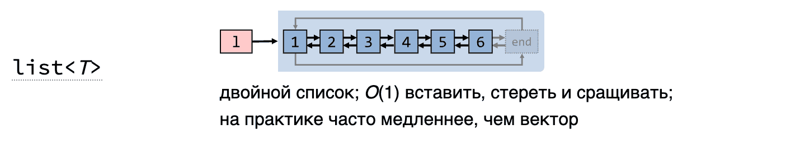
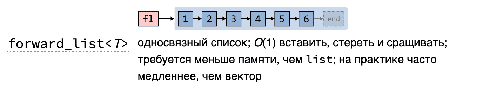
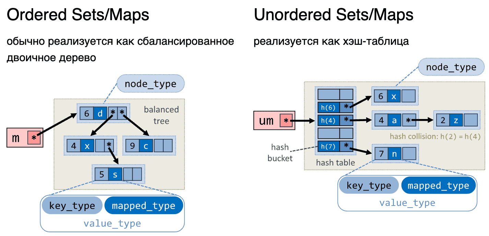

**2 семестр** \
Основы программирования. 

<!--more-->

```cpp
std::vector<int>::iterator myremove(std::vector<int>::iterator begin, std::vector<int>::iterator end, int num) {
	std::vector<int>::iterator cur_place=begin;
	while(begin != end) {
		if(*begin != num) {
			*cur_place = *begin;
			++cur_place;
		}
		++begin;
	}
	return cur_place;
}
```

Тут разбирали всякие функции hand-made `remove( )`. Функция выше работает только на интовых векторах. Можно использовать вместо этого шаблоны. Но всё так же еще будет работать только на векторах. Тогда можем использовать `IterType` вместо `std::vector`. Но ведь не каждый `IterType` подойдет, поэтому нужен `ForwardIterator` и шаблончик

### Функциональные объекты
(чтобы параметризировать функциональные объекты)
перегружены операторы круглые скобочки

- `minus`
- `multiplies`
- `...`
- `equal_to`
- `not_equal_to`
- `greater`
- `...`
- `logical_and`
- `...`
- `bit_and`

**Named Requirements**
- [Container](https://en.cppreference.com/w/cpp/named_req/Container)
- [ReversibleContainer](https://en.cppreference.com/w/cpp/named_req/ReversibleContainer)
- [AllocatorAwareContainer](https://en.cppreference.com/w/cpp/named_req/AllocatorAwareContainer)
- [SequenceContainer](https://en.cppreference.com/w/cpp/named_req/SequenceContainer)
- [ContiguousContainer](https://en.cppreference.com/w/cpp/named_req/ContiguousContainer)
- [AssociativeContainer](https://en.cppreference.com/w/cpp/named_req/AssociativeContainer)
- [UnorderedAssociativeContainer](https://en.cppreference.com/w/cpp/named_req/UnorderedAssociativeContainer)
- ...


(описание контейнеров) - формальное описание того, чего мы ожидаем от определённого типа
- типы, и требования к ним
- Какие выражения должны быть определены в данном контейнере (что можно с ним делать)
- набор методов, которые мы можем делать с этим контейнером


**Sequence containers**
`array`
`vector`
`deque`
`forward_list`
`list`
Последовательные контейнеры - решают проблему массива (фиксированный размер массива)

**Список требований к std::array**
- `Container`
- `ReversibleContainer`
- `SequenceContainer`
- `ContiguousContainer`

- `Container requirements`

```cpp
iterator begin() {return iterator(data())}
const_iterator begin() const {return const_iterator(data())}
iterator end() {return iterator(data()+ _Size)}
const_iterator end() const {return const_iterator(data()+ _Size)}

size_type size() const {return _Size;}
size_type max_size() const {return _Size;}
bool empty() const {return _Size == 0;}
```

- `ReversibleContainer`

```cpp
reverse_iterator rbegin() {return iterator(end())}
const_reverse_iterator rbegin() const {return const_iterator(end())}
reverse_iterator rend() {return iterator(begin())}
const_reverse_iterator rend() const {return const_iterator(begin())}
```


динамически меняют размер в зависимости от того, добавляем мы или убираем элементы ()

Требования к  std::array:
- `iterator` - просто указатель (поэтому возврат конца = начало массива + `size`)
- `reverse_iterator` - смотрит на контейнер не как от начал до конца, а наоборот. Поэтому `rbegin` вернёт конец


- классика


- в памяти - один большой кусок. Выделяет памяти больше, чем нужно. При создании вектора на 1 эл. - выдел. на 1 эл. Далее при добавлении смотрит на возможность добавить. Если есть память, добавляем. Иначе делаем реаллокацию (выделить чуть больше памяти х2). Происходит реаллокация редко , поэтому по асимптотике круто. (непрерывный)
- Предоставляет самый крутой итератор и можно использовать с любым алгоритмом STL
- Быстрый доступ к элементам за счёт непрерывности в памяти
- неэффективно добавлять и удалять из середины (О(n))
- Не всегда можно найти в памяти такой большой непрерывный кусок памяти


- похож на вектор, но не один сплошной кусок памяти. он выделяет несколько разных кусочков памяти. Массив массивов. Если памяти не хватает, то выделяем ещё один кусочек - массив (произовльный)
- что-то между вектором и списком
- Не очень быстрая индексация (надо и понять в каком кусочке лежит элемент, а потом найти элемент уже внутри этого кусочка)
- неэффективаня вставка и удаление в середину


- циклический двусвязный список (двунаправленный)
- Эффективная вставка и удаление
- нельзя использовать со всеми алгоритмами
- долгий доступ к элементам
- Перерасход памяти засчёт указателей и прочего


- однонаправленный  список (Однонаправленный)
- потребляет меньше памяти, чем просто лист
- плохой по иерархии итератор

> [!quote] Цитата
> Если не знаешь, что выбрать, выбирай вектор. Только он не должен быть большим.
>  _Китайская мудрость, 17 век до н.э._


- Если нужно вставлять/удалять в середине, то выбор в сторону списков



- Ассоциативные контейнеры - обычно красно-чёрное дерево(но в стандарте не прописано)
	- set - множество уникальных ключей
		- Во всех объектах должен быть определён оператор меньше(потому что по стандарту компаратор - оператор<) либо иной компаратор (переопределены скобочки). Однако, если мы определяем оператор <, то он будет везде работать везде и всегда, а это возможно не нужно. Но если с точки зрения абстракции оператора < не может быть, то делаем свой компаратор
	- map  множество уникальных пар ключей
		- Двунаправленный итератор
		- получение значения по ключу за log(n)
		- вставка и удаление тоже за log(n)
	- multiset
	- multimap
- Неупорядоченные ассоциативные контейнеры
	- устроены как хеш-таблица - таблица, в которой хранятся значения по ключу. Можно получать значение по хэш-функции.
	- unordered_map
		- Двунаправленный
		- Чтение как бы за O(1), но при коллизиях значений, может дойти до O(n)
		- (должна быть хеш-функция с небольшим количеством возвращаемых значений, чтобы по памяти было хорошо)
		- Потребляет по памяти сильно больше, чем просто map
	- unordered_set
		- Требование к тому, чтобы были выполнены требования к хэш-функции(возвращение ключа по индексу, вроде....)
	- unordered_multiset
	- unordered_multimap


Iterator Invalidation (см слайд)
- Insert/erase
- Capacity change
- After
- Before
- Rehas
- классическая проблема - инвалидация итератора. (пример - реаллокация вектора. То есть мы сохранили итератор какого-то значения, потом подобавляли элементов и произошла реаллокация вектора и теперь итератор указывает не понятно на что. Аналогично с другими контейнерами)
#### Allocator
класс, отвечающий (специальная абстракция, которая отвечает ) требованиям к аллокатору. Идейно: предоставляет контейнерам интерфейс для выделения/удаления памяти. Как бы инкапсилируем выделение и удаление памяти от контейнеров

- самый простой аллокатор - malloc и free

- allocation
- deallocation
- construction
- destruction

```cpp
struct SPoint {
	int x;
	int y;
};

int main() {
std::allocator_traits<CSimpleAllocator<int>> at;
std::vector<SPoint, CSimpleAllocator<SPoint>> data;

data.push_back({10,20});

data.pop_back()

return 0;
}
```


```cpp
template <typename T>
class CSimpleAllocator {
public: 
	pointer allocate(size_type size) {
		pointer result = static_cast<pointer>(malloc(size*(sizeof(T))));
		if (result==nullptr) {
			//Error	
		}
		std::cout << size << result << std::endl;
		return result
	}
	void deallocate(pointer p, size_type n) {
		std::cout << p << std::endl;
		free(p)
	}
}
```

