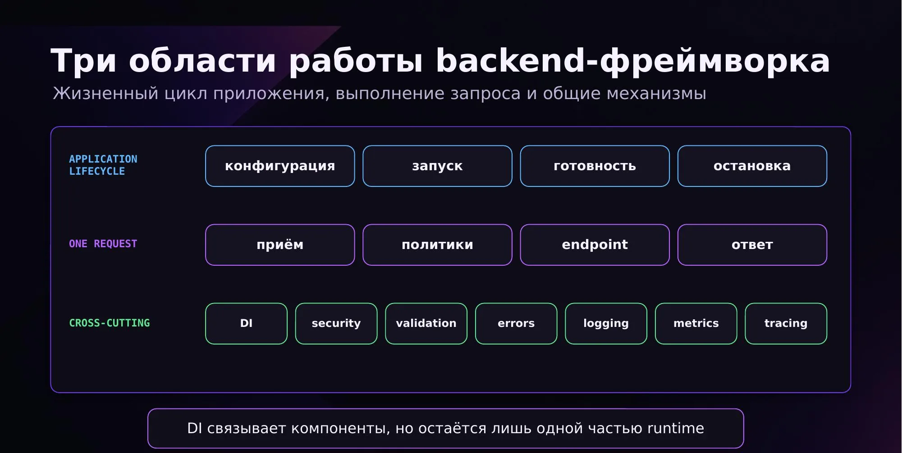
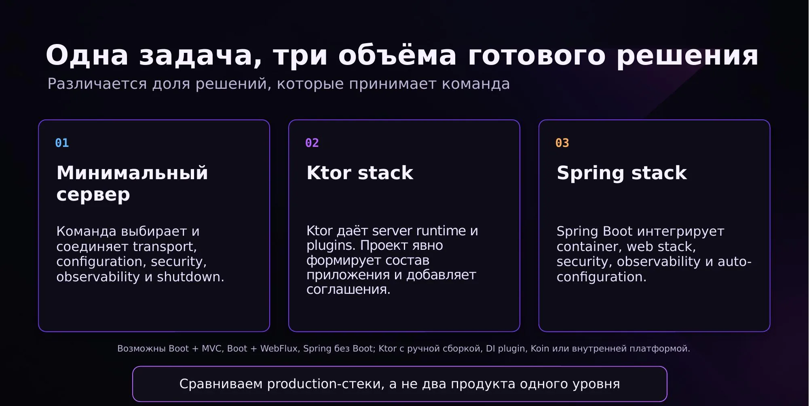
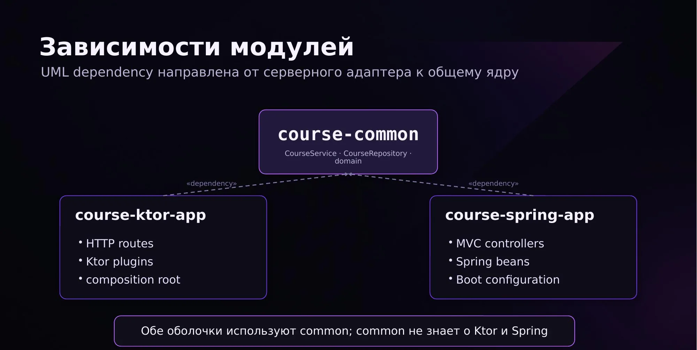
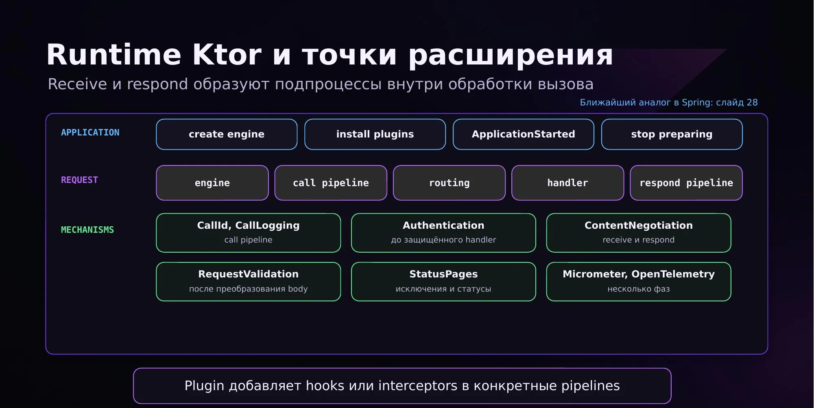
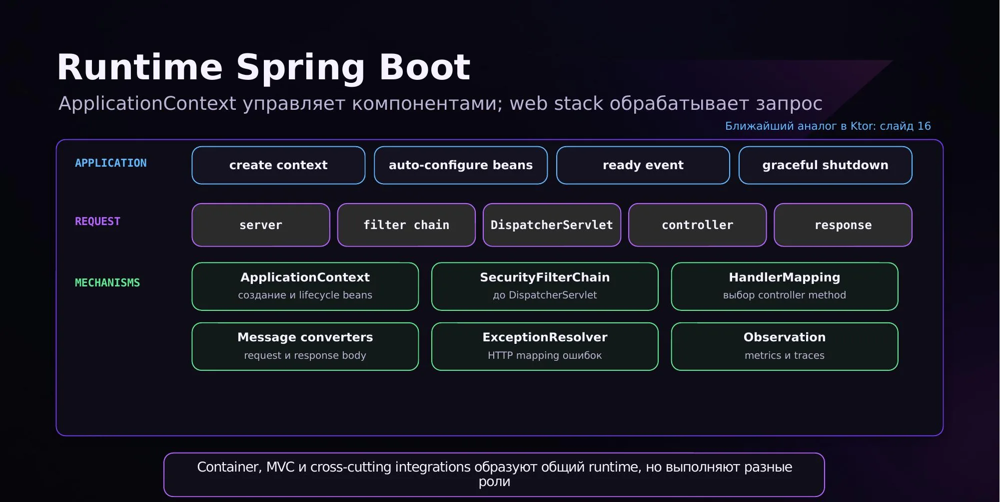
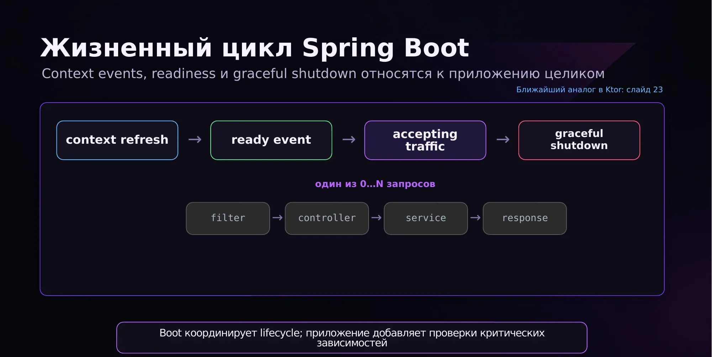
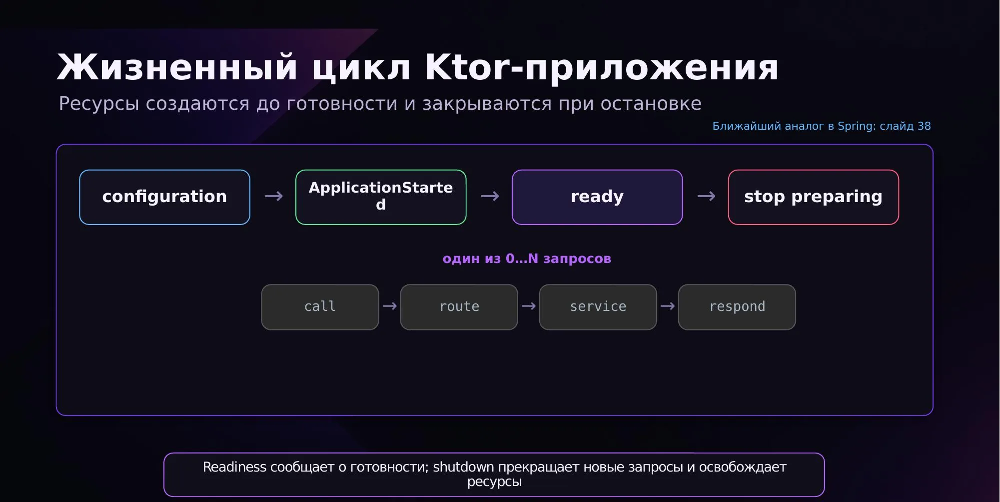
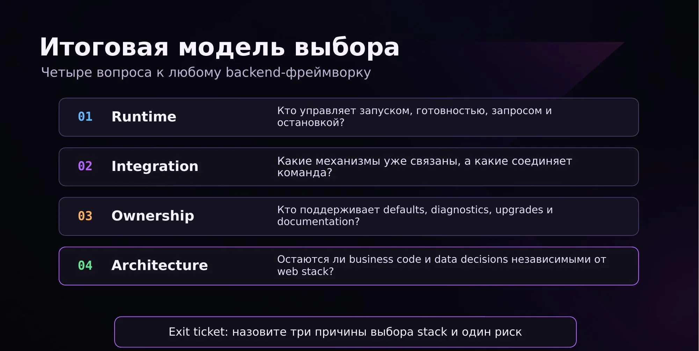

## Что было в прошлый раз

Прошлая лекция была про базу Kotlin: основные конструкции, типы данных, лямбды, null safety, extension-функции. Смотрели, как писать код лаконично и выразительно, без «километровых» конструкций.

Отдельно всплыл `internal` — ближайший аналог в Java это package-private, хотя работают они не одинаково.

Про «Kotlin круче Java»: в новых версиях Java добавляют много синтаксического сахара, и во многом она догоняет Kotlin. Многие до сих пор предпочитают Java — на конференциях можно встретить целые залы людей, которые пишут только на ней.

## Когда код становится сервисом

Возьмём небольшой сервис, который ищет курс по id:

```kotlin
class CourseService(
    private val repository: CourseRepository,
) {
    fun find(id: CourseId): Course =
        repository.find(id)
            ?: throw CourseNotFoundException(id)
}
```

Код корректный: идём в репозиторий, если ничего не нашли — бросаем ошибку. Вопрос: может ли к нему обратиться клиент или другой сервис? Нет. Сейчас он живёт в вакууме: нет инстанса, нет контроллера, который бы его вызывал, нет ничего, что принимало бы запросы. Ему нужна **среда исполнения**, которая запустит приложение, примет запрос и свяжет инфраструктуру с бизнес-логикой.

### Библиотека и фреймворк

Главное различие — **кто управляет потоком выполнения**.

| Признак | Библиотека | Фреймворк |
| --- | --- | --- |
| Кто вызывает | Наш код вызывает API библиотеки | Среда вызывает наш код в заданных точках |
| Что даёт | Отдельную возможность | Каркас приложения и правила интеграции |
| Жизненный цикл | Остаётся у приложения | Частично или полностью управляется runtime |
| Пример | JSON parser, SQL driver | Spring, Ktor |

С библиотекой мы сами решаем, когда и что вызвать. С фреймворком мы регистрируем свой код («вот что я умею»), запускаем — и ждём. Дальше фреймворк сам дёргает наши методы. Управление переходит к фреймворку — это и есть **inversion of control**. В Spring за это отвечает IoC-контейнер, который сканирует приложение и запускает код.

Приложение почти всегда использует и библиотеки, и фреймворк одновременно.

### Три области работы backend-фреймворка

1. **Жизненный цикл приложения** — конфигурация, запуск, готовность принимать запросы, остановка.
2. **Один запрос** — принять запрос, определить, что с ним делать (залогировать, проверить доступ и политики), довести до нужного endpoint, прогнать бизнес-логику и вернуть ответ пользователю. На этом запрос закончился.
3. **Сквозные механизмы (cross-cutting)** — DI, security, валидация, обработка ошибок, логирование, метрики, телеметрия.



Всё это можно настроить в любом приложении — и с фреймворком, и без него, руками. Выбор определяет только степень боли, которую вы испытаете при написании.

## Минимальный сервер без фреймворка

Никаких фреймворков, голый Kotlin:

```kotlin
fun main() {
    val server = HttpServer.create(
        InetSocketAddress(8080),
        0,
    )
    val repository = InMemoryCourseRepository()
    val service = CourseService(repository)

    server.createContext("/courses") { exchange ->
        handleCourses(exchange, service)
    }
    server.start()
}
```

Создаём HTTP-сервер, руками конструкторами собираем репозиторий и сервис, задаём endpoint'ы и для каждого — обработчик. Самое интересное происходит в обработчике:

```kotlin
fun handleCourses(
    exchange: HttpExchange,
    service: CourseService,
) {
    val id = CourseId(
        exchange.requestURI.path
            .substringAfterLast('/')
            .toLong(),
    )
    val course = service.find(id)
    val body = objectMapper.writeValueAsBytes(course)

    exchange.responseHeaders.add(
        "Content-Type",
        "application/json",
    )
    exchange.sendResponseHeaders(200, body.size.toLong())
    exchange.responseBody.use { it.write(body) }
}
```

Раз фреймворка нет, всё делаем сами:

1. Парсим пришедший путь, понимаем, что от нас хотят, достаём id.
2. Вызываем бизнес-логику. Это единственная строка, где происходит что-то полезное для приложения.
3. Переводим результат в JSON (в байты), ставим нужные заголовки и статус-код, отдаём ответ.

А если вылетело исключение? Придётся плакать и писать рядом ещё один обработчик примерно такого же размера — и так для каждого возможного ответа. Теперь представим, что ручек больше одной: пути длинные, кроме path-параметров есть query-параметры, их надо распарсить и провалидировать, все ошибки научиться превращать в байты с правильными заголовками и статусами. Задолбаемся примерно на второй ручке.

Минимальный сервер возможен и иногда оправдан — если сервис маленький и нужно что-то сделать на коленке. Но сегодня речь про фреймворки.

> Какой HTTP-сервер внутри — зависит от стека. В Ktor его можно выбрать самому, об этом ниже.

## Одна задача — три объёма готового решения

- **Минимальный сервер** — пишем вообще всё.
- **Spring** — почти всё скрыто в платформе, в кишки особо не лезем, используем то, что дают.
- **Ktor** — золотая середина: гораздо больше контроля, почти всё прозрачно. В этом суть Ktor.



Сравниваются именно стеки, а не два продукта одного уровня: бывает Spring Boot + MVC, Boot + WebFlux, Spring без Boot; Ktor с ручной сборкой, с DI-плагином, с Koin или с внутренней платформой компании.

### Структура учебного проекта

Проект из чата состоит из трёх модулей:

- `common` — вся бизнес-логика и общие интерфейсы, которые переиспользуются;
- `ktor-app` — обёртка на Ktor;
- `spring-app` — обёртка на Spring.



В `common` нет ни аннотаций, ни зависимостей от фреймворков — просто классы с конструкторами, которые вызывают друг друга и проверяют бизнес-инварианты. Обе оболочки зависят от `common`, а `common` не знает ни о Ktor, ни о Spring. Такой код спокойно покрывается обычными unit-тестами:

```kotlin
@Test
fun `returns course by id`() {
    val expected = Course(
        id = CourseId(42),
        title = "Data platforms",
    )
    val repository = FakeCourseRepository(expected)
    val service = CourseService(repository)

    assertEquals(
        expected,
        service.find(expected.id),
    )
}
```

Задача фреймворка — сделать из этого кода сервис, который отвечает на запросы. Этим объясняется большинство решений в `ktor-app` и `spring-app`.

> Чтобы проект собрался: в модулях Ktor, где ругается на `install`, нужно добавить импорт (достаточно один раз, IDE добавит для всех файлов), а в одном файле заменить старый импорт `callIdMdc` на вариант из `ktor.server.plugins.callid`.

## Ktor

Ktor — фреймворк, написанный с нуля специально под Kotlin. Отличия от Spring:

- **больше контроля, меньше магии.** В Spring легко получить ошибку вида «bean not found» в рантайме: сделали `lateinit`-переменную, бин для неё не создался — приложение упало;
- **полная совместимость с корутинами** — логично для фреймворка, написанного под Kotlin, в отличие от Spring.

### Version catalog: `libs.versions.toml`

В папке `gradle` проекта лежит `libs.versions.toml`. Если вы делали на Java проект на Spring, вы, скорее всего, использовали BOM — чтобы все пакеты Spring были одной версии. Здесь похожая идея:

```toml
[versions]
ktor = "<team-approved>"

[plugins]
ktor = { id = "io.ktor.plugin", version.ref = "ktor" }

[libraries]
ktor-server-core = { module = "io.ktor:ktor-server-core" }
ktor-server-netty = { module = "io.ktor:ktor-server-netty" }
```

- `[versions]` — сами номера версий;
- `[libraries]` — библиотеки, `version.ref` ссылается на версию из `[versions]`;
- `[plugins]` — плагины.

В `build.gradle.kts` вместо полного пути `группа:артефакт:версия` пишется alias — это прямое название переменной из каталога (`ktor-server-core` → `libs.ktor.server.core`):

```kotlin
plugins {
    alias(libs.plugins.ktor)
}

dependencies {
    implementation(libs.ktor.server.core)
    implementation(libs.ktor.server.netty)
}
```

Главный плюс — в многомодульном проекте меняешь одну цифру, и версия обновляется во всех модулях. А потом радуешься, что во всех модулях надо резолвить несовместимости. В больших компаниях обычно есть свой общий файл версий, где всё заведомо совместимо друг с другом; если нужно что-то новое — заводят отдельный файл. Формат общепринятый, и IDEA подсвечивает, у каких библиотек есть новые версии и что могло поменяться.

Можно этим не пользоваться, но код станет менее красивым. Встретится во второй части курса.

### Точка входа и composition root

Функция `main` в Ktor — аналог класса с `@SpringBootApplication`:

```kotlin
fun main() {
    embeddedServer(Netty, port = 8080, module = Application::module)
        .start(wait = true)
}
```

Здесь задаются:

- **engine** — какой сервер будет внутри. В проекте это **Netty**. Есть ещё **CIO** (Coroutine I/O) — котлиновский движок с прямой поддержкой корутин, и несколько других, которые на практике почти не используют;
- **порт**, на котором разворачивается сервер;
- **модуль** приложения, который подключается.

`Application.module()` — это composition root, в нём собирается приложение:

```kotlin
fun Application.module() {
    val repository: CourseRepository =
        InMemoryCourseRepository()
    val service = CourseService(repository)

    configureSerialization()
    configureCallId()
    configureLogging()
    configureSecurity()
    configureValidation()
    configureErrors()
    configureMetrics()
    configureRouting(service)
}
```

Репозитории и сервисы создаются руками — в Ktor по умолчанию **нет DI**. Если он нужен, его подключают: недавно появился встроенный DI-плагин, есть Koin и Dagger — они приняты в индустрии. Можно и вообще без DI.

Все `configure*` — это **extension-функции** на `Application`, каждая из них устанавливает плагин.

> **Напоминание про extension-функции.** Функция объявляется не внутри класса, а снаружи, но вызывается как метод этого класса. Удобно, когда функция нужна только в одном контексте; через них часто делают мапперы. Она статическая и не имеет доступа к приватным полям класса.

### Как Ktor обрабатывает запрос

Клиент отправляет запрос в **engine** (у нас Netty). Дальше запрос проходит внутренний pipeline обработки вызова (`ApplicationCall`) по фазам:


- **Setup** — начальная обработка запроса; можно положить переменные в контекст вызова. В Ktor каждый запрос сам по себе, запросы между собой никак не связаны.
- **Monitoring** — подключение метрик, трассировок, логирования.
- **Plugins** — работа установленных плагинов: аутентификация, routing (routing — тоже плагин) и вообще всё, что ставится через `install`. Плагины работают как **middleware**.
- **Call** — сама бизнес-обработка: идём по дереву routing'а и выполняем логику.
- **Fallback** — что делать, если обработать вызов не получилось: пришла несуществующая ручка или что-то, что мы не умеем обрабатывать. По умолчанию возвращается 404, это можно переопределить.

После этого формируется ответ, отдаётся engine и возвращается клиенту.

> **Middleware** — перехватчик. Происходит какое-то действие, middleware выполняется перед ним, перехватывает запрос, делает своё, после чего запрос продолжает выполняться. Похоже на прокси, но не любое middleware — прокси.

Внутри этапа Call есть ещё два подпроцесса — **receive pipeline** и **respond pipeline**. Они тоже прогоняют установленные плагины, но только на получение или только на отправку. Пример — плагин **ContentNegotiation**:

- при получении тело запроса проходит через ContentNegotiation и превращается из JSON в объект, после чего его можно обработать;
- при ответе — в обратную сторону: объект превращается в нужный формат ответа.

Так устроен весь Ktor: все плагины работают именно через эти фазы. На схеме ниже видно, в какой точке pipeline работает каждый из стандартных плагинов:



В свой код можно встраиваться в любую из пяти фаз, хоть в Setup. Но так делать не принято: у каждой фазы есть предназначение, и добавлять туда стоит только код с тем же предназначением.

### Сериализация

`configureSerialization()` устанавливает ContentNegotiation для работы с JSON — он нужен почти на любом сервере:

```kotlin
install(ContentNegotiation) {
    json()
}
```

Здесь используется котлиновская сериализация, а не Jackson. В Spring обычно используют Jackson; он же часто встречается в проектах, где вместе живут Java и Kotlin или код переписывают с Java на Kotlin.

### Логирование

Логирование в проекте собрано из двух официальных плагинов: `CallId` создаёт или принимает id запроса, `CallLogging` пишет лог через SLF4J и кладёт этот id в MDC, чтобы все записи одного вызова были связаны. Именно здесь живёт тот самый `callIdMdc`, из-за импорта которого проект может не собираться.

```kotlin
fun Application.configureLogging() {
    install(CallId) {
        retrieveFromHeader(HttpHeaders.XRequestId)
        generate { UUID.randomUUID().toString() }
        verify { it.length in 8..128 }
        replyToHeader(HttpHeaders.XRequestId)
    }

    install(CallLogging) {
        callIdMdc("requestId")
        filter { call ->
            !call.request.path().startsWith("/health")
        }
    }
}
```

### Security

В Ktor **нет filter chain**, как в Spring, и по умолчанию нет никакого security. Вы сами задаёте, как оно будет работать, — больше контроля. Есть готовый модуль `Authentication`: сама структура (например, `validate`) уже написана, но то, что внутри `validate`, пишете вы.

```kotlin
fun Application.configureSecurity() {
    install(Authentication) {
        basic("course-basic") {
            validate { credentials ->
                credentials
                    .takeIf {
                        it.name == "teacher" &&
                            it.password == "teach123"
                    }
                    ?.let { UserIdPrincipal(it.name) }
            }
        }
    }

    routing {
        authenticate("course-basic") {
            post("/courses") { createCourse(call) }
        }
    }
}
```

Хотите filter chain — можете написать его сами.

### Routing

Routing — тоже плагин. Внутри он строит **дерево** маршрутов (что-то похожее на бор). Для ручки `/courses/{id}` корнем будет `courses`, от него через `/` — все возможные продолжения, и при запросе routing идёт по этому дереву, ища нужную ручку.

```kotlin
fun Application.configureRouting(
    service: CourseService,
) {
    install(ContentNegotiation) {
        json()
    }

    routing {
        get("/courses/{id}") {
            val id = CourseId(
                call.parameters
                    .getValue("id")
                    .toLong(),
            )
            call.respond(service.find(id))
        }
    }
}
```

- Маршруты можно вкладывать: если у `route` указать, например, `/api`, это станет префиксом для всех ручек внутри. Внутри маршрута можно создавать ещё маршруты — префиксы у префиксов. На нормальном сервере, где по одному пути много ручек, это выглядит очень аккуратно. Пример вложенных маршрутов — в папке `routing` проекта, файл с курсами.
- Аутентификацию можно навесить только на определённые ручки, и это явно видно прямо в routing'е.
- Всё, что написано внутри routing'а, на самом деле — `suspend`-функции, поэтому там можно выполнять асинхронный код. Подробнее — когда дойдём до корутин, многопоточности и асинхронности.

### Обработка ошибок: StatusPages

Плагин **StatusPages** превращает исключения в правильные ответы клиенту: статус-коды и тела ответов.

```kotlin
install(StatusPages) {
    exception<RequestValidationException> { call, error ->
        call.respond(
            HttpStatusCode.BadRequest,
            error.toApiError(),
        )
    }

    exception<CourseNotFoundException> { call, error ->
        call.respond(
            HttpStatusCode.NotFound,
            error.toApiError(),
        )
    }
}
```

Неожиданные ошибки тоже можно обрабатывать — это и есть fallback, своего рода default. В Spring обработчик ошибок уже знает дефолтную ошибку, здесь её надо прописать явно. Если не прописать — будет просто голый 404 без объяснений.

Catch-all обработчик: stack trace остаётся в логах, а клиент получает безопасный ответ без внутренних деталей. `requestId` связывает ответ с записью в логе.

```kotlin
exception<Throwable> { call, error ->
    call.application.log.error(
        "Unhandled request failure, requestId={}",
        call.callId,
        error,
    )
    call.respond(
        HttpStatusCode.InternalServerError,
        ApiError(
            code = "internal_error",
            message = "Unexpected server error",
        ),
    )
}
```

Сейчас в проекте есть логирование, сериализация, security, обработка ошибок и routing. Остальные модули и пример того, как написать свой плагин руками, будут добавлены отдельным PR в репозиторий.

### Тестирование

Тестировать Ktor-приложение легко: `testApplication` прогоняет весь pipeline **без подъёма сервера**.

```kotlin
@Test
fun `returns course`() = testApplication {
    application {
        module()
    }

    val response = client.get("/courses/42")

    assertEquals(
        HttpStatusCode.OK,
        response.status,
    )
}
```

Сам по себе Ktor маленький. Задача — писать на нём и расширять.

## Где будет Ktor в курсе

Во второй половине курса сетевой код клиента почти наверняка будет на Ktor — это общепринятый вариант. Для серверной части можно выбрать Spring. Клиент и сервер — разные модули и вообще разные сущности, поэтому фреймворки у них могут отличаться; в одном модуле смешивать нельзя.

Своих сетевых протоколов нет: пишете REST, gRPC, GraphQL или WebSocket.

## Spring Boot

Здесь много аналогий с Ktor, и со Spring все уже работали.

### Зависимости

Version catalog работает так же: версии в отдельном файле, в `build.gradle.kts` — alias'ы.

> `libs.versions.toml` создаётся автоматически только при создании мобильного приложения. В обычном проекте его можно написать руками, и Gradle будет всё подтягивать оттуда.

В Spring Boot в каталог обычно кладут **starter'ы** — один starter подтягивает совместимый набор библиотек и включает автоконфигурацию:

```toml
[versions]
spring-boot = "<team-approved>"

[plugins]
spring-boot = { id = "org.springframework.boot", version.ref = "spring-boot" }

[libraries]
spring-web = { module = "org.springframework.boot:spring-boot-starter-web" }
spring-security = { module = "org.springframework.boot:spring-boot-starter-oauth2-resource-server" }
```

```kotlin
plugins {
    alias(libs.plugins.spring.boot)
}

dependencies {
    implementation(libs.spring.web)
    implementation(libs.spring.security)
}
```

Кроме подключения библиотек, можно их **исключать**. Spring это особенно любит: подключаешь какой-нибудь модуль, а он тянет библиотеку, которая всё ломает и ни для чего не нужна. Или старый многомодульный проект с легаси, где вместе живут Java и Kotlin: несколько модулей тянут одну библиотеку разных версий. Нужно понять, какая версия нужна и ничего не сломает, а лишнюю исключить. Развлекаться с этим можно долго — особенно когда сервис ложится из-за зависимостей.

### Создание контекста и жизненный цикл

При старте Spring создаёт **контекст**: проходит по всему приложению, находит все бины, помеченные аннотациями или объявленные в конфигурациях, подключает автоконфигурации. Проверяет, нет ли циклических зависимостей и можно ли всё собрать, собирает приложение, потом собирает все объявленные ручки и запускает приложение.



Дальше у запущенного приложения есть две пробы:

- **liveness** — живо ли приложение. Оно может быть упавшим, но в осознанное время поднимется и начнёт отвечать;
- **readiness** — приложение запущено, поднято и готово обрабатывать запросы прямо сейчас.

Остановка — **graceful shutdown**. Резко всё бросить нельзя: есть запросы, которые уже пришли, пользователи, которые ждут ответа, база и сторонние сервисы, которые нужно оставить консистентными. Поэтому приложение перестаёт принимать новые запросы, доделывает старые — и только потом завершается.



В Ktor жизненный цикл устроен так же: ресурсы создаются до готовности и закрываются при остановке.



### Security: SecurityFilterChain

В Spring security — отдельный модуль. В нём задаются проверки входящих запросов:

```kotlin
@Bean
fun securityFilterChain(
    http: HttpSecurity,
): SecurityFilterChain =
    http
        .csrf { it.disable() }
        .authorizeHttpRequests { requests ->
            requests.requestMatchers("/actuator/health").permitAll()
            requests.requestMatchers(
                HttpMethod.GET,
                "/courses/**",
            ).hasRole("READER")
            requests.requestMatchers("/courses/**").hasRole("TEACHER")
            requests.anyRequest().denyAll()
        }
        .oauth2ResourceServer { it.jwt(withDefaults()) }
        .build()
```

- CSRF здесь отключён; в приложениях с UI CSRF-токен чаще всего проверяют.
- `/actuator/health` — ручка, проверяющая, живо ли приложение, — доступна всем.
- Все GET-ручки с префиксом `/courses` доступны только с ролью `READER`.
- **Порядок важен**: правила проверяются сверху вниз. Если доступ отвалился на ранней проверке, а более поздняя его разрешает — доступа всё равно не будет.
- Можно разрешать и запрещать доступ по ролям или полностью закрыть endpoint.
- Подключён OAuth2 с JWT. Бывают и свои велосипеды, но стандартный JWT — нормальный вариант.

Цепочка срабатывает на любой запрос: перехватывает его и проверяет. Если проверки пройдены — идём в обработку, если нет — до обработчика запрос даже не дойдёт. На Java всё абсолютно так же.

### Контроллеры

Чтобы код начал принимать запросы, нужен контроллер с путями:

```kotlin
@RestController
@RequestMapping("/courses")
class CourseController(
    private val service: CourseService,
) {
    @GetMapping("/{id}")
    fun find(
        @PathVariable id: Long,
    ): CourseResponse =
        service.find(CourseId(id))
            .toResponse()
}
```

- `@RequestMapping` на классе добавляет префикс ко всем endpoint'ам внутри.
- На каждой ручке — свой маппинг: `@GetMapping`, `@PostMapping`, `@PatchMapping` и т. д.
- Все параметры пути должны быть параметрами метода — `@PathVariable`. После security-проверки Spring MVC распарсит строку и передаст значения в метод, самим ничего парсить не нужно.
- Здесь используется дефолтный нейминг: имя параметра метода совпадает с именем в пути. Если назвать по-другому (например, `courseId`), имя нужно указать в `@PathVariable` явно; когда параметров несколько — точно.

Всё как в Java, просто на Kotlin жить немного красивее.

### Где это ломается: слишком длинный GET

Ручка может возвращать один объект, а может — список (например, при фильтрации). Для списков обычно делают GET с **query-параметрами** после `?` — мы же что-то получаем. Иногда вместо этого делают POST — и часто так делать не надо. Но иногда без этого не обойтись.

У длины строки запроса есть предел. Встроенное ограничение есть и в Spring, но это скорее ограничение сети: слишком длинный запрос до вас просто не дойдёт или дойдёт обрезанным. Типичная история: сервис до вас написали так, что фильтр принимает список кодов или имён, а пользователи сделали имена километровыми, да ещё кириллицей. Запрос обрезается, не маппится, либо маппится не на ту ручку. В таком случае фильтр передают POST'ом в теле запроса. В Ktor это ломается точно так же.

**Не верьте, что поля короткие. Не верьте пользователям вообще.** Даже если ограничение на длину есть, однажды придёт команда и скажет: «нам нужны имена длиннее, иначе мы вас использовать не будем» — и ограничение уберут.

### Где это ломается: пересекающиеся шаблоны путей

Вторая частая проблема — несколько GET-ручек, шаблоны которых по отдельности разные, но конкретный запрос подходит под несколько сразу. Например, одна ручка `/text`, другая `/{name}` со строковым параметром. Если пользователь передаст в качестве имени `text`, он попадёт не в ту ручку, которую ожидал.

Будьте аккуратны с тем, что пишете в маппингах, особенно если принимаете строковые path-параметры. Отказаться от них совсем часто нельзя: фронт нередко не знает id и располагает только именем или кодом. Поэтому новые ручки добавляйте осторожно, особенно если понимаете, что данные могут быть любыми. Оба кейса регулярно случались в реальной команде.

### Валидация

После того как Spring MVC замапил ручку и собрал объект из запроса, он может проверить данные. Для этого нужна аннотация `@Valid`:

```kotlin
data class CreateCourseRequest(
    @field:NotBlank
    @field:Size(max = 120)
    val title: String,
)

@PostMapping
fun create(
    @Valid @RequestBody request: CreateCourseRequest,
): CourseResponse =
    service.create(
        CreateCourseCommand(
            title = request.title,
        ),
    ).toResponse()
```

`@Valid` сама ничего не проверяет. Её наличие говорит Spring MVC зайти внутрь объекта и проверить ограничения на полях. К этому моменту объект уже собран, остаётся проверить, подходят ли нам данные:

- `@NotBlank` — строка не пустая и не состоит из одних пробелов;
- `@Size(max = 120)` — длина строки не больше 120. Здесь это просто для примера, но бывают и бизнес-требования.

Можно проверять размер, null, пустоту, соответствие строки паттерну.

Такие аннотации достаточно простые и вешаются на встроенные типы и коллекции (у коллекции можно проверить размер). На поле своего типа `@Size` не повесить — зато можно повесить `@Valid`, и проверки рекурсивно пойдут вниз. Также можно создать и зарегистрировать собственную аннотацию.

> В Ktor аналогичную задачу решает плагин `RequestValidation`: он проверяет уже десериализованный объект по явным правилам, а при ошибке бросает `RequestValidationException`, которую затем превращает в 400 `StatusPages`.
>
> ```kotlin
> fun Application.configureValidation() {
>     install(RequestValidation) {
>         validate<CreateCourseRequest> { request ->
>             when {
>                 request.title.isBlank() ->
>                     ValidationResult.Invalid("title must not be blank")
>                 request.title.length > 120 ->
>                     ValidationResult.Invalid("title is too long")
>                 else -> ValidationResult.Valid
>             }
>         }
>     }
> }
> ```

Более сложные проверки — например, что у пользователя есть доступ к чему-то или что строка подходит под сложный паттерн — обычно делают на уровне сервиса.

### Use-site targets

Почему `@field:`, а не просто `@NotBlank`? Если повесить аннотацию без target, IDEA начнёт ругаться, что не задан use-site target. У Kotlin-свойства в JVM есть приватное поле, геттер и параметр конструктора, и нужно сказать, куда именно попадёт аннотация:

- **`field`** — на приватное поле. Сюда обычно вешают валидацию, в основном больше ничего;
- **`get`** — на геттер. Для валидации примерно бесполезно, зато, например, аннотации Swagger обычно вешают на геттер: схема объекта нужна при чтении. Плюс аннотации на геттере наследуются от интерфейса: если data class реализует интерфейс с аннотациями на геттерах, схема соберётся правильно;
- **`param`** — на параметр конструктора. Проверка сработает при вызове конструктора.

Полный список targets:

| Target | Элемент в Java/JVM | Типичное применение |
| --- | --- | --- |
| `field` | Java-поле | Bean Validation, reflection по полям |
| `get` / `set` | Геттер / сеттер | Java API, работающие со свойствами |
| `param` | Параметр конструктора | Constructor injection |
| `setparam` | Параметр сеттера | Аннотации на аргументе сеттера |
| `property` | Kotlin-метаданные | Обычной Java reflection не видно |
| `receiver` | Receiver extension-функции | Параметр-receiver |

Kotlin собирается менять target по умолчанию и постоянно об этом предупреждает. Поэтому **всегда указывайте target явно и думайте, куда ставите** — иначе что-нибудь не сработает.

Пример с Jackson и `@JsonProperty`, который задаёт имя поля в JSON (например, `course_title` вместо дефолтного). Если повесить её только на `get`, отдавать объект мы будем с новым именем, а при получении конструктор будет ждать дефолтное имя — и запрос с новым именем сломается. Поэтому при изменении имён ставьте аннотацию парой: и на `param`, и на `get`. Эту проблему тоже приходилось чинить на реальной стажировке.

### Где валидировать

Единого правила нет, это конвенция внутри команды. Кто-то пишет свои аннотации, кто-то проверяет всё на сервисном слое, кто-то вообще обходится без аннотаций. Писать свою аннотацию хочется редко — внутри довольно неприятная конструкция, — и многим приятнее проверять всё в бизнес-слое. Придёте в команду — спросите, как принято.

**Валидировать только на фронте — плохая идея.** Сломается, и даже не сразу: может пройти месяц или несколько лет, пока к вам придут с критическим багом, а вы будете проверять последний релиз, хотя проблема жила в сервисе всегда — просто пользователь впервые решил поступить по-своему. К API всегда можно обратиться напрямую: `curl`'ом на localhost или из другого сервиса. Разработчик, который интегрируется с вами, не пойдёт через UI. А если поддерживать одинаковые проверки на двух сторонах, они почти сразу начнут расходиться. Жить с этим всё равно придётся: общаться с фронтами и следить за консистентностью.

### Порядок проверок и сообщения

Аннотации проверяются по очереди, в том порядке, как заданы. Представьте, что сначала стоит `@Size`, потом `@NotBlank`. Пользователь передал 121 пробел: первая ошибка — «максимум 120». Он укоротил до 120 пробелов — и получил в лицо новую ошибку: «строка не может быть пустой». Мало кто такое любит.

В аннотациях можно задать своё сообщение об ошибке.

### Обработка ошибок

Если валидация не прошла, вылетит исключение. Если его не поймать, оно долетит до пользователя в сыром виде. Другой пример: всё было валидно, мы пошли искать объект по id, не нашли — приложение бросило `CourseNotFoundException`. Чтобы нормально вернуть ошибку пользователю, нужен обработчик:

```kotlin
@RestControllerAdvice
class CourseExceptionHandler {
    @ExceptionHandler(CourseNotFoundException::class)
    fun handleNotFound(
        error: CourseNotFoundException,
    ): ResponseEntity<ApiError> =
        ResponseEntity
            .status(HttpStatus.NOT_FOUND)
            .body(
                ApiError(
                    code = "course_not_found",
                    message = "Course ${error.id} was not found",
                ),
            )
}
```

На класс с `@RestControllerAdvice` прилетают все ошибки, а внутри описывается, какие из них мы умеем обрабатывать: какой статус поставить и что будет в теле ответа. Вариантов написать обработчик ошибок много, но этот — самый канонический и простой, и почти любой новый сервис напишут именно так.

Отдельно пишется обработчик для **неожиданных ошибок**, например:

```kotlin
@ExceptionHandler(Throwable::class)
fun handleUnexpected(
    error: Throwable,
    request: HttpServletRequest,
): ResponseEntity<ApiError> {
    log.error(
        "Unhandled request failure, path={}",
        request.requestURI,
        error,
    )
    return ResponseEntity
        .status(HttpStatus.INTERNAL_SERVER_ERROR)
        .body(
            ApiError(
                code = "internal_error",
                message = "Unexpected server error",
            ),
        )
}
```

Обработчики конкретных исключений имеют приоритет, а этот ловит всё остальное — `RuntimeException` или `Throwable`: вдруг база скажет, что недоступна, а мы это не обработали. Обрабатывайте все кейсы, какие можно, и делайте ошибки максимально человекочитаемыми — тогда фронт сможет их красиво отрисовать, а пользователи увидят что-то понятное.

## Структура курса

В курсе два блока, и всё это — в рамках одного семестра:

1. Бэкенд: выбираете тему проекта, пишете бизнес-логику, контроллеры и полную обработку, разворачиваете — чтобы можно было дёргать ручки.
2. Обратная сторона — клиентская часть.

## Бины в Spring

Объявить бин можно несколькими способами:

- навесить на класс аннотацию `@Controller`, `@Service`, `@Repository` или просто `@Component`;
- создать отдельный класс конфигурации с `@Configuration` и методами с `@Bean`.

```kotlin
@Configuration
class CourseConfiguration {
    @Bean
    fun courseRepository(): CourseRepository =
        InMemoryCourseRepository()

    @Bean
    fun courseService(
        repository: CourseRepository,
    ): CourseService =
        CourseService(repository)
}
```

`@Bean`-метод — это просто вызов конструктора; если конструкторов несколько, можно вызвать любой. Параметры метода Spring разрешает сам: ищет среди известных ему бинов бин типа `CourseRepository`. В проекте выбран именно явный `@Bean`, чтобы вообще не трогать `common`-модуль.

Сводка способов объявить компонент:

| Механизм | Когда подходит | Кто задаёт создание |
| --- | --- | --- |
| `@Component` / `@Service` | Класс принадлежит приложению, конструктор понятен | Component scanning |
| `@Bean` | Тип из common-модуля или сторонний, нужен factory-метод | Класс конфигурации |
| Auto-configuration | Библиотека даёт default по classpath и условиям | Автор starter'а |
| Программная регистрация | Динамическое расширение инфраструктуры | Инфраструктурный код |

Если бинов нужного типа несколько — ошибка вида «ожидал один бин, а тут десять». Варианты:

- **`@Primary`** — этот бин главный и выбирается, когда кандидатов много;
- **имя бина + `@Qualifier`** — явный выбор конкретного бина при сборке или прямо в классе.

```kotlin
@Bean
@Primary
fun primaryCourseRepository(): CourseRepository =
    PostgresCourseRepository()

@Bean("archiveCourseRepository")
fun archiveCourseRepository(): CourseRepository =
    S3CourseRepository()

@Bean
fun archiveService(
    @Qualifier("archiveCourseRepository")
    repository: CourseRepository,
): CourseArchiveService =
    CourseArchiveService(repository)
```

Особенно актуально, когда бин — это **интерфейс с несколькими реализациями**. Например, есть интерфейс сервиса с тремя реализациями и для каждой — своя реализация репозитория. Тогда связывать нужно аккуратно, иначе подставится не то и сборка сломается. В Java всё то же самое.

## Метрики

`MeterRegistry` — бин, который подключается в конфигурации: от Spring или отдельная библиотека, умеющая собирать метрики. У него есть методы для разных типов метрик: счётчики, гистограммы, числовые значения, время.

```kotlin
@Component
class CourseMetrics(
    registry: MeterRegistry,
) {
    private val created = registry.counter(
        "courses.created",
    )

    fun courseCreated() {
        created.increment()
    }
}
```

По умолчанию Spring поднимает базовые метрики приложения — например, жив ли сервис. Бизнесовые метрики нужно писать отдельно. Подробно — на отдельной лекции.

## Тестирование в Spring

Для тестов тоже нужны аннотации — примерно такие же, как в Java; используется JUnit. Если приложение использует хранилище — Redis, S3, Postgres, — в тестах доступа к реальному, скорее всего, не будет. Тогда поднимают **Testcontainers**.

Web-слой можно проверить через MockMvc, не поднимая всё приложение:

```kotlin
@WebMvcTest(CourseController::class)
class CourseControllerTest(
    @Autowired private val mvc: MockMvc,
) {
    @Test
    fun `returns course`() {
        mvc.perform(get("/courses/42"))
            .andExpect(status().isOk)
    }
}
```

## Как выбрать фреймворк

- **Размер.** Spring сильно больше: в нём реализовано гораздо больше всего. В Ktor многое придётся писать руками, зато не нужно тащить кучу ненужных зависимостей. Если важна память — Ktor.
- **Возможности.** Одинаковое поведение можно получить на любом фреймворке и даже вообще без фреймворка — просто страдать будете по-разному. Выбор — вопрос приоритетов, требований и договорённостей в команде.
- **Скорость.** Однозначно сказать нельзя: по сути делается одно и то же. Долгие проверки в extension-функциях Ktor могут работать дольше, чем вызов бина в Spring, а могут так же. Даже бенчмарк «100 одинаковых запросов» упрётся в шум сети.
- **Прозрачность.** Spring заточен под то, чтобы многое было уже собрано. Но если дефолтное поведение не подходит, сначала придётся понять, где именно оно задано, и лезть в кишки Spring — а смотреть в кишки и логи Spring больно. В Ktor поведение сразу пишется руками, и его видно глазами.

Под капотом и Kotlin, и Java компилируются в байткод JVM. Перегнать Kotlin в Java и обратно можно, но читать результат больно — многие, решив уйти с Java на Kotlin, так и сделали.

Одни и те же контрольные точки в обоих стеках:

| Контрольная точка | Ktor | Spring |
| --- | --- | --- |
| Запуск | `Application.module` и engine | `SpringApplication` и контекст |
| HTTP | Routing и ContentNegotiation | MVC и message converters |
| Security | Плагин Authentication и политика на route | SecurityFilterChain |
| Validation | RequestValidation и явные правила | Bean Validation и `@Valid` |
| Errors | StatusPages | ControllerAdvice |
| Observability | Плагины + договорённости команды | Actuator, Observation, Micrometer |
| Shutdown | События monitor и освобождение ресурсов | Lifecycle контекста и graceful shutdown |

Фреймворк не ограничивает бизнес-логику: подключайте там какие угодно технологии. Бизнес-логика и фреймворк вокруг неё — две параллельные плоскости. Например, Hibernate вполне можно использовать с Ktor.

| Data layer | С Ktor | Со Spring |
| --- | --- | --- |
| jOOQ | Явный wiring и граница транзакции | Интеграция с транзакциями и конфигом Boot |
| Exposed | Kotlin DSL, wiring пишет проект | Можно, интеграцию пишет приложение |
| JDBC / R2DBC | Через библиотеки | Starter'ы и абстракции |
| Spring Data | Непрактично без инфраструктуры Spring | Модель репозиториев и экосистема |

Кроме Ktor и Spring есть и другие фреймворки с разной степенью гибкости:

| Подход | Модель композиции | Готовая платформа | Хорошо подходит |
| --- | --- | --- | --- |
| Spring Boot | Контейнер и auto-configuration | Широкая | Много интеграций и единые конвенции |
| Ktor | Application и плагины | Узкая, расширяемая | Явный состав и своя платформа |
| Micronaut | DI на этапе компиляции | Средняя | DI и облачные интеграции с меньшим reflection |
| Quarkus | Build-time augmentation | Широкая | Контейнеры и native image |
| http4k / Vert.x | Функции или event-driven toolkit | Точечная | Специализированная модель исполнения |

Общие ориентиры (но истину определяет команда):

- сервис маленький → Ktor оправдан;
- сервис большой или не только на Kotlin → на Ktor жить почти не получится, скорее Spring;
- пришли в Java-команду → почти точно Spring;
- хотите не думать о внутренностях и пользоваться готовым → Spring;
- хотите понимать, что происходит, и всё настраивать → Ktor.

Сначала формулируют, что нужно, потом выбирают, как. Даже если код сейчас пишется с нейросетями, его всё равно нужно ревьюить и понимать.

### Кейсы


**A. 20 похожих CRUD-сервисов**, общая security, одинаковые health-checks, быстрый онбординг новых людей. Первое, что приходит в голову, — Spring, чтобы особо не думать. Но можно и Ktor, если кто-то в команде уже написал шаблон приложения на Ktor и есть готовая платформа и инфраструктура.

**B. Небольшой сервис с необычным flow**, нужен контроль всего pipeline. Здесь нужны явные точки расширения — это про Ktor.

**C. Сервис со сложным SQL и строгими SLO** (Service Level Objective — целевой уровень качества обслуживания). В Spring есть репозитории, которые генерируют реализацию методов по сигнатуре, но при сложном SQL запросы, скорее всего, всё равно придётся писать руками. Здесь выбор определяется data-слоем и опытом команды.


Итоговые четыре вопроса, которые стоит задать любому backend-фреймворку:



## Про проект

В своём проекте нужно выбрать, с чем жить: Ktor или Spring. Смешивать их в одном сервисе не надо. Если очень хочется — это будут два отдельных микросервиса.

В конце презентации есть блок «Для увлечённых» (со слайда 49): generic-резолвинг бинов, сюрпризы Spring-контейнера, use-site targets, прокси, логирование — в основном про боль, которая возникает в работе с фреймворками.
