Это небольшое погружение в DevOps. На следующем курсе и DevOps, и тестирование будут отдельными предметами — там и станет понятно, нравится ли вам DevOps. Здесь задача скромнее: пройтись по флоу и разобрать ровно то, что нужно знать разработчику, чтобы запустить своё приложение в контейнере, проверить его и выкатить.

## Как изменение доходит до прода

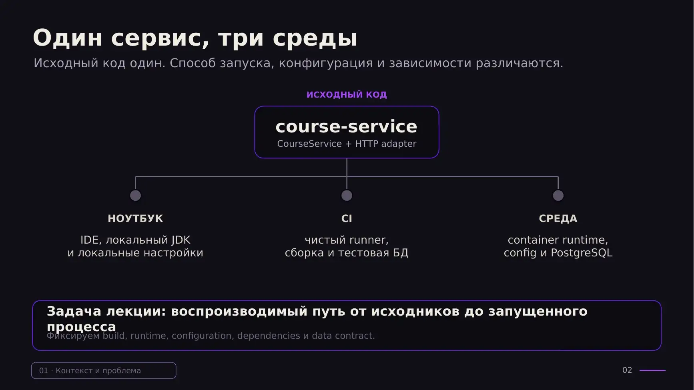

Исходный код один, а запускается он в разных местах: на ноутбуке, в CI и в среде. Удобнее всего разобрать процесс на примере Яндекса.

В Яндексе нет долгоживущих веток. Есть один транк — главная ветка, `main`, которая постоянно двигается. Все бранчи создаются от неё, когда вы делаете какие-то изменения.


```mermaid
flowchart LR
    A[Локальная разработка<br/>и тесты] --> B[CI]
    B --> C[Ревью и merge]
    C --> D[Тестинг<br/>предпрод]
    D --> E[Канарейка<br/>3–5% пользователей]
    E --> F[Прод]
```

1. **Локально.** Сделали изменения, локально протестировали.
2. **CI.** CI-тесты зачастую проверяют не только ваши тесты, но и конфигурации — правильно ли они описаны. Часто в CI проверяется ещё и линтер: если он строгий, CI не пропустит код и выдаст ошибку линтера. CI — очень кастомная вещь, в него добавляют то, что захочет компания (или вы).
3. **Ревью и merge.** Код прошёл CI, его отревьюили — мержите ветку, дальше она будет выкатываться.
4. **Тестинг.** Зачастую в компаниях две среды. Тестинг — это предпрод: те же данные, что на проде, но вы не рискуете сломать прод. Если всё упало в тестинге — это логично лучше, чем на проде: делаете rollback и откатываете изменения.
5. **Прод.** Если с тестовым окружением всё прошло, начинается выкатка на прод.

На проде есть два основных понятия: сам прод целиком (рабочее приложение, сайт — неважно) и **канарейка**. Канарейка есть далеко не везде, но где есть — это удобно. Это небольшая выборка пользователей, например 3% или 5%, и обновление сначала выкатывается для них. На канарейку обычно ставятся отдельные уведомления. Если упала канарейка, то прод упал не у 100% пользователей, а только у 3% — проще откатить, меньше убытков для сервиса. Дальше выкатываетесь на основной прод, всё задеплоилось — вы молодцы.

### Зелёный pipeline — ещё не рабочий релиз

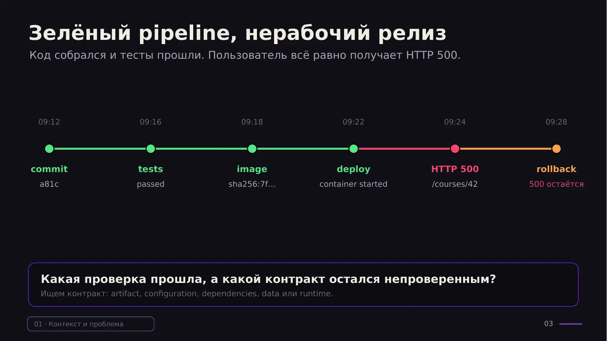

Бывает так: деплой прошёл, а ручка не завелась, и на проде начинает пятисотить. Когда на проде пятисотит — это очень грустно, и за это будет «бобо». Код собрался, тесты прошли, а пользователь всё равно получает HTTP 500. Вопрос, к которому вся лекция и ведёт: какая проверка прошла, а какой контракт (артефакт, конфигурация, зависимости, данные, runtime) остался непроверенным?

## Процесс сборки образа

Дефолтный путь от исходников до запущенного процесса:

- **Исходники** — вся программа, которая написана.
- **Build** — подтягиваются зависимости, компилятор всё проверяет. Линтер тоже можно забиндить так, чтобы он прогонялся перед сборкой.
- **Артефакты** — в Java/Kotlin это, например, fat jar: всё приложение собирается в один jar, который удобно куда-то нести.
- **Image** — из артефакта делается образ. В образ, помимо jar, можно положить и другие приложения. Например, если сервис обрабатывает голос, туда можно засунуть ffmpeg, чтобы два приложения жили в одном образе. Скачиваете один образ — и в нём уже всё окружение, нужное для работы.
- **Процесс и конфиг** — то, что запускается из образа и что потом можно менять.

### Конфигурация через базу данных

Иногда часть конфигурации удобнее держать в базе: её можно легко менять прямо в рантайме, например через флаги.

Живой пример. На сервис пошла нагрузка 200%. Как и большинство сервисов, он умеет держать пик, но недолго: если 200% длятся час, сервис задохнётся и упадёт. Что можно сделать — завести в базе true/false **флаг деградации**. Ставите его в `true` — сервис начинает деградировать: на API становятся более жёсткие лимиты, и нагрузка сдувается. Пока проблему не починили, флаг держится активным. Работа приложения замедляется, но это лучше, чем если оно упадёт.

## Docker: что нужно разработчику

Docker желательно знать хотя бы на базовом уровне: локально тесты тоже часто поднимаются через него, и интеграционные тесты можно гонять локально — это очень удобно. Если хочется глубже — это уже уход в DevOps. Внутреннее устройство Docker отдельно разбирается на курсе по администрированию, с лекцией и лабами, поэтому здесь он пробегается бегло.

Docker работает на любой операционке, потому что внутри (на не-Linux системах) поднимается Linux-виртуалка.

### Image и container

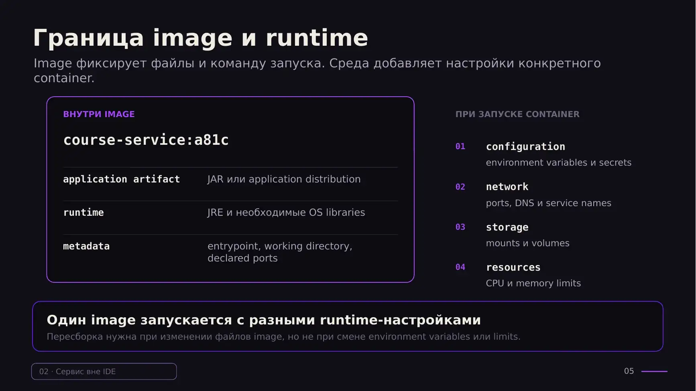

Image фиксирует файлы и команду запуска, а среда при запуске добавляет настройки конкретного контейнера: переменные окружения, сеть, volumes, лимиты. Пересобирать образ нужно, когда меняются его файлы, но не когда меняются переменные окружения.

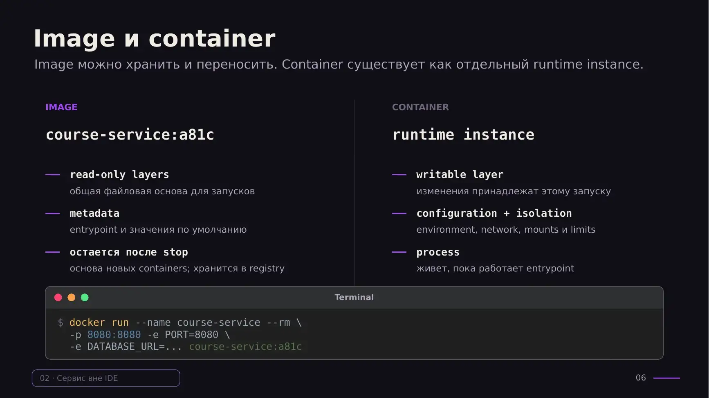

```bash
docker run --name course-service --rm \
  -p 8080:8080 -e PORT=8080 \
  -e DATABASE_URL=... course-service:a81c
```

Порты в таком примере лучше выносить в env-файл и просто делать `docker run`. В идеале флоу такой: собрали приложение, сделали образ, загрузили его в registry. Дефолтный — Docker Hub, оттуда любой пользователь может образ скачать. Но у компаний зачастую свои registry, и загружать образ вы будете туда.

### Проверка запуска

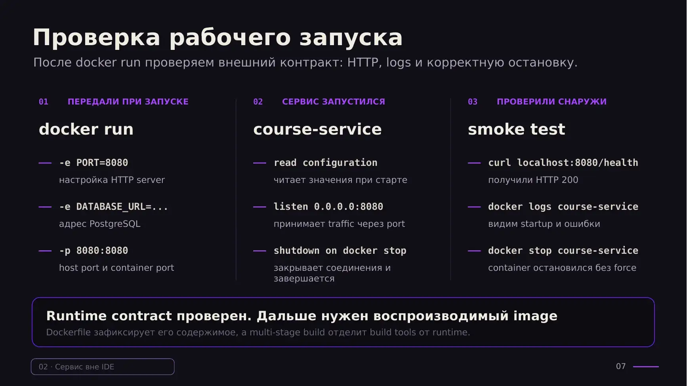

После `docker run` проверяем внешний контракт: что сервис отвечает по HTTP (`curl localhost:8080/health`), что в логах видны старт и ошибки (`docker logs`), что контейнер корректно останавливается (`docker stop`). Сделать для своего приложения health check и завернуть его в Docker на самом деле не трудно.

### Dockerfile

Dockerfile можно писать нейронкой — главное, проверять. Если у вас каждый билд занимает тысячу секунд, скорее всего, нейронка написала плохой билд.

По версиям: писать можно на любой версии Kotlin и Java, но старайтесь выбирать стабильные. Kotlin обновляется довольно часто (последний релиз был буквально неделю назад). Плюс бывают проблемы с версиями библиотек — **конфликты версий — самая частая проблема**.

Сборка multi-stage: сначала build stage с JDK и Gradle, потом runtime stage, куда переносится только результат.

Build stage, часть 1 — редко меняющиеся файлы сборки копируем раньше исходников:

```dockerfile
FROM eclipse-temurin:21-jdk AS build
WORKDIR /workspace

COPY gradlew settings.gradle.kts build.gradle.kts ./
COPY gradle/ gradle/
COPY shared/build.gradle.kts shared/
COPY services/course-service/build.gradle.kts services/course-service/

RUN ./gradlew :services:course-service:dependencies --no-daemon
```

Build stage, часть 2 — исходники и сборка дистрибутива:

```dockerfile
COPY shared/src/ shared/src/
COPY services/course-service/src/ services/course-service/src/

RUN ./gradlew :services:course-service:installDist --no-daemon
```

Runtime stage — в финальный образ переносим только дистрибутив:

```dockerfile
FROM eclipse-temurin:21-jre AS runtime
WORKDIR /app

COPY --from=build \
  /workspace/services/course-service/build/install/course-service/ \
  /app/

USER 10001
EXPOSE 8080
ENTRYPOINT ["./bin/course-service"]
```

JDK, Gradle и исходники остаются в build stage. `EXPOSE` сам по себе порт не публикует.

### Кеш Docker и порядок команд

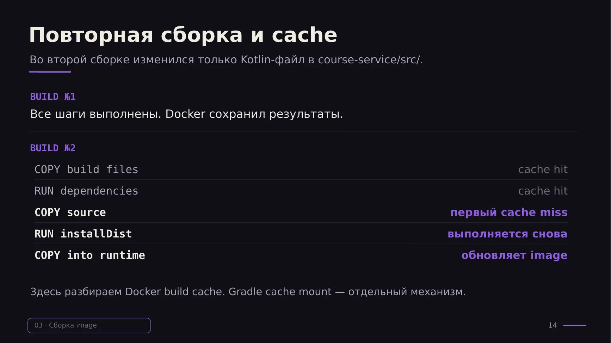

Кеш Docker работает так: **все команды, которые идут после той, где произошли изменения, выполняются заново**, а всё, что до неё, достаётся из кеша.

Поэтому если, например, нижний `COPY` (тот, что `--from=build` или копирование исходников сервиса) засунуть в самый верх — сразу после `FROM` и `WORKDIR`, — каждый раз будет происходить полная пересборка. А если изменения только в коде сервиса, всё, что идёт до копирования исходников, достанется из кеша. Это очень сильная оптимизация времени сборки.

### Базовые команды

- `COPY` — выбираете, что скопировать в образ.
- `RUN` — исполнить команду.
- `EXPOSE` — открыть что-то, зачастую порты. Порты желательно выносить в env: на сервере может быть запущено много сервисов, все они должны быть на разных портах, иначе их просто не получится запустить.

**COPY или ADD?** `ADD` умеет ещё распаковывать архивы и скачивать файлы по HTTP. Вопрос из разряда «гробовых»: на лекции по DevOps его задали практикующему девопсу, и тот честно сказал, что не помнит. Это нишевая команда — среди примерно сотни просмотренных Dockerfile ни в одном её не было. Шанс, что она понадобится в вашем приложении, крайне низкий.

`.dockerignore` — то же самое, что `.gitignore`, один в один: то, чего Docker не увидит при сборке.

### Многомодульный проект

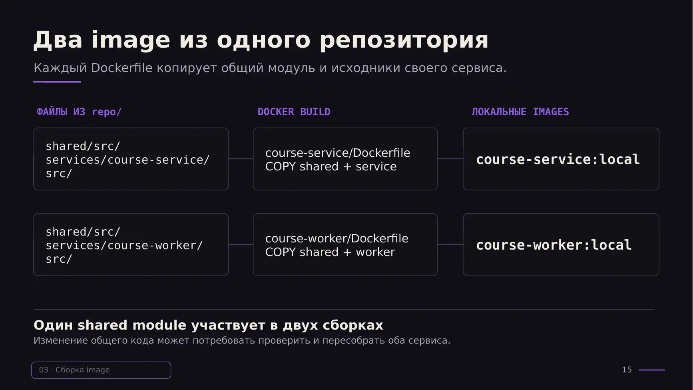

В многомодульном проекте у **каждого модуля свой Dockerfile**. И если есть shared-модуль с общими интерфейсами, которые используются в каждом модуле, **его нужно копировать в каждый Dockerfile, где он используется**. Это, пожалуй, самое важное замечание по проекту, который вы будете писать.

## Docker Compose

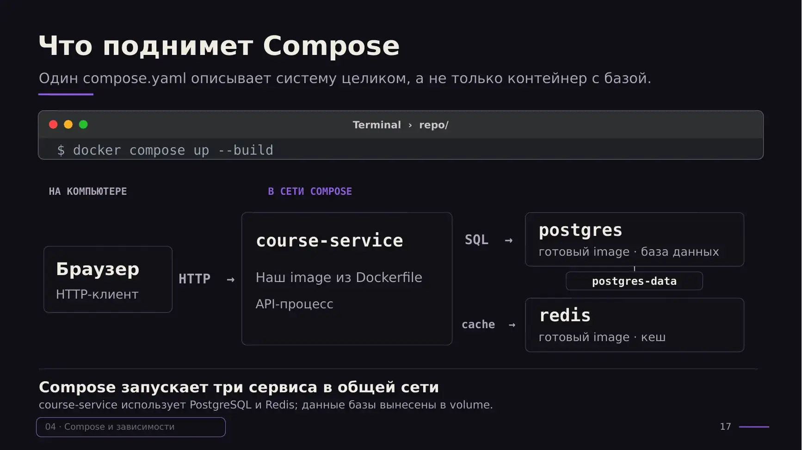

Один `compose.yaml` описывает систему целиком: наш сервис, PostgreSQL, Redis. Будет выложен репозиторий с кодом сервиса с прошлой пары, compose для него и sh-скрипт, который запускает интеграционные тесты сразу в Compose.

```yaml
services:
  course-service:
    build:
      context: .
      dockerfile: services/course-service/Dockerfile
    environment:
      DATABASE_URL: jdbc:postgresql://postgres:5432/courses
      DATABASE_USER: courses
      DATABASE_PASSWORD: local-only
      REDIS_URL: redis://redis:6379
    ports:
      - "8080:8080"
    depends_on:
      postgres:
        condition: service_healthy
      redis:
        condition: service_healthy

  postgres:
    image: postgres:18-alpine
    environment:
      POSTGRES_DB: courses
      POSTGRES_USER: courses
      POSTGRES_PASSWORD: local-only
    healthcheck:
      test: ["CMD-SHELL", "pg_isready -U courses -d courses"]
      interval: 2s
      retries: 15
    volumes:
      - postgres-data:/var/lib/postgresql

  redis:
    image: redis:8-alpine
    healthcheck:
      test: ["CMD", "redis-cli", "ping"]
      interval: 2s
      retries: 15

volumes:
  postgres-data:
```

### Как обращаться к сервисам

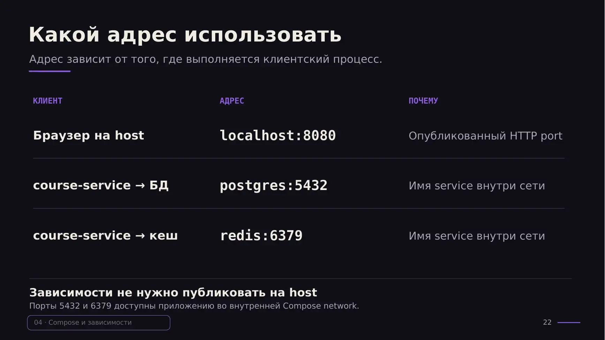

Если внутри Compose запущено несколько сервисов — course-service, Postgres, что-нибудь ещё вроде Temporal, — то из контейнера к ним обращаются **по имени сервиса** (`postgres:5432`): они находятся в одной сети, у Docker своя внутренняя сеть. Сетей можно сделать и несколько, чтобы сервисы, которые не должны знать друг о друге, жили в разных.

`localhost:8080` — это подключение с локальной машины, например для тестов или чтобы открыть сервис в браузере. Вот и вся разница: через какую сеть вы подключаетесь.

### Health check

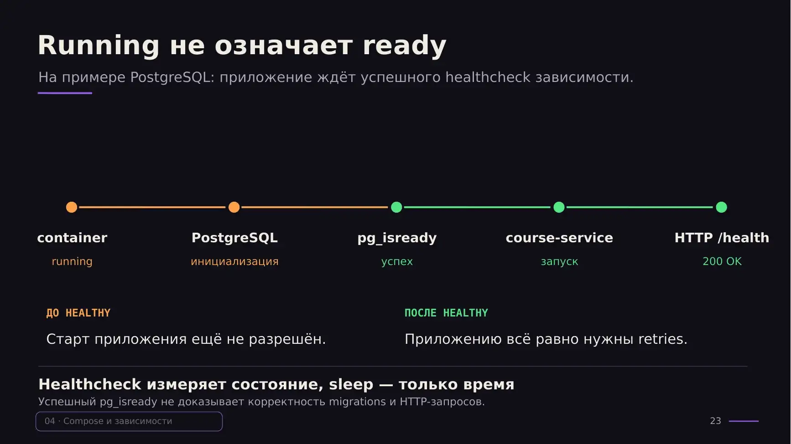

На практике health check — это ручка в каждом сервисе, которая по конвенции уже есть.

**Всегда ли health check даёт гарантию?** Нет. Жизненный пример — кластер базы данных: мастер и реплики, поднимаются, скажем, через sh-скрипт в одном контейнере. Health check пишется для контейнера, то есть фактически только для мастера.

Теперь вы хотите интеграционные тесты на весь кластер: проверить, что данные есть и на мастере, и на репликах. Запускаете — контейнер ждёт health check, мастер говорит «окей», тесты стартуют. А реплики ещё не поднялись. На мастере тесты проходят, на репликах — нет, и тесты постоянно падают.

Сделать health check мастера, который опрашивает реплики, не выйдет: мастер следит только за собой, а не за состоянием других нод, — за ними следит другой сервис над ними. А если в будущем SRE решат расширить кластер и добавят ещё три ноды — health check придётся переписывать.

### Где лежат данные без volume

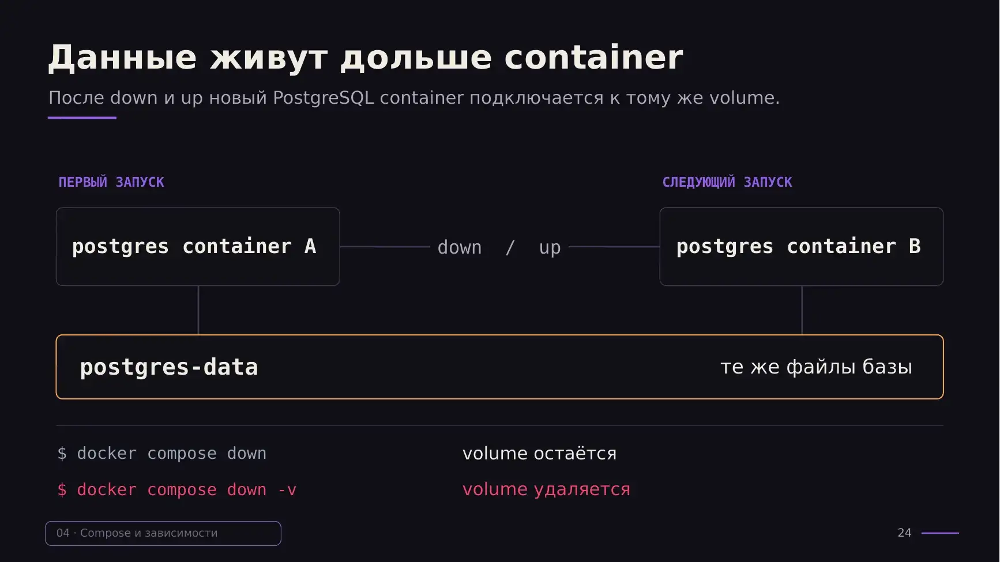

Если у Postgres в compose не прописан volume, данные будут стираться при каждом запуске. Но пока контейнер работает, они где-то лежат — на хосте, в `/var/lib/docker/...`, и при пересоздании контейнера очищаются. Поэтому базе volume нужен всегда.

```bash
docker compose down      # volume остаётся
docker compose down -v   # volume удаляется
```

## Тесты

Допустим, всё запущено. Как утверждать, что всё работает? Сначала health check, потом тесты. Дальше по сути начинается целая теория тестирования: что тестировать, как, на каком уровне — unit-тесты, интеграционные, end-to-end, моки, стабы, TDD, Testcontainers.

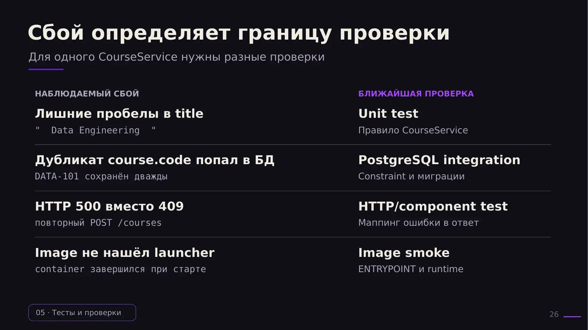

Каждый сбой ловится своей ближайшей проверкой: лишние пробелы в названии — unit-тестом, дубликат в базе — интеграционным тестом с настоящим PostgreSQL, 500 вместо 409 — HTTP-тестом, сломанный запуск образа — smoke-тестом.

Unit-тест вызывает сервис напрямую, без HTTP-фреймворка:

```kotlin
@Test
fun `normalizes title`() {
    val repository = InMemoryCourseRepository()
    val service = CourseService(repository)

    val course = service.createCourse(
        code = "DATA-101",
        title = "  Data Engineering  "
    )

    assertEquals("Data Engineering", course.title)
}
```

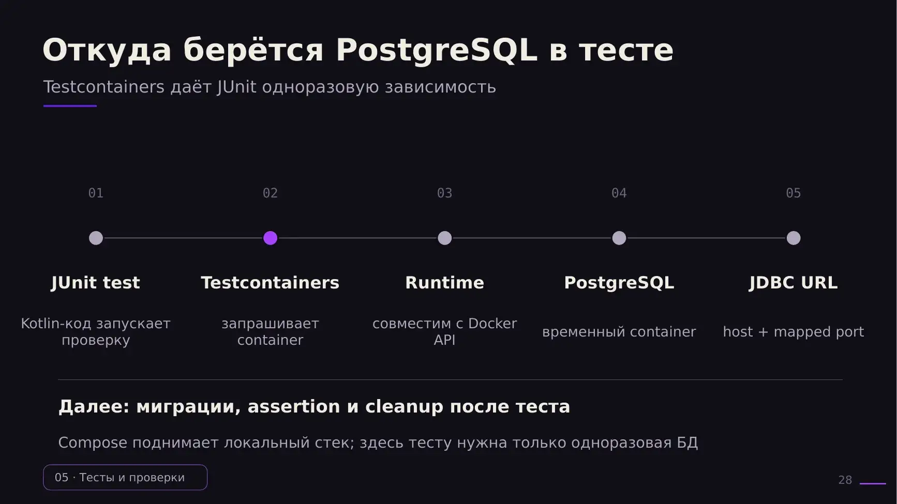

Testcontainers поднимает для теста одноразовую базу:

```kotlin
@Testcontainers
class CourseRepositoryTest {
    @Container val postgres =
        PostgreSQLContainer<Nothing>("postgres:18-alpine")

    @Test fun `rejects duplicate code`() {
        val url = postgres.jdbcUrl
        migrate(url)
        save(url, "DATA-101")

        assertDuplicateRejected {
            save(url, "DATA-101")
        }
    }
}
```

Пример контракта, который стоит проверять: первый `POST /courses` с `DATA-101` отвечает `201 Created`, повторный — `409 Conflict` с кодом ошибки `COURSE_CODE_EXISTS`.

### Flaky-тесты

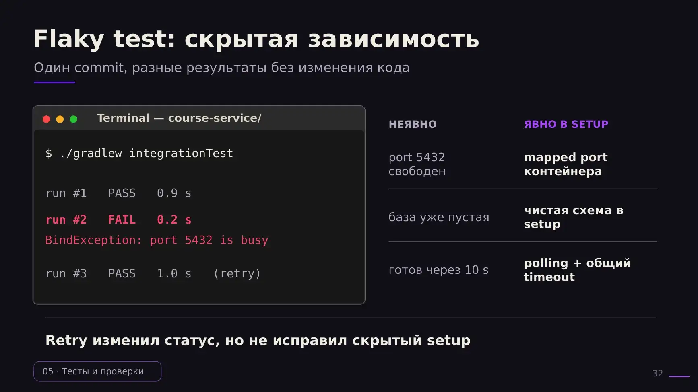

Ситуация: тест упал, потом прошёл, потом снова упал, на четвёртый и пятый раз прошёл — без изменений в коде. Это тесты со скрытой внешней зависимостью: от времени, от внешних файлов, от занятого порта, от того, что база «уже пустая».

Такие тесты надо ловить, дробить и переделывать, иначе жизнь превратится в ад. Пример из практики: в Яндексе есть сервис, живущий с десятых годов, — тестов в нём накопилась тонна, половина из них flaky, и проходят они два часа. Узнаёшь, прошло ли, только спустя два часа. Retry меняет статус теста, но не чинит скрытый setup — так что если у вас появились такие тесты, лучше сразу не забивать на них.

После тестов — канарейка: выкатываем на небольшую долю случайных пользователей. Если что-то упадёт — спокойно откатываемся.

## CI/CD

Сервис написан, покрыт тестами со всех сторон, образ собран, compose написан, есть контейнеры для локалки, теста и прода. Что дальше? Нужно, чтобы процесс доставки новых изменений был удобным.

**CI/CD** (непрерывная интеграция и доставка) ставит разработку, проверку и выкатку изменений на конвейер. Чтобы процесс был прозрачным и одинаковым для всех, берут CI и прописывают в нём правила, по которым изменения пропускаются. Разработчикам не нужно гадать, заработает или нет: CI показывает, что всё билдится и тесты проходят. При каждом коммите мы хотим убедиться, что добавленный код не ломает то, что работало до этого.

Как обычно выглядит CI: сначала **триггер** — коммит, создание PR, мерж веток и многое другое. Потом подготовка и сами действия.

### CI-файл должен быть читаемым

Очень часто CI-файлы — нечитаемая простыня, которую никто не хочет вести. А ведь CI-файл можно сделать красивым, практически с полиморфизмом: протягивать переменные и переменные окружения туда, куда надо, по названиям, ничего не хардкодить. Пожалуйста, делайте именно так. В будущем, скорее всего, отдельного девопса у вас не будет, и CI придётся настраивать самим — лучше сразу делать красиво, чем потом страдать, копаясь в этих простынях.

```yaml
jobs:
  checks:
    runs-on: ubuntu-latest
    steps:
      - uses: actions/checkout@v6
      - run: ./gradlew check

  image:
    needs: checks
    runs-on: ubuntu-latest
    steps:
      - uses: actions/checkout@v6
      - run: ./ci/build-image
```

### Jobs и DAG

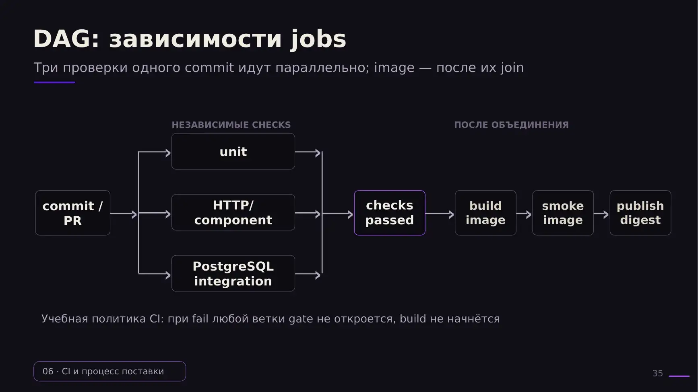

В CI есть jobs и actions. Каждую job можно запускать независимо от других — последовательно или параллельно. Параллельно, например, гоняются тесты для разных модулей. Или несколько микросервисов, которые катятся одновременно: собирать их последовательно точно не хочется.

CI по сути — **направленный ациклический граф** (DAG). Каждой job можно поставить предусловие — что должно пройти, чтобы она запустилась. Например, есть кубик (узел графа), в котором триггерим выкатку на машину: отправляем образ и говорим «обновляемся». До этого стоит сначала собрать нормальный образ и прогнать тесты — иначе будет «прикольно».

Узел выполняет операцию и по умолчанию ничего не обязан вернуть, кроме статуса. Чтобы появились output-значения, их нужно прописать: куда сложатся, как называются. Настроек много, в том числе отображения, — предлагается поиграться.

В CI можно делать примерно всё что угодно: собирать зависимости и образы, отправлять письмо на почту, создавать задачу в Jira, создавать события в инфраструктурных сервисах — «сервис начал раскатку», «сервис закончил раскатку», «сервис ушёл на плановые работы».

Зачем такие события? В какой-то момент придёт куча пользователей: «у нас всё упало, почините». Чтобы понять, почему, ищут события, которые произошли рядом, — и часто причина связана с релизами. Такие отсечки полезно собирать и где-то хранить.

## Доставка и откат

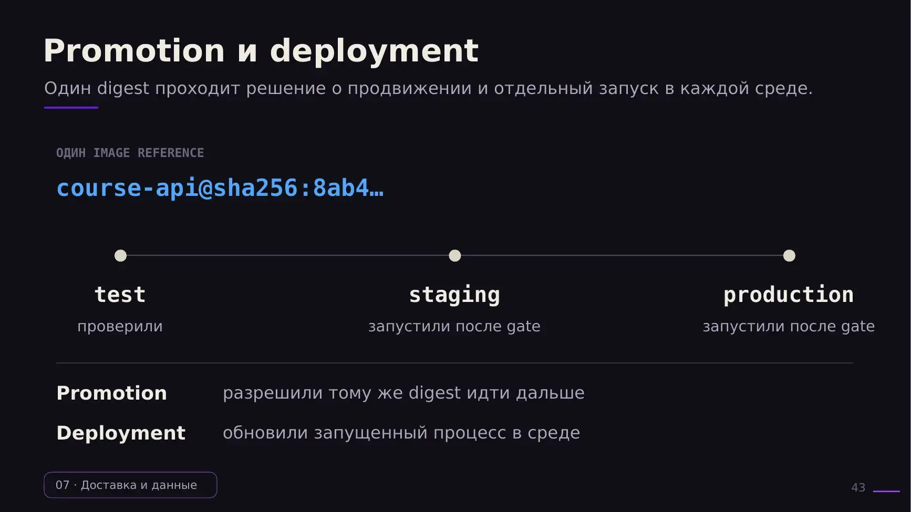

Вот выкатили новую версию — и упало. Первое, что хочется сделать, — быстро откатиться. Но откат не всегда возвращает всё как было.

### Миграции не откатываются вместе с образом

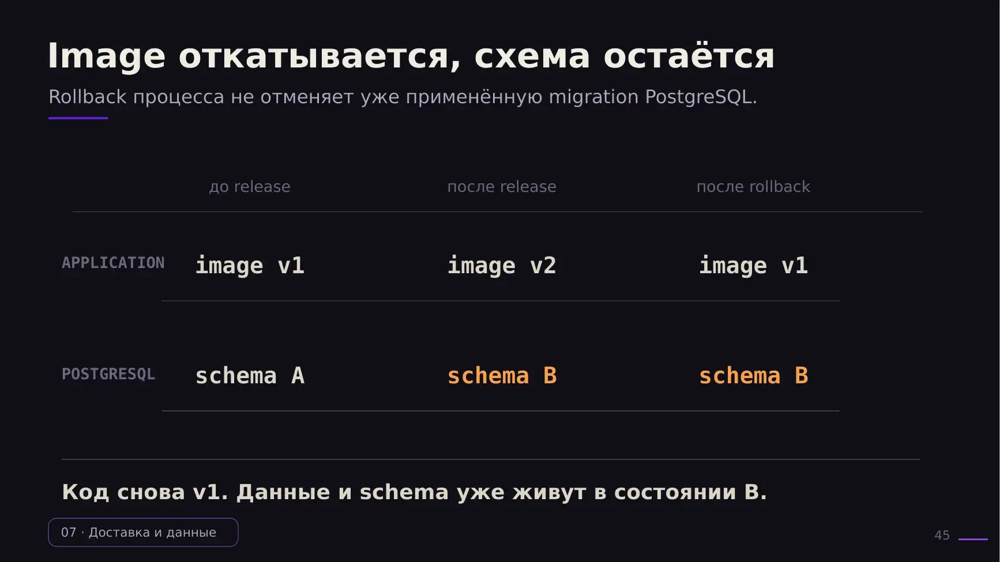

Если релиз применил миграцию, изменения в базе остаются и после отката образа. Не любая операция с базой обратно совместима. Например, удалили из таблицы ненужный столбец — а старая версия, в которой этот столбец был, после отката просто сломается.

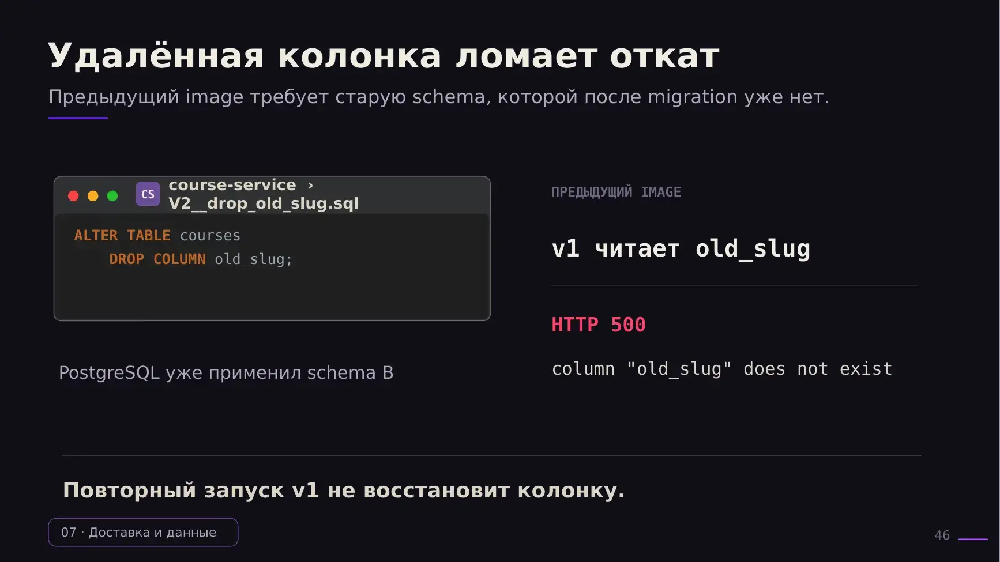

```sql
ALTER TABLE courses
    DROP COLUMN old_slug;
-- откатились на v1 → HTTP 500: column "old_slug" does not exist
```

Как делать безопасно: создаёте новое рядом и какое-то время живёте на новом.

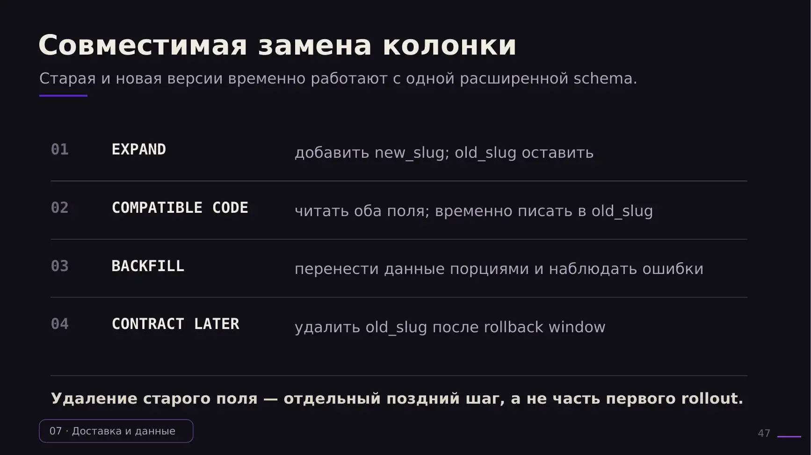

1. **Expand** — добавить `new_slug`, `old_slug` оставить.
2. **Compatible code** — читать оба поля, временно писать в старое.
3. **Backfill** — перенести данные порциями.
4. **Contract later** — удалить `old_slug` только после окна отката.

Ещё пример: после релиза логи резко начали забивать всю оперативную память. Тут возник спор, что дешевле — докупить память или нанять разработчика, который всё починит. Аргумент за память: это разовая покупка. Аргумент против: серверная память (с коррекцией ошибок) стоит ужасно дорого.

Зелёный pipeline подтверждает только то, что вы явно попросили его проверить.

## Диагностика

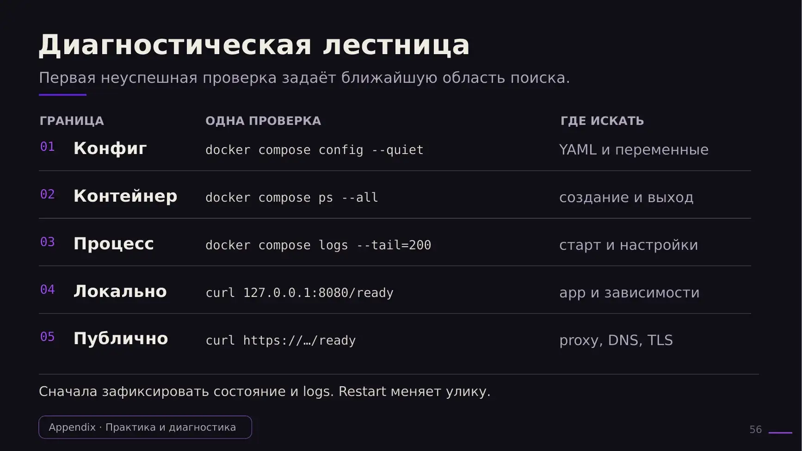

В конце презентации есть блок для особо увлечённых — как искать и фиксить ошибки. Первая неуспешная проверка задаёт область поиска: конфиг → контейнер → процесс → локальный запрос → публичный запрос. И сначала зафиксируйте состояние и логи — restart меняет улики.

## Итог

Мы научили сервис жить, работать и отвечать на запросы. Теперь — выкатывать: собирать образ в Docker, поднимать всё согласованно через Compose и запускать автоматические проверки в CI.

По организационному: вторая лаба — реализовать бизнес-логику придуманной в первой лабе идеи. Сдача — по очереди подходите и показываете, с правками по ревью. Вопросы можно писать в чат; полезно также поискать статьи — например, на Хабре есть статья, которая по этапам проводит от чистого Docker до Docker Compose.
