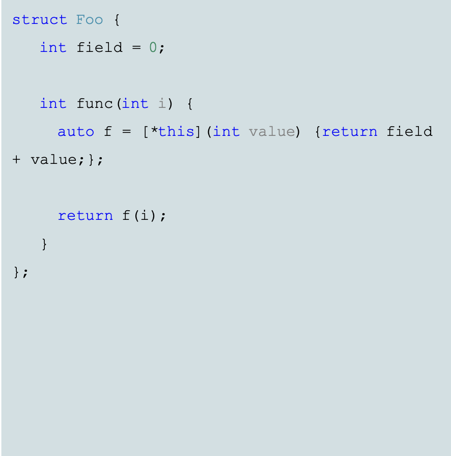
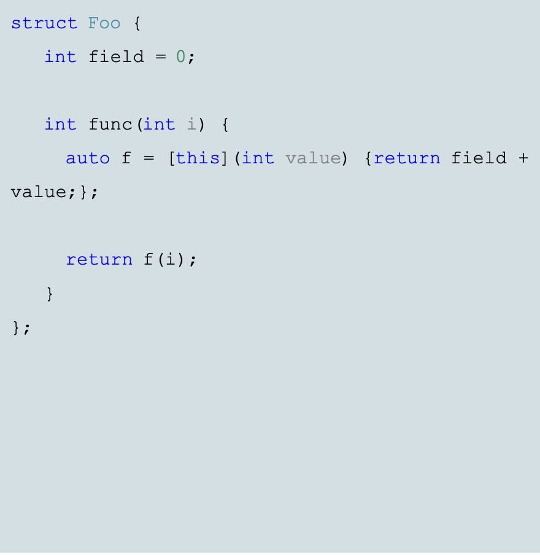
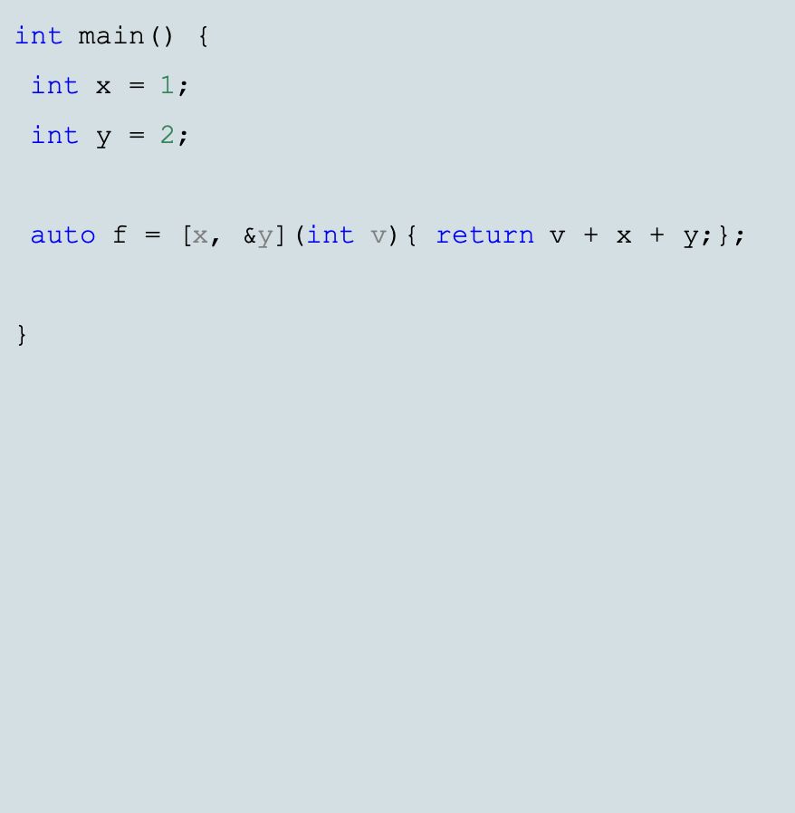

**2 семестр** \
Основы программирования. 

<!--more-->

### Проблемы функторов:
- Реализация далеко от места вызова
- Много текста
- Часто функторы используется только один раз *(редко бывает, что нужно что-то новое, потому что достаточно функторов в std)*
*Начиная с C++11 использует вместо собственных функторов lambda-функции*
### Преимущества функторов:
- Не надо отдельно писать функционал *(прямо вместе использования определяем функцию -> более читаемо)*
- Не надо нигде искать реализацию
- Более элегантная реализация функторов со стороны синтаксиса
- Захват переменных из локальной области видимости

### Захват переменных(capture):
- [x,y] - by value
- [=] - all by value with automatic storage duration
- [\&x, \&y] - by reference
- [\&] - all by reference with automatic storage duration
- [this] - all by copy current object
- [*this] - all by reference current object

|                                                   |                                                   |                                                   |
| ------------------------------------------------- | ------------------------------------------------- | ------------------------------------------------- |
|  |  |  |

### mutable lambda:
- Явно указывает, что можно менять переданную переменную (если была передана по значению)
- Передана по ссылке - меняется везде (как и в обычной функции)
- По копии с `mutable` - можно изменять внутри лямбды *(при разных вызовах  она будет сохранять своё состояние)*, но она не будет меняться в глобальном скоупе

Если написать сырую лямбду *(никуда её не передавать, не присваивать)*, то она моментально единожды вызовется

- Если нам нужно в зависимости от условий нужны 2 варианта объектов с функциями, то это будет очень дорого (*вызов конструктора по умолчанию при объявлении переменной, которой потом юудет присваивать)* + вопросы с константностью + может не быть дефолт конструктора
- Вариант решения - указатель на функцию *(проблема в размещении на куче взамен на стек)*
- С помощью лямбды (инициализируем переменную лямбдой, которая возвращает нужный нам объект в зависимости от условий)

- Изначально хотелось просто упростить объявление функторов для передачи в другие функции, но теперь использует просто на месте вызова для красоты

- Чтобы отказаться от вызова лямбда-функции без () используем std::invoke (чисто для красоты, не больше)

### Наследование:
- Имеем структуру с наследованием 2-ух классов и сделали using operator()от обоих классов -> в зависимости от того, какие они, будет либо вызов в зависимости от принимаемых аргументов, либо конфликт
- Как бы функциональный объект = двум функциональным объектам

Как это можно упростить?:

1. Седлаем отдельную функцию, для более красивого создания такого объекта
2. А теперь просто передадим в такую функцию - мейкер не функторы, а lambda-функции

Всё это может делать за нас std::bind (из-за появления лямбды перестал быть нужен, потому что:
- с помощью лямбды можно в одну класть другую (см пример)

### Generic lambda
Компилятор пытается подобрать конкретный тип в зависимости от использования - auto

Вместо типов аргументов можно просто ставить слово auto -> при инстанциации этой лямбды будет создан шаблонный функтор

### Рекурсивная лямбда
(рекурсия прямо в месте использования)

- Создаём лямбду, внутри оторой лежит другая лямбда, которая вызывает саму себя
- из-затого что внутри лямбды мы не можем вызвать саму лямбду, то внутри заволим новую лямбду через переменную -> её можно класть в вызов внутренней лямбды

### Function pointer and Lambda

Лямбды обратно совместимы с указателями на функцию

