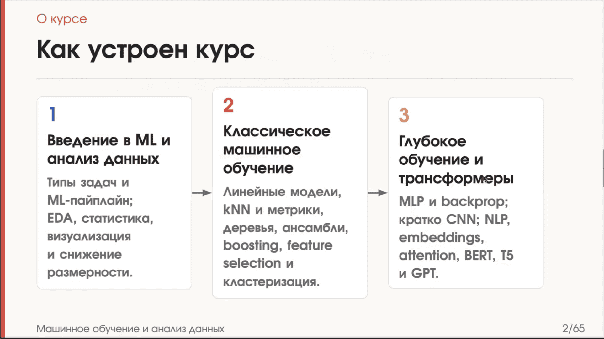
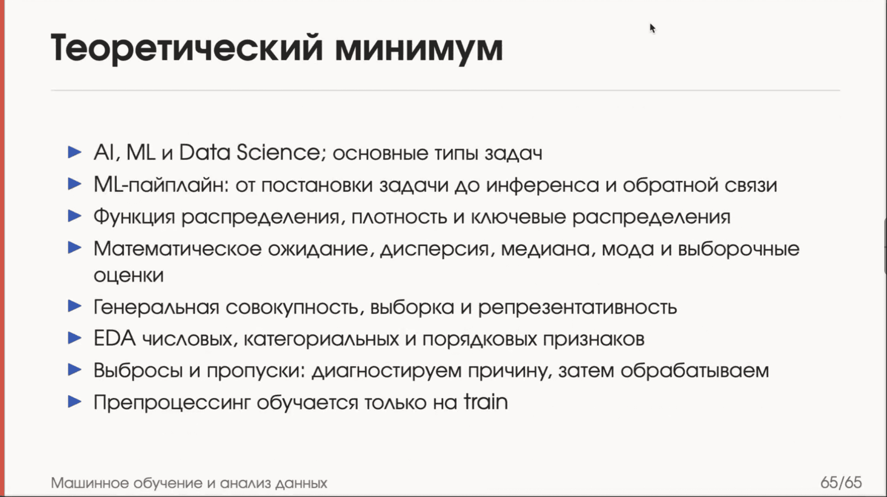

## Организационное

Курс обещает быть насыщенным: уже в сентябре уложится (или уложат...) то, что нормальные люди проходят за пару месяцев.

### Лабы

Два типа:

1. **С автопроверкой** — скрытые тесты, CI/CD в GitHub, принцип «всё или ничего». Балл за лабу домножается на коэффициент, полученный на практике (за тест можно получить от 0 до 1, но коэффициент ниже 0.5 не упадёт, т.е. чтобы получить больше, нужно решить более 3х задач из 5 в тестике)
2. **Без автопроверки** — с код-ревью в гитхабе или устной защитой

Всего: 7 лаб с автопроверкой + 7 без автопроверки. (возможно и другое количество, но верхняя планка 15 лаб, если что-то успеваться не будет, то может и меньше, дд неделя, будет лаба покрупнее на 2 недели)

### Рубежки

- 20 октября 2026
- 16 декабря 2026

Переписывания нет. Каждая рубежка — контрольная точка, нужно набрать не менее 6 баллов. Если меньше — предположительно допса.

Похоже на прошлый год, не сложнее (но "Игорь всё переделал").

### Про использование нейросетей

Позиция курса:

- **Нельзя:** выводы и текст, написанные нейронкой. Если видно, что текст нейросетевой — 0 баллов.
- **Можно:** рутина, построение графиков, код там, где это явно разрешают.
- **Обязательно руками:** архитектура, написание алгоритмов, всё, что для вас новое.

Половина курса нацелена на то, чтобы научить самостоятельно писать ML-дизайны (составлять архитектуру, анализировать данные), другая половина — писать код и разбираться в алгоритмах. Когда мы пишем алгоритмы — пишем их руками. Когда составляем ML-дизайн и хотим проверить, насколько он действенный, — можно нагенерить код нейронкой, это окей.

> в Яндексе во внутренней соцсети обсуждали, является ли отказ от использования AI причиной для увольнения. Ответ от руководства — да

### Термины
(ведём свой словарик!) \
**Инференс** — использование модельки (запуск на новых данных).

---

## Математическая статистика (повторение)

**Функция плотности** отвечает на вопрос, где сконцентрированы значения случайной величины. Для абсолютно непрерывной случайной величины ξ плотность связана с функцией распределения.

**Функция распределения** отвечает на вопрос, какая плотность накопилась слева от этой точки (иногда включительно, иногда невключительно).

### Основные распределения

#### Биномиальное

Число успехов в $n$ **независимых** испытаниях. Именно оно возникает в бинарной классификации, с которой мы будем работать: из него выводятся функции, оптимизирующие предсказание.

Когда использовать **нельзя** — когда эксперименты зависимы. 

Пример: предсказываем клики пользователей по рекламе. 10 кликов подряд — явно зависимые события: если пользователь кликнул на баннер с AI-generated изображением, скорее всего кликнет на такой же и в следующий раз.

#### Пуассона

Число событий на фиксированном интервале при постоянной средней интенсивности. Примеры: сколько звонков поступит за час, сколько привезут заказов, сколько за час умрёт людей.

- Параметр $\lambda$ — интенсивность, частота появления событий.
- Мат. ожидание распределения Пуассона равно $\lambda$.
- Используем, когда мало экспериментов и мало данных.

Та же проблема с зависимостью: если предсказывать количество аварий за час, то одна произошедшая авария повышает шанс второй — события зависимые.

#### Равномерное

Случайная величина ξ имеет равномерное распределение $U(a, b)$, $a < b$, если её плотность постоянна на $[a; b]$.

В ML почти не используется: мир неравномерный. Возникает только тогда, когда мы сами случайно выбираем что-то из чего-то — например, вытаскиваем шары из коробки, где вероятность у всех шаров примерно одинаковая.

#### Показательное

Ключевое — **свойство нестарения**: если вы три часа не выигрывали в казино и потратили почти все деньги, вероятность выигрыша от этого не меняется. Поэтому гемблинг — это плохо. Возникает повсюду, в биологии особенно.

#### Нормальное (гауссовское)

Самое частое распределение. В ML конкретно возникает, когда мы хотим уравновесить ошибки: мы будем стараться, чтобы ошибки наших предсказаний подходили под нормальное распределение. Это вид шума. Когда дойдём до линейной регрессии, сразу введём, что ошибка принадлежит нормальному распределению с одинаковой дисперсией, и дальше всегда будем опираться на то, что строим модели, подгоняя их ошибку под нормальность.

Наглядная аналогия — разброс патронов.

#### Log-нормальное

Взяли нормальное распределение и возвели $e$ в его степень.

Возникает в биологии постоянно. Пример: измеряем ферритин у людей — у большинства он в норме (есть пик), но есть больные люди в хвосте. Возможно, в курсе будет биологический датасет; в прошлом году всем было тяжело, потому что биологию никто не знает.

#### Хи-квадрат

Распределение суммы квадратов независимых стандартных нормальных величин.

**Степень свободы** = количество этих стандартных нормальных распределений. Возникает при работе со статистическими гипотезами.

#### Стьюдента

Распределение с «длинными хвостами». Используется, когда есть выбросы, которые мы не хотим сильно учитывать.

Почему часто используем вместо нормального: **по краям у него не нули**. Это помогает, например, в алгоритмах кластеризации, когда нужно учитывать очень далёкие расстояния как всё ещё существующие, а не бесконечные.

#### Фишера

Статистические гипотезы — разберём на следующей лекции. Формулу лучше помнить.

### Описательные характеристики

- **Математическое ожидание** — средневзвешенное значение, центр масс распределения.
- **Дисперсия и среднеквадратичное отклонение** — насколько мы в среднем уходим от мат. ожидания. Если предсказание в среднем классное, но дисперсия очень большая — скорее всего, мы не правы. («Если огромная дисперсия — лучше уволиться и больше никогда не заниматься ML» © Игорь)
- **Квантиль** — значение, до которого прошло $n\%$ распределения.
- **Медиана** — квантиль уровня 0,5: до него 50% распределения и после него 50%.
- **Мода** — самое часто встречающееся значение, верхушка плотности распределения.
- **Межквартильный размах (IQR)** — разность квантиля 0,75 и квантиля 0,25. Показывает, в насколько широкий диапазон попадает средняя половина значений.

### Выборки

Мы работаем не с бесконечными выборками, а с ограниченным количеством наблюдений — это и есть **выборка**. Хотим, чтобы она была **репрезентативной**.

**Генеральная совокупность** — все значения, которые вообще когда-либо существуют. Её мы никогда не добьёмся: люди рождаются, умирают, обо всех всё знать невозможно. Поэтому берём ограниченное количество наблюдений и пытаемся приблизить генеральную совокупность.

Пример: опрос, за кого голосуют на выборах. Чтобы выборка была репрезентативной, нужно взять людей разных возрастов, политических убеждений, рас, полов — и в том соотношении, в котором они находятся в реальном мире. Точности до миллионных не добиться, но приблизить можно.

Ровно для этой статистики проводятся переписи населения. В курсе будем периодически работать с данными Росстата — например, в одной из домашек будут данные о ДТП (где иногда встречается несколько тысяч ДТП в одном месте в одно время, но статистика при этом почти идеальная).

**Стратификация** — составление репрезентативной выборки: подгон процентных долей (возрасты, корм и подобное) под реальные статистики.

**Пример нерепрезентативной выборки:** есть 10 заводчиков, спрашиваем у них вес родившихся щенков. Выборка плохая, потому что у одного заводчика скорее всего одна и та же порода (или ограниченное их число), он кормит собак одинаковым кормом и так далее. Без стратификации такие выборки делать не надо.

> На практике в курсе заданий на сведение к репрезентативной выборке сейчас нет — мы работаем с теми данными, которые есть.

---

## Работа с реальными данными

### Единица наблюдения

Всегда нужно определить, что мы считаем единицей.

Пример с собаками — два варианта:

- заводчик = единица наблюдения, все его щенки = его признаки;
- собака = единица наблюдения, заводчик = признак этой собачки.

Что лучше — зависит от задачи. Если предсказываем вес щенков, единицей стоит взять собаку.

### Качество данных

Смотрим на схему данных и на качество: есть ли пропуски, дубли, невозможные значения.

Данные в курсе всегда будут плохие — это часть задания, а не небрежность. Постоянно придётся смотреть на качество и решать, что удалить, а что оставить. Иногда хочется удалить всё, но не стоит.

Перед тем как смотреть на результаты, смотрим, как вообще распределены данные. Если вес собачки распределён не нормальным образом, а как-то очень странно — стоит разобраться, что не так (или понять, что так и должно быть).

### Выбросы

Проблема: мы удаляем 1% справа и 1% слева, и уже новые значения в очищенной выборке становятся выбросами. Решение — **ограничить количество итераций очистки**, желательно одной.

Осторожно с удалением процентов датасета: в этот процент могут попадать очень важные данные. Например, если у вас 99% здоровых и 1% больных людей, то после отрезания хвостов останутся только здоровые — у больных признаки как раз странные.

### Типы переменных

Тип определяется смыслом. Три основных типа (потом, в deep learning, всё усложнится):

**1. Числовые** — те, что обладают непрерывными распределениями.

> Обсуждение на лекции: является ли расстояние числовой характеристикой? Формально существует планковская длина, и все расстояния можно разложить на конкретные кванты. Для обычных задач это неудобно, поэтому расстояние берём числовым; но в квантовых/молекулярных задачах его пришлось бы задавать категориальными признаками. Мысль, о которой не стоит забывать: любая числовая характеристика чаще всего представляется как кванты.

**2. Категориальные** — типы: цвет окраски животных и подобное. В примере со слайда категориальные — Postal Code и Delivery Speed (выражена не в км/ч, а описательно). Мы часто будем превращать числовые характеристики в категориальные, потому что с ними проще работать.

**3. Порядковые** — категориальные, но с отношением порядка на множестве категорий: мы точно знаем, что одна больше другой. При этом **не знаем гэп между категориями**: насколько рейтинг 5 отличается от рейтинга 4, или насколько «экспресс» отличается от «стандарта» по сравнению с отличием «стандарта» от «пикапа».

> «Фичи» — это и есть характеристики (признаки).

### Кодирование категориальных признаков

Модели работают только с числами, поэтому категории нужно как-то представить численно.

**Плохо:** задать 0 = красный, 1 = зелёный, 2 = синий. Появляется порядок, которого в данных нет: красный «меньше» зелёного. Рандомные числа тоже не спасают — порядок всё равно остаётся, а нам нужно от порядка избавиться.

**One-Hot Encoding:** создаём новые фичи — «является ли объект красным», «зелёным», «синим» — и ставим единичку только там, где объект действительно такой. Колонки несовместны: единичка не может быть одновременно в синей и в зелёной.

Проблема One-Hot: рост размерности датасета и разреженность. Появляется очень много столбцов, где мало единичек и очень много нулей; модель может просто забить и решить, что это ни на что не влияет. Чем больше категорий — тем чаще так происходит.

**Порядковые переменные:** One-Hot может подойти, если модель сама выучит ранжирование — такое случается, но лучше так не делать. Обычно просто ставим числа в правильном порядке. Данные о том, что разница между категориями разная, теряются, но хоть так.

### Обработка пропусков

Датасеты часто бывают разреженными: часть данных потерялась или просто не измерялась. Варианты:

- заполнить **медианой / средним** — рабочий вариант для числовых;
- заполнить **случайно** — так иногда делают, но это сильно убивает качество («случайность, которая убивает качество, — почти всегда обман»);
- **выкинуть признак**, если он слишком сильно влияет на таргет. Пример: предсказываем, болеет ли человек алопецией, и есть пропуски в наличии гена, отвечающего за эту болезнь → такой признак просто выкидываем;
- для роста человека и подобных фич — медиана или мода;
- для категориальных (например, пол) — заполнять **по распределению**, средним/медианой не получится;
- **удалить строки** с пропусками;
- позже будут алгоритмы, которые заполняют пропуски по-умному и в том числе генерируют новые данные.

**Пропуск сам может быть признаком.** Есть специальный энкодинг: выносим в отдельный столбец информацию 0/1 о том, что значение было пропущено. Некоторые модели могут выучить зависимость по этой колонке.

Пример с пингвинами: 19 пропусков из 344 наблюдений, распределены случайно, контентной переменной среди них нет. Можно заполнить средним/медианой или удалить эти строки. Просто заигнорить нельзя — потом сломаются алгоритмы, не переваривающие NaN. Медиана предпочтительнее среднего, потому что защищает от выбросов.

### Утечка данных (data leakage)

Пример из прошлого года: нужно было предсказывать степень свободы слова в стране. Среди признаков (экологичность и прочее) был средний балл. Линейная регрессия просто умножит этот средний балл на количество переменных, вычтет остальные и выдаст стопроцентное предсказание. Но если появится новая страна, предсказать не получится — среднего балла у неё не будет.

**Правило:** всегда думайте о том, будут ли такие данные доступны, когда вы буквально запускаете inference на новых данных.

---

## EDA

### Общие принципы

- Строить придётся очень много графиков, и строить их красивыми.
- Но не все графики нужны: есть полезные, есть бесполезные. Если данные равномерно распределены — зачем график? Можно просто написать об этом словами.
- Работаем в Python с NumPy и Pandas. Аккуратно следим, чтобы числа не записались как категориальные значения — это частая ошибка, которая скажется в том числе на обучении модели.
- Для непрерывных фич используем не только гистограммы, но и **бокс-плоты**.

### Три типичные картинки с выбросами

1. Одна точка очень далеко от всех остальных — чаще всего это выброс. Но если задача про редкий класс (болезни, мошеннические операции), то, возможно, и не выброс.
2. Образуется редкая, но отделимая группа — это **дисбаланс данных**: есть малочисленная группа, которую мы хотим предсказывать, и многочисленная, которую тоже хотим предсказывать.
3. Выбросы с низкой локальной плотностью, распределённые непонятно как: у них просто рандомные фичи. Такое хотим удалять.

Выброс, оказавшийся внутри плотного кластера, скорее всего не помешает.

### Бокс-плот

Из чего состоит:

- **полосочка** — медиана;
- **коробка** — от квантиля 0,25 (низ) до квантиля 0,75 (верх); между ними как раз IQR;
- **усы** — 1,5 IQR от границ коробки (общепринятая величина);
- всё, что выходит за усы, — выбросы;
- полупрозрачные точечки — сами наблюдения.

Усы показывают, где у нас примерно приемлемые данные (не в смысле нормального распределения).

> В английской литературе квантили пишут в процентах: 25% и так далее. Квартиль/квантиль — говорят по-разному.

### Violin plot

Если данные распределены не нормально, бокс-плот становится неадекватным: он покажет кучу выбросов на хвостах, которых на самом деле нет. В таких случаях разумнее использовать **violin plot** — по сути он строит функцию распределения (плотность).

### Хитмап и корреляции

Хитмап показывает корреляцию между фичами датасета. Корреляция фичи с самой собой всегда 1.

**Корреляция** — мера зависимости, не обязательно линейной.

- **Пирсона** — про линейную зависимость, наклон линейной регрессии одной переменной относительно другой.
- **Спирмена** — считается на рангах: сначала сортируем две колоночки.

Некоторые алгоритмы машинного обучения заставляют выкидывать коррелированные признаки, а некоторые наоборот требуют оставить как можно больше данных.

### Связи категорий

Значения в одной категории могут коррелировать со значениями другой категории и при этом не коррелировать со значениями в третьей. Значений получается очень много, особенно если категорий много.

---

## Разобранные датасеты

### Вино

- 178 наблюдений; единица наблюдения — образец вина.
- Признак: регион Италии, из которого взят образец.
- 13 числовых признаков: процентное содержание кислот, интенсивность цвета, содержание пролина и т. д.
- 3 класса, которые нужно предсказывать.
- Пропусков нет.

Интенсивность цвета можно кодировать и как числовую, и как порядковую фичу; в самом датасете она уже приведена к числовой.

Что увидели:

- Плохой график (левый на слайде): цвета наезжают друг на друга, ничего не понятно. Такие строить не надо.
- Классы отличаются по алкогольности — на гистограммах видно смещение по классам.
- Классы распределены примерно равномерно, но на маленьких датасетах это нельзя назвать равномерным: класса 3 заметно меньше, чем класса 2, поэтому про класс 2 мы сможем выучить больше.
- На графике зависимости интенсивности цвета от другого признака классы разделить толком нельзя: если убрать цвета, это один кластер странной формы. Жёлтый ещё отделим, красный и синий — сложнее.
- Хитмап: корреляция пролина и алкогольности высокая — 0,64.

### Пингвины

- 344 наблюдения, 7 признаков: длина крыла, длина клюва, высота клюва, масса тела, порода, пол и т. д.
- 19 пропусков (см. раздел про пропуски).

Что увидели:

- На зависимости длины клюва от высоты клюва отчётливо выделяется синий кластер; зелёный и красный отделить друг от друга тяжелее, но можно.
- Бокс-плот: распределения в каждом классе действительно отличаются, но у первых двух классов очень похожие распределения массы тела.
- Пол также влияет на массу пингвинов.

***

