## Устойчивые статистики

Когда данные нужно свернуть в одну цифру, среднее оказывается плохой сводкой при выбросах.

День A: $2, 3, 3, 4, 18$ с. День B: $5, 6, 6, 6, 7$ с. Среднее в обоих случаях — 6 с.

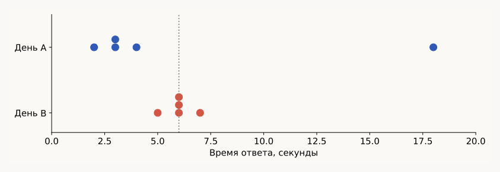

При этом $median(A) = 3$ с, $median(B) = 6$ с, а разброс отличается на два порядка: $s^2_A = 45.5$, $s^2_B = 0.5$. В день A четыре ответа из пяти укладываются в 2–4 с, и среднее целиком сдвигает единственное значение 18 с.

Отсюда пара устойчивых аналогов:

| Обычная статистика | Устойчивый аналог |
| --- | --- |
| Среднее | Медиана |
| Дисперсия (СКО) | IQR — межквартильный размах $Q_{.75} - Q_{.25}$ |

Медиана нужна для типичного запроса, среднее — например, для суммарного времени. Использовать будем в основном IQR, потому что выбросы есть везде: даже если удалить текущие, выбросами становятся новые точки распределения.

EDA — обязательный этап перед любой ML-задачей: смотрим, какие данные есть, как они распределены, нужны ли они и не слишком ли они плохие. Общий порядок работы:

1. Вопрос и критерий ответа: что хотим узнать и о какой совокупности.
2. Данные и их качество: сбор, единица наблюдения, пропуски, ошибки.
3. EDA: распределения, группы, связи, необычные наблюдения.
4. Подготовка: масштаб признаков и представление данных.
5. Проверка: гипотеза и неопределённость либо модель и валидация.
6. Вывод: ответ на вопрос, ограничения, следующий шаг.

## Масштабирование данных

### Зачем оно нужно

Если признаки в разных единицах, расстояние между объектами зависит от этих единиц.

| Объект | Возраст, годы | Доход, тыс. руб. |
| --- | --- | --- |
| A | 20 | 50 |
| B | 30 | 51 |
| C | 21 | 60 |

Здесь $d(A, B) = \sqrt{10^2 + 1^2} = d(A, C)$. Если записать доход не в тысячах, а в рублях, вклад дохода в квадрат расстояния вырастет в $10^6$ раз. Рассматривать такие столбцы как обычные координаты точки нельзя, поэтому каждый признак нормализуем отдельно.

### Три скейлера

| Метод | Формула | Опора |
| --- | --- | --- |
| Min–Max | $\dfrac{x - x_{min}}{x_{max} - x_{min}}$ | Минимум и максимум |
| Standard | $\dfrac{x - \mu}{\sigma}$ | Среднее и масштаб |
| Robust | $\dfrac{x - median(x)}{Q_{.75} - Q_{.25}}$ | Медиана и IQR |

**Min–Max** переводит выборку на отрезок $[0, 1]$: минимум становится нулём, максимум — единицей. Проблема — выбросы: одно огромное значение прижимает все остальные точки к нулю.

**Standard** вычитает выборочное среднее и делит на среднеквадратичное отклонение, приводя среднее выборки к нулю, а дисперсию — к единице. Формально стоит брать исправленную дисперсию, но в ML выборки обычно настолько большие, что при $n \to \infty$ исправленная дисперсия сходится к истинной и разница несущественна. Слабое место то же: одно сильное отклонение сдвигает среднее, а на дисперсию выбросы влияют квадратично.

**Robust** — устойчивый аналог Standard: среднее заменено медианой, СКО — межквартильным размахом. По факту мы отбрасываем хвостовые значения.

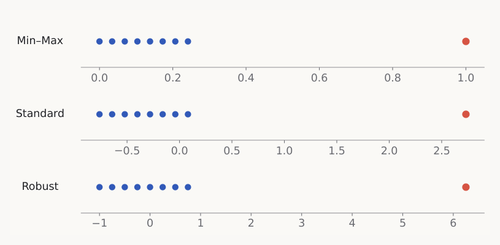

Одни и те же значения $1, 2, \ldots, 8, 30$. Важно: Robust не удаляет выбросы, красная точка остаётся крайней — он лишь позволяет аккуратнее обработать остальные данные. После Min–Max основная масса ужимается примерно в $[0; 0.3]$, после Standard становится чуть шире, после Robust размах основной части — около двойки. Чем ближе точки друг к другу, тем больше точности в расстояниях теряется при работе с числами с плавающей точкой, так что различимый размах — не косметика. Если выброс ничего не значит, его лучше просто удалить.

### Что скейлеры не меняют

Форму распределения. Они его только масштабируют.

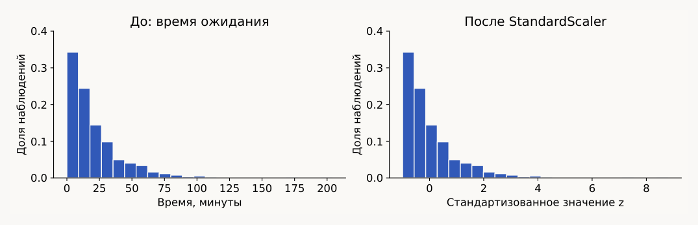

2000 значений из экспоненциального распределения со средним 20 мин: после преобразования $\bar z = 0$, $\mathrm{Var}(z) = 1$, но правый хвост никуда не делся.

Стандартизация нужна и потому, что расстояния, PCA и регуляризация чувствительны к масштабу, и потому, что в линейных моделях мы рассчитываем на стандартное нормальное распределение ошибок; при слишком широких данных распределение шума перестаёт быть стандартным и приходится дополнительно подгонять коэффициенты.

### Параметры считаем по train

Параметры вычисляем по обучающей выборке, отдельно для каждого признака. Нулевой знаменатель требует отдельной обработки.

Пусть на train $x_{min} = 10$, $x_{max} = 30$. Тогда

$$20 \mapsto \frac{20 - 10}{30 - 10} = 0.5, \qquad 40 \mapsto \frac{40 - 10}{30 - 10} = 1.5.$$

Пересчитывать максимум по тесту не нужно и нельзя: это меняет преобразование и раскрывает информацию о тесте — утечка данных, при которой модель фактически выучивает распределение отложенной выборки. Значение за пределами $[0, 1]$ на тесте — нормально и допустимо.

Скейлер — такая же модель, как остальные: у Min–Max обучаемые параметры это минимум и максимум, у Standard — среднее и СКО, а применение сводится к подстановке нового значения в уже обученную формулу.

Накладывать одно масштабирование поверх другого не стоит. Каждый скейлер приводит данные к своему свойству — среднее 0 и дисперсия 1 либо отрезок $[0, 1]$, — и второе преобразование это свойство ломает, а распределение после двух применений может измениться.

## Статистический вывод

### Задача

25 запросов: $\bar x = 34$ мс, выборочное СКО $s = 10$ мс. Прошлый замер давал 37 мс.

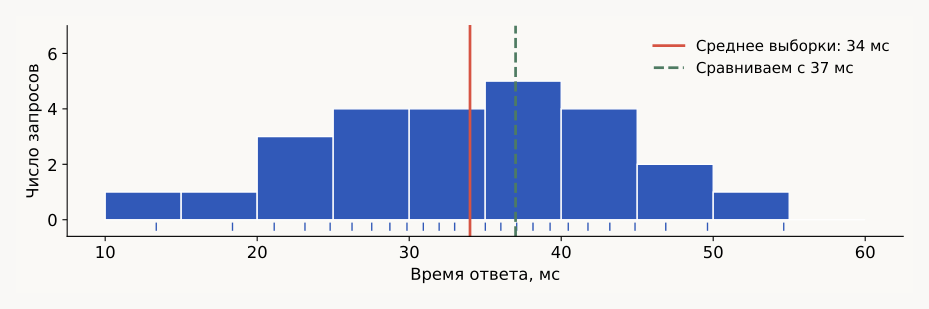

Численно среднее стало меньше, но вопрос в том, отличие это или погрешность. Z-тест простой, однако работает на нормальных или близких к нормальным распределениях, а про время ответа мы этого не знаем. Поэтому берём критерий Стьюдента, который позволяет проверять различие среднего и для ненормальных распределений.

### Доверительный интервал

$$\bar x \pm t_{24,\,0.975}\,\frac{s}{\sqrt{n}} = 34 \pm 2.064 \cdot 2 = [29.87;\ 38.13] \text{ мс}.$$

Степеней свободы $24 = 25 - 1$: одну степень свободы теряем потому, что среднее — это тоже оценка по выборке.

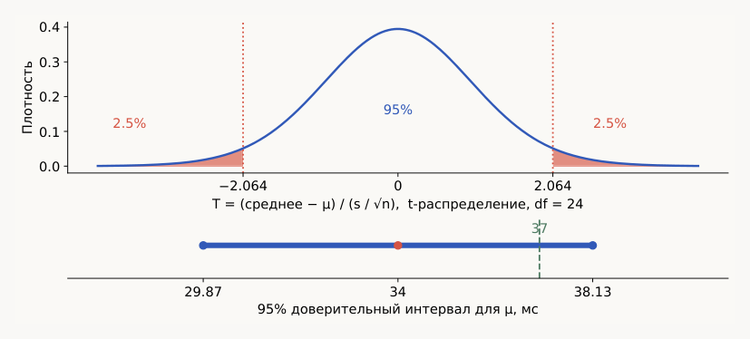

Формулировка «величина попадает в этот интервал с вероятностью 0.95» неверна: величина не случайна, это константа, а интервал посчитан по выборке. Корректно так: при независимых нормальных наблюдениях 95% интервалов, построенных этой процедурой, накрывают $\mu$.

Значение 37 попадает в интервал — при таком СКО разницу средних можно объяснить случайным отклонением. Нулевую гипотезу мы **не отвергаем**, а не «доказываем».

### Гипотезы и p-value

| Вопрос | Нулевая гипотеза | Альтернатива |
| --- | --- | --- |
| Есть изменение? | $H_0: \mu = 37$ | $H_1: \mu \neq 37$ |
| Стало медленнее? | $H_0: \mu \leq 37$ | $H_1: \mu > 37$ |

Статистика критерия измеряет расхождение данных с нулевой моделью, а её распределение при $H_0$ переводит это расхождение в вероятность.

p-value — вероятность того, что при верной $H_0$ статистика окажется настолько же или более экстремальной, чем наблюдаемая. Эмпирически — вероятность попасть в хвосты распределения.

$$T_{obs} = \frac{34 - 37}{10/\sqrt{25}} = -1.5, \qquad p = P_{H_0}(|T| \geq 1.5) \approx 0.147.$$

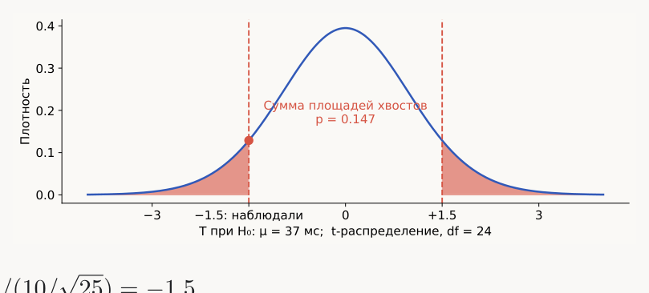

При $\alpha = 0.05$ гипотезу $\mu = 37$ не отвергаем.

### Ошибки I и II рода

| Решение | $H_0$ верна | $H_0$ неверна |
| --- | --- | --- |
| Отвергнуть $H_0$ | Ошибка I рода | Обнаружить эффект |
| Не отвергать $H_0$ | Корректное решение | Ошибка II рода |

$\alpha$ ограничивает вероятность ошибки I рода. Мощность $1 - \beta$ — вероятность обнаружить заданную альтернативу. Считают её редко, но когда берёте случайный критерий из интернета под свою задачу, сперва прикиньте, как часто он будет давать ошибку второго рода: почти всегда часто.

### Критерий хи-квадрат

Честный ли кубик? После 60 независимых бросков частоты граней: 8, 9, 12, 11, 13, 7.

$H_0: p_1 = \cdots = p_6 = 1/6$, то есть распределение исходов принадлежит классу дискретных равномерных. Ожидаемая частота каждой грани $E_i = 60/6 = 10$.

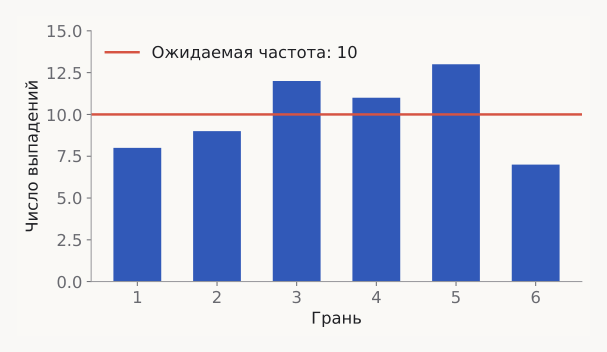

Расхождение наблюдений и ожиданий сворачиваем в одно число:

$$T = \sum_i \frac{(O_i - E_i)^2}{E_i} = 2.8.$$

| Грань | 1 | 2 | 3 | 4 | 5 | 6 |
| --- | --- | --- | --- | --- | --- | --- |
| Наблюдали $O_i$ | 8 | 9 | 12 | 11 | 13 | 7 |
| Ожидали $E_i$ | 10 | 10 | 10 | 10 | 10 | 10 |
| $(O_i - E_i)^2 / E_i$ | 0.4 | 0.1 | 0.4 | 0.1 | 0.9 | 0.9 |

Простая сумма отклонений равна нулю, поэтому берём квадраты; деление на $E_i$ задаёт масштаб колебаний частот. Хи-квадрат относится к семейству **критериев согласия** — тех, что проверяют совпадение формы распределения.

Из шести частот одну степень свободы теряем (сумма частот фиксирована и равна 60), остаётся 5. При $H_0$ статистика приближённо имеет распределение $\chi^2_5$.

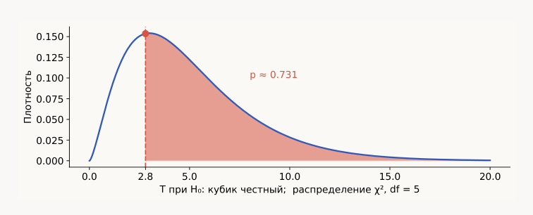

$p = P_{H_0}(T \geq 2.8) \approx 0.731$ — гипотезу о честном кубике не отвергаем.

### Интерпретация p-value

В другом эксперименте получили $p = 0.20$. Корректный вывод:

- ~~Вероятность верности $H_0$ равна 20%~~ — p-value не даёт вероятность гипотезы.
- **При $\alpha = 0.05$ данных недостаточно, чтобы отвергнуть $H_0$.**
- ~~Эффекта точно нет~~.

В отчёте нужны величина эффекта, интервал неопределённости и условия измерения. Если искать много связей и показывать только значимые, ложные находки накапливаются.

## Корреляции

Корреляция — мера зависимости величин, без уточнения, какой именно. Видов её десятки, разбираем два.

### Пирсон

$$r = \frac{\sum_i (x_i - \bar x)(y_i - \bar y)}{\sqrt{\sum_i (x_i - \bar x)^2 \sum_i (y_i - \bar y)^2}}$$

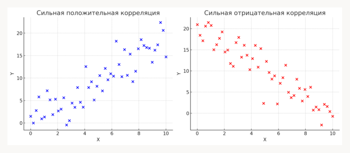

Это мера **линейной** зависимости, и она же угловой коэффициент линейной регрессии для двух переменных. Маленькое $r$ не означает, что зависимости нет.

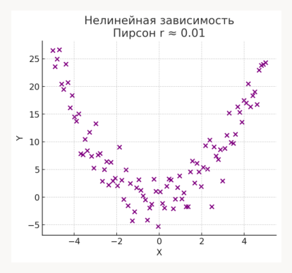

Здесь зависимость очевидно есть, но прямая её не описывает, и Пирсон даёт $r \approx 0.01$. Перед выводом по коэффициенту смотрим на форму связи. В тысячемерных данных никаких парабол глазами не увидеть, поэтому одному коэффициенту доверять нельзя.

### Спирмен

$$\rho_s = \mathrm{corr}(\mathrm{rank}(x), \mathrm{rank}(y)).$$

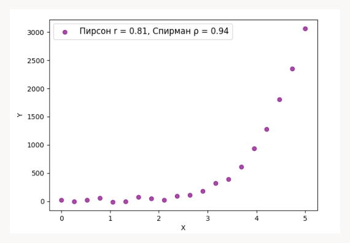

Ранговая корреляция — мера **монотонной** зависимости: параболу она тоже не покажет, зато монотонная связь может быть нелинейной. При совпадающих значениях используем средние ранги.

Что делаем: сортируем каждую переменную отдельно и нумеруем наблюдения от 1 до $n$.

| Наблюдение | 1 | 2 | 3 | 4 | 5 | 6 | 7 | 8 |
| --- | --- | --- | --- | --- | --- | --- | --- | --- |
| Время | 12 | 15 | 17 | 18 | 20 | 21 | 22 | 26 |
| Возраст | 14 | 25 | 20 | 35 | 45 | 30 | 60 | 95 |
| $R_x$ | 1 | 2 | 3 | 4 | 5 | 6 | 7 | 8 |
| $R_y$ | 1 | 3 | 2 | 5 | 6 | 4 | 7 | 8 |

$$\sum_i (R_{x,i} - R_{y,i})^2 = 8, \qquad \rho_s = 1 - \frac{6 \cdot 8}{8(8^2 - 1)} \approx 0.905.$$

Последняя формула применима без совпадающих рангов.

### Что делают преобразования признаков

| Преобразование | Pearson $r$ | Spearman $\rho_s$ |
| --- | --- | --- |
| $x \mapsto 60x$ | Не изменится | Не изменится |
| $x \mapsto x^2$, здесь $x > 0$ | Может измениться | Не изменится |

Положительное линейное масштабирование (умножение на константу, сдвиг) сохраняет оба коэффициента. Строго возрастающее преобразование сохраняет ранги, но может изменить линейную форму: куб — тоже монотонное преобразование и ранги не тронет, а вот квадрат при значениях обоих знаков монотонность теряет и ранги поменять уже может.

Отсюда практический приём для параболы с картинки выше: проверять линейную зависимость $x$ от корня из $y$ (для отрицательных значений — из модуля). После такого преобразования корреляция Пирсона окажется высокой.

## Проклятие размерности

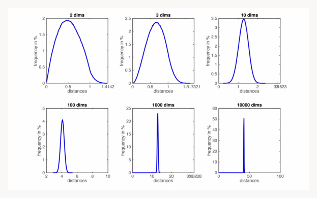

На графиках — распределения попарных расстояний при разном числе признаков. С ростом размерности **относительный разброс расстояний уменьшается**, «близкий» и «далёкий» соседи становятся менее различимы. Эффект зависит от распределения данных и метрики.

Причина видна из самой формулы: евклидово расстояние — корень из суммы квадратов по всем признакам. Когда слагаемых тысяча, сами расстояния становятся большими и практически одинаковыми, а различия между ними уезжают в мелкие разряды вроде 49.5 и 49.5001 — что вместе с конечной точностью чисел с плавающей точкой окончательно их съедает.

## Снижение размерности и PCA

Тысячемерные данные тяжело обрабатывать и невозможно визуализировать. PCA (principal component analysis, анализ главных компонент) борется и с проклятием размерности при огромном числе признаков, и с задачей визуализации сложно устроенных данных.

Пример — шесть образцов и два уровня экспрессии генов (экспрессия — грубо говоря, степень выработки гена).

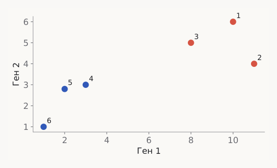

Если оба признака меняются вместе, положение точки можно описывать одной координатой вместо двух. Потеряем при этом часть информации о расстояниях и о том, как именно распределены сами гены.

### Шаг 1. Центрирование

Из каждого признака вычитаем его выборочное среднее — сколько бы признаков ни было, центрируем все. Для примера $\mu = (5.833,\ 3.633)$, $X_c = X - \mathbf{1}\mu^\top$.

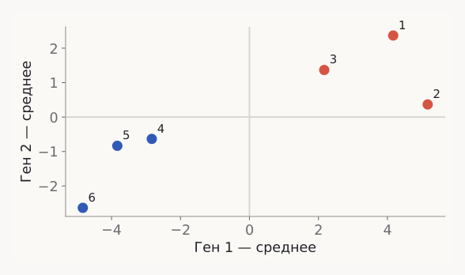

Для образца 1: $x_1 = (10, 6)$, $x_{c,1} = (4.167,\ 2.367)$. Среднее каждого столбца $X_c$ равно нулю.

### Шаг 2. Выбор направления

Строим прямую (в общем случае — гиперплоскость), на которую ортогонально проектируем все точки, и выбираем ту, где разброс координат проекций максимален.

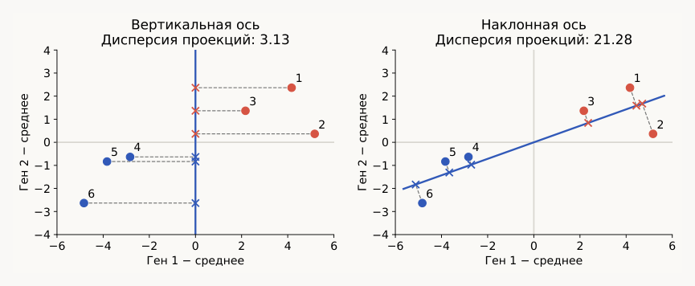

У вертикальной оси дисперсия проекций 3.13, у наклонной — 21.28.

Максимизация дисперсии и минимизация ошибки восстановления — это одно и то же:

$$\|x_i\|^2 = z_i^2 + \|r_i\|^2,$$

где $x_i$ центрированы, $r_i$ — остаток. Сумма $\sum_i \|x_i\|^2$ фиксирована, поэтому максимизировать $\sum_i z_i^2$ значит минимизировать $\sum_i \|r_i\|^2$ — квадраты **перпендикулярных** расстояний до оси.

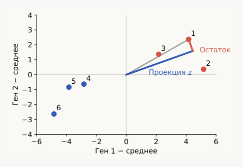

### Шаг 3. Следующие компоненты

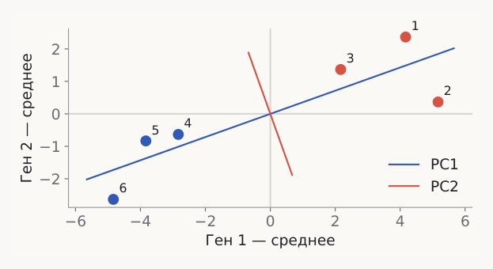

PC1 — направление с наибольшей дисперсией. Дальше остаётся ортогональное ей подпространство размерности $n - 1$, и в нём мы проделываем ровно ту же процедуру: проектируем точки и снова ищем направление максимальной дисперсии. В двух измерениях PC2 просто забирает всю оставшуюся дисперсию. Чем меньше номер компоненты, тем больше дисперсии она объясняет.

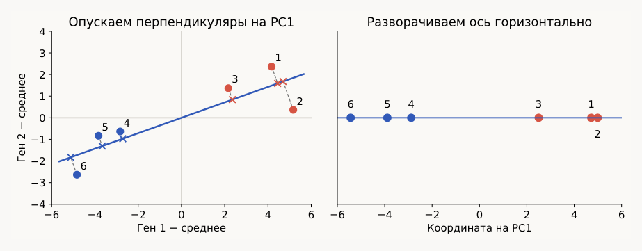

Координата объекта — знаковое расстояние от центра вдоль PC1. Двумерная картинка превратилась в одномерную, распределение расстояний при этом старались сохранить.

### Откуда берутся собственные векторы

Для $d$ признаков есть $d^2$ попарных ковариаций — таблица $d \times d$:

$$C_{jk} = \frac{1}{n-1}\sum_{i=1}^{n}(x_{ij} - \mu_j)(x_{ik} - \mu_k), \qquad C \approx \begin{pmatrix} 18.967 & 6.487 \\ 6.487 & 3.127 \end{pmatrix}.$$

Для центрированных данных $C = X_c^\top X_c / (n-1)$, а дисперсия проекции на направление $w$ равна $w^\top C w$. Ищем единичную ось с максимальной дисперсией проекций, ограничение на длину учитываем множителем Лагранжа:

$$\max_w w^\top C w,\quad w^\top w = 1; \qquad L(w, \lambda) = w^\top C w - \lambda(w^\top w - 1);$$

$$\nabla_w L = 2Cw - 2\lambda w = 0 \implies Cw = \lambda w.$$

Получилось уравнение собственного вектора — то есть собственные векторы возникают в PCA не случайно, а всегда, когда речь заходит об ортогональных проекциях и МНК. Собственный вектор $v$ — направление, которое оператор $C$ оставляет на той же прямой, $\lambda$ — во сколько раз он его растягивает. Ковариационная матрица положительно определена: все её собственные числа неотрицательны, а собственные векторы можно выбрать ортонормированными. В точке максимума дисперсия $w^\top C w = \lambda$, так что наибольшее собственное число и даёт первую компоненту.

| Компонента | Направление | Дисперсия |
| --- | --- | --- |
| PC1 | $(0.9417,\ 0.3364)$ | $\lambda_1 \approx 21.284$ |
| PC2 | $(-0.3364,\ 0.9417)$ | $\lambda_2 \approx 0.809$ |

Новая координата — линейная комбинация исходных признаков, то есть вклад каждого исходного гена в компоненту можно посчитать точно:

$$z_i = w_1(x_{i1} - \mu_1) + w_2(x_{i2} - \mu_2), \qquad \|w\| = 1.$$

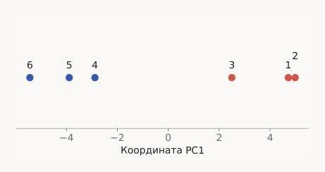

Для образца 1: $z_{11} = x_{c,1}^\top v_1 \approx 4.167 \cdot 0.9417 + 2.367 \cdot 0.3364 \approx 4.720$. Матрица $Z = X_c V_k$ имеет размер $n \times k$: столько же объектов, меньше координат.

Новый объект преобразуем тем же обученным отображением: для $x = (7, 4)$ получаем $x_c = (1.167,\ 0.367)$ и $z \approx 1.222$. Заново обучать PCA не надо — повторный fit создаст другую систему координат.

### Объяснённая дисперсия и выбор числа компонент

$$EVR_j = \frac{\lambda_j}{\sum_{\ell=1}^{d}\lambda_\ell}.$$

В нашем примере одна только PC1 объясняет 96.34% общей дисперсии, теряем 3.66% — для большинства задач это незначительно, зато считать теперь нужно вдвое меньше чисел и все алгоритмы работают быстрее.

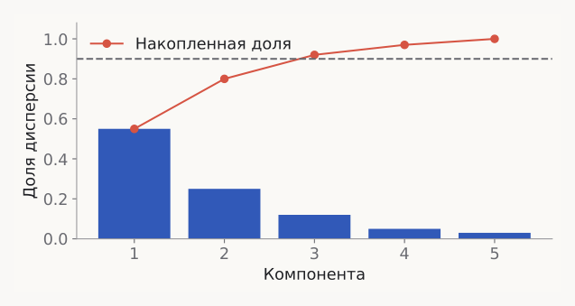

Столбики — дисперсия, объяснённая каждой компонентой по отдельности, линия сверху — накопленная сумма. В условном примере пятимерное пространство разложено на 5 компонент, и для порога 90% хватает $k = 3$ (92%). Потерять 10% дисперсии обычно не страшно, потерять 80% — бывает страшно. Для визуализации берут 2–3 оси, для модели проверяют качество на валидации.

Важная оговорка: это доля дисперсии выбранного представления $X$, а не доля сохранённой информации о целевой переменной.

### Ограничения

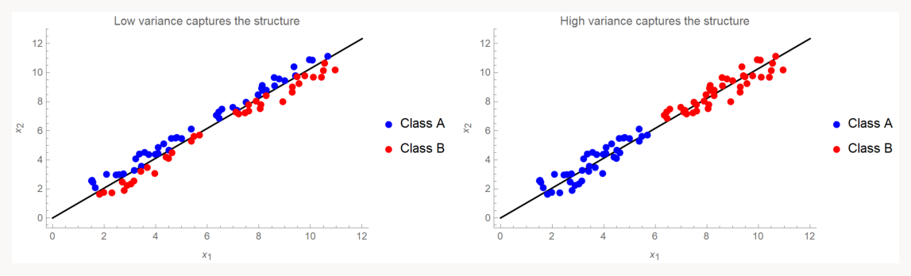

Направление, полезное для разделения классов, может иметь малую дисперсию — PCA не использует $y$ и ничего не знает о классах. Если два класса лежат близко и малодисперсионны, разделить их после PCA будет очень сложно.

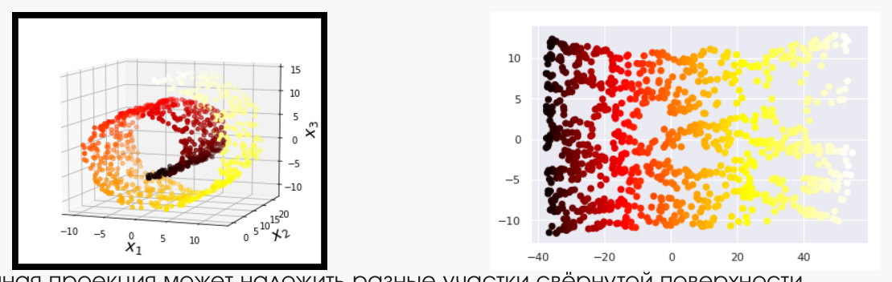

Второе ограничение — линейность. Собственные векторы и ортогональные проекции работают только с линейными преобразованиями, поэтому свёрнутую поверхность (закрученную спираль) линейная проекция накладывает саму на себя, и разные её участки перемешиваются.

### Подготовка данных перед PCA

| Шаг | Зачем он нужен |
| --- | --- |
| Центрирование | PCA описывает отклонения от среднего |
| Масштабирование | Разные единицы меняют ковариации и оси |
| Проверка выбросов | Квадраты отклонений усиливают их влияние |
| Fit на train | Новые объекты используют те же параметры |

При общем осмысленном масштабе может хватить одного центрирования; при разных единицах обычно рассматривают стандартизацию. Руками это всё считать не придётся — на практике всё сводится к `fit` и последующему преобразованию новых объектов уже обученной моделью.

Обратное преобразование по сохранённым компонентам даёт лишь приближение исходных данных: чем выше объяснённая дисперсия, тем оно точнее, но отброшенные компоненты не восстанавливаются.

## t-SNE

Нелинейный метод: умеет обрабатывать нелинейные зависимости внутри данных и проектировать не на прямые.

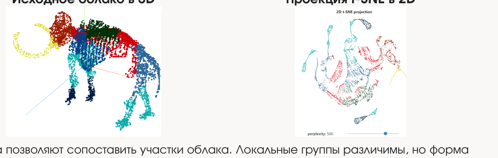

Цвета позволяют сопоставить участки облака: локальные группы различимы, но форма мамонта и глобальные расстояния искажены.

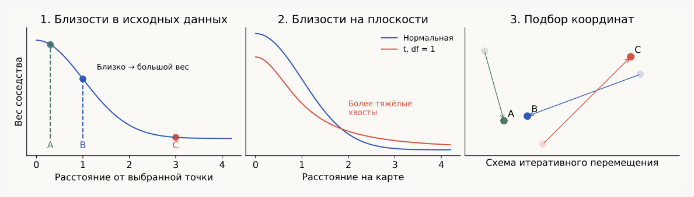

1. Из расстояний получаем вероятности соседства $p_{ij}$.
2. На карте считаем близости $q_{ij}$ с тяжёлыми хвостами t-распределения.
3. Перемещаем точки, уменьшая расхождение $P$ и $Q$. Это не сохранение всех расстояний.

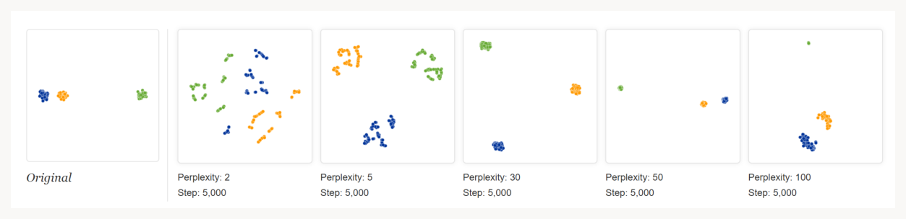

t-SNE адаптирует локальный масштаб, поэтому площади групп и расстояния между ними нельзя напрямую трактовать как исходную геометрию. Для проверки — другие seed и perplexity, исходные признаки и технические партии данных.
