<a href="https://storage.yandexcloud.net/notakeith/ml/ML_Lecture_3_2026.pdf" class="btn rounded-full center flex">
    
    Презентация
</a>

Курс в этом году стал пожёстче, и это регулируют. Закрыться на тройку несложно — это могут все. На 4–5 придётся стараться, но цель в том, чтобы каждый, кто хочет, закрылся на желаемую оценку. Вопросы по оцениванию — в чат.

Зачем вообще стараться. Чтобы понимать, как устроены LLM и всё, что вокруг них, нужна хорошая база, без неё дальше не получится. Рынок меняется: например, человек, пришедший в тестирование, сейчас на работе настраивает огромную тучу агентов и метрик, чтобы собирать качество — по сути это работа ML-инженера, хотя пришёл он как QA. В ближайшие лет пять такая ситуация будет только усугубляться, и обычному разработчику придётся уметь работать с агентами, связывать их между собой и следить за качеством. Потому что галлюцинации никто не отменял: «Ой, извините, я удалила продовую базу данных».

Поэтому курс будет непростым, его не получится «расплюнуть, закрыть, забыть». Задача — чтобы на отборах на стажировки и позиции вы спокойно проходили, а не готовились в панике ещё три месяца. Вся команда курса либо работает в ML, либо активно проходила и проходит такие отборы.

Сегодня лекции как таковой нет: повторяем всё, что было на первой неделе, на примере покемонов. Где что-то непонятно — останавливайте и спрашивайте. Презентация и ноутбук с анализом выложены, ноутбук можно запускать самостоятельно.

## Типы переменных

Распределения бывают дискретные и непрерывные. У дискретной случайной величины значения, например, натуральные — пример такой переменной: возраст.

Ещё один тип — **порядковые** переменные. У категорий есть чёткий порядок, но непонятно, насколько велика разница между ними: ввести числовое отношение между категориями нельзя.

**Непрерывные**: в теории вероятностей это непрерывная случайная величина, а в анализе данных под непрерывным обычно понимают признак, у которого просто много значений, и эти значения реально числовые — их можно сравнивать и так далее.

Покемон — это строка таблицы. Разберём, к какому типу относится каждый столбец:

| Вид | ID | Основной тип | Второй тип | Вес, кг |
|---|---|---|---|---|
| Pikachu | 25 | electric | отсутствует | 6 |
| Snorlax | 143 | normal | отсутствует | 460 |
| Gengar | 94 | ghost | poison | 40.5 |

- **ID** — сложное место. С одной стороны, это категория: значение уникально, и порядок на нём особого смысла не имеет. Строго с точки зрения математики и теории вероятностей его можно назвать числовым, но интересен он нам скорее как категория.
- **Основной тип** — категориальный: электрический, нормальный и так далее.
- **Второй тип** — тоже категория: он либо отсутствует, либо это какой-нибудь poison.
- **Вес** — числовая переменная.

## Среднее и медиана

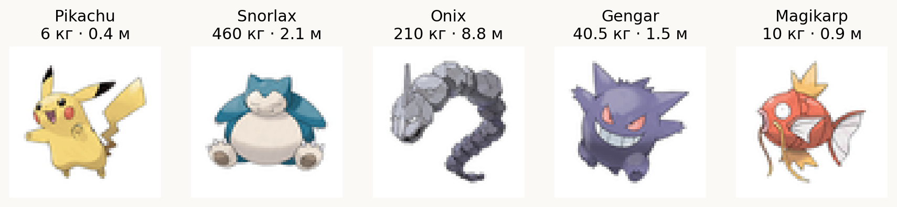

Вес у покемонов бывает очень разный. Pikachu весит всего 6 кг. Есть тяжёлые товарищи вроде Snorlax — он весит полтонны и чувствует себя прекрасно. Есть каменный Onix, который весит больше 200 кг.

Вопрос: если взять этих пятерых и посчитать вес «среднего абстрактного покемона в вакууме», насколько это будет полезно? Не очень. Если усреднять настолько разные объекты, мы не получим «нечто среднее». Описание целой выборки, да ещё такой маленькой, одним числом может принести больше проблем, чем пользы.

**Среднее** — сумма значений, делённая на их количество.

**Медиана** — выстраиваем всё распределение в возрастающий ряд и берём из него серединку.

Для пятёрки выше: упорядоченные веса $6;\ 10;\ 40.5;\ 210;\ 460$, медиана $40.5$ кг, а среднее

$$
\frac{6 + 10 + 40.5 + 210 + 460}{5} = 145.3 \text{ кг}.
$$

Медиана полезнее тем, что нивелирует выбросы.

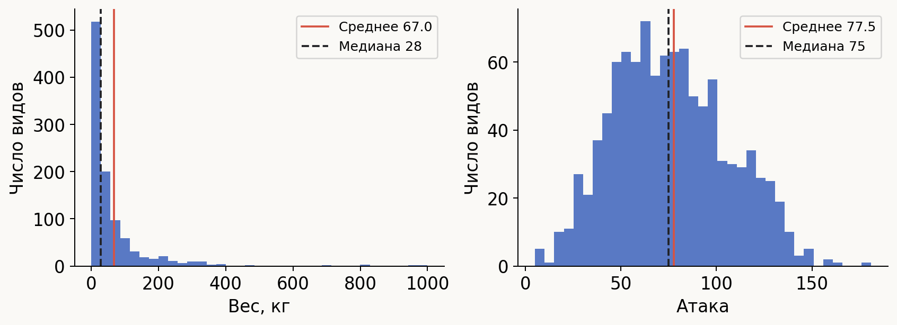

На всей базе у веса среднее (красная линия) около 67 кг, а медиана (чёрный пунктир) — 28 кг, больше чем в два раза меньше. Это значит, что лёгкие покемоны представляют собой основную массу, а где-то в конце есть небольшое количество тяжёлых выбросов. За счёт них среднее сильно увеличивается, а на медиану выбросы никак не влияют — потому что их мало. Поэтому анализ через медиану устойчивее к выбросам и к проблемам в данных.

Более реальный пример: запросы к поиску. Большинство запросов получили ответ за 10 миллисекунд, а один подвис и ответил за полторы секунды. Если посчитать среднее, оно окажется огромным просто из-за одного зависшего запроса. Медиана же останется там, где была.

> Если в данных могут быть выбросы, старайтесь по максимуму отказываться от методик, основанных на среднем, и от дисперсии, посчитанной через вычитание среднего. Считайте через медианы и используйте непараметрические методы.

На атаке медиана (75) и среднее (77.5) практически равны. Это значит, что распределение близко к симметричному и выбросов нет: если медиана и среднее очень близки, выбросов нет.

## Параметрические и непараметрические тесты

Вспомним статистику. Самый простой статистический тест — **t-тест**. Пусть есть две выборки, и мы предполагаем, что они взяты из одного распределения. У одной есть какое-то $\mu_1$, у другой $\mu_2$, и гипотеза: $\mu_1 = \mu_2$. В t-тесте мы считаем средние и смотрим, насколько они отклоняются друг от друга. Если отклоняются чуть-чуть — говорим, что оснований считать выборки разными нет.

Но чтобы t-тест работал, распределение должно быть нормальным: один горбик, и этот горбик нормальный. Если распределение не нормальное, использовать его нельзя. А на практике таких распределений примерно ноль: нормальное — это чистая теория статистики, а в анализе данных у вас всегда «какая-то шляпка» — несколько пиков, выбросы и ещё что-нибудь. Поэтому t-тест нельзя использовать примерно везде.

Чтобы от этого не страдать, придумали **непараметрические** аналоги. Непараметрическими они называются за счёт того, что не делают предположений о распределении данных. Выводы делаются только на основе метрик, которые можно получить чисто из данных, — например, медианы, которая полностью вычисляется из выборки.

Для повторения статистики будут ссылки на видео (записи лекций по статистике и канал с парой обязательных видосов).

## Пропуски

Пропуски можно удалить, заполнить или пострадать. Страдать — бесполезное занятие, тема простая, поэтому на ней не останавливаемся.

## Квартили и боксплот

Квартили делят отсортированную выборку:

- $Q_1$ — 25-й процентиль: значение, ниже которого лежит 25% выборки;
- $Q_2$ — медиана, 50-й процентиль;
- $Q_3$ — 75-й процентиль.

Аналогично, 60-й процентиль — это значение, меньше которого в выборке 60% объектов.

Для веса покемонов $Q_1 = 8.5$ кг, медиана $28$ кг, $Q_3 = 70$ кг.

**Боксплот** строится так: коробка идёт от $Q_1$ до $Q_3$, внутри линия медианы. Дальше от краёв коробки откладывается полтора межквартильных расстояния влево и вправо:

$$
\mathrm{IQR} = Q_3 - Q_1, \qquad L = Q_1 - 1.5\,\mathrm{IQR}, \qquad U = Q_3 + 1.5\,\mathrm{IQR}.
$$

Усы доходят до крайних наблюдений внутри этих границ. Их длина зависит от того, какой был межквартильный размах и как расположены данные. Всё, что не влезает, болтается отдельными точками.

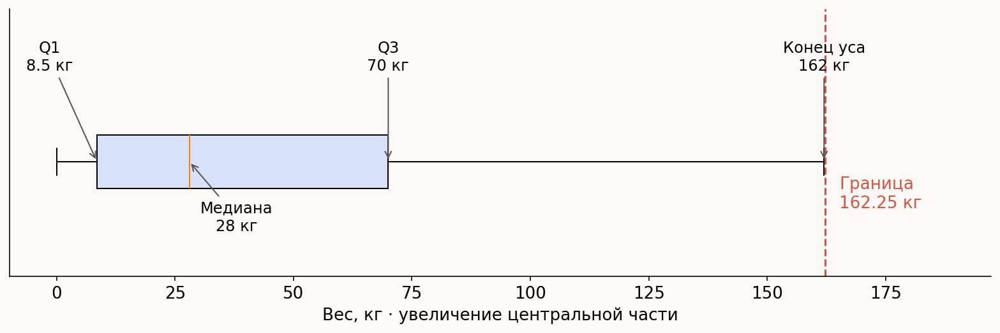

Усы — это не 5-й и 95-й процентили. И усы не обязаны быть одинаковыми: на графике видно, что медиана находится не посередине коробки, потому что лёгких покемонов очень много — распределение перекошено.

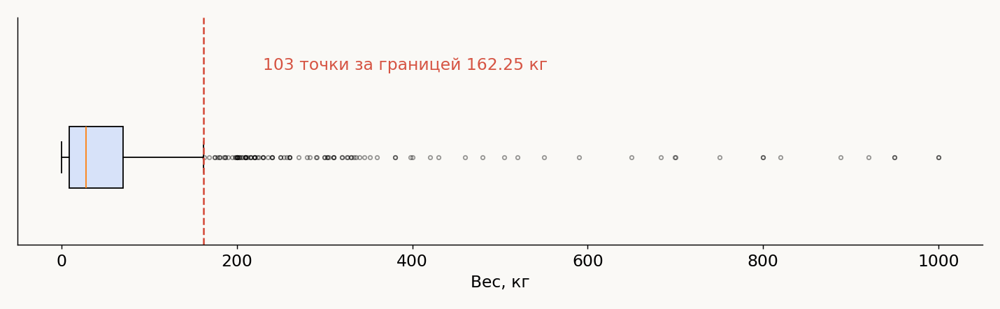

Snorlax здесь оказывается выбросом, хотя он далеко не самый тяжёлый покемон в датасете — есть покемоны, которые весят под тонну.

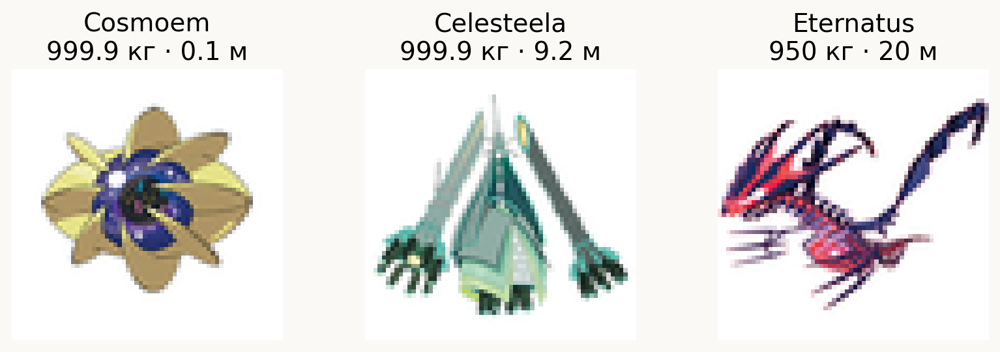

### Удалять ли выбросы

Всего в выборке 1025 покемонов, и за границей оказались 103 точки — примерно десятая часть датасета. При этом это реально существующие покемоны. Если просто удалить десятую часть, останется ли выборка репрезентативной?

**Репрезентативная выборка** — такая, по которой можно делать выводы обо всей совокупности. Пример: я хожу по аудитории и складываю людей в выборку: «Привет, пойдём». Если у меня нет структуры, по которой я хожу, скорее всего выборка получится совершенно не репрезентативной. Мне проще подходить к тем, кто сидит спереди. До тех, кто посерединке, добраться сложнее, а до ребят, которые сидят высоко, — ещё сложнее, так что оттуда в выборку попадёт довольно мало людей.

## Связи признаков

### Корреляция Пирсона

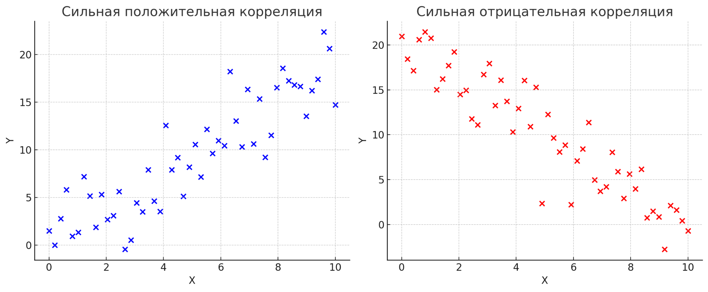

$$
r = \frac{\sum_i (x_i - \bar x)(y_i - \bar y)}{\sqrt{\sum_i (x_i - \bar x)^2 \sum_i (y_i - \bar y)^2}}
$$

Коэффициент лежит от $-1$ (сильная отрицательная связь) до $1$ (сильная положительная). Если корреляции нет, точки выглядят как бесформенное облако.

### Нелинейные зависимости

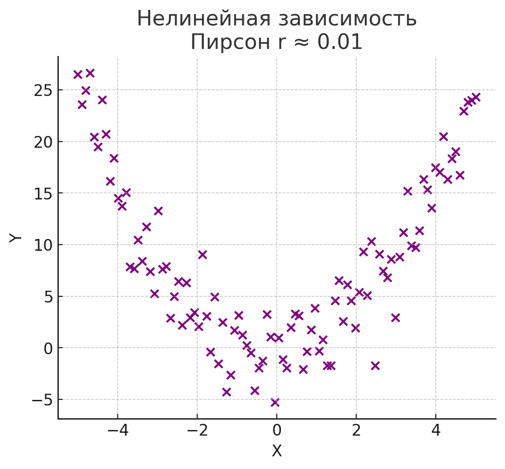

В случае нелинейной связи корреляция Пирсона вдруг оказывается очень низкой. Значит ли это, что связи нет? Нет — значит, что она нелинейная. Здесь явно есть связь, парабола, но в коэффициенте корреляции этого не видно.

> Когда ищете зависимости в данных, никогда не ограничивайтесь корреляцией. Корреляция — штука, которую используют, когда зависимость уже найдена: вы посмотрели, увидели, что две переменные связаны, и чтобы принести это руководителю или опубликовать — посчитали коэффициент. Если искать зависимость через корреляцию, можно пропустить всё, потому что линейных связей меньшинство.

### Гипотезы на покемонах

Проверим две гипотезы:

1. Более тяжёлые покемоны имеют более высокую атаку.
2. Более высокая защита связана с меньшей скоростью: те, кто умеет защищаться, неповоротливые.

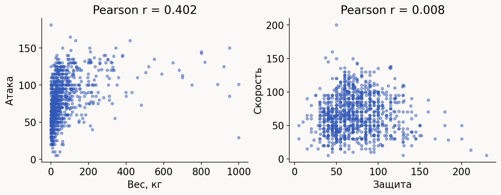

Для веса и атаки $r \approx 0.4$ — первую гипотезу, скорее всего, можно подтверждать.

Для защиты и скорости корреляции нет. Но здесь очень интересный момент: точки образуют треугольник. Связь есть, просто она не линейная, поэтому корреляция её не увидела. Если бы мы этого не заметили, могли бы пропустить что-то важное. Пример игрушечный, но на реальных данных такое может оказаться очень важным.

### Сравнение групп

Изначально этот датасет собирали, чтобы предсказывать легендарность покемона: есть легендарные, а есть обычные. Вопрос: правда ли, что у покемонов с особым статусом сумма шести боевых характеристик в среднем выше?

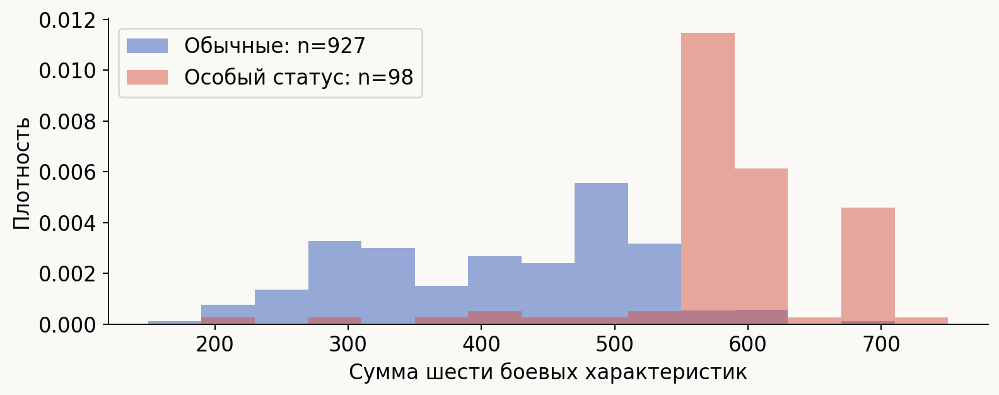

У покемонов с особым статусом распределение суммы характеристик сильно сдвинуто вправо — это видно сразу. Проверить можно через медианы, которые обсуждали в начале: медиана одной группы находится в одном месте, медиана другой — заметно правее. Гипотеза подтверждается.

## Стандартизация

Разные данные измеряются в разных единицах: что-то в рублях, что-то в долларах, и 100 рублей со 100 долларами сравнивать нельзя. Данные находятся в разных масштабах, и чтобы эти масштабы убрать, нужна стандартизация.

### Дисперсия

У данных есть две характеристики: среднее и то, насколько данные от этого среднего умеют отклоняться — **дисперсия**.

Демонстрация на листке бумаги: если согнуть его в форме кривой распределения, площадь под ней всегда будет одинаковой, а центр я не двигаю. Но согнуть можно высоко и узко, а можно низко и широко — и в зависимости от этого меняется разброс. Большой разброс — большая дисперсия, маленький — маленькая.

Почему это важно: если данные лежат в большом диапазоне, у них больше дисперсия, и такая переменная будет казаться важнее. Чтобы убрать эту «важность», масштаб нужно выравнивать.

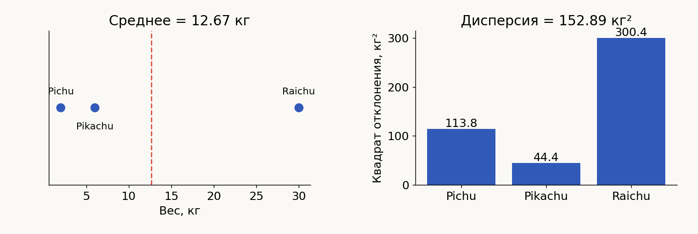

Пример на Pichu (2 кг), Pikachu (6 кг) и Raichu (30 кг). Pikachu меньше всего отклоняется от среднего, а Raichu, хотя вес у него не очень большой, куда-то улетает.

Если перевести вес из килограммов в граммы, отклонения и $\sigma$ вырастут в тысячу раз, а дисперсия — в миллион. Значит, нельзя сравнивать переменные в разных масштабах: у них по-разному устроены разбросы. Стандартизация

$$
z = \frac{x - \mu}{\sigma}
$$

убирает эту зависимость — числитель и знаменатель меняют масштаб одинаково.

### Кто ближе к Pikachu

Возьмём вес и скорость. У Pikachu 6 кг и скорость 90, у Meowth 4.2 кг и скорость 90, у Eevee 6.5 кг и скорость 55. Кто ближе к Pikachu — Meowth или Eevee?

Интуитивно — Meowth. Масса отличается примерно в полтора раза (чуть меньше), а скорость не отличается вообще. У Eevee вес отличается чуть-чуть, а скорость — почти в два раза.

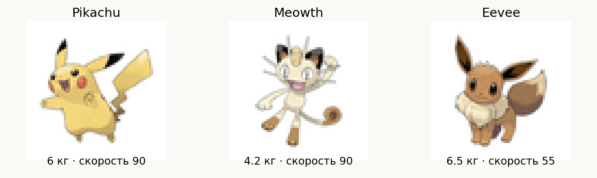

А теперь запишем вес в граммах:

Расстояние до Meowth — 1800, до Eevee — около 500. Получается, ближе Eevee. Правда ли это? Нет, не правда: объекты те же, мы просто изменили числовой вклад веса.

После стандартизации Meowth оказывается ближе и когда вес был в килограммах, и когда в граммах. Это уже более корректная картина.

### Форма распределения

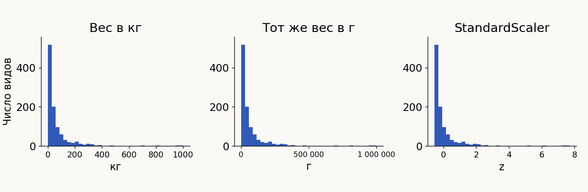

Важно помнить: при линейном шкалировании само распределение не меняется. Меняется только масштаб, а форма остаётся, потому что преобразование линейное.

Чтобы изменить форму, нужны более сложные преобразования — например, логарифм.

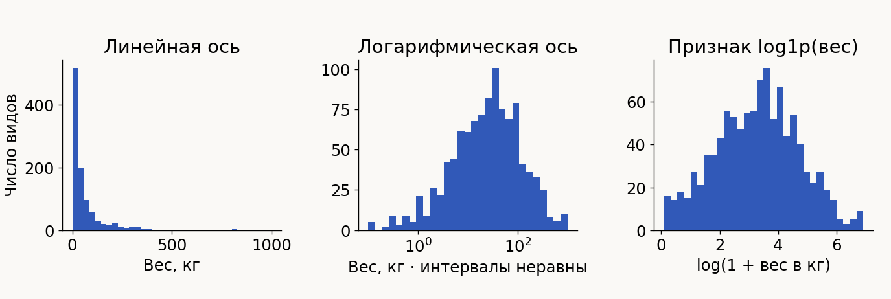

После логарифмирования хвосты, которые выглядели совершенно жутко, сжимаются в маленький кусочек. Это очень прикольный результат: на практике часто хочется работать с чем-то близким к нормальному, и тогда можно просто взять логарифм (или, наоборот, экспоненту).

Если данные после логарифма становятся похожи на нормальные — это как раз про **лог-нормальное распределение**. Лог-нормальное распределение и распределение Пуассона — штуки, которые в жизни встречаются очень часто. Все говорят, что часто встречается нормальное, но часто встречается и лог-нормальное.

Про бейзлайны подробно поговорим на следующей лекции.

## PCA

PCA используется в машинном обучении повсеместно, поэтому с ним нужно обязательно разобраться.

### Проклятие размерности

При каком-то количестве размерностей все расстояния становятся одинаковыми.

Пример: рекомендации музыки. У Яндекса собраны миллионы разных фичей. 10 дней назад вы проснулись в 7 утра и открыли Яндекс — фича. 5 дней назад уснули поздно и послушали грустную песенку — фича. Год назад купили билеты на концерт исполнителя — тоже фича. Если такое количество фичей никак не обрабатывать, в какой-то момент рекомендательная система придёт к тому, что все расстояния стали одинаковыми: «классно, супер, держи рандомную песню». Такого же не происходит? Ну ладно, иногда происходит.

Работать с большим количеством фичей можно двумя совершенно разными подходами:

- **отбор признаков** — выбрать часть существующих (для этого тоже есть методы, их посмотрим позже);
- **генерация новых признаков**, которые будут объяснять больше.

PCA относится ко второму: это метод, который позволяет уменьшить размерность данных и при этом сохранить максимум информации.

### Как работает PCA

В HTML-версии презентации есть анимации (в PDF они не работают).

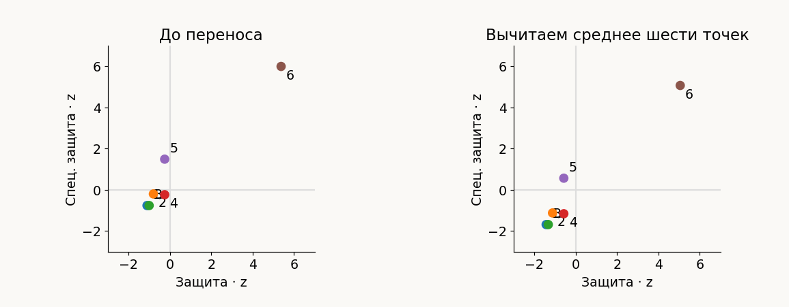

**Шаг 1.** Переносим центр данных в ноль.

**Шаг 2.** Через этот центр подбираем прямую, которая лучше всего описывает данные. Мы хотим сохранить как можно больше дисперсии: переносим данные на ту ось, вдоль которой они описываются лучше всего.

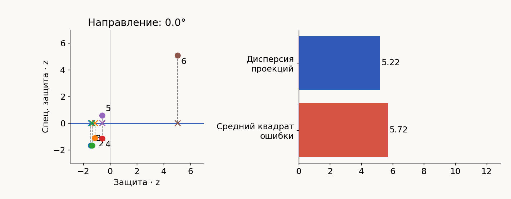

Если взять горизонтальную ось, сумма квадратов расстояний до неё очень большая. Мы хотим её минимизировать, поэтому начинаем прямую крутить.

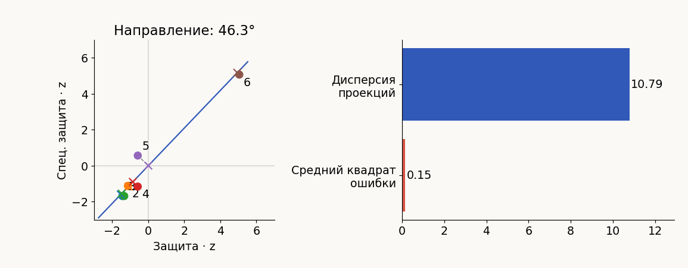

В идеальном положении дисперсия проекций становится большой, а средний квадрат ошибки — очень маленьким. Эта прямая сохраняет максимум дисперсии данных в той проекции, в которой это возможно. Мы почти не потеряли информации, зато описываем данные уже не двумя фичами, а одной.

**Шаг 3.** Каждой точке сопоставляем её проекцию на эту ось — это и есть новая координата.

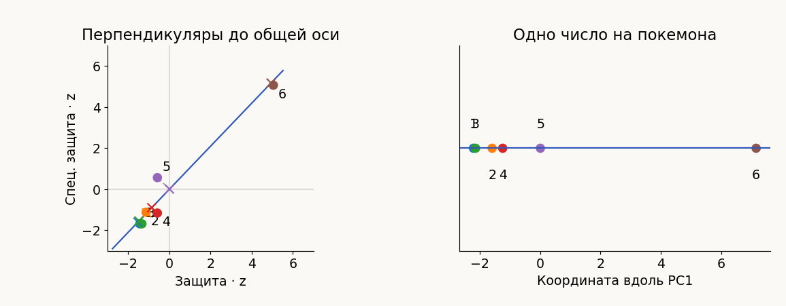

На примере показан переход из двух фичей в одну, но точно так же можно из ста фичей сделать десять. По сути мы делаем линейный поворот данных: исходные оси заменяются новыми. Новых осей может быть сколько угодно, но не больше, чем было исходно.

### Порядок компонент

Чтобы правильно сделать PCA, сначала выбирается та ось, которая объясняет больше всего дисперсии. Поэтому результат PCA не зависит от того, в каком порядке указаны признаки: первой всегда будет компонента с наибольшей долей объяснённой дисперсии, потом следующая лучшая, и так далее.

Если компонентам не удаётся объяснить много дисперсии, возможно, зависимость нелинейная: PCA ловит только линейные зависимости.

### Сколько компонент оставить

Обычно доли объяснённой дисперсии выглядят так: первые компоненты дают много, потом резкий спад, потом примерно одинаково мало. Но может быть и такой случай, когда пять компонент одинаково важны — тогда нужно оставлять все пять.

Чтобы решить, сколько оставить, у обученного PCA можно посмотреть **explained variance** — сколько даёт первая компонента, сколько вторая, третья, и сколько они дают кумулятивно. Те, что дают большой вклад, оставляем, а те, что похожи на мусор, отбрасываем.

### Интерпретация компонент

Любая компонента — это линейная комбинация всех исходных фичей:

$$
PC_1 = \alpha f_1 + \beta f_2 + \gamma f_3 + \dots
$$

У PCA-объекта можно запросить эти коэффициенты и посмотреть, из чего получилась каждая компонента.

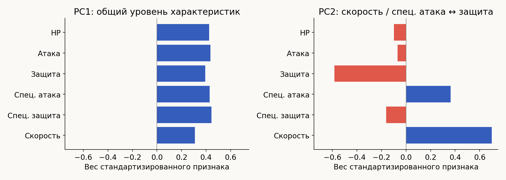

На покемонах первая компонента оказалась общим уровнем характеристик: все веса положительные. Так случилось — могло бы получиться и по-другому, нам просто повезло. Но по секрету: очень часто так везёт. Анализ данных часто приводит к тому, что в данных находится некоторая структура. А если структуры в данных нет, то и выяснить из них ничего не получится.

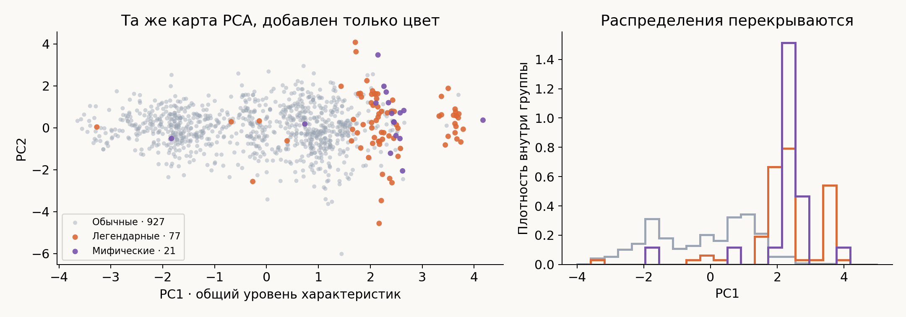

Чем больше PC1, тем чаще покемон легендарный. При этом статус в PCA не передавался: мы взяли характеристики, нашли ось с наименьшей суммой квадратов расстояний, отложили первую компоненту, потом вторую — и всё.

## t-SNE на рукописных цифрах

Датасет цифр: 1797 изображений 8×8. Каждый цвет на картах — объекты одного класса, метки алгоритму не передавались.

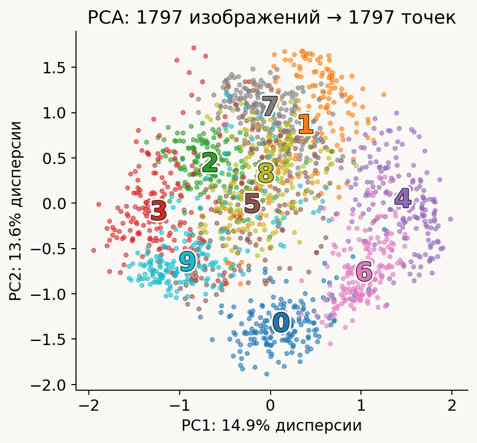

На PCA кластеризация есть, но не очень заметная: например, видно, что нолики и шестёрки соседствуют.

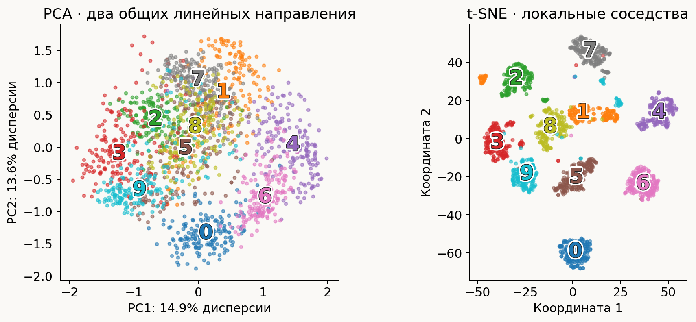

На t-SNE группы разделяются гораздо лучше. Вопрос: нолики должны быть похожи на шестёрки, а на карте расстояние от ноликов до шестёрок примерно такое же, как до других цифр. Это нормально?

Да: **расстояние между кластерами на t-SNE не играет никакой роли**.

> t-SNE — только метод визуализации: на него можно смотреть, но делать выводы по одной картинке t-SNE нельзя. t-SNE не сохраняет расстояния, поэтому нельзя сравнивать, насколько близки или далеки друг от друга два кластера.

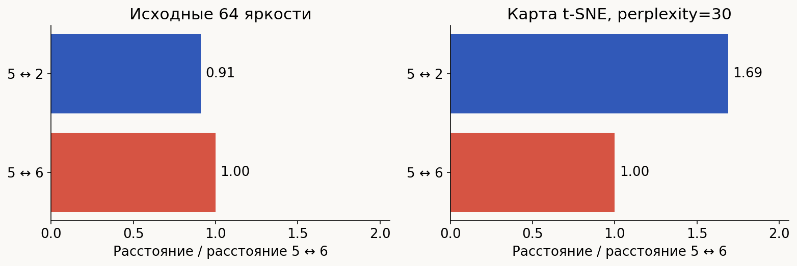

Например, двойки, пятёрки и восьмёрки на карте расположились друг относительно друга как-то «через одно место», но отделились друг от друга довольно хорошо.

Что можно гарантировать про кластер на t-SNE: объекты в нём принадлежат одной группе, и сходство объектов внутри кластера больше, чем их сходство с объектами, которые в кластер не входят. А вот сравнивать расстояния между кластерами нельзя.
