<a href="https://storage.yandexcloud.net/notakeith/net/lecture-02.pdf" class="btn rounded-full center flex">
    
    Презентация
</a>

## План

Двигаемся по уровням коммуникации снизу вверх, сегодня — физический уровень:

1. Развеиваем миф о том, чем определяется скорость.
2. Основные этапы передачи данных.
3. Физическое кодирование и немного физики сигнала.
4. Логическое кодирование.
5. СКС — как выглядит современная кабельная инфраструктура, которую можно увидеть в аппаратной или в коммуникационных шкафах здания.

## Миф: «положим провод получше — будет быстрее»

Один из самых частых технических мифов. Скорость коммуникации между двумя приложениями может ограничиваться на **любом** уровне, и провод — только один из них.

### Прикладной уровень

Одну и ту же задачу можно решить хорошо, а можно плохо. Процесс может стоять на паузе, ожидая ответа системы, в архитектуре может быть узкое место. Пользователю, по большому счёту, неинтересно, какой потенциал по скорости у его линии связи — ему важно то, что он видит на уровне приложения и транспорта.

### Транспортный уровень

Про него будет отдельная большая лекция. Типичная история: линия позволяет передавать, скажем, 150 Мбит/с, а по конкретному соединению больше 50 Мбит/с не выжимается, как ни старайся. У этого есть вполне инженерная причина — автоматическое регулирование скорости в протоколе TCP.

### Сетевой уровень

Сильно влияет топология. Интернет — сложный связанный граф, и между двумя точками могут быть разные маршруты. Возникают неоптимальные и перегруженные маршруты, из-за которых скорость падает. Эти эффекты могут быть плавающими: зависеть от времени суток и других факторов.

### Канальный уровень

Какой бы прекрасный провод вы ни притащили, если у вас 10-мегабитный сетевой адаптер — больше 10 Мбит/с не будет.

### Физический уровень

Тоже сильное ограничение на возможную скорость. С ним можно играть, и инженеры постоянно ищут пути ускорения, но физика есть физика.

> [!IMPORTANT]
> На качество коммуникации влияет вся цепочка целиком. Это нужно учитывать при разработке архитектуры и управлении инфраструктурой. Например, при разнесении приложения по региональным площадкам легко выставить нереальные требования к скорости синхронизации, которые линии связи просто не обеспечат.

## Проблемы физического уровня

На физическом уровне на передачу влияют расстояние, корректная реализация кабельной системы, физические условия, в которых передаётся сигнал, и сами приёмо-передающие устройства.

**Электромагнитные помехи.** Если сигнал передаётся электрически, на линию наводятся помехи. Источники — трансформаторы, блоки питания, которые преобразуют переменный ток в постоянный, газоразрядные лампы (сейчас применяются всё реже). Защите от этого в конструктиве не всегда уделяется достаточно внимания.

**Радио.** Здесь всё совсем плохо: радио — тяжёлая среда для коммуникаций, хотя пользуемся мы им постоянно. Многолучевое распространение, волновые эффекты, интерференция, экранирование и так далее.

**Конструктивные помехи.** Особенно ярко проявляются на разъёмах внутри коммуникационного оборудования: даже если сам кабель защищён, в месте соединения возникают специфические контактные эффекты.

**Затухание.** Понятная из физики история: сигнал постепенно теряет энергию в среде. Отсюда чаще всего и берутся ограничения на длину физического сегмента.

> [!NOTE]
> Для Ethernet по витой паре категории 5e спецификация — 100 метров на физический сегмент без повторителя. После 100 метров сигнал, характерный для этого стандарта, просто перестаёт уверенно распознаваться.

## Этапы передачи данных

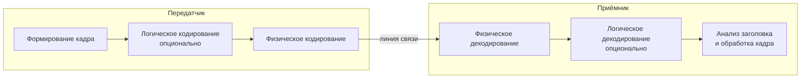
```mermaid
flowchart LR
    subgraph Передатчик
        A[Формирование кадра] --> B[Логическое кодирование<br/>опционально]
        B --> C[Физическое кодирование]
    end
    C -- линия связи --> D
    subgraph Приёмник
        D[Физическое декодирование] --> E[Логическое декодирование<br/>опционально]
        E --> F[Анализ заголовка<br/>и обработка кадра]
    end
```

1. **Формирование кадра.** Как в модели OSI: в буфере памяти лежит готовый к передаче набор бит — кадр с заголовком, данными и трейлером.
2. **Логическое кодирование.** Опциональный этап — не в смысле «хочу делаю, хочу нет», а потому что одни стандарты его требуют, а другие нет. Исходный набор бит по определённым правилам преобразуется в другой.
3. **Физическое кодирование.** Передатчик формирует сигнал нужного вида и вносит возмущение в физическую среду.

На приёмнике всё в обратном порядке: снимаем сигнал, физически декодируем, при необходимости логически декодируем, затем анализируем заголовок и обрабатываем кадр. Обработка идёт либо через прерывание, и считает CPU с драйвером, либо, если у сетевой карты есть свой процессор, — на ней самой.

## Аналоговый или цифровой сигнал?

Рисуем график: по оси абсцисс время, по оси ординат напряжение. Подключаем осциллограф и видим гладкую кривую. Аналоговый это сигнал или цифровой?

Интуитивно хочется сказать «аналоговый», раз он гладкий. Но правильный ответ: **зависит от того, как мы будем этот сигнал интерпретировать**.

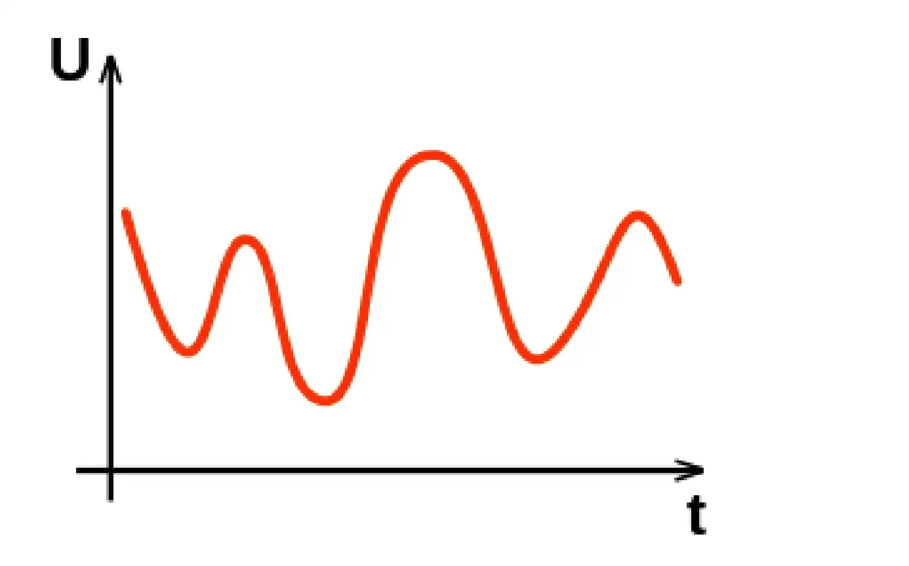

- Если снимаем сигнал непрерывно — он аналоговый.
- Если заранее договорились, что вот такой уровень — условно единица, а вот такой — ноль, и измеряем раз в определённый интервал, — он превращается в цифровой.

То есть аналоговость или цифровость определяет не форма сигнала, а принцип представления в нём информации.

### Почему цифра, если аналог информативнее

Аналоговый сигнал потенциально несёт больше информации: при цифровой передаче данные оцифровываются, а потом обратно превращаются в исходные, и неизбежны потери. Отсюда любовь аудиофилов к виниловым пластинкам.

Но у цифры два важных преимущества:

1. **Можно восстанавливать данные.** В аналоге, если что-то потеряли, остаётся только поплакать: поцарапали пластинку — она будет хрипеть, и ничего не сделаешь. В цифре алгоритмы могут что-то досчитать и восстановить.
2. **Скорость передачи цифровых данных может быть выше и обычно выше.** Аналог ограничен средой очень жёстко. Цифра тоже ограничена, но там ограничения свободнее — и дальше разбираемся, какие.

## Физическое кодирование: первые примеры

Самый простой вариант — **NRZ**: есть ток — единица, нет тока — ноль. Применяется, например, в COM-портах (RS-232). Интерфейс старый, но живой до сих пор: через него управляют платами, перепрошивают контроллеры, подключаются к коммуникационному оборудованию.

Вариант хитрее — различать за один такт не два уровня сигнала, а больше. Один раз измерили сигнал и получили сразу 2 бита. Это тоже абсолютно живая история: **PAM-5** в гигабитном Ethernet, где за один такт передаётся 2 бита.

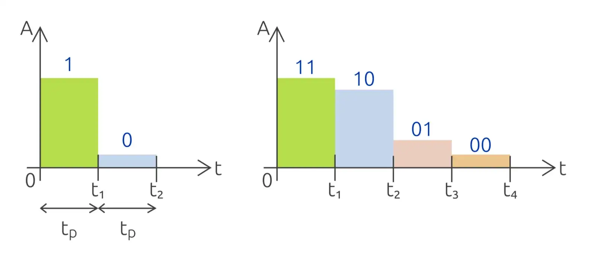

## Как увеличить скорость передачи

Вооружившись инженерным здравым смыслом, что можно сделать?

- **Увеличить частоту** — сократить период такта. Сокращаем такт в два раза, и данные передаются в два раза быстрее. Именно так поступили при переходе с 10 на 100 Мбит/с.
- **Усложнить сигнал** — хитрее кодировать и передавать больше бит за один такт.

Ограничивают нас следующие величины:

- $F$ — **полоса пропускания** линии связи: диапазон частот сигнала, который проходит сквозь линию без существенного ослабления;
- $S$ — мощность сигнала;
- $N$ — мощность шума: любая линия зашумлена паразитными и наведёнными сигналами;
- $M$ — количество дискретных уровней сигнала, то есть та самая «сложность» сигнала.

Связь этих величин с пропускной способностью $C$ задают формулы Найквиста и Шеннона:

$$
C = 2F \log_2 M \qquad\qquad C = F \log_2\left(1 + \frac{S}{N}\right)
$$

Отсюда рецепт: увеличивать полосу пропускания, усложнять сигнал, увеличивать мощность сигнала, уменьшать шум. Всё абсолютно инженерно. Теперь смотрим, где мы упираемся.

**Полоса пропускания.** Очень хорошая полоса пропускания у платины — в сравнении с медью и алюминием замечательная. Но трудно представить платиновые провода: их придётся охранять.

**Шум.** Можно положить линию в ванну с жидким азотом — сопротивления практически не будет, шума тоже. Прекрасные условия, но конструктивно трудно представить, что по всей Москве под землёй лежит азот. Можно бороться с шумами сложными балансными схемами, но это требует денег.

**Мощность сигнала.** Когда шумы безразличны, их просто забивают мощностью. Но с ростом мощности растут габариты и энергопотребление: придётся носить со смартфоном чемодан с батареей. К тому же есть ограничения безопасности жизнедеятельности на мощность электромагнитного излучения, безопасного для человека.

**Сложность сигнала.** Почему нельзя бесконечно увеличивать число уровней: 4, 8, 16, 32…? Мы упираемся в шум — уровни становятся неразличимы. И, как ни странно, упираемся в полосу пропускания. Чтобы понять почему, нужен Фурье.

## Ряд Фурье и гармоники

Любую периодическую функцию можно разложить в ряд Фурье. Возникает вопрос: сигнал ведь не периодический, почему это работает? Потому что последовательность передаваемых данных можно считать повторяющейся и раскладывать так же.

> [!NOTE]
> Картинка к этой части взята из учебника Олиферов — она блестяще показывает суть.

Передатчик честно формирует сигнал с прямоугольными фронтами и отправляет его в линию связи. Этот сигнал раскладывается на отдельные члены ряда — **гармоники**: синусы и косинусы с определённой частотой, фазой и амплитудой. Чем больше индекс гармоники, тем выше её частота. Сложив их все, получаем исходный прямоугольный сигнал.

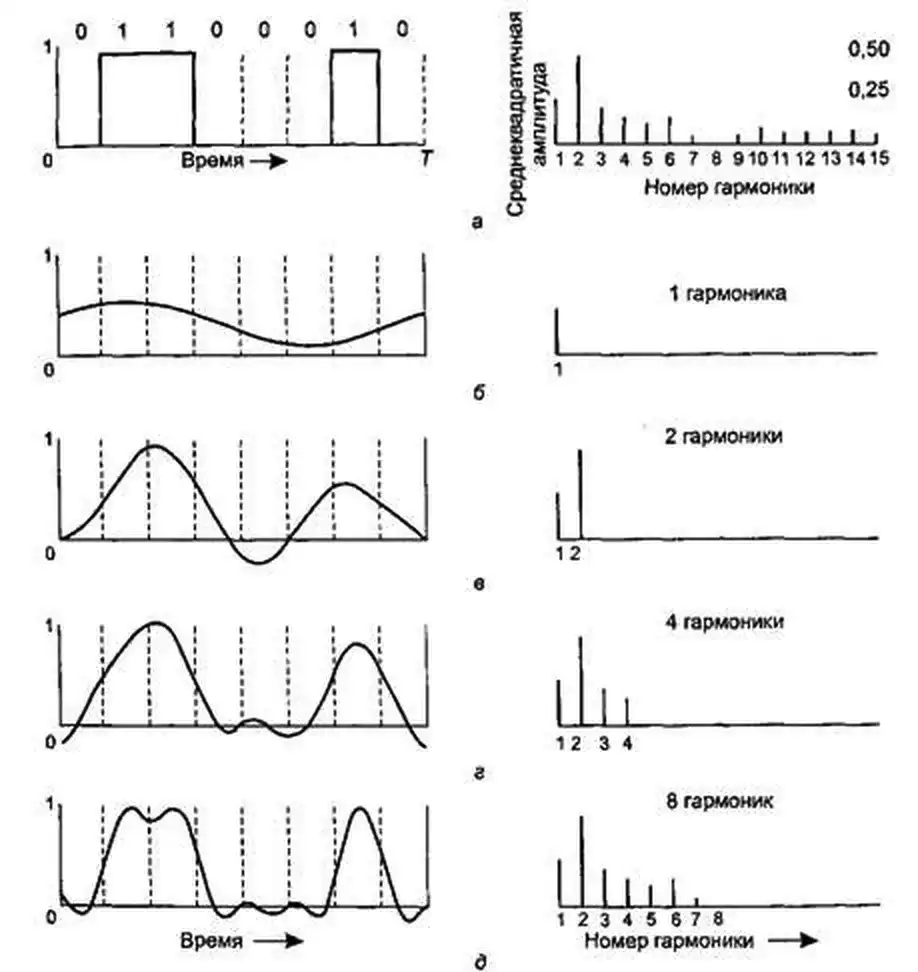

Будем передавать гармоники по одной и смотреть, что приходит на приёмник:

| Сколько гармоник | Что видно на приёмнике |
|---|---|
| 1 | Нельзя уверенно сказать, где единица, а где ноль |
| 2 | Стало лучше, но уверенности нет |
| 4 | Уже можно узнать исходную последовательность |
| 8 | Всё хорошо: однозначно понятно, где единица, а где ноль |

При этом сигнал на приёмнике всё ещё не такой, как на передатчике: не такой красивый, не прямоугольный. Но нам всё равно — единица понятна и ноль понятен.

Отсюда естественный вопрос: а надо ли вообще передавать все гармоники? Нет. Пусть всё, что выше нужного количества, погасит линия связи. Главное, чтобы прошло необходимое число гармоник.

Ещё два важных соображения:

- Гармоники с младшими индексами вносят основной вклад в **энергию** сигнала — определяют, насколько он по амплитуде выделяется.
- Чем выше частота гармоники, тем сильнее она влияет на **нюансы формы**: крутизну фронтов и прочее.

Поэтому чем навороченнее сигнал, тем больше в нём значимых высокочастотных гармоник. Если различать не два уровня, а четыре, восьми гармоник уже не хватит — нужно 12, 16, чтобы начать видеть подробности уровней.

> [!IMPORTANT]
> Два тезиса, которые нужно вынести:
> 1. Чем сложнее сигнал, тем больше в нём частотных гармоник.
> 2. На приёмнике не обязательно видеть тот же сигнал, который ушёл с передатчика. Пусть он немного испортится в линии — важно, чтобы физическое кодирование позволяло однозначно понять, где 0, а где 1.

## Полоса пропускания

Как её измеряют: берём линию связи, надеваем белый халат, берём осциллограф. Закачиваем в линию сигнал определённой частоты и смотрим, что получилось на выходе. Строим график:

- по оси абсцисс — частота сигнала;
- по оси ординат — отношение мощности выходного сигнала к мощности входного. Больше единицы оно быть не может, а жаль.

Обычно на уровне отношения 0,5 делают отсечку. Диапазон частот между отсечками и называют **полосой пропускания** линии связи. Сигнал внутри полосы пройдёт сквозь линию, снаружи — нет.

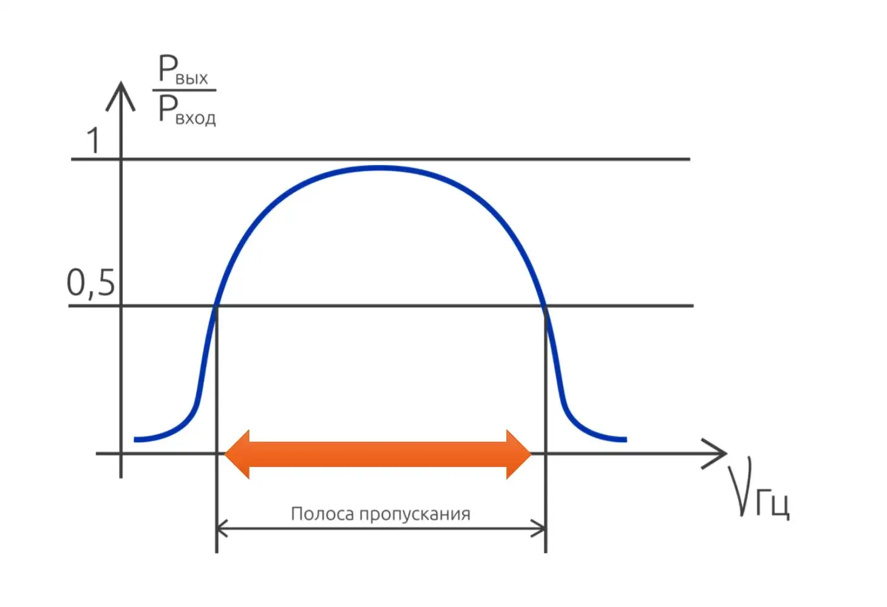

Хорошая бытовая аналогия — цветное стекло. Видимый диапазон света оно пропускает, а то, что справа и слева, поглощает: например, ультрафиолет не проходит. Любая линия связи работает как такой частотный фильтр. Если «кричать» в линию на частотах вне её полосы, нас не услышат.

### История про весну и ADSL

На третьем курсе, работая в технической поддержке, в прекрасный весенний день в конце марта: птички поют, всё хорошо, а дома интернет то есть, то нет. Описал ситуацию, инженер проверил: большие потери на канале. «Сейчас понизим скорость». Понизил — и всё заработало. На вопрос, что случилось, ответ был: «Молодой ещё. Весна».

Интернет был по ADSL — архаичной технологии последней мили, когда цифровой сигнал передаётся по телефонной линии.

Что происходит весной? Тает снег. Если бы снег был просто водой, было бы всё равно. Но у нас снег с солью, реагентами и прочим, и весь этот солёный компот течёт в кабельные колодцы и заливает муфты. Характеристики линии портятся: **была широкая полоса пропускания, а стала узкая**.

Сигнал ADSL-модемов строился в расчёте на широкую полосу. Узкая полоса выбивала часть гармоник, сигнал портился на приёмнике: что-то проскакивало, что-то нет.

Когда инженер понизил скорость, понизилась частота сигнала и сузился его частотный спектр. Все необходимые гармоники стали укладываться в новую узкую полосу. Линия осталась частотным фильтром, но перестала портить сигнал драматично — и всё заработало.

> [!TIP]
> Этот пример показывает связь полосы пропускания с реальной скоростью передачи данных и объясняет, почему сигнал нельзя усложнять бесконечно.

### Почему нельзя бесконечно усложнять сигнал

Физический код, различающий, условно, тысячи уровней, придумать можно. Можно даже сделать передатчик, который будет такой сигнал формировать. Но понадобится линия связи с огромной полосой пропускания, чтобы пропустить все высокочастотные гармоники.

Технически это возможно, но **экономически не оправдано**. Эксперименты в этой области ведутся, однако ограничения преодолеваются деньгами. Инженерия балансирует с запросами рынка: если появится массовый запрос, появится массовое производство, упадёт цена — и технология придёт.

## Физическое кодирование подробнее

### NRZ

Есть сигнал — единица, нет сигнала — ноль. Очень простой код, но у него два недостатка.

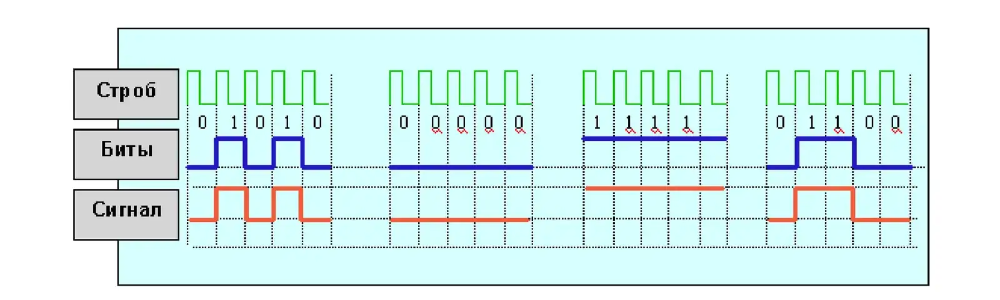

**Потеря синхронизации.** Когда единицы и нули чередуются, всё идеально. Но на длинной последовательности одинаковых символов приёмник теряет такт: непонятно, сколько единиц подряд пришло. Поэтому при NRZ всегда нужны минимум две линии: одна сигнальная и одна линия синхронизации, по которой идёт 1, 0, 1, 0… — по ней синхронизируется приёмник.

> [!NOTE]
> Здесь речь о синхронизации тактов, а не часов. Часы синхронизируются на прикладном уровне, через NTP.

**Широкий спектр.** Если разгонять частоту этого кода, у него очень сильно расширяется требуемая полоса пропускания. Поэтому потолок скоростей COM-портов невелик, и применяются они для служебных нужд: залить прошивку на контроллер, передать терминальные команды роутеру. Гонять по ним данные в больших объёмах не выйдет.

### Манчестерский код

Код умный и до сих пор применяется, в том числе в Ethernet.

- Единица кодируется перепадом с верхнего уровня на нижний.
- Ноль — перепадом с нижнего уровня на верхний.

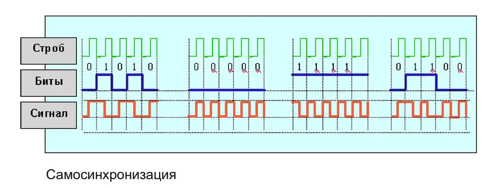

На длинных последовательностях одинаковых символов частота сигнала удваивается. Приёмник контролирует частоту сигнала и направление перепадов, поэтому код **самосинхронизирующийся**: отдельная линия синхронизации не нужна.

| | NRZ | Манчестер |
|---|---|---|
| Синхронизация | Нужна отдельная линия | Код синхронизирует сам себя |
| Линий для передачи в обе стороны | 3 (туда, обратно и синхронизация) | 2 (туда и обратно) |

### Гигабитный Ethernet

Более сложный сигнал с несколькими уровнями — ровно то, о чём рассуждали выше: за один такт передаём больше данных.

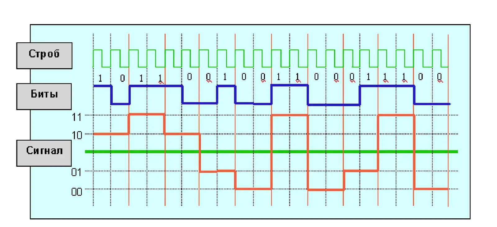

По тому, как меняется физический код при наращивании скорости передачи, хорошо видно два пути: увеличение частоты и усложнение сигнала. Радиоинженеры, например в Wi-Fi, ещё и страшно любят сложное кодирование и уплотнение канала.

## Логическое кодирование

### 4B/5B

Есть таблица: берём исходные 4 бита и заменяем их на 5 бит по этой таблице.

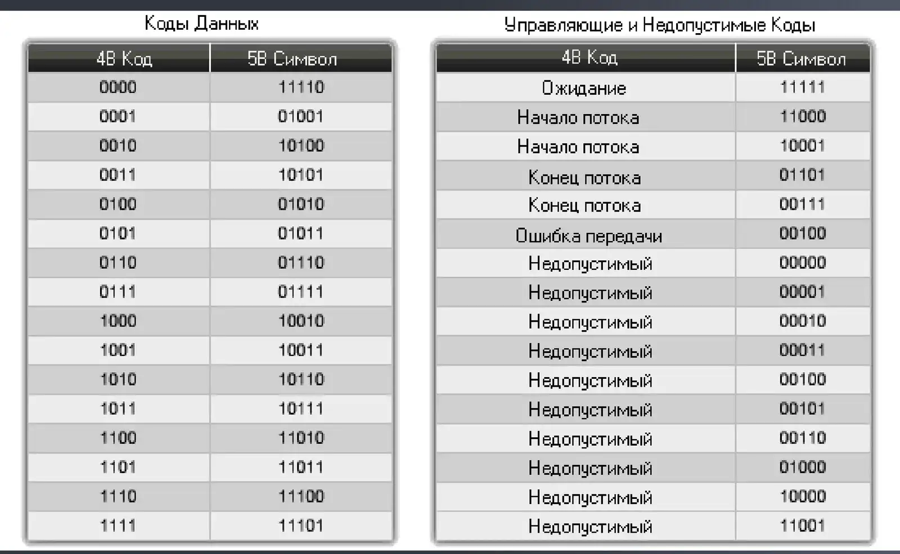

Кажется странным: мы хотим увеличить скорость, а на каждые 4 бита передаём лишний пятый. В гигабитном Ethernet применяется ещё более длинный вариант — 8B/10B.

Зачем это нужно, видно на истории перехода к 100 Мбит/с. Манчестерский код использовался в 10-мегабитном Ethernet. Чтобы особо не менять аппаратуру и провода, решили передавать в 10 раз быстрее. Но то самое свойство — удвоение частоты на длинных последовательностях одинаковых символов — на 100 Мбит/с стало драматической проблемой: линия как частотный фильтр начинает выбивать высокочастотные гармоники.

Решение: сохранить увеличенную в 10 раз частоту сигнала, но **специально готовить данные** так, чтобы длинных последовательностей одинаковых символов не было. Именно это и делает таблица 4B/5B. Кроме того, в таблице остаются служебные комбинации.

### Помехоустойчивые коды

Есть ещё более хитрые варианты — помехоустойчивые коды, они неплохо описаны в учебнике Олиферов. Такой код позволяет на приёмнике не просто обнаружить ошибку, а восстановить данные.

> [!IMPORTANT]
> Логическое кодирование нужно, чтобы улучшить свойства передачи на существующем оборудовании.

## Итог: пути разгона канала

1. **Увеличивать частоту** — но не бесконечно: упираемся в полосу пропускания.
2. **Усложнять сигнал** — хороший способ, но тоже не бесконечно: упираемся в шум и полосу пропускания.
3. **Делать линии лучше и дороже.** Так и делают: каждое следующее поколение линий связи имеет всё большую полосу пропускания ровно для того, чтобы работать на более высоких частотах с более сложными сигналами.
4. **Использовать логическое кодирование.**
5. **Мультиплексировать канал.**

### Мультиплексирование

Параллельная передача: данные разбиваются и передаются параллельно, а на приёмнике выполняется демультиплексирование — части собираются обратно в общее сообщение.

Мультиплексирование применяется в старших версиях Wi-Fi и очень любимо в оптике. В одну линию связи закачиваются сигналы на разных частотах: в одном оптическом волокне одновременно присутствует множество сигналов. Благодаря спектральному анализу сложные приёмники отделяют их друг от друга.

Когда в новостях оператор трансатлантической связи увеличил скорость по своим линиям, не перекладывая провода, вариантов два:

- задействовал ещё линии, которые были незадействованы;
- на той же полосе пропускания поставил оборудование с более эффективным кодированием или мультиплексированием.

> [!IMPORTANT]
> Рассматривать физические провода отдельно бессмысленно. Скорость определяется сочетанием линии связи, физического кода приёмо-передающего устройства и, возможно, логического кода. На одних и тех же проводах с одним кодом можно передавать один гигабит в секунду, а с другим — несколько.

## Пассивное оборудование и СКС

**Пассивное оборудование** — всё, где нет электричества.

**СКС** (структурированная кабельная система) — устойчивый термин, описывающий инженерный подход и набор стандартов для построения **универсальной** кабельной системы здания, через которую любые информационные сервисы доставляются своим клиентам.

Ключевое слово — универсальная: одна кабельная инфраструктура для компьютерной сети, телефонии, видеонаблюдения, систем контроля доступа и так далее.

### Зачем это нужно

Исторически строили разные сети: отдельно компьютерную, отдельно телефонную, отдельно для видеонаблюдения. Постепенно стало понятно:

- **одной командой проще управлять** всей системой;
- компьютерные сети по полосе пропускания превзошли аналоговые, и по ним уже можно пропускать аналоговые сервисы;
- большинство сервисов стало IP: телефония цифровая, видеонаблюдение по IP, даже СКУД.

Всё гоняется по единой слаботочной системе. Плюс удобная модифицируемость и простая эксплуатация: нужно подключить в розетку компьютер — патч-кордом подключаешь её к коммутатору, нужен телефон — к телефонной станции. Никаких людей в синих халатах с паяльником, всё делается патч-кордами.

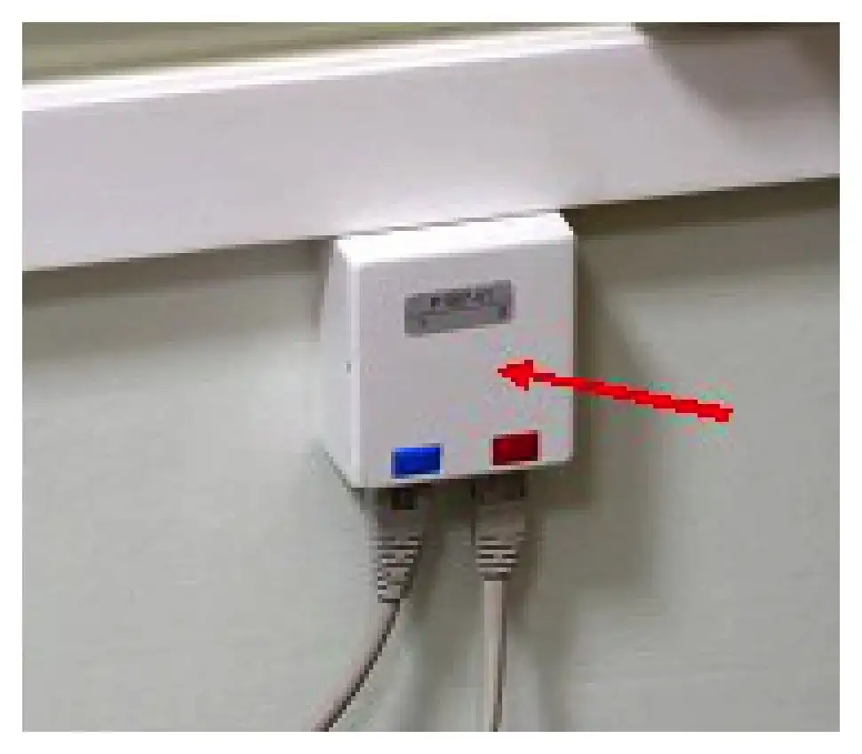

### Стандарты

Стандартов много. Американские стандарты TIA/EIA-568 и 569 используются повсеместно: типы кабелей, типы разъёмов, технические характеристики линий связи, правила монтажа. Есть практически аналогичный стандарт ISO. Есть также стандарт на проектирование и эксплуатацию.

Что определяют стандарты:

1. **Характеристики линий связи**: полосу пропускания, требования по затуханию, по перекрёстным наводкам на стандартных разъёмах. Если линия соответствует стандарту, эти значения известны. Это даёт инженеру, проектирующему приёмо-передающее устройство, уверенность, что его физический сигнал пройдёт по линии.
2. **Правила монтажа, эксплуатации, тестирования и проектирования.**

В стандартах бывают странные на первый взгляд вещи:

- регламентируется радиус изгиба кабеля;
- описаны кабельные полки и сколько кабелей определённого стандарта туда можно положить;
- в месте соединения с коннектором расплетать пары можно не больше чем на полтора сантиметра.

За всем этим стоит желание сохранить физическую целостность линии: чтобы изоляция была в порядке, не было наводок и так далее.

### Эксплуатация

Что такое эксплуатация проводов? Если речь об инфраструктуре здания — прежде всего документирование. Без документации в кабельной системе приходится разбираться, прозванивая кабели.

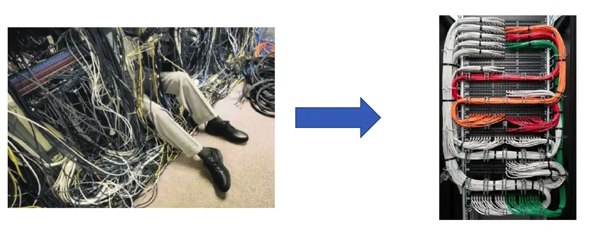

Для глобальных линий есть ещё эксплуатационное тестирование. Магистральная линия между крупными провайдерами или к точке обмена трафиком может умереть двумя путями:

1. Приехал экскаватор и перерубил её. Такое бывает — особенно при плохой документации, когда в городском хозяйстве нет информации, где что закопано.
2. Более распространённый вариант: линия **деградирует постепенно**. Портится какое-то соединение, потихоньку, пока не дойдёт до критического состояния и не начнутся проблемы с передачей.

Обнаружить деградацию можно только периодическим тестированием: по регламенту, например раз в месяц, приходят инженеры, выключают оборудование и проверяют линию.

### Подсистемы СКС

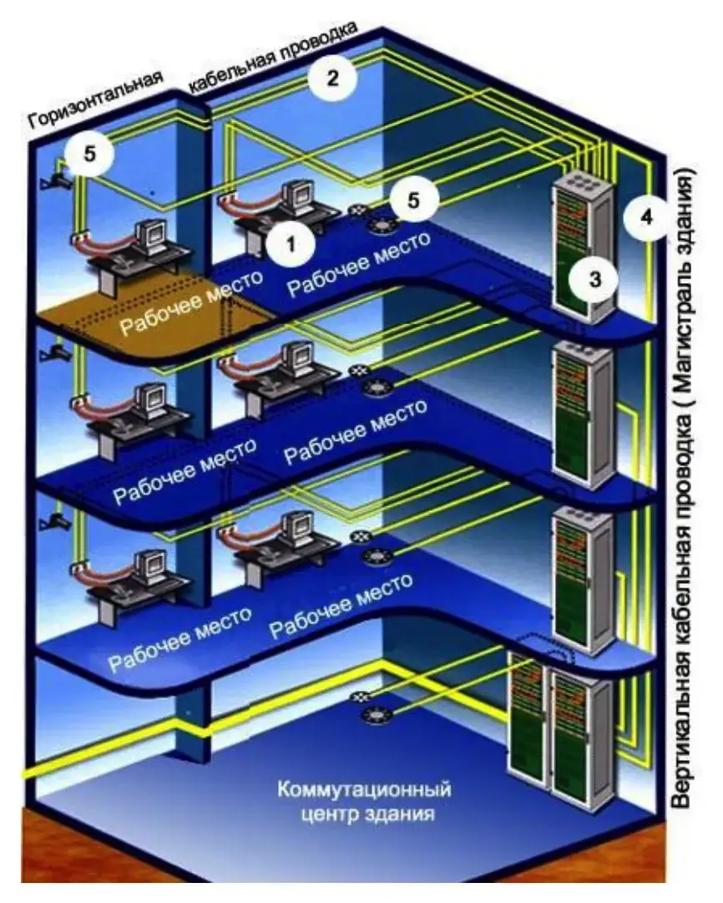

- **Горизонтальная** — от рабочего места до коммуникационного узла этажа (коммуникационного шкафа). Это участок между абонентом и первым коммуникационным узлом.
- **Вертикальная** — между этажами.
- **Магистральная** — между зданиями, в пределах комплекса.

### Элементы

Передающие сигнал: кабели, разъёмы, соединительное оборудование (патч-панели, кроссы), сплайсы.

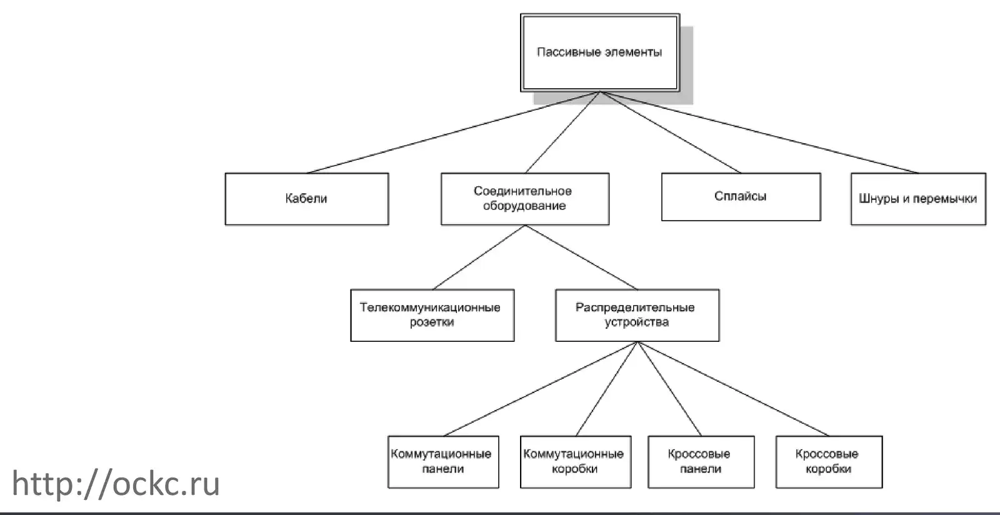

Инфраструктурные: сами данные не передают, но обеспечивают жизнь кабельной системы. Кабельные лотки, фальшполы и фальшпотолки, 19-дюймовые шкафы и стойки. 19 дюймов — расстояние между стойками, стандарт монтажа оборудования.

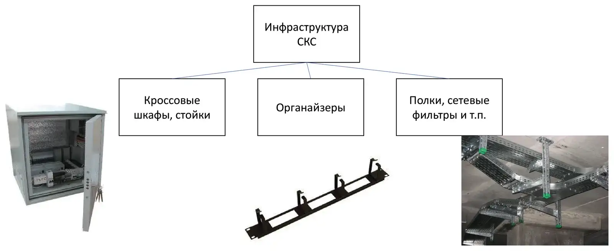

## Типы кабелей

- **Витая пара.**
- **Коаксиальный кабель.** Сейчас у него, как ни странно, ренессанс. Обычный антенный кабель — пример.
- **Оптика** всевозможная.

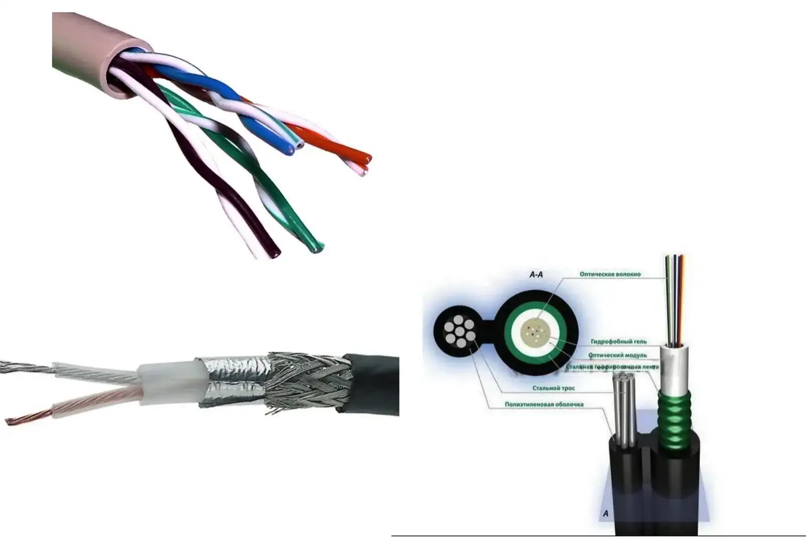

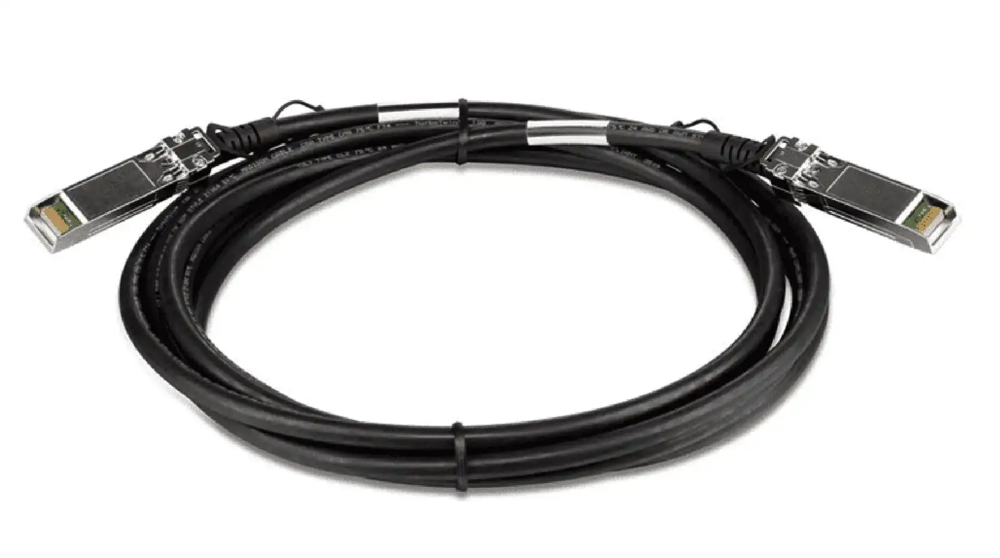

### Витая пара

Конструктивных вариантов много: незащищённая UTP (типична для патч-кордов), FTP, STP, S/FTP и другие. Но что важно, независимо от конструктива: **у любого кабеля есть категория**. Категории отличаются полосой пропускания.

- Хочешь передавать гигабит — изволь минимум категорию 5e с полосой 125 МГц.
- Хочешь выйти на 10 гигабит — нужна более высокая категория. На категории 6 обратите внимание на длину: 10-гигабитный Ethernet-сигнал после примерно 50 метров не пройдёт из-за затухания. Но это не значит, что по такой линии не пройдёт какой-то другой физический код.

Как развивались категории: с ростом категории кабели становятся толще и тяжелее. Инженеры боролись с перекрёстными помехами, добавляя изоляцию между парами. В седьмой категории каждая пара в фольге и всё вместе в общем экране — защита и от внешних помех. Меняется и химия материалов, чтобы полоса пропускания была больше. То есть инженеры работают в двух направлениях: изоляция и химия проводников.

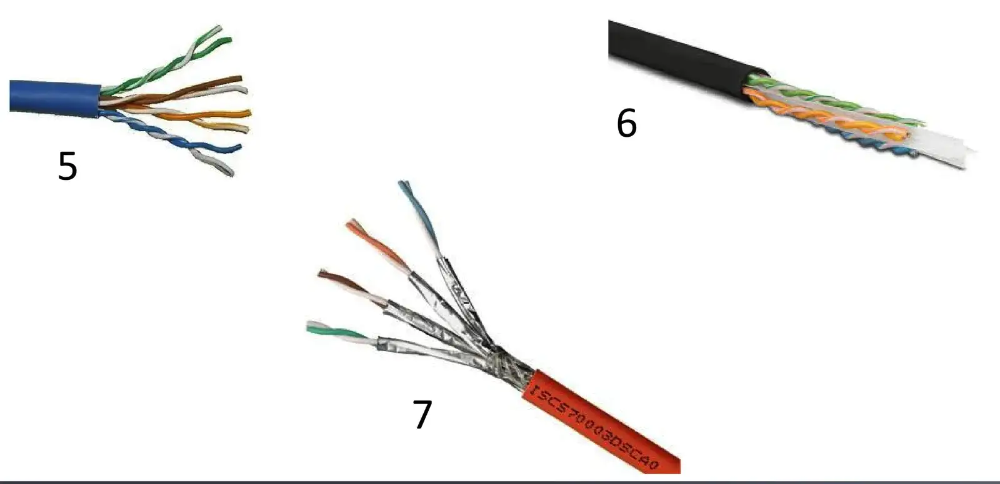

### Маркировка кабеля

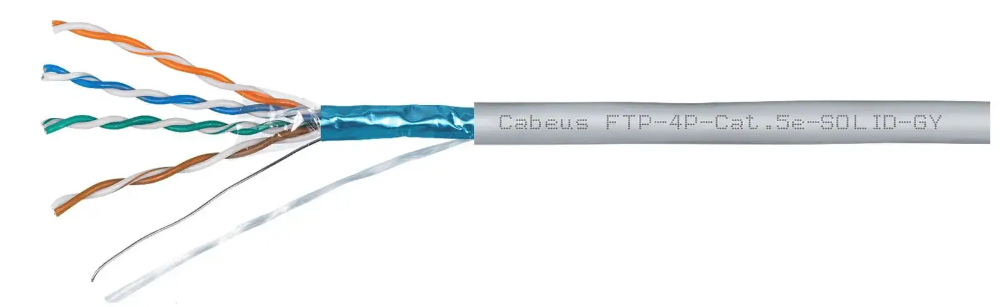

| Маркировка | Что означает |
|---|---|
| Cat 5e | Категория — для нас самое главное: сразу понятно, какую скорость можно получить |
| Solid | Жила монолитная, не многопроволочная |
| FTP | Есть фольгированный экран |
| 4P | 4 пары (бывает 2, бывает больше) |
| Outdoor | Кабель для внешней прокладки: изоляция толще |
| 23 AWG | Диаметр проводника: чем число больше, тем диаметр меньше |

Внутри некоторых outdoor-кабелей бывает наполнитель вроде парафина. Он нужен, чтобы при перепадах температуры, например при замерзании, не лопалась изоляция.

### Оптика

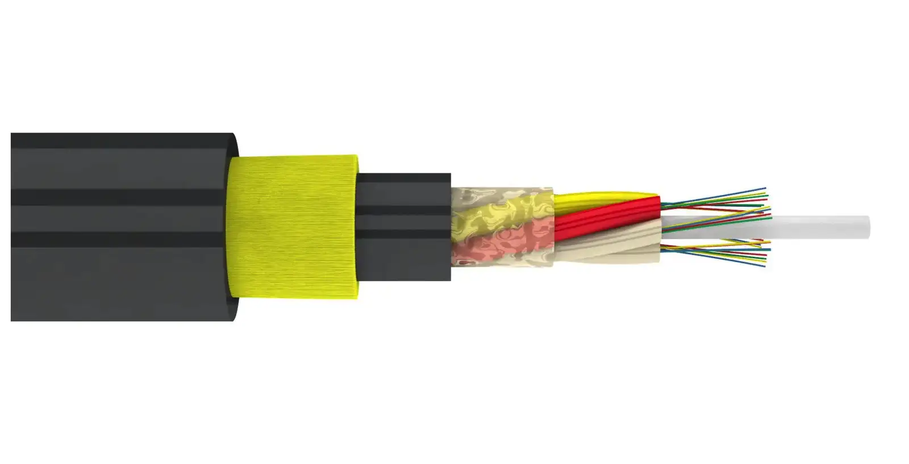

**Многомодовая.** Диаметр сердцевины большой, сигнал идёт с внутренним отражением. На отражениях происходит рассеивание и затухание.

**Одномодовая.** Диаметр световода сравним с длиной волны, работают уже волновые эффекты. Сигнал идёт практически без внутреннего отражения и только поглощается средой. Поэтому связь по одномоду быстрее и дальше.

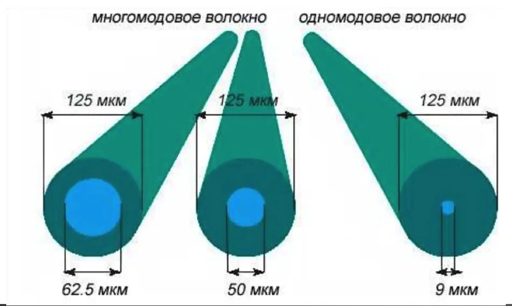

Многомодовую оптику применяют на коротких расстояниях — пара километров. Одномод — магистрали.

Почему до сих пор не всё делают на одномоде? Мешают деньги. Когда это целесообразно для задачи — вкладываются. А если нужно связать соседние здания, зачем тратить деньги.

## Оборудование

**Сварка оптики.** Мужчины в халатах, сидящие с проводами в фургоне у колодца, варят оптику: скрутить её синей изолентой не получится. Волокна укладываются в сварочный аппарат, соосность юстируется автоматически, после сварки идёт тестирование качества соединения. Для ровного скола волокна есть специальный инструмент — ножницами так не сделаешь.

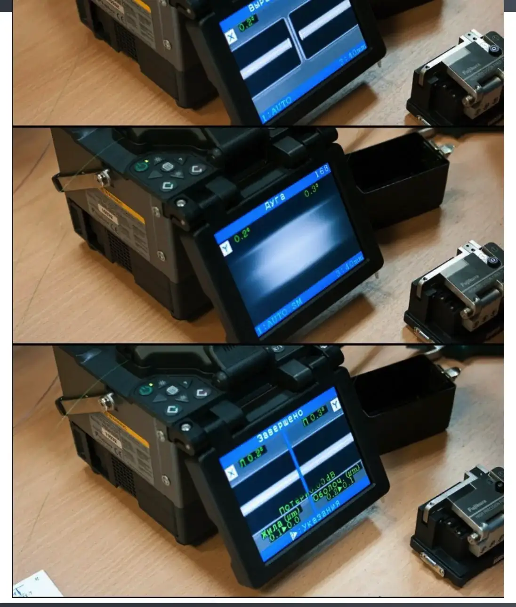

**Тестер.** Не просто прозвонка с лампочками. Им можно измерить характеристики линии, проверить полосу пропускания, узнать расстояние до обрыва. Лампочный прозвонщик скажет только, что где-то обрыв.

**Патч-панель.** Место, куда сходятся провода со всех рабочих мест. Сама по себе ничего не делает — это удобный интерфейс для модификации. Нужно подключить компьютер — берёшь патч-корд и соединяешь порт с коммутатором. Нужен телефон — соединяешь с телефонной станцией.

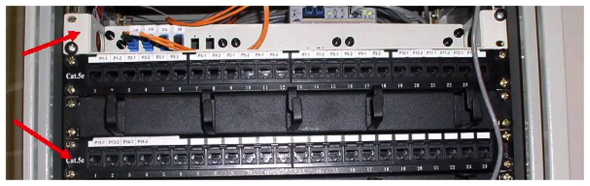

> [!WARNING]
> Обратите внимание на патч-корды. Можно заложить в стены кабель седьмой категории, а патч-корды купить на рынке за копейки. Получится 10-полосное шоссе со съездом на просёлок.

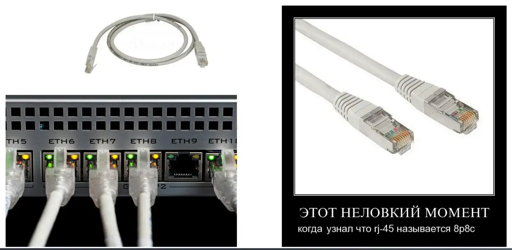

**Оптический сплайс.** Место, защищающее сварку оптики. Сваренные волокна закрываются гильзами — их всегда забываешь надеть заранее, потом плюёшься, режешь заново и варишь снова.

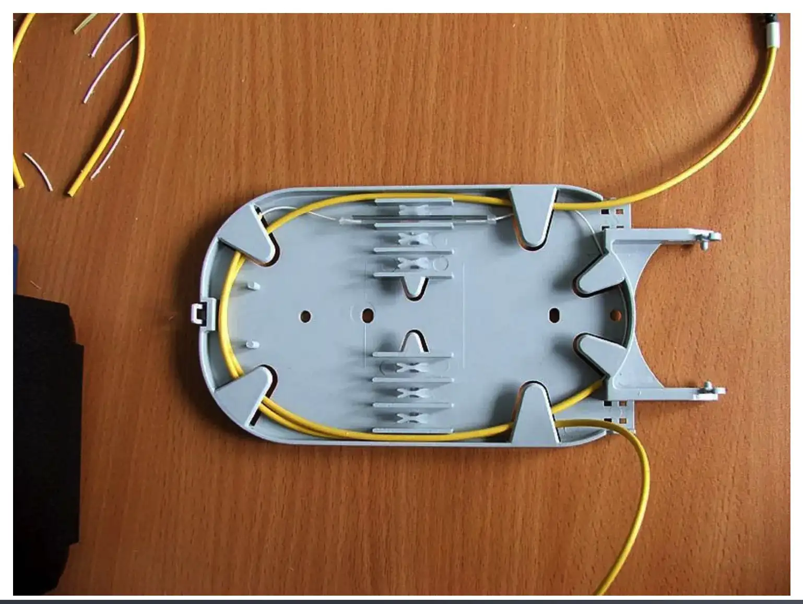

**Муфта.** Сплайсы укладываются в неё. Хорошая, крепкая, защищённая вещь — её можно бить лопатой.

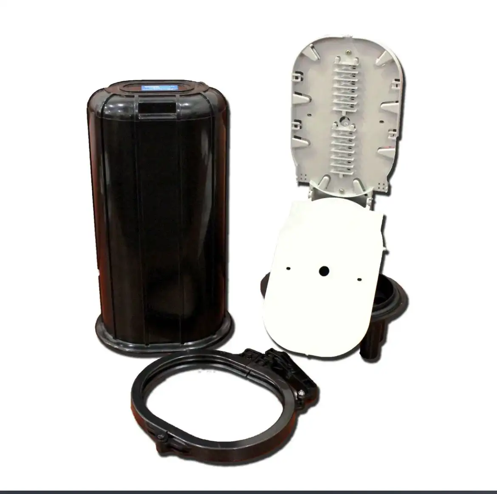

**Оптический кросс.** Тот же сплайс, но для внутреннего монтажа: чтобы не бросать всё на чердаке, а аккуратно распаять оптические линии на стене и подключаться к ним. Так в принципе и должно быть — красиво и чисто.

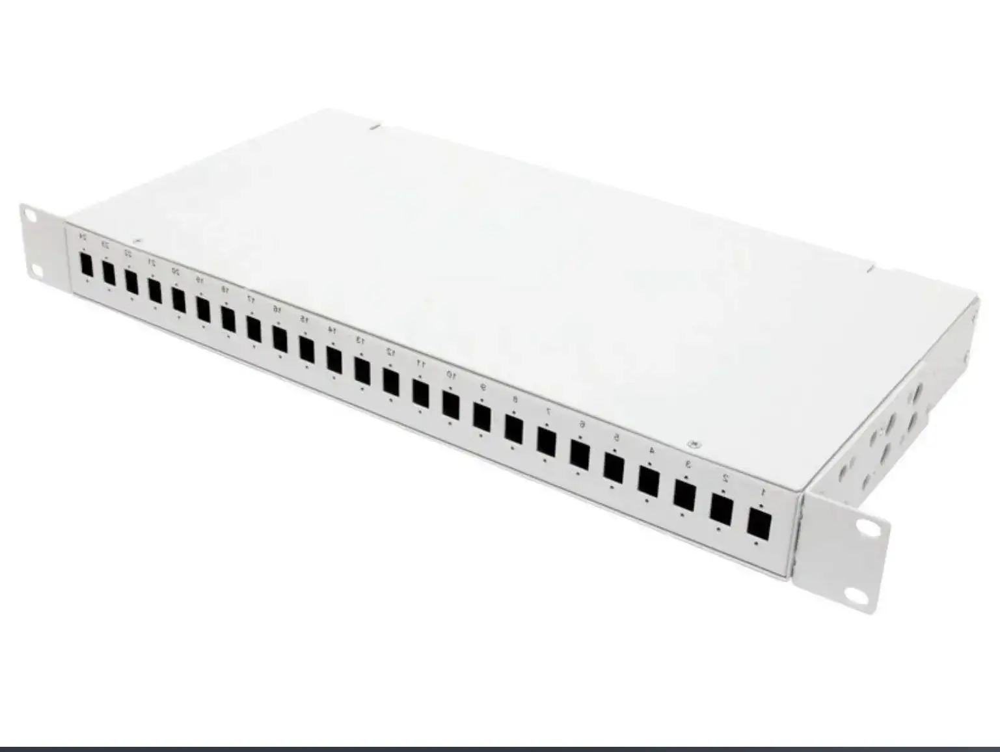

**Точка обмена трафиком.** На фото — подвал одной из российских точек обмена трафиком: сюда приходят кабели разных провайдеров. Всё радует глаз, маркировка на месте, и по документации сразу понятно, что куда идёт. В реальности, особенно в городе, так бывает не всегда. На столбах часто можно увидеть бухту кабеля — это технологический запас.

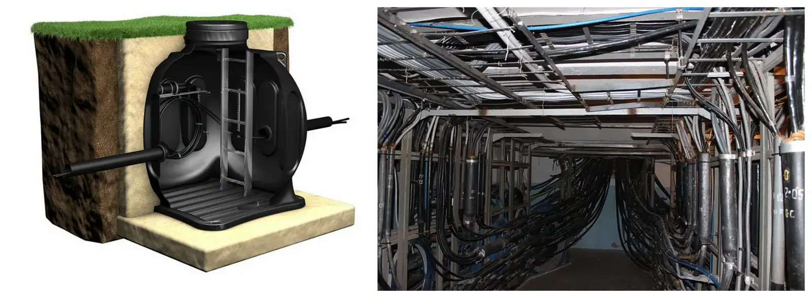

**Встречные сигналы в одном волокне.** Чтобы выжать полосу пропускания максимально, по одной оптической линии передают в обе стороны на разных частотных диапазонах. Если к вам домой приходит оптика по PON, в одном волокне — три частотных диапазона, один из которых компьютерная сеть.

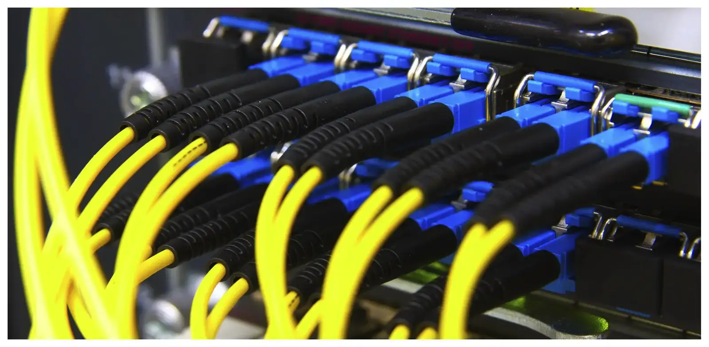

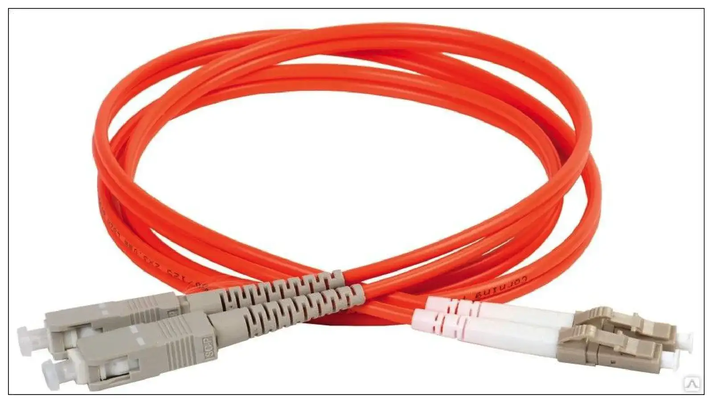

**Медиаконвертер.** Уже активное оборудование: превращает оптику, которую провайдер притащил в здание, в медь.

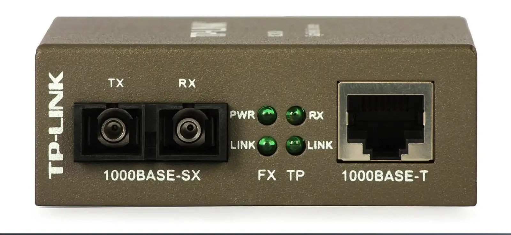

## Проектирование

На поэтажных планах здания отмечаются все точки: где проходят кабели, какого они типа, куда заходят, всё подписано.

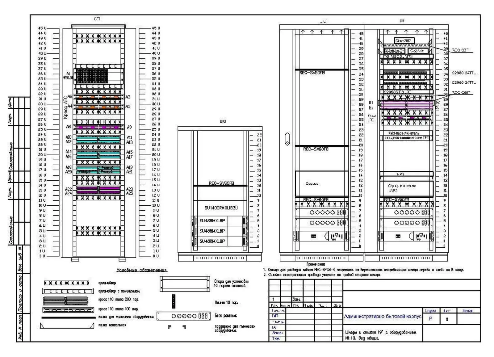

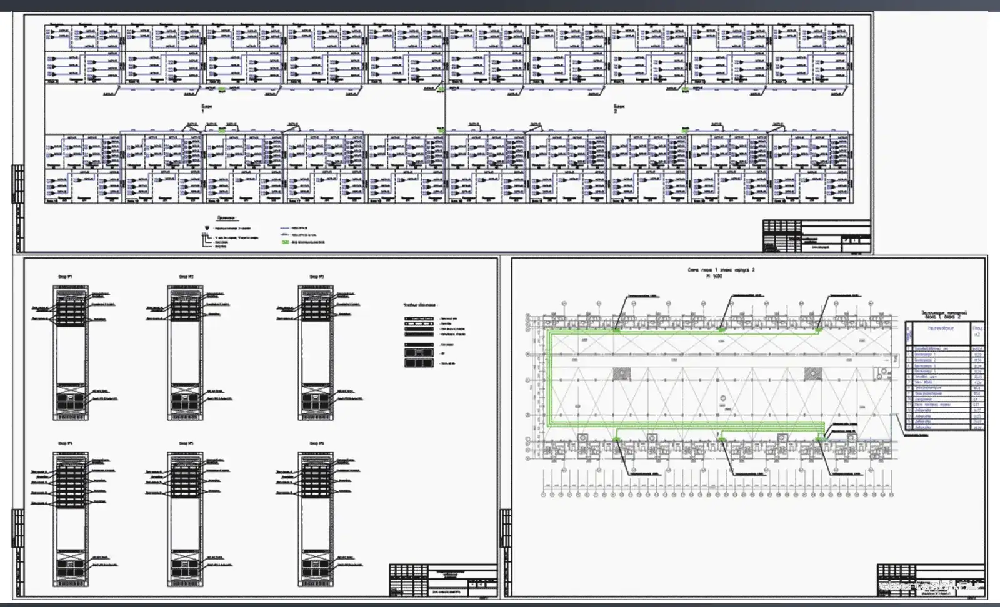

После монтажа нужно убедиться, что всё в порядке, — провести тестирование и сертификацию кабельной системы.
