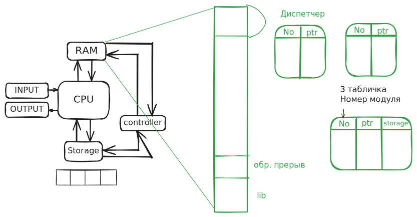
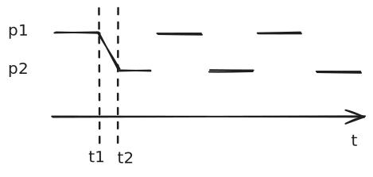
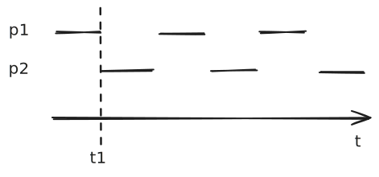
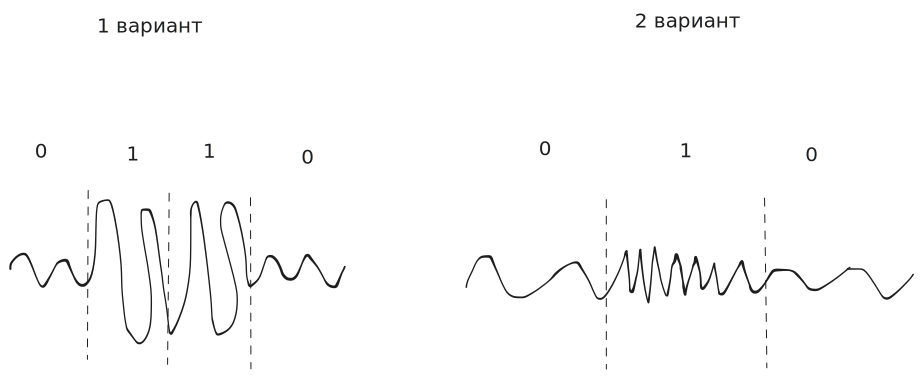
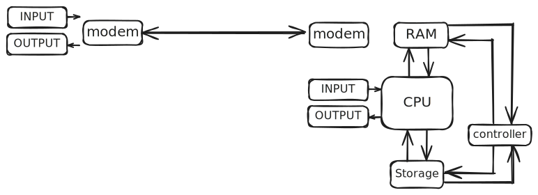

### Структурные программы и пакеты

Раньше считалось, что программы — это монолиты. Затем начали появляться **структурные программы**. Теперь можно было дробить работу между разными программистами: кто-то пишет один метод, кто-то — другой. Появились **модули** — это не просто методы, но и связанные с ними данные (например, предрассчитанные таблицы). Из модулей появились **пакеты**.

### Оверлейное программирование

В условиях ограниченной памяти нужно было исполнять код, который заведомо весит больше, чем доступно памяти. Решение — **оверлеи**: мы выгружаем ненужный кусок кода и подгружаем нужный.

Теперь диспетчер получает третью табличку — с номерами модулей. Она нужна для подгрузки нужных кусков кода.

Хочется минимизировать время простоя — появляется **планировщик**.

Получилась программа-диспетчер, надстройка над фон-неймановской архитектурой, позволяющая эффективнее пользоваться процессором.

Но мы оптимизировали ситуацию только для одной программы. А хочется, чтобы пока одна программа долго что-то вычисляет (не кушая память), параллельно могла работать другая. Идея: разместить в памяти несколько программ и сделать оптимизацию многомерной — на множестве программ и устройств. Так появляется второй этап.

### Этап 2. Мультипрограммные операционные системы

Разделили память на несколько программ. Процессор будет выполнять команду то одной программы, то другой. Звучало прекрасно, но реализовать это было очень трудно. Нужно разделить процессорное время — **Processor Sharing**.

Это **псевдопараллельность**: на самом деле в каждый момент времени работает одна программа, просто очень быстро переключаемся.

> **Марковский процесс** — каждый шаг зависит только от предыдущего состояния.

#### Кооперативная многозадачность

Идея: «Я в коде поставлю точки, и диспетчер будет решать — то ли мне обратно вернуть управление, то ли переключиться на другой процесс». Но программисты не хотели вставлять эти кусочки кода. Появилась идея делать ветвление так, чтобы эти точки **обходить**. В итоге была только вероятность, что процессорное время будет делиться равномерно.

В 60-е от кооперативной многозадачности отказались. Но потом, в 2020-е, к ней вернулись: горутины, корутины Kotlin, fiber'ы. Появились state-машины.

> До середины 90-х не верили в программистов и в код — верили только в железо. ПО воспринималось как что-то вспомогательное.

#### Вытесняющая многозадачность

Хорошо, кооперативная многозадачность не помогла. Давайте сделаем это «железно». Добавили **кварцевые часы**, которые регулярно вызывают прерывания. Диспетчер задач через равные промежутки времени проверяет планировщик и отдаёт управление программам.

> RISC-архитектура сменяется CISC-архитектурой. Появляется та архитектура процессора, которой мы пользуемся сейчас.

#### Регистровый контекст

Нельзя просто так остановиться в любой точке — в регистрах могут быть нужные данные. Появляется понятие **регистрового контекста**. Обработчик прерывания таймера становится не таким простым: нужно не просто перейти к обработке другой программы, но и **выгрузить один контекст и подгрузить другой**.

Итог:
> **Processor Sharing = Таймер прерываний + Регистровый контекст**

### Виртуальная память

Программа компилируется — компилятор указывает адрес в памяти для переменной. Но адрес дан относительно нуля. Мы ведь не знаем, куда именно загрузится программа. Решение — **виртуальная память**; эту задачу повесили на диспетчер.

> **Виртуальная память** — абстракция, позволяющая при разработке или компиляции программного кода использовать адресацию от нуля, а в момент загрузки или исполнения заменять абстрактные (виртуальные) адреса на физические.

С одной стороны, мультипрограммность делается ради эффективности. С другой — мы тратим ресурсы на переключение между программами. **Парадокс**: мы тратим ресурсы, чтобы их экономить.

### Защита памяти и привилегированный режим

С мультипрограммностью появилась возможность из одной программы случайно (или специально) полезть в память другой.

> Реальный случай: сервер в Беркли, рядом запущена программа студента и расчёт траектории баллистической ракеты. Программа студента случайно записала что-то в память программы ракеты. Ракету запустили — она сбилась с курса. Осталось приносить дипломатические извинения.

Появляется задача **защиты памяти** — программа должна работать только со своей памятью. Вводится понятие **привилегированного режима**: код в этом режиме может использовать любой кусок памяти.

> «Мы раздали людям в форме автоматы». Это было единственным решением — не давать привилегированного режима нельзя, иначе не сможем защищаться. Но с другой стороны, у кого-то может «полететь кукуха».

Так мы получили **Program Isolation**.

### Файлы

Изолировали ОЗУ — но есть ещё и ПЗУ. Зачем в памяти лежит функция, которой я неделю не пользуюсь? Пусть лежит на ПЗУ, а оверлеем подтянем, когда понадобится.

Появляется концепция **файла**: некоторой области данных даём имя, нужное только для программиста.

### Межпроцессное взаимодействие и каналы

Появляется необходимость коммуницировать между программами. Программисты захотели объединять несколько программ в пакеты. Чтобы они могли взаимодействовать, нужно было просить привилегированный процесс дать разрешение.

> В 1-й лабе есть `Pipe`: `stdout` левой команды закрывается на `stdin` правой команды.

Планировщик теперь должен учитывать связи между процессами. Например, в «Ленте»: очередь огромная за салатами (память), но кассы (процессор) пустые. Это уже не марковские процессы.

### Виртуальная машина (ранний смысл термина)

Появилась концепция **Virtual Machine** — это ещё далеко до современного понятия виртуализации.

> **Лирическое отступление — миф о вечном возвращении.** Жизнь человека — последовательность процессов. Если взять бесконечную ось времени, то на ней эти последовательные процессы будут бесконечно повторяться — и это снова будем мы. Бесконечное количество одинаковых наших жизней.

Каждая программа живёт внутри виртуальной памяти, а операционная система распределяет ресурсы между разными «виртуальными процессами». Именно в этот момент появился термин **операционная система**.

Компания **Burroughs** создала компьютер B5000, диспетчер которого назывался **MCP (Main Control Program)**.

### Этап 3. Сетевые операционные системы

**Узкое место** — ввод/вывод. У суперкомпьютеров был один общий ввод и вывод. Был **Teletype**: рулон бумаги, замыкающиеся магнитики. При вводе — ты их замыкаешь; при выводе программа замыкает магнитики и бьёт молоточками по бумаге. В то время это было прорывом — предмет обихода печатает, возникало ощущение «искусственного интеллекта».

Оператор вводил программы, запускал, записывал вывод и отдавал заказчику.

#### Бизнес-модель машинного времени

> Хотите рассчитать маршрут для логистической компании. Нанимаете программиста, он пишет код. Но запустить негде. Отправляете программиста из Сан-Франциско в Бостон в командировку. Машинист вводит код, запускает, ловит деление на ноль, выдаёт отчёт. Программист едет обратно: «всё плохо». Дорого, неэффективно.

#### Появление сетей

Компания **AT&T** взяла кредиты и протянула медные провода по всей США — это была телефонная связь.

Появился **модем**.

Но теперь нет умного оператора, который проверял правильность кода и выставлял счёт (bill). Нужно это чем-то заменить. Появляются **аккаунты** и **биллинг**. Как понять, кто именно подключается? Появляется **логический вход (logical login)** и 3 этапа аутентификации:

1. **Идентификация** — присваиваем человеку логическое имя (пин-код, биометрию, хэш и т. д., которые хранятся в системе).
2. **Аутентификация** — процесс проверки, сопоставление хэшей.
3. **Авторизация** — предоставление ресурсов после успешной аутентификации.

Позже появится **многофакторная аутентификация**.

Суперкомпьютинг становится бизнесом. США — большая страна: на восточном побережье ночь, на западном день. Компьютеры на одном побережье погибают от нагрузки, на другом простаивают. Возникает идея соединить компьютеры модемной связью и **раскидывать job'ы** между ними.