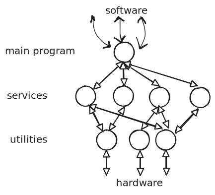
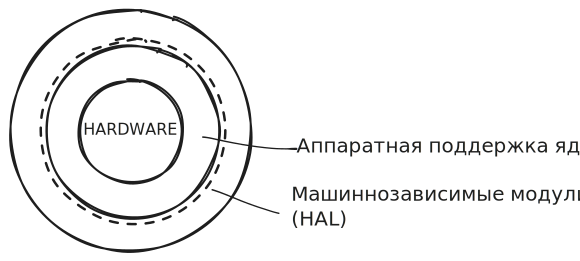
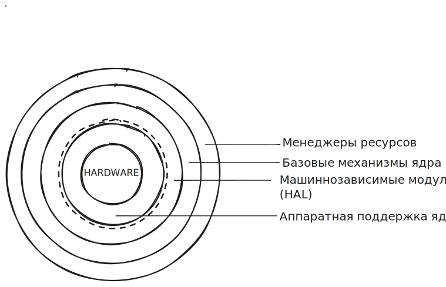
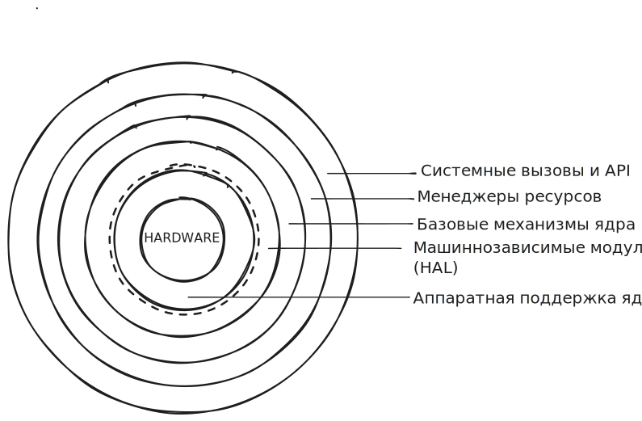
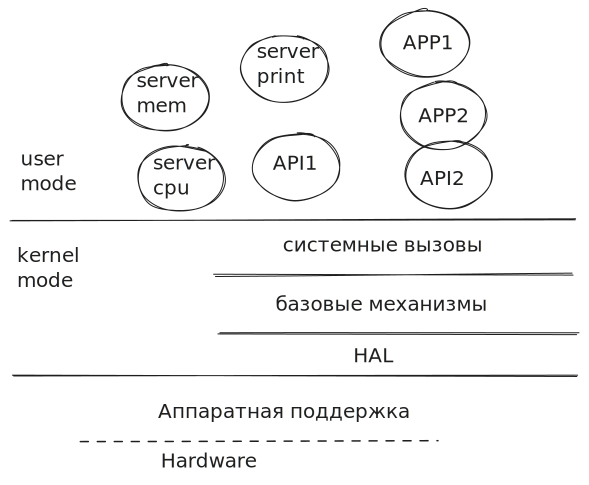
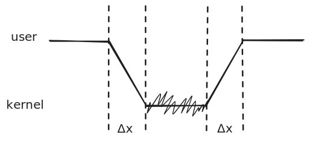
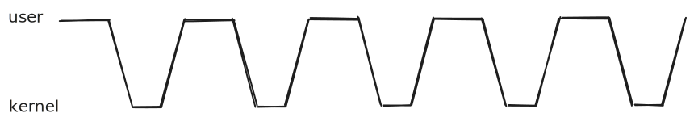

Ядро всегда работает в привилегированном режиме. Оно **резидентно** — находится в физической памяти, минуя виртуальную.

Но если всё загнать в ядро — оно будет весить очень много. Нужно искать компромисс.

### 1. Монолитная архитектура

Любая процедура в любой момент может вызывать другую. Удобно: любой компонент может уйти в любой другой. Тем не менее, должна быть иерархия — иначе доработка системы будет сложной.

Выделили 3 слоя:
1. **Main program** — интерфейс к пользовательскому ПО (Software).
2. **Services**
3. **Utilities**

> **Системный вызов** — обращение пользовательского приложения к ядру операционной системы с целью попросить/предоставить ресурс или выполнить привилегированную операцию.

Как это работает: ядро найдёт PID процесса, достанет SP (stack pointer), возьмёт там вектор параметров, перенесёт это в ядро и выполнит системный вызов. Результат (параметры) упаковываются и возвращаются в SP. Выполняется команда выхода из привилегированного режима, включается защита памяти.

Логика одна и та же независимо от архитектуры ядра — возможна разница только в работе со стеком. Когда системных вызовов много, `main` становится перегруженным. И хочется, чтобы системные вызовы были обёрнуты удобной библиотекой.

Этот слой из процессов вырос в **API** — множество интерфейсов.

### 2. Многослойная монолитная архитектура

Она остаётся монолитной (всё в ядре), но слоёв больше:

1. **Hardware**
2. **Слой аппаратной поддержки ядра**
3. **Машинно-зависимые модули (HAL — Hardware Abstraction Layer)**

> **Чипсет** — то, что обеспечивает вашу совместимость или несовместимость с ОС.

Вызов запроса кванта непрерывной памяти и подобные операции идут в слой «Базовые механизмы ядра».
**Базовые механизмы ядра** супероптимизированы, написаны на ассемблере.
**Менеджеры ресурсов** максимально оптимизированы алгоритмически (с использованием стохастики).

### 3. Микроядерная архитектура

Одна из концепций, которую продвигал **Танненбаум**.

`APP1` сделает системный вызов в ядро. Системный вызов вызовет `API2`, тот вернёт результат, ядро вернёт результат `APP1`. `APP1` обработает результат, запросит ещё что-то — и снова системный вызов…

Теряем скорость работы ядра, но **освобождаем память**, в которой может лежать пользовательская программа.

**Windows** — это среднее между двумя мирами (гибрид).

### 4. Наноядерная архитектура

Работают специфические ОС, которые называются **гипервизорами**. Например, при покупке виртуального сервера в AWS или Yandex Cloud.

Гипервизор имеет очень мало драйверов — только основные (для памяти, для дисков). Всё остальное вынесено в ОС, работающие на уровне usermode. Нет сложных алгоритмов выделения памяти.

### 5. Экоядерная архитектура

Та архитектура, где Hardware может всё время меняться. В ядро закладываем менеджеров и защищаем их — не даём ошибкам железа повлиять на ядро.

### Модульное ядро. Гибридные ядра

Гибридные ядра нужны в основном для научных задач — тестирование и отладка планировщиков и подобное.