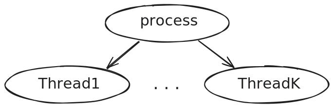
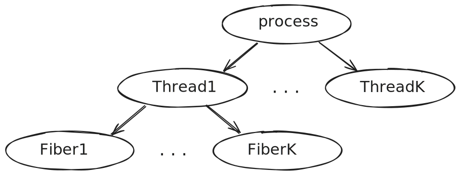
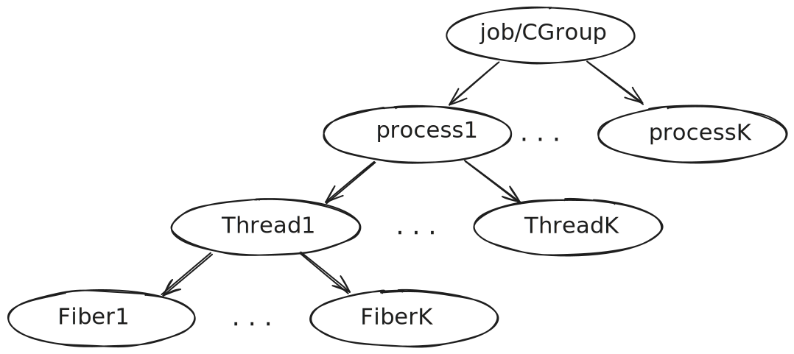
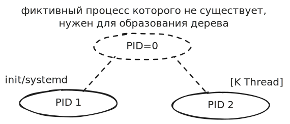
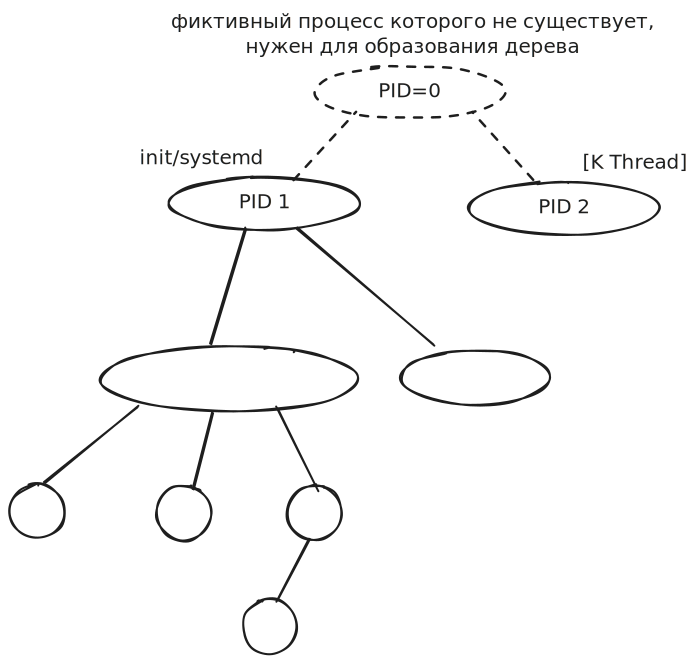
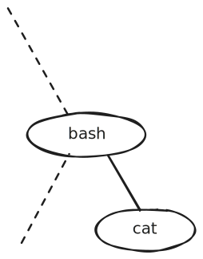

Любой системный вызов выполняется в рамках процесса.

> **Процесс** — набор исполняемых команд, ассоциированных с ним ресурсов и контекста исполнения, находящийся под управлением операционной системы.


Если в цикле запускаете `grep` — запускается один и тот же код, но у каждого процесса свои дескрипторы ввода/вывода.

### Сигналы

В рамках концепции привилегированного доступа выдали возможность подавать процессам **сигналы**. Когда подаёте `kill`, команда не доставляет сигнал процессу напрямую — она отправляется ядру. Сигналы `SIGKILL (9)` и `SIGSTOP (19)` **нельзя перехватить** — это обеспечивается ядром. Иначе можно было бы написать вредоносный код, который нельзя завершить.

С помощью `renice` можно поменять приоритет процесса. Но в современных планировщиках это работает иначе, чем в старых.

### Многопоточность

Появилась многопоточность:
- **Физическая многоядерность** (cores)
- **Виртуальные потоки** (threads, hyper-threading)



Есть процесс, выполняющийся на конкретном ядре. Например, осветляет картинку: к каждому пикселю прибавляет константу. Остальные ядра простаивают. С точки зрения алгоритма можно сделать многопоточное осветление, но нужно:
- (а) расшарить память и обеспечить целостность данных (что сложно из-за разной скорости процессов);
- (б) разрешить нескольким потокам работать с одной памятью, ослабив защиту памяти.

> **Поток (thread)** — набор исполняемых команд и контекста исполнения, разделяющий все или часть ресурсов с другими потоками данного процесса и находящийся под управлением операционной системы.

**Синхронизация потоков** нужна, потому что приходится вручную контролировать целостность данных.

Пример: вычислить дробь — числитель и знаменатель в разных потоках, третий поток делит. В идеальном мире знаменатель должен быть готов раньше деления. Но может оказаться, что числитель вычислен, а знаменатель ещё равен 0 — ловим деление на ноль.

### Возвращение к кооперативной многозадачности — Fiber'ы

**Маятник возвращается.** Вернулись к тому, от чего уходили — к кооперативной многозадачности. Появились **горутины**, **fiber'ы** (волокно из нити Thread). Их называют ещё **Lightweight Thread**.

Идея: один настоящий поток может разложиться на несколько таких «легковесов». Thread может состоять из нескольких Fiber'ов (а может и не состоять, если технология не используется).

> **Fiber** — набор исполняемых команд в контексте конкретного потока, находящийся под управлением пользовательского приложения.

В Kotlin это реализовано с помощью конечных автоматов.



### Распределение ресурсов между процессами

Пример: запущены IDEA и Chrome. Кажется, должно достаться поровну, 50/50. Но у Chrome 99 процессов, а у IDEA — 1. Ресурсы делятся как 99:1. Упс. С позиции ОС нет разницы, что они порождены одним процессом, — все процессы плюс-минус равны.



### Основные функции подсистемы управления процессами

- Создание
- Обеспечение ресурсами
- Изоляция
- Диспетчеризация
- Планирование
- Синхронизация
- Межпроцессное взаимодействие
- Завершение

Сегодня — про **создание** и **завершение**.
- *Обеспечение ресурсами* размазано: ресурсы разные, и для них разные планировщики.
- *Изоляция* — это изоляция ОЗУ, ПЗУ, сети.
- *Диспетчеризация* — процессы меняют состояния (один выполняется, потом спит; другой просыпается). Граф состояний приведёт к задаче планирования.
- *Синхронизация* — процессы влияют друг на друга, в race condition возникают критические ситуации.
- *Межпроцессное взаимодействие* — это 3-я лаба.

### Создание процесса

Любой процесс создаёт другой процесс. А как создаётся первый? В каждой ОС есть **костыль** для рождения первого процесса. В Unix процессы образуют строгое классическое **иерархическое дерево** — у каждого процесса ровно один родитель.



`d` в `systemd` — это **daemon** (system daemon).



#### Системные вызовы для создания процессов

- **`fork()`** — дословно «ответвиться». Создаёт копию текущего процесса.
- **`exec*()`** — заменяет текущий процесс новой программой.
- **`clone()`** — более тонкий контроль (используется для потоков в Linux).

Пример:
```bash
#!/bin/bash
cat file.txt
```
Bash породил потомка с именем `cat`.



> **Если зомби-апокалипсис привёл к тому, что закончились PID'ы — сервер зависнет настолько, что даже войти нельзя.** Открыть терминал — породить процесс. Даже если зашли, посмотреть процессы через `ps` — тоже процесс…

Диспетчер процессов родит процесс и вернёт параметры — одним из 18 параметров будет PID.