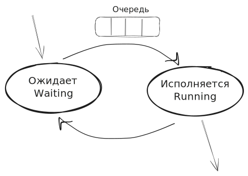
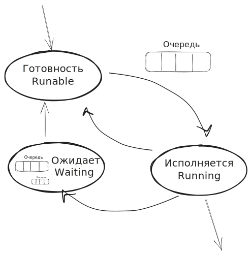
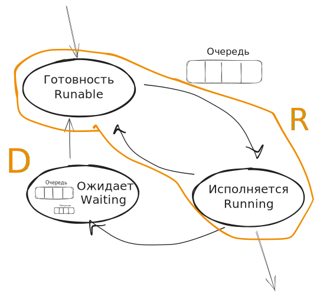
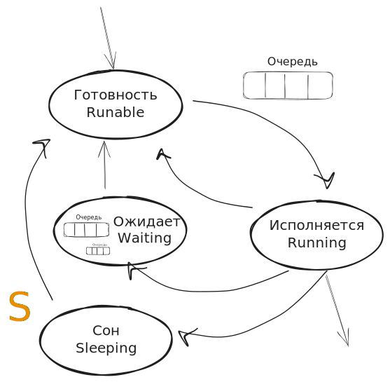
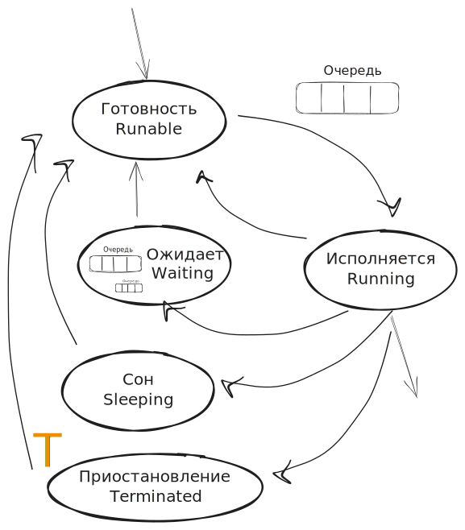
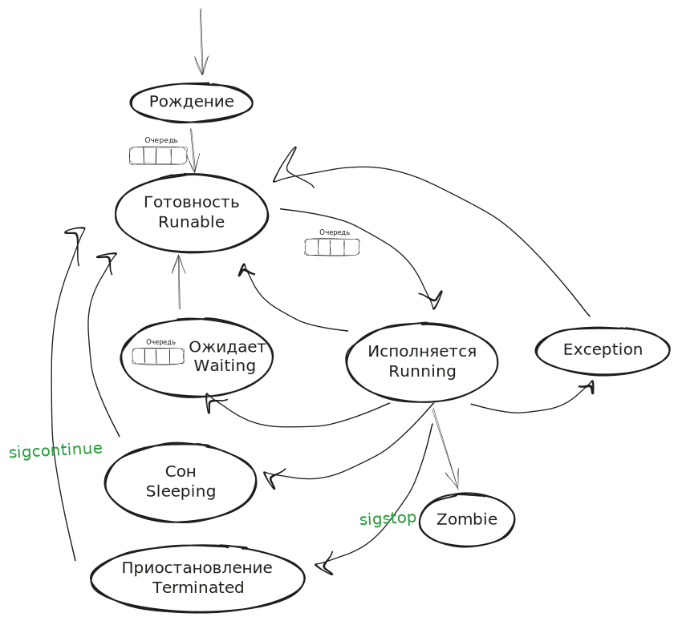

### Диспетчеризация и клонирование процессов

Время дискретно — происходят события, которые меняют одно дискретное состояние на другое.

Развитие событий во времени описывается **автоматами**:
- **Вершины** — возможные состояния процесса. Они не привязаны к конкретному времени; в каждый момент процесс находится в какой-то вершине.
- **Рёбра** — возможные переходы между состояниями.

### Двухсостоянийная модель

Исторически было 2 состояния:
- **Running** (исполняется) — используется процессор.
- **Waiting** (ожидает) — чего-то ждёт.

Ребро между ожиданием и исполнением становится **очередью**.

Из Running у процесса 2 выхода: завершиться или уйти в Waiting.

Пока стоял в очереди, операция I/O завершилась — он перейдёт в Running, когда подойдёт очередь. Но может быть и так, что очередь подошла, а I/O ещё не завершено — процесс снова уйдёт в Waiting. Это **непродуктивно**: дёргать процесс, который не может выполняться.

### Трёхсостоянийная модель

Появилось состояние **Runnable** (готов).

Любой процесс попадает в **Runnable** (готовность). Мы всегда начинаем с вычислений (нужно запросить дескриптор и т. п.). Сразу обеспечить Running мы не можем.

Если процесс синхронно своему коду уходит в ожидание — он идёт в **Waiting**. В Waiting появляются свои очереди — как правило, к устройствам ввода/вывода. Это состояние называется **Direct Waiting** — процесс ожидает конкретное событие (семафор, I/O).

В какое состояние переходить из Waiting? Сразу в Running нельзя — будет конкуренция двух очередей. Значит, в **Runnable**.

### Состояния процессов в Linux

**`R` (Running)** — процесс либо прямо сейчас исполняется, либо будет исполняться в ближайшее время.

**`D` (Direct Waiting / Uninterruptible Sleep)** — ожидает завершения конкретного события, которое выведет его в Runnable. Процесс сначала разгребёт накопившийся перечень событий — обработает сигналы, вызовет системные вызовы.

**`S` (Sleeping)** — процесс спит. Это, как правило, **демоны**: те же веб-серверы, если запросов нет, большую часть времени спят.

**Чем S отличается от D?** В обоих процесс ждёт. Но:
- В **D** он ждёт конкретный сигнал.
- В **S** он забуферизует любой сигнал и сразу переведёт его в Runnable.

Пример работы веб-сервера в S:
1. Пакет приходит, ядро парсит TCP-заголовок.
2. По дескрипторам портов определяется, кто слушает порт.
3. Слушающему процессу посылается WakeUp.
4. Процесс уходит в Runnable.
5. Обработчик читает с вершины стека и обрабатывает запрос.
6. После обработки — снова `Sleeping`.

**`T` (Stopped/Terminated)** — приостановлен. На жаргоне — «состояние комы»: процесс ставят на паузу.

### Почему у «рождения» нет состояния?

Чтобы выдать состояние, нужно выдать PID. Пока PID нет — процесса нет в `ps aux`. Соответственно, состояние «рождение» — это и есть процесс создания.

### Состояние «карантин» (Exception)

Если процесс поймал Exception, ядру придёт прерывание от чипсета. Это переполнение памяти, выполнение недоступной команды процессора и т. п.

Состояние «карантина» — что-то вроде второго шанса. Если процесс многопоточный, Linux даст ему ещё попытку. Может, это рассинхронизация потоков? Может, через 10 мс деление на ноль исчезнет — знаменатель досчитается? Может, забыли мьютекс? Может, `malloc` не успел вызваться? Стоит попробовать через 10–20 мс.

> **ОС очень гуманная.** Она никогда не убивает процесс — она **предлагает ему самоубиться**. Почему? Если ОС вдруг убьёт какую-нибудь транзакцию, какой-то дяденька потеряет шестизначную сумму долларов. Такую систему никто не купит. **Дефолтные обработчики сигналов — это самоубийства.**

