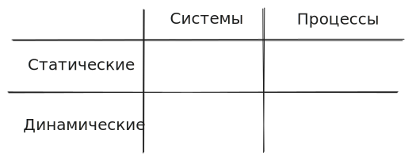
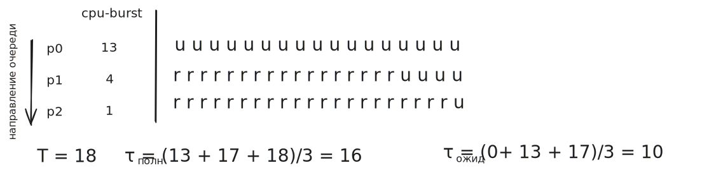
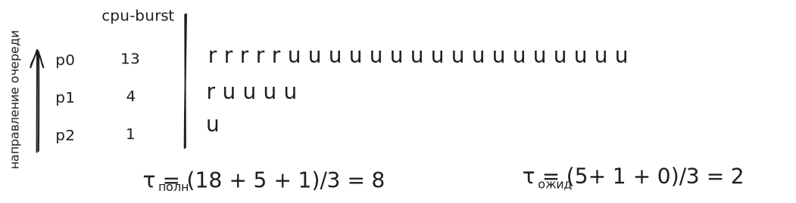
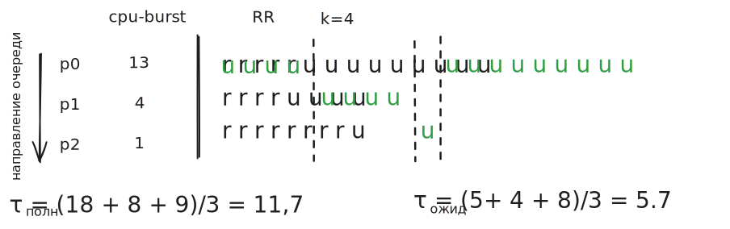
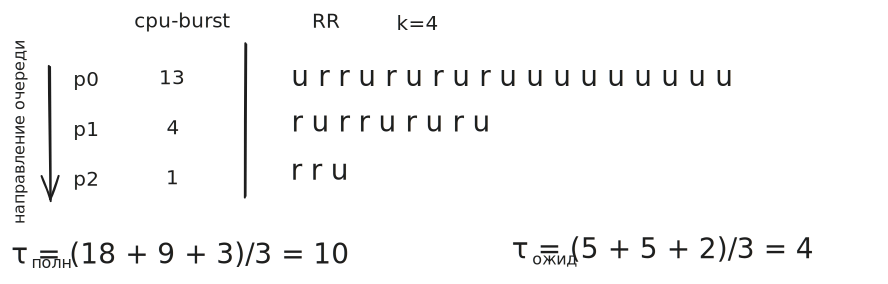
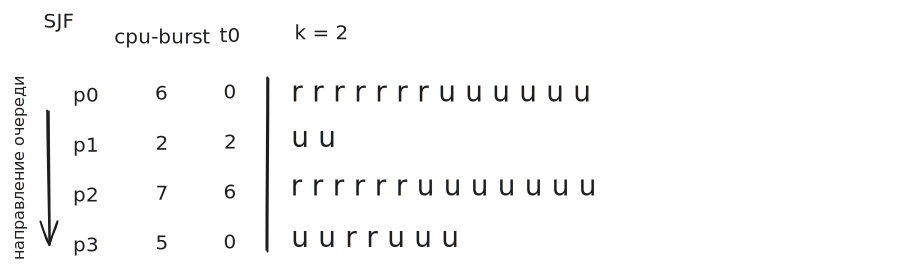
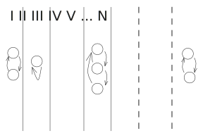
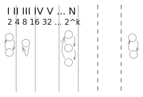

### Метрики

- **Время ожидания** (непродуктивное время).
- **Время отклика** (для интерактивных процессов важно — смотрим что-то в реальном времени).

Что считать «хорошо»? Нужны граничные свойства алгоритма.

### Свойства алгоритмов планирования

1. **Предсказуемость.** На похожих данных алгоритм должен давать похожие результаты. Например, время работы алгоритма. *Настоящие специалисты не используют O-нотацию — в реальности оценки превращаются в тыкву.* Пример: генетические задачи — мутации, время их схождения — случайная величина с большой дисперсией.
2. **Масштабируемость.** В современном мире для планировщиков $O(n)$ недопустимо, надо хотя бы $O(\log n)$. Был алгоритм планировщика с провокационным названием **O(1)** (где константа была 104). Его заменили на $O(\log n)$. Асимптотически $O(1)$ эффективнее, но в реальности $O(\log n)$ оказался лучше.
3. **Реализуемость.** Есть слепые тесты — алгоритм заменяется рандомайзером. Если рандомайзер лучше планировщика — зачем такой алгоритм? **Критерий истины — практика.** Накладные расходы нужно минимизировать.

### Параметры планирования

Хотим выстроить план — для этого надо что-то знать о процессах. Есть $n$-мерное пространство — $n$-мерный куб, каждая сторона которого — параметр. Сводим задачу к поиску экстремума функции. Если бы функция была всюду дифференцируемой и непрерывной — задача была бы простой. Но это только в математике.

Параметры можно делить на:
- **статические** vs **динамические**,
- **системы** vs **процессы**.

- **Статические параметры системы**: характеристики железа.
- **Динамические параметры системы**: процент утилизации процессора, утилизации канала связи и т. д.
- **Статические параметры процесса**: права доступа (если процесс вовсе не может открывать сокет — не учитываем его в сетевом планировщике), и т. п.
- **Динамические параметры процесса**:
  - **CPU-Burst** — сколько процесс будет непрерывно работать на процессоре, пока не уйдёт в I/O (в тактах).
  - **I/O-Burst** — аналогично с I/O: через сколько вернётся.

### 2 класса алгоритмов

- **Вытесняющее планирование** — есть способ прервать процесс и передать ресурс следующему.
- **Невытесняющее планирование** — нет.

### Алгоритмы планирования

#### 1. FCFS (First-Come-First-Served)

А что если перевернуть очередь?

Полное время сократилось в 2 раза, время ожидания — в 5 раз.

**Справедливость говорит**: FCFS.
**Эффективность говорит**: пропустить вперёд «студента с водой». Но охранник не знает CPU-Burst процессов.

#### 2. RR (Round-Robin)

С теми же процессами:

Поставим квант $K = 1$:

Но накладные расходы будут колоссальными.

#### 3. SJF (Shortest Job First)

#### 4. Гарантированное планирование

Пусть есть $N$ процессов. Каждый $i$-й процесс характеризуется двумя величинами:
- $T_i$ — текущее полное время (время в системе);
- $\tau_i$ — текущее время исполнения.

В идеале $\tau_i \approx \frac{T_i}{N}$. Вводим **коэффициент справедливости**:
$$R_i = \frac{\tau_i \cdot N}{T_i}$$

Тот, у кого $R_i$ минимален, — самый обделённый. Вводим квант: пока процесс выполняется, числитель растёт только у него, знаменатель — у других. Через какое-то время самым обделённым станет уже кто-то другой. Так аккуратно и справедливо раздаётся процессорное время.

Сломалось две вещи:
1. $R_i$ — вещественное число. Сортировка по вещественным числам сложна — сравнение двух вещественных чисел дорого, тем дороже, чем выше точность.
2. **Подверженность хакингу.** Студенты за либеральные ценности — только пока их не собираются отчислить. Что делали студенты в общаге? Заходил в 7 утра, запускал процесс-заглушку. До 12 утра дописывал реальный код. К моменту, когда код появлялся, $\tau_i$ маленькое, а знаменатель уже накопился — процесс получал максимальные ресурсы. Началась гонка таких программ.

> Через 40 лет к этой идее вернутся и докажут, что так делать всё-таки можно.

### Многоуровневая очередь

Аналогия с управлением программой:
- 4-курсник, пишущий диплом и уже стажирующийся.
- 1-курсник, который ещё никак себя не показал.
- Студент с 3 академами.

Как расставить рейтинг? Появился новый студент, надо вставить между 378-м и 379-м местом. Вещественные числа? Сдвигать всех начиная с 378? Возникает идея — **многоуровневая очередь**.

- Внутри очереди — Round-Robin.
- Процесс может исполняться только если нет процессов в более приоритетной очереди.

Со старых времён был компьютер с аптаймом 6 лет. Взяли дамп памяти — для изучения. В дампе планировщика был процесс, который так и не выполнился за много лет. Он был где-то на дне.

Появился алгоритм типа **«лифт»** — и **многоуровневая очередь с обратной связью**.

