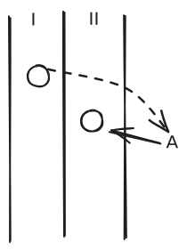
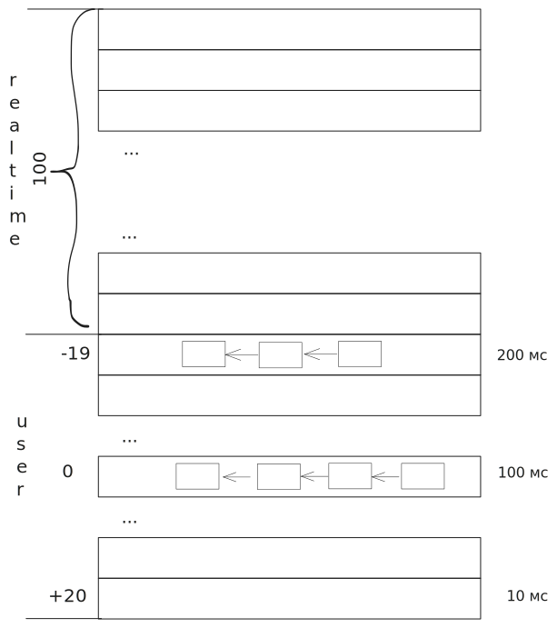

### 4 требования к планировщику (исходно противоречивые)

1. **Поддержка внешнего управления приоритетами.** Владелец сервера должен иметь возможность кому-то дать приоритет. Так или иначе придётся поддерживать многоуровневую очередь.

2. **Эффективность использования ресурсов.** Минимальное время простоя процессора (статус IDLE). Минимальное время «деструктивной работы». Процессы должны максимально быстро покидать память. Минимум переключений в режим ядра (смена контекста дорогая). Эффективно использовать кэш процессора (меньше тратить на перерасчёт маппинга виртуальной памяти).

3. **Минимизировать накладные расходы алгоритма.** Везде использовать целочисленную (а лучше битовую) арифметику. Хорошая асимптотика — $O(n)$ считается плохой, выше не рассматривается.

4. **Минимизировать риски тупиков.**
   > **Deadlock**: несколько процессов блокируют ресурсы — процесс A заблокировал ресурс $R_1$ и ждёт $R_2$, процесс B заблокировал $R_2$ и ждёт $R_1$.
   >
   > Другая ситуация: процесс стоит в очереди I и ждёт ресурс A. Ресурс A занят другим процессом, стоящим в очереди II и ждущим исполнения. С точки зрения компьютера всё хорошо — но они в бесконечном ожидании.
   

> Оказывается, есть и экономическая выгода от справедливости.

### Планировщик Windows

Windows использует **32-уровневую очередь**.

- **Realtime-уровень** — системные процессы, которые не меняют очередь и никогда её не покидают.
- С 16 по 31 — системные процессы.
- С 1 по 15 — пользовательские.
- На одном уровне между процессами — Round-Robin.
- На **0-м уровне** — процесс, обнуляющий память.

#### Классы приоритетов процессов

| Класс        | Приоритет |
| ------------ | --------- |
| Realtime     | 24        |
| High         | 13        |
| Above Normal | 10        |
| Normal       | 8         |
| Below Normal | 6         |
| Idle         | 4         |

Зачем 32 очереди, если классов всего 6? Из-за **уровней насыщения потоков** (их 7):

| Уровень насыщения | Дельта |
| ----------------- | ------ |
| TimeCritical      | +15    |
| Highest           | +2     |
| Above Normal      | +1     |
| Normal            | ±0     |
| Below Normal      | -1     |
| Lowest            | -2     |
| Idle              | -15    |

**TimeCritical** и **Idle** — краевые, экстренные. Выйти за уровни 1–15 нельзя.

#### Критерий эффективности

Windows XP / 95 / 98 прогнозировал CPU Burst. Потом поняли, что современные процессы становятся всё более интерактивными — это уже не марковские цепи.

Стали **поощрять** «хорошие» процессы (наказывать не надо) — те, что быстрее уходят в I/O. Когда процесс возвращается из I/O, ему **поднимают очередь**. Величина надбавки — эмпирические коэффициенты, которые Microsoft не разглашает. Например:
- дисковые операции — самая низкая надбавка (+1) — скорее всего, ты прочитал и пойдёшь читать ещё;
- чтение из USB-порта — +2;
- интерактивные режимы (звук, клавиатура) — нужно, чтобы речь была плавной, текст печатался плавно.

**Квант:** в Windows 7 — 12 тиков таймера.

### Планировщик Linux

#### O(1)

**140 многоуровневых очередей.**

В Linux между процессами на одном уровне — **FIFO**.

Появляется вторая очередь — **Non-Active**, первая называется **Active**. Рано или поздно даже из самой приоритетной очереди все процессы окажутся в Non-Active. В этой очереди нет голодания. Когда очередь Active закончится — меняем указатели местами: Non-Active становится Active.

**Но эту очередь можно обойти.** Создаём интерактивный процесс — он поднимается на максимальный приоритет. Затем меняет поведение и в конце своего времени **создаёт новый процесс и умирает**. Новый процесс на том же уровне — и снова к концу времени создаёт нового и умирает. Так процесс может выполняться бесконечно.

Костыль: при создании процесса процессорное время делится **пополам** между родителем и потомком.

#### CFS (Completely Fair Scheduler)

> Одну из лучших реализаций сделал **Эндрю Малдар** (Ingo Molnár), закончил Будапештский университет ещё во времена Варшавского договора, когда университет был наполовину МГУ. Когда рухнул железный занавес, эмигрировал в США, попал в IBM/Red Hat. Его заметил Линус Торвальдс и доверил оптимизировать планировщик. Со времён университета он помнил идею Танненбаума и её критику.

Есть две характеристики:
- **Execution time** — целочисленное время выполнения.
- **Max execution time** — максимальное.

Но вставка в очередь долгая. Малдар ходил на алгосы — выбрал сбалансированное дерево, **Red-Black Tree**.

Всё хорошо, но где `nice`? 3 из 4 требований решены, но **первое — нет**. Решение: **`nice` влияет на течение времени.** При `nice = 0` 1 мс равно 1 мс. Чем приоритетнее процесс — тем быстрее течёт его время ожидания и медленнее — время выполнения.