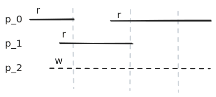
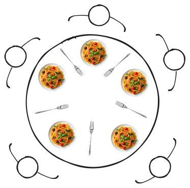

**Отсутствие прогресса** — ресурс доступен, но никто им не пользуется.

Но может быть и другая ситуация — процессов много, ресурсов мало. Возникает **голодание**.

### Проблема читателей/писателей

Характерна для очередей.

- Если пришла операция чтения — пусть читает параллельно.
- Если операция записи — монополизирует устройство.

Где ломается логика?
- $p_0$ начал чтение.
- $p_2$ начал ждать конца чтения, чтобы записать.
- $p_1$ начал чтение, пока $p_0$ ещё читал.

**Решение:** разрешаем параллельное чтение только когда в очереди **нет ожидающих записи**.

### SLA (Service Level Agreement)

Оцениваем время ожидания $r$.

> У проблем синхронизации **нет эффективных решений с гарантиями** — есть только статистические алгоритмы.

### Тупики (Deadlock)

> Множество процессов находится в состоянии тупика, если каждый из этих процессов ожидает событие, которое может быть вызвано только другим процессом из этого множества.

### Как бороться?

**Дейкстра** и тут решил — точнее, попытался.

Гегель вывел познание как 3 этапа:
1. Тезис
2. Антитезис
3. Синтез

Но для этого нужен оппонент. Дейкстра придумал модель, понятную на уровне здравого смысла, которая описывала бы проблему тупика и помогала бы её решить.

### Проблема обедающих философов

- За круглым столом сидят 5 философов. Между каждой парой соседей — 1 вилка.
- Философы либо размышляют, либо едят.
- В тарелках — нескончаемые спагетти.
- Чтобы есть, нужно **обе вилки** (спагетти скользкие).

Три состояния:
- **Размышление** (продуктивное, тратит жизненную энергию).
- **Голод** (сил размышлять нет).
- **Насыщение** → возврат к размышлению.

Философы не хотят разговаривать друг с другом. Нужны правила.

#### Стратегия 1: Левая → правая → ешь → положи

1. Проголодался — возьми левую вилку.
   - Не удалось — жди.
   - Удалось — возьми правую.
     - Не удалось — жди.
     - Удалось — ешь, потом положи обе.

**Проблема:** если все одновременно проголодались, все взяли левую, никто не может взять правую — **deadlock**.

#### Стратегия 2: Если правую не взять — положи левую и попробуй снова

Все одновременно взяли левую, никто не взял правую, все положили левую — и снова взяли левую…

**Появляется livelock** — система подаёт признаки жизни, но не прогрессирует. По мониторингам не виден.

#### Стратегия 3: Положить левую и подождать **случайное время**

Берём левую, пробуем правую — не получилось, кладём левую и ждём случайное время. Кому-то да повезёт.

Но всё равно есть комбинация времени, при которой получается livelock.

> Случайная последовательность генерируется алгоритмом — а **детерминированный алгоритм не может выдать настоящее случайное число**.

Возвращаемся к проблеме тупиков. Нужно либо разрешить философам общаться, либо ввести **официанта**, выдающего вилки. Но официант — узкое место, ещё один планировщик. А что если ресурсов 10 тысяч? 10 тысяч планировщиков? Кажется, будет проблема с реализацией.

Дейкстра признал, что задача пока не имеет универсального решения.

### Условия Коффмана

Спустя 5 лет вышла статья **Коффмана**, в которой была сформулирована теорема.

> **Тупик возникнет тогда и только тогда, когда одновременно выполнены 4 условия:**
>
> 1. **Mutual Exclusion** — любой ресурс, участвующий в тупике, должен быть неразделяемым.
> 2. **Hold and Wait** — процесс имеет право, удерживая ресурс, ожидать другой.
> 3. **No Preemption** — только сам процесс может отдать ресурс; забрать у него нельзя.
> 4. **Circular Wait** — каждый процесс ожидает событие, зависящее от другого процесса (кольцо).

Отсюда появились методы решения проблемы (и поиска livelock'ов). У Танненбаума описаны алгоритмы поиска тупиков, но они **только теоретические** — на практике не работают.

Нужно построить ОС, в которой гарантированно не будет выполнено хотя бы одно из условий.

### Как ломать условия Коффмана

**1. Mutual Exclusion** (сделать ресурс разделяемым).
Принтер — у него есть pooling, очередь печати. В офисе на 150 сотрудников: не отправлять сразу на печать, а **буферизовать** в очередь. Приложению сказать «всё, ты напечатал», а очередь сама разберётся.
Условия:
- неинтерактивность (нет обратной связи);
- уверенность, что очередь не переполнится.

**2. Hold and Wait.** Двухфазная транзакция: сначала получаем **все** нужные ресурсы, потом работаем.

**3. No Preemption.** Возможность отнимать ресурсы.

**4. Circular Wait.** Пронумеровать ресурсы, требовать брать их в порядке возрастания номеров. Теоретически работает, но на практике упирается в сложность.

Снизить вероятность тупика можно, реализовав комбинацию этих подходов.

### Три подхода к работе с тупиками

1. **Обнаруживать.**
2. **Предотвращать.**
3. **Игнорировать.** Снижаем вероятность и не гарантируем отсутствие тупиков.

> Весь инфобез держится на балансе защиты и вероятности атаки: с одной стороны — стоимость взлома и потенциальная прибыль атакующего; с другой — стоимость защиты.

То же и с тупиками в крупных онлайн-магазинах: у 1 клиента из 100 возникнет тупик — извинимся и дадим бонус на 300 рублей.

> **Случай Маятина**: за городом заказал доставку «Перекрёстка» на сумму свыше 10 тысяч (положена бесплатная доставка). Связь была плохой — добавил товар и сразу нажал «оформить». Полетели две транзакции: сначала пришло оформление, потом добавился товар. Сумма не пересчиталась. Написал в поддержку: «Всё конечно хорошо, но изоляцию транзакций в СУБД сделайте».

> **Случай с Google** — объявили конкурс на задачи для квантовых компьютеров: компьютер есть, а что на нём считать — непонятно.

> **Случай с Яндекс.Облаком** — начиная с 20 петабайт упираешься в алгоритмы: нельзя просто так взять и достать данные из ячейки — перебирать ячейки будет невероятно долго.