*Лекция 3, 17.09. Основа — запись лекции; блоки «Со слайдов» и картинки взяты из презентации для наглядности.*

## Поглощение света

**Поглощение** — уменьшение энергии световой волны, проходящей через вещество. Математически оно является следствием проводимости среды: чем больше проводимость, тем сильнее поглощение.

### Закон Бугера

Экспериментально: измеряем интенсивность падающего излучения $I_0$, интенсивность прошедшего $I$ и смотрим, как ослабление зависит от толщины $L$. Для любого материала зависимость получается экспоненциальной:

$$
I = I_0 e^{-kL}
$$

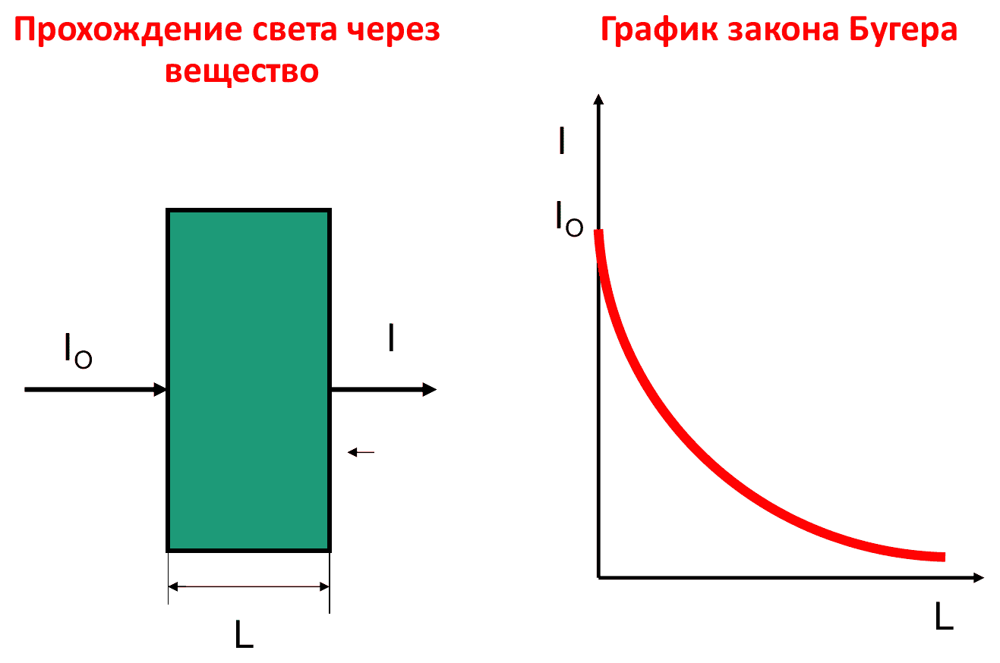

- $k > 0$ — **коэффициент поглощения**, размерность $\text{м}^{-1}$ (стоит в показателе экспоненты вместе с длиной).
- $k$ обратно пропорционален толщине, на которой интенсивность падает в $e \approx 2{,}7$ раза.
- $k$ зависит от длины волны — отсюда спектры поглощения (линейчатые, полосатые, практически сплошные).

**Активные (лазерные) среды** дают не поглощение, а усиление: сначала в среду закачивают энергию (**накачка**), затем она отдаёт её проходящему излучению. Процесс тоже идёт по экспоненциальному закону, только с положительным показателем.

### Порядки величин

| Вещество | $k$ | Комментарий |
|---|---|---|
| Металлы | $\sim 10^3\text{–}10^4\ \text{см}^{-1}$ | Плёнка толщиной ~1 мкм даёт $kL \sim 1$, т.е. ослабление всего в $e$ раз — такая плёнка полупрозрачна; тоньше — ещё прозрачнее |
| Диэлектрики | $\sim 10^{-3}\text{–}10^{-5}\ \text{см}^{-1}$ | Для оптоволокна (десятки км) нужны ещё меньшие значения |
| Газы, пары металлов | $\approx 0$ | Атомов в единице объёма мало, вероятность встречи излучения с атомом мала |

### Связь с комплексным волновым числом

Из прошлой лекции: в проводящей среде волновое число комплексное, $k = k' - ik''$, и амплитуда затухает как $e^{-k''x}$. Интенсивность — квадрат амплитуды, поэтому коэффициент в законе Бугера равен $2k''$.

Скорость в среде $v = \dfrac{1}{\sqrt{\varepsilon\varepsilon_0\mu\mu_0}}$, $c = vn$, откуда $n = \sqrt{\varepsilon\mu}$. В оптике работают с прозрачными немагнитными средами ($\mu \approx 1$), поэтому $n = \sqrt{\varepsilon}$, а $\varepsilon$ — функция частоты.

## Тепловое излучение

Первая область, где выяснилось, что классической физики недостаточно для объяснения эксперимента.

> **Со слайдов:** тепловое излучение — испускание электромагнитных волн телами за счёт их внутренней энергии. Происходит при любой $T > 0\ \text{K}$, но при невысоких температурах излучаются практически только длинные (ИК) волны.

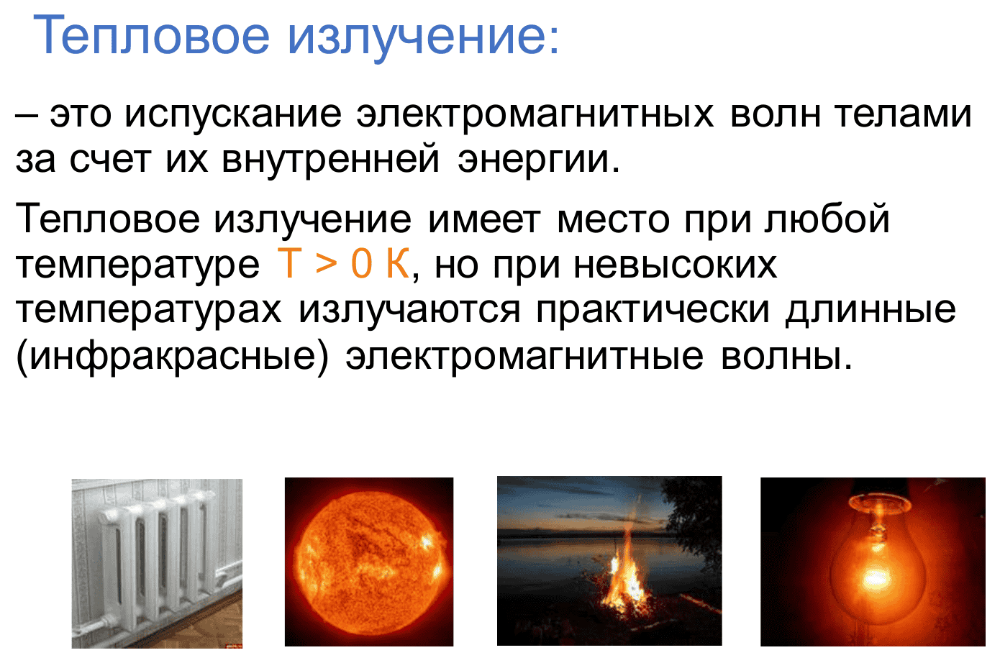

- Любое тело с температурой выше $0\ \text{K}$ излучает.
- Человек ($\approx 310\ \text{K}$) излучает с максимумом около $9\text{–}10$ мкм — тепловой (ИК) диапазон, глазом не виден. Увидеть можно через **тепловизор** — оптико-электронный преобразователь (переводит излучение любого диапазона в оптический).
- Чтобы максимум попал хотя бы в красную область, нужно $\sim 3000\ \text{K}$ — этого почти не выдерживает ни один металл. При 700–800 °C металл слегка светится, но максимум по-прежнему в ИК.
- Чтобы максимум был в середине видимого диапазона, нужно $\sim 6000\ \text{K}$ — любое вещество при этом уже плазма. Такой источник — Солнце; зрение адаптировано к нему, поэтому максимум чувствительности глаза совпадает с максимумом солнечного излучения.
- Глаз хуже воспринимает края видимого диапазона: при одинаковой мощности зелёная лампа кажется ярче красной и фиолетовой.

### Лампа накаливания vs светодиод

- Вольфрамовая спираль (вольфрам — самый тугоплавкий металл, плавится при ~3400 K) нагрета примерно до 2500–2600 K. Основная часть энергии уходит в тепло: такая лампа хорошо греет, но плохо светит.
- Светодиод на 3 Вт светит как лампа накаливания на 60 Вт — разница в 20 раз говорит о КПД лампы накаливания порядка нескольких процентов.
- Светодиод излучает в узком спектральном диапазоне, почти вся энергия идёт в свет.

### Характеристики излучения

**Энергетическая светимость** $R$ — энергия, излучаемая в единицу времени с единицы площади:

$$
[R] = \frac{\text{Дж}}{\text{м}^2 \cdot \text{с}} = \frac{\text{Вт}}{\text{м}^2}
$$

По сути это та же интенсивность. Просто **светимость** — понятие фотометрии: она пересчитывается с учётом чувствительности глаза.

> **Со слайдов:** светимость считается во всём интервале частот и по всем направлениям (в пределах телесного угла $2\pi$): $R_T = \dfrac{W}{St}$.

**Спектральная плотность энергетической светимости** (испускательная способность) — светимость в узком интервале частот от $\omega$ до $\omega + d\omega$:

$$
r_{\omega T} = \frac{dR_T}{d\omega}, \qquad R_T = \int_0^\infty r_{\omega T} \, d\omega
$$

$R_T$ в этом случае — **интегральная энергетическая светимость**. Физики предпочитают работать с частотами, инженеры — с длинами волн.

### Кривые излучения при разных температурах

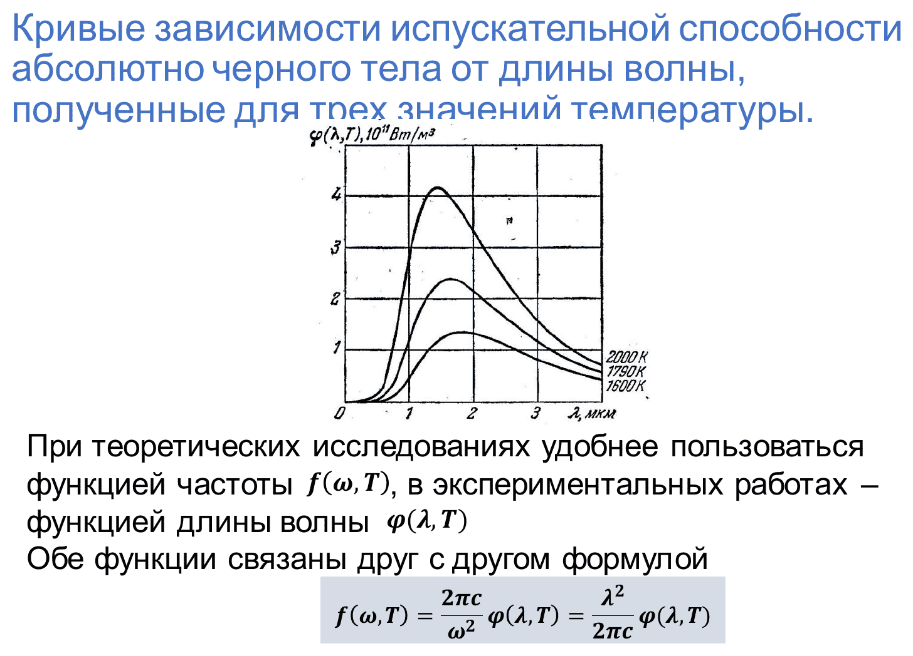

- При $1600\ \text{K}$ максимум около 2 мкм, на видимый диапазон приходится ничтожная доля.
- Кривая для $2000\ \text{K}$ практически совпадает с кривой лампы накаливания. Площадь под кривой — мощность с единицы площади; умножив на площадь спирали, получаем мощность лампы. На освещение идёт только кусок в интервале $0{,}4\text{–}0{,}7$ мкм, в УФ — совсем немного, остальное — тепло.
- С ростом температуры максимум смещается в сторону коротких волн. Это было известно кузнецам: при нагреве цвет металла идёт от тёмно-красного к ярко-красному, оранжевому, жёлтому. Привязать это к числам стало возможно после того, как Томас Юнг (начало XIX в.) измерил длины волн видимого света.

> **Со слайдов:** функции частоты и длины волны связаны так:
> $$
> f(\omega, T) = \frac{2\pi c}{\omega^2}\,\varphi(\lambda, T) = \frac{\lambda^2}{2\pi c}\,\varphi(\lambda, T)
> $$

**Солнце:** на расстоянии орбиты Земли интенсивность около $1300\ \text{Вт/м}^2$, размазанная от гамма-излучения до радиоволн. Солнечная батарея использует лишь часть спектра — порядка $100\text{–}150\ \text{Вт/м}^2$. Кроме того, она даёт постоянный ток, и преобразование в переменный происходит с КПД < 100%.

## Абсолютно чёрное тело

Падающий поток делится на отражённый, поглощённый и прошедший; в сумме они дают падающий.

**Поглощательная способность** $\alpha_{\omega T}$ — доля поглощённого потока. Зависит как минимум от частоты (определяется атомным строением) и от температуры.

$$
\alpha_{\omega T} = \frac{d\Phi_\text{погл}}{d\Phi_\text{пад}}
$$

- **Абсолютно чёрное тело** — абстракция: $\alpha = 1$ на всех частотах от 0 до ∞. В видимом диапазоне близки к нему сажа и чёрные краски.
- Белые тела имеют коэффициент отражения, близкий к 1 (в видимом диапазоне). **Абсолютный отражатель** ($\alpha = 0$ во всём спектре) — пока из фантастики; был бы идеальной защитой от излучения.
- **Серое тело** — $\alpha < 1$; вводится **коэффициент серости** от 0 до 1.
- Для непрозрачного тела: $\alpha = 1$ — ничего не отражается, $\alpha = 0$ — всё отражается (**абсолютно белое тело**).

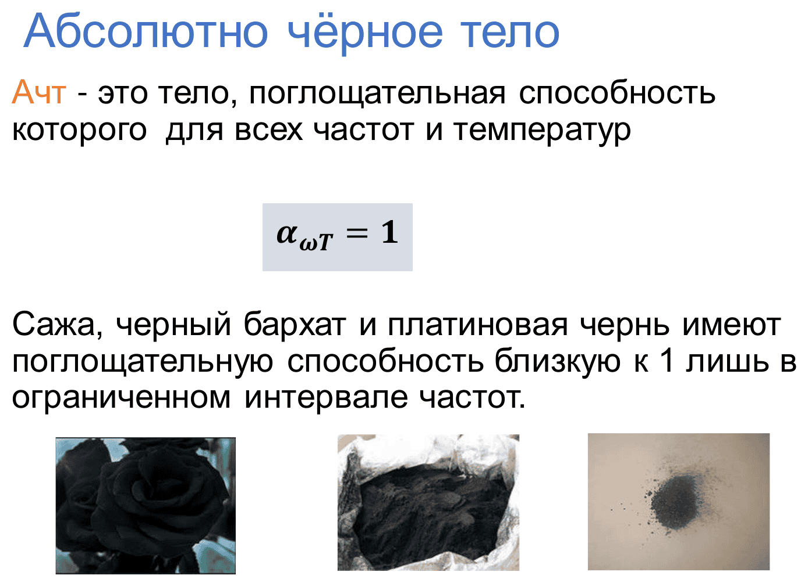

> **Со слайдов:** модель абсолютно чёрного тела — почти замкнутая полость с малым отверстием: попавший внутрь луч многократно отражается и практически не выходит обратно. Серое тело на слайдах определяется как $\alpha_{\omega T} = \alpha_T = \text{const} < 1$.

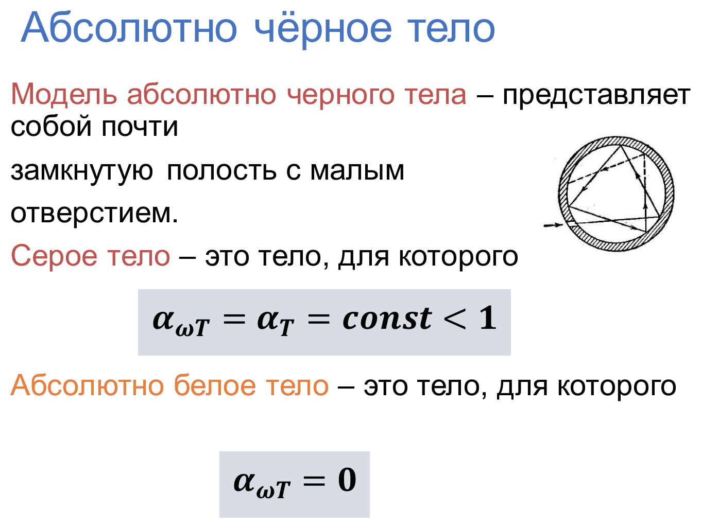

### Закон Кирхгофа

Отношение испускательной способности к поглощательной одинаково для всех тел и является **универсальной функцией** частоты и температуры:

$$
\left(\frac{r_{\omega T}}{\alpha_{\omega T}}\right)_1 = \left(\frac{r_{\omega T}}{\alpha_{\omega T}}\right)_2 = \ldots = f(\omega, T)
$$

Сам Кирхгоф вид функции не указал. Для абсолютно чёрного тела $\alpha = 1$, поэтому **функция Кирхгофа — это испускательная способность абсолютно чёрного тела**: $r^\text{ачт}_{\omega T} = f(\omega, T)$. Её можно записывать через частоту $f(\omega, T)$ или через длину волны $\varphi(\lambda, T)$; так как $\omega$ и $\lambda$ обратны друг другу, графики будут «зеркальными»: малые частоты — ИК и радио, большие — УФ, рентген.

> **Со слайдов:** следствие — тело, сильнее поглощающее какие-либо лучи, сильнее их и испускает.

Графики получены экспериментально, и в XIX веке встал вопрос: какая аналитическая функция их описывает?

## Законы излучения чёрного тела

### Закон Стефана–Больцмана

Площадь под кривой (интегральная светимость) пропорциональна четвёртой степени температуры:

$$
R_T = \int_0^\infty f(\omega, T)\, d\omega = \sigma T^4, \qquad \sigma \approx 5{,}67 \cdot 10^{-8}\ \frac{\text{Вт}}{\text{м}^2 \cdot \text{К}^4}
$$

- Нагрели тело в 2 раза — светимость выросла в 16 раз.
- $T$ — **абсолютная** температура. Типичная ловушка: нагрев с 200 до 400 °C — это не удвоение, а переход с 473 до 673 K.
- Во всей физике температура в Цельсиях стоит только в инженерной формуле удельного сопротивления — исторически так сложилось.

Откуда берётся значение $\sigma$, на тот момент объяснить не могли.

> **Со слайдов:** Стефан (1879) пришёл к закону, анализируя экспериментальные данные; Больцман (1884) получил его для АЧТ из термодинамических соображений.

### Закон смещения Вина

Длина волны максимума спектральной плотности обратно пропорциональна температуре (сформулирован экспериментально в конце XIX века):

$$
\lambda_{\max} = \frac{b}{T}, \qquad b \approx 2{,}9 \cdot 10^{-3}\ \text{м} \cdot \text{К}
$$

**Пример.** Человек: $\lambda_{\max} = \dfrac{2{,}9 \cdot 10^{-3}}{310} \approx 9{,}4\ \text{мкм}$. Чтобы максимум был на ~500 нм (в 20 раз короче), температуру нужно поднять в 20 раз → около 6000 K.

**Звёзды.** Температуры звёзд никто не измерял термометром — их оценивают по цвету через закон Вина:

- красные — порядка 3000 K;
- жёлтые — 6–7 тыс. K;
- голубые — порядка 10 000 K (подставляем ~400 нм → в полтора раза горячее Солнца). Такие звёзды ещё и значительно сильнее излучают в УФ, рентгене и гамма-диапазоне.

### Формула Рэлея–Джинса

Первая попытка аппроксимировать кривую:

$$
f(\omega, T) = \frac{\omega^2}{4\pi^2 c^2} kT
$$

> **Со слайдов:** Рэлей и Джинс исходили из теоремы классической статистики о равнораспределении энергии по степеням свободы — каждому электромагнитному колебанию приписали энергию $kT$.

- $k \approx 1{,}38 \cdot 10^{-23}\ \text{Дж/К}$ — **постоянная Больцмана**, коэффициент пропорциональности между температурой и энергией.
- Температура — макроскопическая, «человеческая» характеристика средней энергии; у отдельных частиц температуры нет.
- **Оценка:** чтобы оторвать электрон у водорода, нужно $\sim 2\text{–}3 \cdot 10^{-18}$ Дж. Газ должен иметь $kT$ такого порядка → $T \sim 10^5$ K, это плазма.
- Энергия молекул газа ↔ их скорость ↔ давление. Пример — дизельный двигатель: резко уменьшаем объём, резко растёт температура, происходит воспламенение без поджига.

При фиксированной температуре формула — это просто **парабола** по $\omega$.

### Ультрафиолетовая катастрофа

Энергия — интеграл от спектральной плотности, а

$$
R_T = \int_0^\infty \frac{\omega^2}{4\pi^2 c^2} kT \, d\omega = \infty
$$

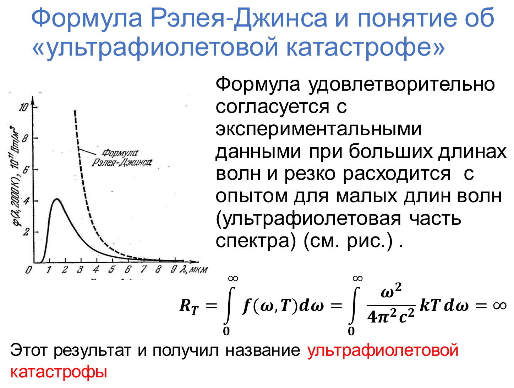

Ошибок в выводе не нашли, а энергия получалась бесконечной. Парабола хорошо ложится на эксперимент при малых частотах (больших длинах волн), но расходится с ним примерно с видимого диапазона / ближнего ультрафиолета — отсюда название. На графике по длинам волн кривая Рэлея–Джинса резко уходит вверх при малых $\lambda$, и интеграл так же расходится.

**Объяснение:** свет проявляет и волновые, и корпускулярные свойства. Чем короче длина волны, тем сильнее выражены свойства частиц:

- ИК и длиннее — корпускулярные свойства выражены слабо;
- УФ, рентген, гамма — волновые свойства слабее, каждый фотон несёт большую энергию.

Для масштаба: 200 МэВ ≈ $10^{-11}$ Дж — энергия деления одного ядра урана. Сама по себе мала, но ядер в килограмме очень много.

Вывод формулы Рэлея–Джинса в курсе не даётся; концептуально излучение рассматривалось как волны в замкнутой области.

## Гипотеза и формула Планка

Макс Планк предложил считать, что излучение испускается **порциями энергии** (квантами), движущимися со скоростью $c$, причём энергия порции пропорциональна частоте:

$$
\mathcal{E} = h\nu = \frac{hc}{\lambda} = \hbar\omega
$$

- $h \approx 6{,}63 \cdot 10^{-34}\ \text{Дж} \cdot \text{с}$ — **постоянная Планка**.
- $\hbar = \dfrac{h}{2\pi} \approx 1{,}05 \cdot 10^{-34}\ \text{Дж} \cdot \text{с}$ — удобна при работе с $\omega = 2\pi\nu$; с точностью ~5% можно считать $\hbar \approx 10^{-34}$.
- Монохроматическое излучение частоты $\nu$ состоит из **целого** числа $n$ фотонов, каждый с энергией $h\nu$: $\mathcal{E}_n = n\hbar\omega$.
- Сам Планк до конца жизни сомневался в правильности идеи.

**Следствие:** если процессу нужна определённая порция энергии (например, развалить молекулу), то при облучении излучением меньшей частоты процесс просто не пойдёт. Эта идея позволила Эйнштейну объяснить фотоэффект.

### Формула Планка

Вывод не приводится, только результат:

$$
f(\omega, T) = \frac{\hbar\omega^3}{4\pi^2 c^2} \cdot \frac{1}{e^{\hbar\omega / kT} - 1}
$$

Удобно ввести безразмерную величину $x = \dfrac{\hbar\omega}{kT}$ — во сколько раз энергия фотона больше $kT$.

- $x \ll 1$ (малые частоты): $e^x - 1 \approx x$, и формула в точности переходит в **формулу Рэлея–Джинса**. Фотонов с малой энергией много, а много фотонов — это волна.
- $x \gg 1$ (большие частоты): единицей можно пренебречь, определяющей становится спадающая экспонента.

> **Со слайдов:** в пределе $\hbar\omega \gg kT$ получается формула Вина:
> $$
> f(\omega, T) = \frac{\hbar\omega^3}{4\pi^2 c^2} e^{-\hbar\omega/kT}
> $$

Качественно функция — произведение степенного множителя (параболы) на спадающую экспоненту: при малых частотах экспонента ≈ 1 и видна парабола, при больших экспонента «гасит» рост. Такие зависимости в физике встречаются часто.

### Три закона из одной формулы

- **Интегрируем** формулу Планка → закон Стефана–Больцмана и значение постоянной:

$$
\sigma = \frac{\pi^2 k^4}{60 \hbar^3 c^2}
$$

- **Дифференцируем** и ищем максимум → трансцендентное уравнение (сейчас легко решается численно) → закон Вина и постоянная $b$.

> **Со слайдов:** после замены $x = \dfrac{2\pi\hbar c}{kT\lambda}$ условие максимума $\varphi(\lambda, T)$ сводится к
> $$
> x e^x - 5(e^x - 1) = 0 \quad\Rightarrow\quad x \approx 4{,}965, \qquad T\lambda_m = \frac{2\pi\hbar c}{4{,}965\,k} = b
> $$

Итого по излучению чёрного тела: формулы Планка, Вина и Стефана–Больцмана и три постоянные — Планка, Стефана–Больцмана, Вина. Постоянная $\sigma$ остаётся в ходу для инженерных расчётов.

## Фотоэффект

Открыт Герцем в 1887 году. Столетов экспериментально исследовал его и сформулировал три закона (на уровне «наблюдаю, но почему — не знаю»). Объяснил Эйнштейн, воспользовавшись идеей Планка.

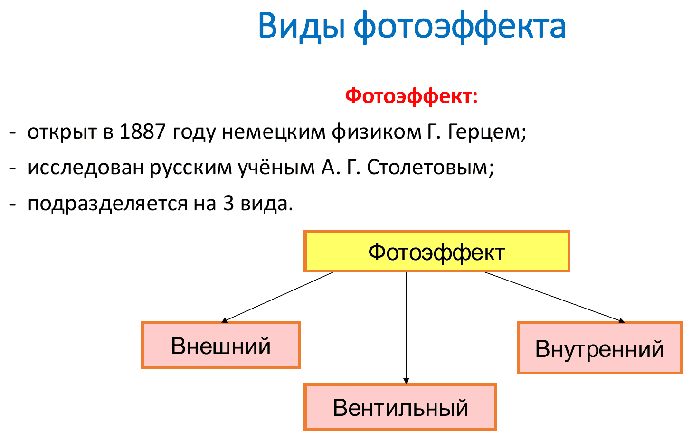

### Виды фотоэффекта

- **Внешний** — электроны вырываются из освещаемой металлической пластины наружу. Пластина в вакуумной колбе под напряжением: нет света — нет тока, есть свет — есть ток. Применение: датчик пересечения периметра (луч перекрыли → фотоэффект прекратился → сработала схема). На слайдах: на его основе работают **фотоэлементы**.
- **Внутренний** — электроны перераспределяются внутри полупроводника, растёт его проводимость. Устройство — **фоторезистор**: больше освещение → меньше сопротивление.
- **В p–n-переходе** (на слайдах — **вентильный**) — освещением можно управлять проводимостью перехода и получать ток даже при закрытом переходе. Устройство — **фотодиод**.

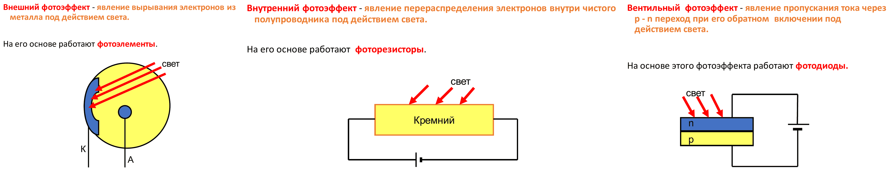

Внутренний и вентильный фотоэффекты объясняются только квантовой механикой, поэтому полупроводники стали использовать примерно с 1940-х. До этого они считались «мусором»: проводят плохо, изолируют ещё хуже. Дальше в курсе разбирается только внешний фотоэффект.

**Безынерционность:** свет включили — ток пошёл, выключили — прекратился. Фотоны движутся со скоростью света, а электроны в вакууме из-за очень малой массы по сравнению с зарядом разгоняются с огромным ускорением; инерционность — доли наносекунды.

### Установка

Свет фокусируется через окно колбы на металлическую пластину.

- **Катод** — откуда вылетают электроны, на него подаём минус (отталкивает электроны).
- **Анод** — куда прилетают, на него подаём плюс (притягивает).
- Вольтметр измеряет напряжение между анодом и катодом, микро-/миллиамперметр — ток.

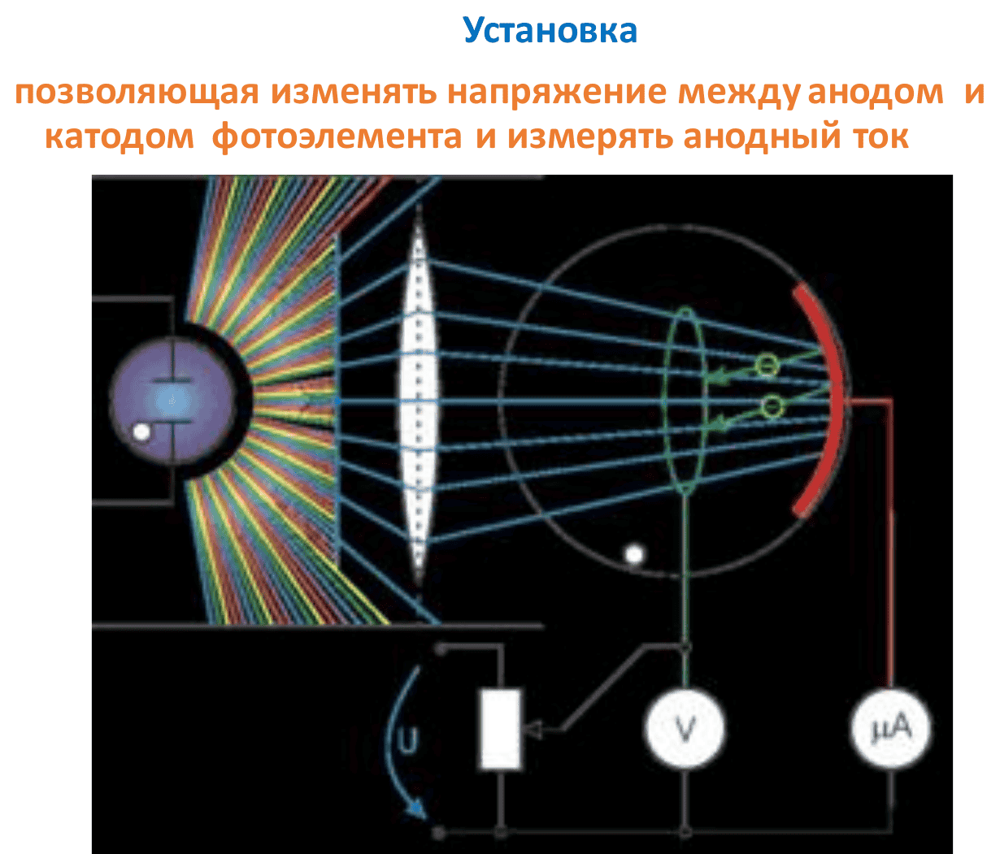

### Вольт-амперная характеристика

В отличие от обычного резистора (закон Ома — прямая), ВАХ фотоэлемента нелинейна и имеет три участка:

1. начальный;
2. быстрый рост;
3. **насыщение**.

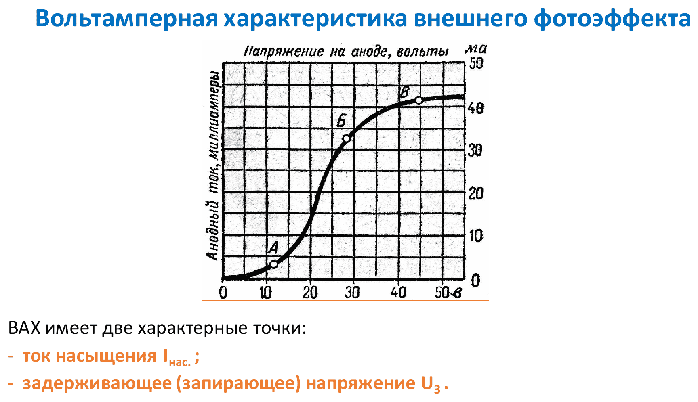

**Насыщение:** при постоянной мощности освещения за единицу времени вырывается фиксированное число электронов. Когда все они успевают долететь до анода, ток больше не растёт. Если увеличить интенсивность (две лампы вместо одной), ток насыщения станет больше.

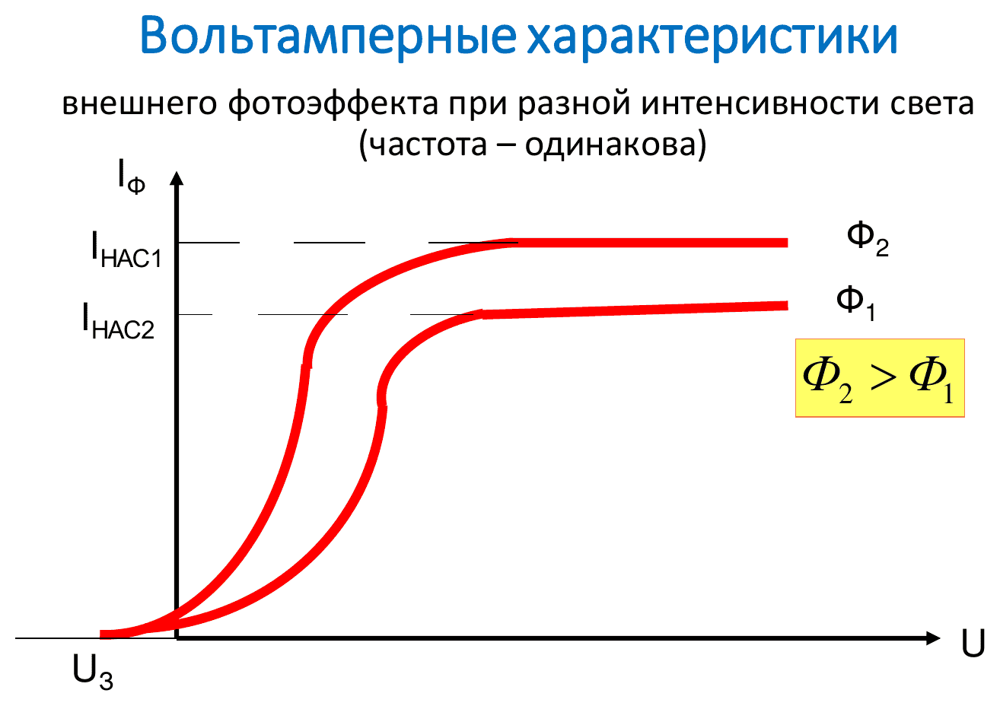

Разность потенциалов разгоняет электроны: $eU = \dfrac{mv^2}{2}$.

**Задерживающее напряжение.** Опыт показал, что ток есть даже при $U = 0$, а чтобы его обнулить, нужно поменять полярность. Значит, электроны получают энергию не только на вылет из металла, но и на движение.

> **Со слайдов:** задерживающее напряжение $U_з$ — напряжение обратного знака, при котором фототок равен нулю; по нему находят максимальную скорость электронов: $eU_з = \dfrac{mv^2_{\max}}{2}$.

### Уравнение Эйнштейна

Фотон — частица, и действует он на один электрон целиком: половины фотона не бывает.

Чтобы вырвать электрон из металла, нужно затратить энергию — **работу выхода** $A$ (на границе металла положительные ионы остаются только с одной стороны и притягивают электрон обратно).

Три случая:

- $h\nu < A$ — энергии не хватает, электрон не вырывается;
- $h\nu = A$ — электрон вырывается с нулевой скоростью, вся энергия ушла на вылет;
- $h\nu > A$ — остаток энергии идёт в кинетическую энергию электрона.

$$
h\nu = A + \frac{mv^2_{\max}}{2}
$$

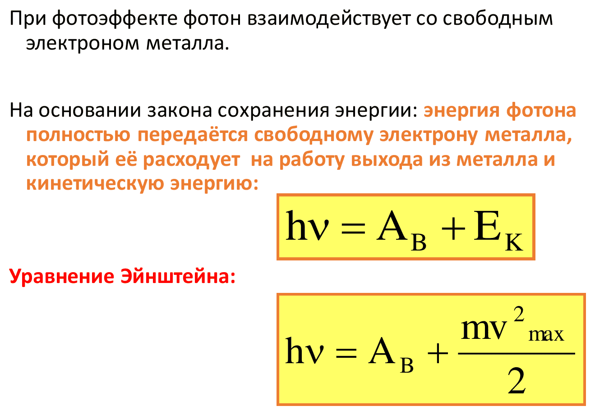

Аналогия: пришли в кафе — денег не хватает на кофе, хватает ровно на кофе, или хватает на кофе и ещё остаётся на булочку.

*Продолжение — на следующей лекции.*
