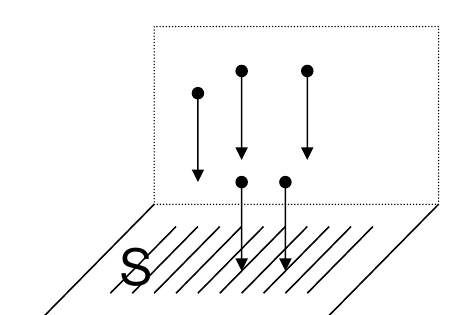
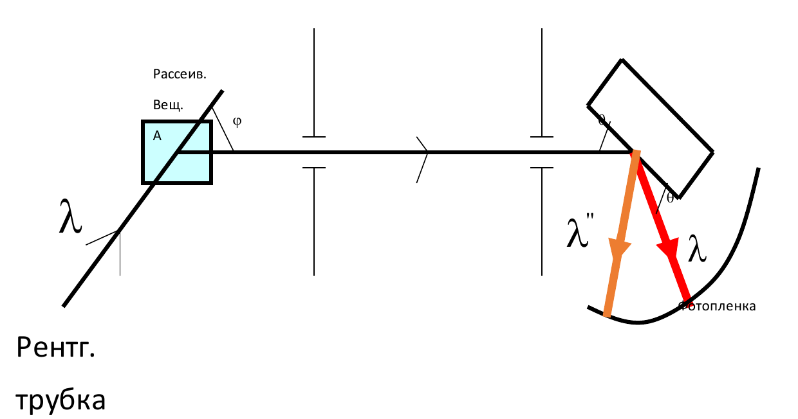
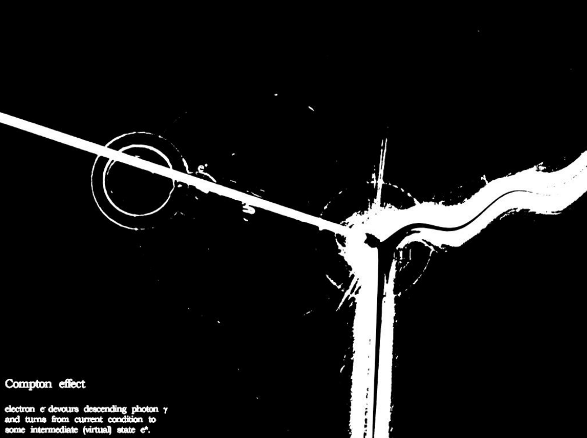
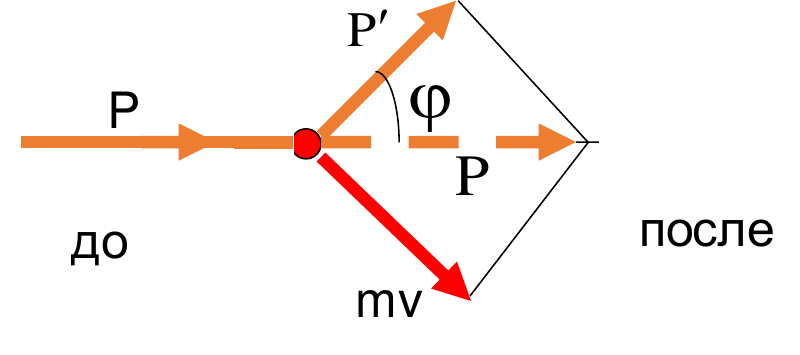

## Фотоэффект

### Установка

Фотоэлемент — это, по сути, стеклянная колба с откачанным воздухом, внутри которой есть катод и анод. На катод светят, из катода вылетают электроны. Вылетают они, разумеется, только если им сообщить достаточно энергии.

Схема подключения: к электродам подключается батарея, последовательно с ней — амперметр, для регулировки напряжения — реостат (переменное сопротивление), а параллельно всему этому — вольтметр.

Амперметр фиксирует **анодный ток** — фактически число электронов, долетающих до анода за единицу времени. По горизонтали на графике откладывается напряжение $U_{AK}$ между анодом и катодом:

- $U_{AK} > 0$ — плюс подключён к аноду, вылетевшие электроны притягиваются к нему;
- $U_{AK} < 0$ — обратное включение, плюс на катоде.

### Почему электрон тормозится

Если есть напряжение, то есть разность потенциалов, а значит и градиент потенциала — направление его роста. Электрическое поле направлено против градиента:

$$
\vec E = -\nabla\varphi
$$

Сила Кулона $\vec F = q\vec E$, а у электрона заряд отрицательный, поэтому сила направлена против поля. По второму закону Ньютона $\vec F = m\vec a$ ускорение направлено туда же, куда сила. Значит при прямом включении электрон ускоряется к аноду, а при обратном — поле тянет его обратно к катоду.

Может ли электрон долететь до анода при обратном включении? График говорит, что да. Это возможно, если он вылетел с большой скоростью.

Через силы такую задачу решать неудобно: она векторная, нужно знать расстояния и направления. Через энергию всё сводится к сложению и вычитанию вещественных чисел. Скорости нерелятивистские, поэтому кинетическая энергия электрона — $\dfrac{mv^2}{2}$. Тормозящее поле совершает над электроном работу $eU$. Если

$$
eU \geq \frac{mv^2}{2},
$$

то поле отобрало всю энергию: электрон летел, скорость падала, падала и в какой-то момент обнулилась. Даже если до анода не хватило тысячной доли нанометра — это не считается.

> Как сотую долю балла до 90 не добрал: злой преподаватель «отлично» не поставит. Знакомый случай из Вышки — одной сотой не хватило. Очень жаль, но в другой раз.

Дальше поле толкает электрон обратно, а с отношением заряда к массе порядка $10^{11}$ ускорение получается огромным. Электроны не долетают — цепь фактически разорвана — амперметр показывает ноль.

### Вольт-амперная характеристика

Ток растёт **нелинейно** — это не закон Ома. И при этом в какой-то момент рост прекращается — наступает **насыщение**.

Почему это странно: ток пропорционален скорости электронов, а чем больше напряжение, тем больше скорость. Если на начальном участке ток растёт, он должен был бы расти и дальше. Но при фиксированной интенсивности ток выходит на **ток насыщения**.

> Такой же график есть в любом учебнике экономики — объём продаж от времени. Выкинули на рынок новый айфон: сначала все пытаются понять, лучше ли он старого, потом все его покупают, а дальше он нужен только тем, кто утопил, разбил или кому срочно нужен второй. Поэтому экономисты — не гуманитарии: хорошие очень дружат с математикой, статистикой и корреляционным анализом. Гуманитарии — это плохие экономисты.

Напряжение, при котором ток обращается в ноль при обратном включении, называется **задерживающим напряжением** $U_з$. Его снимали в лабораторной 5.07: потихоньку увеличивали обратное напряжение и смотрели, как падает ток, пока он не станет нулевым.

Задерживающее напряжение позволяет найти максимальную кинетическую энергию вылетевших электронов:

$$
eU_з = \frac{mv_{\max}^2}{2}
$$

### Электронвольт

Заряд электрона порядка $10^{-19}$ Кл — считать с ним неудобно. Поэтому ввели единицу энергии **электронвольт**:

> **1 эВ** — энергия, которую приобретает электрон, пройдя разность потенциалов 1 В.
>
> $$1\ \text{эВ} = 1{,}6\cdot10^{-19}\ \text{Дж}$$

Теперь всё просто: прошёл 3 В — энергия 3 эВ. Электрон с энергией 5 эВ попадает в область с обратным напряжением 3 В — теряет 3 эВ. Атомная физика стала арифметикой первого класса. Именно так выглядят задачи ЕГЭ на фотоэффект: если в школе рассказали, как его считать, задача тривиальна.

### Законы фотоэффекта (Столетов)

Эксперименты с фотоэффектом шли несколько лет, потому что вылезало слишком много проблем. Столетов выделил три закона, которые описывают то, что он наблюдал экспериментально, но объяснить их не смог.

Важный принцип эксперимента: меняем только одну характеристику за раз. Иначе непонятно, что на что влияет.

**1. Ток насыщения пропорционален падающему световому потоку.**

Световой поток — это интенсивность, то есть мощность на квадратный метр. Подняли интенсивность — график пошёл выше, ток насыщения вырос. Убавили — упал. Почему — неизвестно.

**2. Задерживающее напряжение линейно зависит от частоты света.**

Сохраняем интенсивность, но меняем длину волны. Чем короче длина волны (больше частота), тем дальше влево уползает точка нулевого тока — тем больше $U_з$. Зависимость не прямо пропорциональная, а линейная:

$$
U_з = a\nu - b
$$

Константа $a$ одинакова для всех веществ, а $b$ — своя для каждого. Если построить графики для разных веществ (цезий, медь и т. д.), получатся параллельные прямые с одинаковым наклоном, сдвинутые друг относительно друга.

**3. Существует красная граница фотоэффекта.**

При монохроматическом излучении есть предельная длина волны: при большей длине волны фотоэффекта нет, при меньшей — есть. Это и есть **красная граница** — минимальная частота и максимальная длина волны.

Почему «красная»: в конце XIX века единственный доступный диапазон был оптический. Например, спектральные линии водорода в видимой области нашли в конце XIX века, а в инфракрасной и ультрафиолетовой — около 1910–1920-х годов, когда появились приборы. На деле граница может быть и фиолетовой, и ультрафиолетовой — некоторые металлы приходится облучать довольно жёстким ультрафиолетом. Но название осталось.

Это была первая большая проблема фотоэффекта. Энергия вроде бы определяется интенсивностью — энергией в единицу времени на квадратный метр. Какая разница, красный свет, зелёный или инфракрасный? Не хватает энергии за секунду — посветим две, час, неделю. А не работает.

**Безынерционность.** Фотоэффект возникает практически мгновенно: сделали частоту больше красной границы — появился, меньше — исчез. Свет включили — есть, выключили — нет. Не то чтобы строго мгновенно, но ни приборы, ни человек этот интервал не фиксируют.

### Уравнение Эйнштейна

Похоже, работ Планка ни Столетов, ни сначала Эйнштейн не читали — они лежали на немецком где-то в Германии, интернета не было. В 1905 году Эйнштейн объяснил уравнение Столетова.

В уравнении $U_з = a\nu - b$ и $a\nu$, и $b$ измеряются в вольтах. Домножим обе части на заряд электрона — слева получится кинетическая энергия электрона, справа — тоже энергии:

$$
h\nu = A + \frac{mv_{\max}^2}{2}
$$

За эту формулу Эйнштейн и получил Нобелевскую премию.

- $h\nu$ — энергия фотона (формула Планка): свет приходит порциями, энергия порции пропорциональна частоте с коэффициентом $h$;
- $A$ — **работа выхода**;
- $\dfrac{mv_{\max}^2}{2} = eU_з$ — кинетическая энергия вылетевшего электрона. Скорость при этом никто не меряет — меряют задерживающее напряжение.

Отсюда смысл констант Столетова:

$$
a = \frac{h}{e}, \qquad b = \frac{A}{e}
$$

### Работа выхода

**Работа выхода** — энергия, которую нужно затратить, чтобы вырвать электрон из металла.

Почему она вообще нужна: металл — это ионы кристаллической решётки и свободные электроны. Раз есть свободные электроны, то от каждого атома, скорее всего, оторвано по одному электрону, и все атомы — однозарядные положительные ионы. На границе металла с вакуумом внизу полно ионов, а сверху их нет. Электрон между ионами тянет вглубь (у него минус, у ионов плюс), снаружи его ничего не тянет. Чтобы он вылетел, ему нужно сообщить энергию. Часть её он тратит на выход, остаток — его кинетическая энергия.

Если энергии фотона ровно хватает на выход ($h\nu = A$), электрон вываливается с нулевой кинетической энергией, и ВАХ идёт точно из нуля. Без внешнего напряжения светим, а тока нет: электроны вываливаются, скапливаются у катода и в какой-то момент начинают мешать вылетать следующим.

### Объяснение красной границы

Свет — это порции. Если энергии порции хватает, чтобы выбить электрон, он выбивается. Не хватает — не выбивается, сколько ни свети. А пока нет выбитых электронов в вакууме, разность потенциалов между анодом и катодом не в состоянии вырвать их сама.

Энергию фотона можно записать через частоту, через постоянную Планка с чертой или через длину волны:

$$
\varepsilon = h\nu = \hbar\omega = \frac{hc}{\lambda}
$$

Минимальная энергия — это работа выхода, поэтому красная граница:

$$
\nu_0 = \frac{A}{h}, \qquad \lambda_0 = \frac{hc}{A}
$$

Измерив длину волны красной границы, мы находим работу выхода.

Волновая оптика здесь бессильна: если свет — волна, никакой красной границы быть не должно. Волна несёт энергию, для выбивания электрона нужна энергия — посвети несколько секунд, и она накопится. Ситуация «энергии не хватит в любом случае» возможна, только если энергия сосредоточена в очень маленькой области, которая либо попадает в электрон, либо нет. **Фотон — частица**, которая при попадании в электрон может его выбить.

### Характерные значения

- видимый диапазон — примерно от 1,5 до 3 эВ;
- меньше 1,5 эВ — инфракрасное излучение;
- больше 3 эВ — ультрафиолет.

Для сравнения: при распаде одного ядра урана выделяется около 200 МэВ — 200 миллионов электронвольт. С точки зрения внешнего наблюдателя это тоже очень мало — заметно становится, когда распадов очень много.

### Измерение постоянной Планка

Эксперимент:

1. Берём источник со сплошным спектром — лучше всего лампу накаливания.
2. Ставим монохроматор с узкой щелью, чтобы вырезать узкий диапазон длин волн, и пересчитываем длины волн в частоты.
3. Светим на фотоэлемент и для разных частот фиксируем задерживающее напряжение.
4. Строим график $U_з(\nu)$. Реально точки будут только выше оси, но прямую продолжаем до пересечения с осями.

- **Тангенс угла наклона** — $\dfrac{h}{e}$. Он очень маленький, потому что напряжения — вольты, а частоты — порядка $10^{14}$ Гц (сотни терагерц).
- **Отрезок на вертикальной оси** — $\dfrac{A}{e}$.

Так из одного эксперимента получаются и постоянная Планка (если с высокой точностью известен заряд электрона), и работа выхода. Фотоэффект до сих пор остаётся стандартным способом уточнения постоянной Планка: всё, что нужно точно мерить, — напряжение.

## Импульс фотона

Импульс фотона можно вывести из релятивистской динамики. Связь энергии и импульса:

$$
E^2 = (pc)^2 + (m_0c^2)^2
$$

Массы покоя у фотона нет, поэтому

$$
p = \frac{E}{c} = \frac{h\nu}{c} = \frac{h}{\lambda}
$$

Формула позволяет найти импульс фотона, но с оговоркой: импульс — вектор, а справа стоят два скаляра. Получаем численную характеристику, но ничего не знаем о направлении. Поэтому формула оценочная. Векторное уравнение, связывающее импульс с длиной волны, существует, но оно чуть сложнее.

> В школе с этим никто не напрягается — как и с законом всемирного тяготения или законом Кулона: слева вектор силы, справа массы, квадрат расстояния и гравитационная постоянная — сплошь скаляры. Куда направлена сила тяготения? «Ну, к телу». Уравнение пригодно для оценки, но не для точных расчётов, потому что не даёт направления.

Раз у фотона есть импульс, он может передать его веществу — **свет создаёт давление**. Маленькое, но создаёт.

Частица, движущаяся со скоростью света, не может иметь массы покоя: частицу с массой покоя невозможно разогнать до $c$, нужная для этого энергия уходит в бесконечность. Энергия фотона $h\nu$ — это его кинетическая энергия, энергии покоя у него нет.

## Аннигиляция и рождение пар

Самый интересный эффект — преобразование массы в энергию. Возьмём электрон и антиэлектрон (позитрон). По формуле $E = mc^2$ каждый обладает энергией покоя $m_0c^2$, вместе — $2m_0c^2$.

Направим их навстречу: при столкновении массы исчезают. Процесс называется **аннигиляцией** (от латинского *nihil* — «ничто»). Но получается не ничто, а чистая энергия:

$$
e^- + e^+ \to 2\gamma, \qquad E = 2m_0c^2
$$

Почему два фотона: должен выполняться закон сохранения импульса. Было две частицы — после столкновения тоже должны получиться две частицы. Законы сохранения энергии и импульса обязаны работать, просто в релятивистской форме.

Законы сохранения связаны со свойствами пространства-времени:

| Закон сохранения | Следует из |
|---|---|
| энергии | однородности времени |
| импульса | однородности пространства (вакуум во всех точках одинаков) |
| момента импульса | изотропности пространства (во всех направлениях свойства одинаковы) |

Если заявить, что закон сохранения не выполняется, вы тем самым постулируете неоднородность времени или пространства. Продемонстрировать это вряд ли получится.

Возможна и **обратная операция** — рождение пары. Напрямую из фотона пару не получить, но в мощном электрическом поле (например, поле ядра) фотон превращается в пару электрон–позитрон. Это наблюдалось экспериментально — есть фотографии треков частицы и античастицы: в магнитном поле они расходятся в разные стороны. Энергия $2m_0c^2$ довольно большая, поэтому такие фотоны — это гамма-излучение.

> Мимо этой формулы не прошли фантасты и придумали **позитронную пушку** — устройство, которое выпускает пучок позитронов. При этом забыли, что в воздухе пучок начнёт аннигилировать прямо со среза ствола. Первой, наверное, испарится сама пушка.

## Корпускулярные свойства света

Фотоэффект и излучение чёрного тела — то, на чём споткнулась волновая оптика. Их изучение привело к тому, что свет обладает не только волновыми, но и **корпускулярными** свойствами — это частицы.

## Давление света

Если у фотонов есть импульс, давление фотонов можно рассматривать так же, как давление молекул газа. Отличия: скорость у фотонов — $c$, а массы как таковой нет, но импульс есть.

### Вывод формулы

Давление — сила на единицу площади, а сила по второму закону Ньютона — изменение импульса за единицу времени:

$$
P = \frac{F}{S} = \frac{\Delta p}{S\,\Delta t}
$$

Возьмём параллелепипед: площадь основания $S$, третья сторона — $c\Delta t$. Все фотоны, попавшие в этот объём, за время $\Delta t$ точно долетят до стенки и передадут ей импульс.

Передача импульса возможна двумя способами с разным результатом:

- **поглощение** — фотон «влипает» в стенку, изменение импульса равно начальному импульсу: $\Delta p_{погл} = \dfrac{h}{\lambda}$;
- **отражение** — импульс был направлен в одну сторону, потом в другую, суммарное изменение вдвое больше: $\Delta p_{отр} = 2\dfrac{h}{\lambda}$.

Поэтому при одном и том же пучке давление на белую поверхность больше, чем на чёрную.

Вообще взаимодействие света с веществом описывается тремя коэффициентами: отражения, пропускания и поглощения. Считаем поверхность непрозрачной: всё, что не отразилось, поглощается.

Введём **коэффициент отражения** $\alpha$ — долю отражённых фотонов. Из $N$ фотонов $\alpha N$ отразятся, $(1-\alpha)N$ поглотятся:

$$
\Delta p = \alpha\cdot 2\frac{h}{\lambda}N + (1-\alpha)\frac{h}{\lambda}N = (1+\alpha)\frac{h}{\lambda}N
$$

Число фотонов выражаем через концентрацию $n$ — число частиц в единице объёма:

$$
N = n\cdot S\cdot c\Delta t
$$

Подставляем — $S$ и $\Delta t$ уходят влево и дают давление. Вместо уравнения на импульс, который нужно как-то мерить, получаем уравнение на давление — макроскопическую величину, которую померить можно:

$$
P = (1+\alpha)\,n\,\frac{h}{\lambda}c = (1+\alpha)\,n\,h\nu
$$

Произведение $n\cdot h\nu$ — энергия света в единице объёма, **объёмная плотность энергии** $w$ (Дж/м³):

$$
P = (1+\alpha)\,w
$$

Объёмную плотность энергии можно выразить через **интенсивность** $I$ — энергию за единицу времени на единицу площади, зная скорость частиц:

$$
P = (1+\alpha)\frac{I}{c}
$$

Интенсивность можно посчитать, зная мощность источника.

### Опыт Лебедева

Впервые давление света измерил П. Н. Лебедев в 1899 году. В стеклянной колбе с откачанным воздухом он подвесил вертушку с лопастями: одна покрашена в чёрный, другая в белый. На неё светили светом и смотрели, как вертушка начинает поворачиваться — давление на лопасти отличалось ровно в два раза. Опыт до сих пор считается уникальным.

### Солнечный парус

Идея с практическим применением — **солнечный парус**: двигатель для космического аппарата, которому не нужно топливо. Вытаскиваем на орбиту парус площадью хотя бы 100 м², разворачиваем к Солнцу — и световое давление создаёт постоянную тягу. Регулируя положение паруса, можно управлять движением, как парусный корабль идёт под ветром.

Оценим. Для Солнца на расстоянии орбиты Земли $I \approx 1300\ \text{Вт/м}^2$. Для поглощающей поверхности:

$$
P = \frac{I}{c} = \frac{1300}{3\cdot10^8} \approx 4{,}3\ \text{мкПа}
$$

Это 4,3 мкН на каждый квадратный метр. Парус 10×10 м:

$$
F = PS = 4{,}3\cdot10^{-6}\cdot 100 = 4{,}3\cdot10^{-4}\ \text{Н}
$$

Пусть масса аппарата 100 кг:

$$
a = \frac{F}{m} = 4{,}3\cdot10^{-6}\ \text{м/с}^2
$$

Очень мало, но действует постоянно: за 10 дней набегает около 4 м/с, за полгода — около 70 м/с. Эксперимент долгий, но никто не мешает сделать парус больше 100 м².

> Фантасты и тут придумали **фотонный двигатель**: в фокусе зеркала происходит аннигиляция, и мощность светового потока на много порядков выше солнечной. Как зеркалу при этом уцелеть и не испариться — фантасты особо не задумываются.

### Отступление: проблема ракет

Основная проблема современной космонавтики — скорость истечения продуктов сгорания из реактивного двигателя: максимум 4–5 км/с. Хочется скоростей в сотни километров в секунду, но для этого нужны тысячи тонн топлива.

Чтобы вывести на орбиту полезный груз 20 т, на старте ракета должна весить около 500 т — 480 т уйдёт «в никуда». Причём в эти 20 т входит масса цистерны: она должна выдерживать как минимум пятикратную перегрузку, иначе лопнет, так что пару-тройку тонн она весит. Бочку с топливом потом нужно куда-то пристыковать — значит, нужен двигатель и запас топлива на стыковку. В лучшем случае полезного остаётся тонн 15: пятьсот на старте — пятнадцать наверху.

Можно добывать топливо на месте, но для этого нужен космонавт с лопатой, и сначала до места нужно добраться — желательно живым. Просто долететь несложно: вышли на орбиту, разогнались до 11 км/с и попали, а то, что скорость в момент встречи будет 3–4 км/с, — мелочь. А вот добраться живым — проблема, и сейчас она не решена. Кроме химических источников энергии для двигателей пока ничего нет — остальное на уровне лабораторных экспериментов.

## Эффект Комптона

Эффект Комптона окончательно обрушил волновую оптику, а заодно и классическую электродинамику.

### Классическое предсказание

Эффект касается поведения заряженной частицы в переменном электромагнитном поле. В роли частицы лучше всего выступает электрон — свободный электрон проще всего получить: взяли металлическую пластину, нагрели, получили электроны. Другие заряженные частицы получить гораздо сложнее.

Переменное электромагнитное поле — это электромагнитная волна. Что говорит классика: пусть электрон условно неподвижен. На него налетает волна — колебания электрического и магнитного полей. Сила Кулона раскачивает электрон, и он начинает колебаться в той же плоскости, где колеблется электрическое поле. Одновременно идут два процесса:

1. Электрон **поглощает энергию** из волны — чтобы раскачать массу, нужно потратить энергию, даром ничего не происходит.
2. Колеблющийся заряд **сам создаёт переменное поле**: он перемещается, расстояния от него до разных точек пространства меняются. По уравнениям Максвелла переменное электрическое поле порождает переменное магнитное — короче, электрон **излучает**.

И излучать он должен на той же частоте, на которой его раскачали. По-другому в классике не получается.

### Опыт Комптона

В 1922 году Комптон обнаружил, что рассеянное излучение содержит компоненту с **большей** длиной волны: $\lambda' > \lambda$.

Комптон выбрал наиболее энергичное излучение, какое было в его распоряжении, — рентгеновское. Рентгеновские трубки тогда уже были и активно использовались в медицине: чтобы сфотографировать сломанную кость, рентген незаменим. До этого хирург должен был увидеть перелом глазами, чтобы понять — срастётся сам или проще отрезать.

Рентгеновский пучок направляли на вещество со свободными электронами (парафин). В рассеянном излучении фиксировали:

- исходную длину волны $\lambda$ — явно не весь пучок попал по электронам, что-то прошло мимо;
- второй пучок, рассеянный под углом, с другой, немного большей длиной волны $\lambda'$.

> **Эффект Комптона** — рассеяние электромагнитного излучения на свободных электронах вещества со сдвигом длины волны (её увеличением).

Заметно проявляется только для рентгеновского и гамма-излучения. С гамма-излучением сплошные проблемы: его надо получить, собрать в пучок, потом поймать. Поэтому чаще работают с рентгеном.

### Формула сдвига

Связь угла рассеяния и изменения длины волны оказалась очень простой:

$$
\Delta\lambda = \lambda' - \lambda = \lambda_K(1-\cos\varphi)
$$

Длина волны в метрах, $1-\cos\varphi$ безразмерно — значит, коэффициент пропорциональности тоже в метрах. Не особо напрягаясь, Комптон назвал его своим именем — **комптоновская длина волны**:

$$
\lambda_K = \frac{h}{m_0c} = \frac{6{,}63\cdot10^{-34}}{9{,}1\cdot10^{-31}\cdot3\cdot10^{8}} \approx 2{,}426\cdot10^{-12}\ \text{м} = 2{,}426\ \text{пм}
$$

$\lambda_K$ зависит только от массы частицы, постоянной Планка и скорости света — ни от длины волны, ни от вещества она не зависит. Сдвиг $\Delta\lambda$ тоже не зависит от вещества и от длины волны падающего излучения — только от угла рассеяния $\varphi$, и с ростом угла растёт.

Почему удобнее работать в рентгене: в видимом диапазоне длины волн — сотни нанометров, то есть сотни тысяч пикометров. Заметить на их фоне изменение на пару пикометров сложно. Рентгеновские длины волн примерно в тысячу раз меньше, и там сдвиг уже заметен.

### Механическая модель

Электродинамика объяснить эффект не смогла, а решение, как ни странно, нашлось в механике. Пусть есть неподвижное тело массы $m$, и в него влетает другое — про его массу ничего не говорим, говорим только, что у него есть импульс. Как в бильярде: налетающий шарик отлетает в одну сторону, мишень — в другую. Импульс налетающего после удара будет меньше — часть ушла мишени. Это не совсем бильярд: ударный шарик маленький, а цель большая. Сверху получается треугольник импульсов — импульс раскладывается на два, и закон сохранения энергии тоже никто не отменял.

Мишень — электрон. Налетающий шарик — фотон. Его импульс уменьшается, а раз $p = \dfrac{h}{\lambda}$, то длина волны обязана увеличиться. Это возможно, только если свет — не волна, а поток частиц.

> Как выразился М. Борн, «эффект Комптона — это игра в бильярд фотонами и электронами».

Эффект Комптона стал последней соломинкой, сломавшей спину верблюду, — окончательным доказательством того, что у света есть не только волновые свойства.

### Законы сохранения для системы фотон–электрон

Подробный вывод — на следующей лекции. Исходные данные:

| | Импульс до | Энергия до | Импульс после | Энергия после |
|---|---|---|---|---|
| Электрон | $0$ | $m_0c^2$ | $mv$ | $mc^2$ |
| Фотон | $\dfrac{h}{\lambda}$ | $\dfrac{hc}{\lambda}$ | $\dfrac{h}{\lambda'}$ | $\dfrac{hc}{\lambda'}$ |

Закон сохранения импульса (теорема косинусов для треугольника импульсов):

$$
(mv)^2 = p^2 + p'^2 - 2pp'\cos\varphi
$$

Закон сохранения энергии:

$$
\varepsilon + m_0c^2 = \varepsilon' + mc^2, \qquad m = \frac{m_0}{\sqrt{1-\dfrac{v^2}{c^2}}}
$$

Совместное решение и даёт

$$
\Delta\lambda = \frac{h}{m_0c}(1-\cos\varphi)
$$
