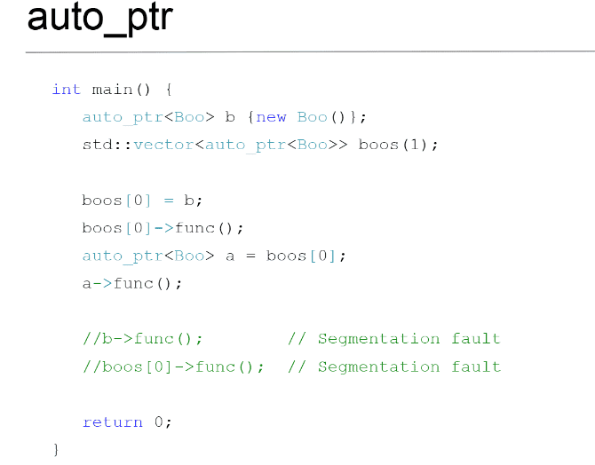

**2 семестр** \
Основы программирования. 

<!--more-->

### Идиома RAII
- омг, может быть такое, что код окончит работу до того, как вызывается делит. Решение - идиома RAII(в конструкторе выделяем память, в деструкторе освобождаем → при любом окончании программы, память освободится)

```cpp
// 
void func() {
	int* ptri = new int(5);
	return;
	/*
	
	*/
	delete ptri;
}
```


```cpp
//используя идиому RAII
class AutoPtr {
public:
	AutoPtr(int value) 
		: value_(new int (value))
// в списке иниуиализации можно вызывать оператор new
	{}

	~AutoPtr() {
		delete value_;
	}  

	int operator*() {
		return *value_;
	}
private:
	int* value_;
};

  

void func() {
	AutoPtr ptr(5);
	return;
}
```

- Чтобы присваивать значение классу, нужно возвращать объект по ссылке
- Проблема написанного указателя - при умолчательном конструкторе копирования просто копируется указатель, а при удалении удаляется объект дважды (not cool)
	- Нужно в конструкторе копирования выделять нужную память
```cpp
	AutoPtr(const AutoPtr& other){
		: value(new T(*(other.value_)))
		{}
	}

	AutoPtr& operator=(const AutoPtr& other){
		if (&other == this){
			return *this;
		}
		
		delete (?)
		// присваивание значения
		
	}

```
- Если указатель не сам создаёт объект, а если ему передают владение указателем, тогда существует 3 стратегии конструктора копирования:

### "Я передаю владение ресурсом" 
 (передаём значение, а сами становимся `nullptr`) - стандарт 98 - `std::auto_ptr` (в 2017 удалили). Можем неявно передать владение (Ex. вектор таких объектов(см. слайд))

```cpp
	AutoPtr(AutoPtr& other)
	{
		value_ = other.value_;
		other.value_ = nullptr;
	}  

	AutoPtr& operator=(AutoPtr& other) {
		if (&other == this) {
			return *this;
		}
		value_ = other.value_;
		other.value_ = nullptr;
		return;
	}
```


### "Ресурс мой, никому не отдам" 
 (просто запрещаем конструкторы копирования и оператор присваивания) стандарт - `std::unique_ptr`
- Шаблон как для самого типа, так и для `Deleter` - ==функтор== (можно передать метод специального деструктора ex. файл и `fclose`)
- метод `release` или `release` (чекнуть)

```cpp
	AutoPtr(AutoPtr& other) = delete;
	AutoPtr& operator=(const AutoPtr& other) = delete;
```

```cpp
template<typename T, typename DeletePtr>
class AutoPtr {
public:
	AutoPtr(T value)
		: value_(new T (value))
	{}
	~AutoPtr() {
		if(value) {
			DeletePtr deleter;
			deleter(value_);
		}
	}
/*

*/
};
```


```cpp
int main() {
	FILE* file = fopen("in.txt");
	fclose(file);
}
```

```cpp
template<typename T, typename DeletePtr>
class AutoPtr {
public:
	AutoPtr(T value)
		: value_(new T (value))
	{}
	~AutoPtr() {
		if(value) {
			DeletePtr deleter;
			deleter(value_);
		}
	}
/*

*/
}

int main() {
	FILE* file = fopen("in.txt")

	AutoPtr<FILE,FileDeleter> fPtr(file);
}
```

### "Пытаться разделить ресурс" 
- Как это сделать, чтобы, при уничтожении одного объекта, ресурс в другом объекте оставался. Если объект последний, то и освобождать ресурс
- `std::shared_ptr`
- Храним счётчик на количество объектов, владеющих этим ресурсом (владеет указателем на счётчик). Копирование увеличивает счётчик, деструктор уменьшает. При значении счётчика равном нулю освобождаем ресурс
- Немного дороже, чем 2 вариант. ==Лучше сначала идти к `unique_ptr`, а потом к `shared_ptr`==
- Крайний пример (см. презентацию)
	- При конструировании указатель внутри структуры с счётчиком 0
	- Когда присвоили указатели, то счётчики стали равны 2

```cpp
struct A;  
struct B {  
    B() { std::cout << "B\n";}  
    ~B() { std::cout << "~B\n";}  
    std::shared_ptr<A> ptr;  
};  
struct A {  
    A() { std::cout << "A\n";}  
    ~A() { std::cout << "~A\n";}  
    std::shared_ptr<B> ptr;  
};  
  
void func(){  
    std::shared_ptr<A> a {new A()};  
    std::shared_ptr<B> b {new B()};  
    a->ptr = b;  
    b->ptr = a;  
    
	std::cout << a.use_count() << " " << a->ptr.use_count() << std::endl;  
	std::cout << b.use_count() << " " << b->ptr.use_count() << std::endl;
    // nothing will be deleted  
}  
  
int main() {  
    func();  
}
```

Решение этой проблемы - std\:\:weak_ptr. Не владеет объектом напрямую, но знает о существование. Может отдать когда существует, если не существует, то не отдаст.

```cpp
#include <iostream>  
struct A;  
struct B {  
    B() { std::cout << "B\n";}  
    ~B() { std::cout << "~B\n";}  
    std::weak_ptr<A> ptr;        // Заменяем shared_ptr на weak_ptr
};  
struct A {  
    A() { std::cout << "A\n";}  
    ~A() { std::cout << "~A\n";}  
    std::weak_ptr<B> ptr;        // Заменяем shared_ptr на weak_ptr
};  
  
void func(){  
    std::shared_ptr<A> a {new A()};  
    std::shared_ptr<B> b {new B()};  
    a->ptr = b;  
    b->ptr = a;  
  
    std::cout << a.use_count() << " " << a->ptr.use_count() << std::endl;  
    std::cout << b.use_count() << " " << b->ptr.use_count() << std::endl;  
    // nothing will be deleted  
}  
  
int main() {  
    func();  
}
```