<a href="https://storage.yandexcloud.net/notakeith/web/lecture_01.pdf" class="btn rounded-full center flex">
    
    Презентация
</a>

## О курсе

Семестр посвящён в основном фронтенд-разработке. Серверная часть будет разбираться мазками, отдельными вкраплениями, а полноценно сервер — план на следующий семестр.

План обширный: хочется обзорно пробежаться по всем основным технологиям, на которых держится современный веб, но при этом дать какую-то глубину, а не просто перечислить, что вообще существует. Смысл именно в понимании базы — понимание базы открывает двери к работе с любыми фреймворками и технологиями, которые существуют сейчас и появятся дальше.

По плану 16 лекций и 7 лабораторных работ. На лекциях основной упор на теорию плюс технологические штуки и кейсы из реальной жизни, на практике — применение этих знаний. По React будет одна лабораторная, а дальше три лабораторные, на которых проект реализуется самостоятельно и тему можно выбрать почти любую.

## Из чего состоит любое веб-приложение на клиенте

Неважно, какие технологии под капотом и какие фреймворки, — на клиентской части браузера всё сводится к трём пунктам:

- **HTML** — скелет, разметка содержимого;
- **CSS** — всё визуальное: оформление, брендирование, анимации;
- **JavaScript** — интерактивность, бизнес-логика, поведение: когда что-то на странице перестраивается, элементы добавляются и исчезают.

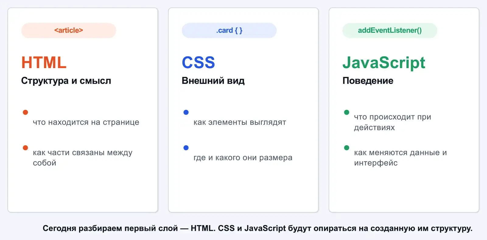

Просто HTML — это текст, каким-то образом размеченный. Красивые страницы, к которым мы привыкли, приносит CSS, а «живость» — JavaScript.

## Как страница попадает в браузер

В адресной строке вбивается URL — уникальный идентификатор ресурса. В этот момент браузер отправляет первый запрос в сеть, чтобы найти расположение ресурса: на каком сервере в интернете он лежит.

Когда сервер найден, самый первый ресурс, который он отдаёт, — как правило, HTML-документ. Этот файл является скелетом всей страницы: он содержит основной текстовый контент и ссылки на дополнительные ресурсы, которые нужны для работы страницы.

Браузер парсит полученный HTML и строит **DOM** — специальный служебный объект, который содержит информацию о структуре документа и его содержимом. Затем из документа извлекаются ссылки на внешние ресурсы, и браузер их скачивает и применяет: CSS — применяет визуальные стили, JavaScript — начинает исполнять код.

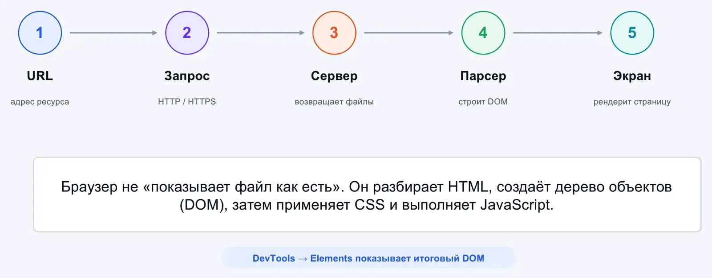

Всё это хорошо видно в средствах разработчика. Открываются они через <kbd>Ctrl</kbd>+<kbd>Shift</kbd>+<kbd>I</kbd> (<kbd>Cmd</kbd>+<kbd>Shift</kbd>+<kbd>I</kbd> на маке) либо правой кнопкой по элементу страницы → «Инспектировать». На вкладке «Сеть» после перезагрузки страницы видно, как много ресурсов на самом деле подтягивается извне: помимо HTML это CSS, JavaScript, картинки, внешние скрипты аналитики и прочее. Запросы можно отфильтровать по типу — и увидеть, что HTML-документ загружается первым. Если открыть его содержимое, оно сопоставляется с тем, что видно визуально: обычный текст, обрамлённый специальными синтаксическими конструкциями в угловых скобках — тегами.

Это один из вопросов, которые задают не только фронтендерам, но и веб-разработчикам в целом, чтобы оценить понимание того, как работает веб. Бывают кандидаты, которые неплохо пишут код на React и хорошо разбираются в самой библиотеке, но на вопрос «откуда этот React появляется на компьютере пользователя» ответить не могут.

## Что такое HTML

HTML — это аббревиатура от HyperText Markup Language. Строго говоря, это даже не язык программирования, а декларативный язык разметки, который превращает обычный текст в гипертекст.

Появился он много лет назад, когда у учёных возникла необходимость обмениваться результатами исследований и научными статьями с помощью компьютеров. Обычный текст в терминале не очень информативен и неудобен для чтения, поэтому появилась потребность этот текст разметить: сделать какие-то его части более заметными и осмысленными. Тогда и начали появляться всевозможные языки разметки — Markdown, LaTeX и другие.

С помощью HTML к элементам текста добавляется дополнительный смысл — то, что называется семантикой, — и визуально различимая структура.

## Теги и элементы

Основная единица HTML-документа — **тег**. Это запись в исходнике: пользователь визуально не видит сам тег, он видит результат его применения.

Теги, как правило, парные: есть отдельно открывающий и отдельно закрывающий, и они обрамляют кусок содержимого. Но это не правило, а скорее эмпирическая штука — бывают и одиночные теги, когда всё нужное укладывается в один тег.

Конструкция «открывающий тег + содержимое + закрывающий тег» называется **HTML-элементом**. Работать мы будем именно с элементами.

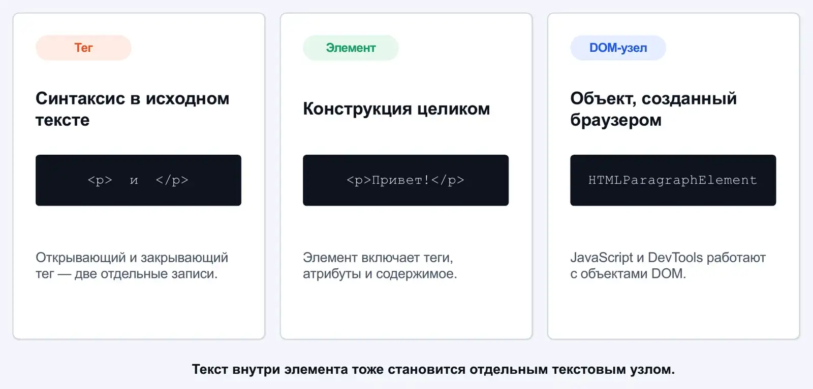

### Анатомия тега

В угловых скобках указывается имя элемента. Разных элементов очень много, запоминать все не надо — основные всё равно останутся в голове. Стоит помнить, что за каждым именем стоит осмысленное слово, которое передаёт назначение элемента: например, `a` — от anchor, «якорь», то есть ссылка (внешняя или внутренняя).

Закрывающий тег выглядит так же, только со слешем, который стоит первым сразу после угловой скобки.

У тегов бывают **атрибуты** — наборы пар «ключ — значение», которые дают тегу дополнительные свойства и говорят браузеру, как этот элемент должен себя вести. Через атрибуты же задаётся какой-то базовый функционал. Например, `href` у тега `a` указывает, к чему мы подцепляемся: внешний ресурс, раздел страницы и так далее.

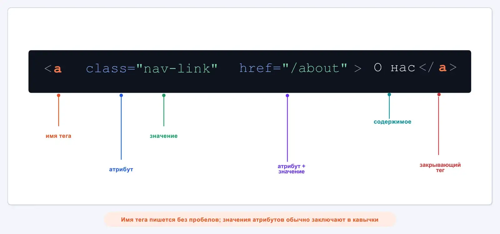

### Одиночные теги

Одиночные (их же называют пустыми) теги используются сами по себе и не имеют пары. Например:

- `img` — для отображения изображений, с атрибутом `src`, указывающим адрес ресурса;
- `input` — поля ввода, кнопки и прочее.

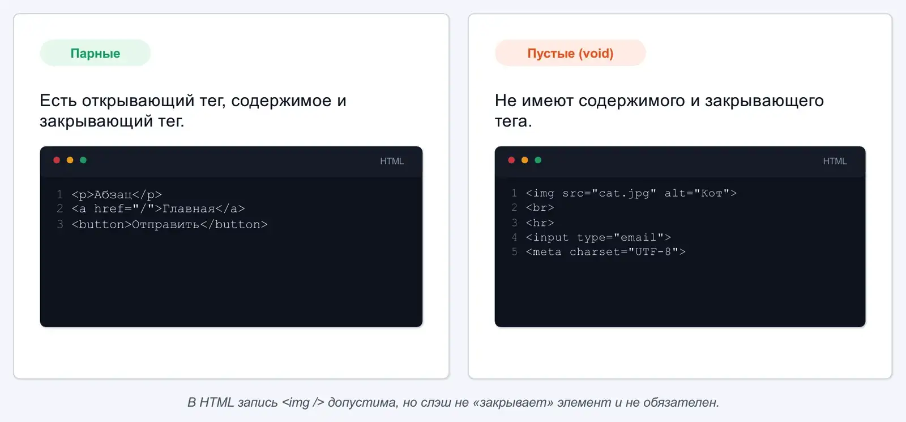

## DOM-дерево

Главная концепция, на которой всё держится, — DOM-дерево. Теги могут быть вложены друг в друга, и в результате вложенности появляется древовидная структура: есть теги-родители, которые содержат другие узлы, и теги-потомки.

В простейшем примере на самом верху тег `main`, который обрамляет всё содержимое; у него один потомок — `article`; внутри `article` — заголовок и абзац, а внутри каждого из них текстовые узлы, которые являются конечными листьями.

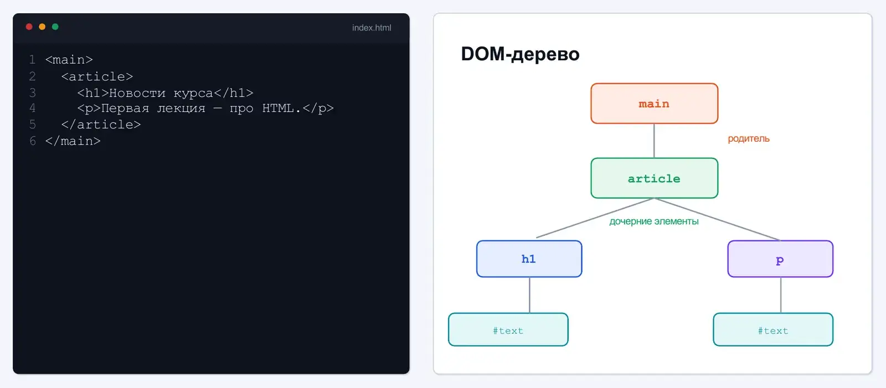

Текст всегда является отдельным узлом именно потому, что это конечный лист, у которого не бывает потомков. Современные браузеры достраивают структуру сами: если написать `h1` и внутри просто текст, браузер этот текстовый узел создаст.

К этой концепции мы будем постоянно возвращаться при изучении CSS и JavaScript, потому что идея дерева используется для доступа к элементам. Имея в переменной сохранённый элемент страницы, можно, используя алгоритмы обхода деревьев, быстро найти его родителя, его «сиблингов» (элементы с общим родителем, на одном уровне), перемещаться вверх и вниз и получать доступ к нужным элементам.

## Правильная вложенность

Закрывать элементы нужно в обратном порядке — как со скобками. Если открывающий тег обрамляет целиком какой-то элемент, внутри которого есть другие теги, нужно следить за правильным порядком закрывающих тегов.

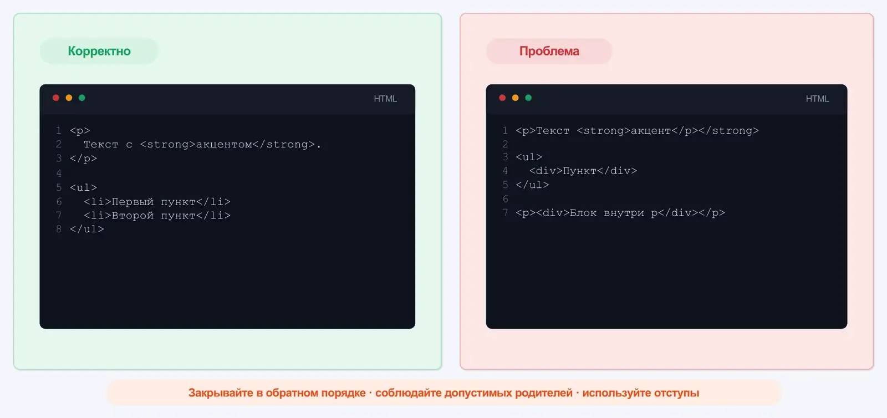

Некорректная вложенность на современном браузере фатального падения страницы, скорее всего, не вызовет: содержимое останется, но могут разломаться стили и что-то отобразится неожиданным образом. Браузеры умеют восстанавливать сломанную структуру HTML и самостоятельно расставлять забытые закрывающие теги.

В целом это проблема из прошлого века, когда контент для страниц писали в терминале. В современной IDE такое почти не возникает: работает автокомплит — написал открывающий тег, закрывающий появился сам.

## Минимальный HTML-документ

Хорошей практикой считается такая структура. Если что-то из этого опустить, страшного не случится и браузер что-то всё равно покажет, но писать стоит правильно.

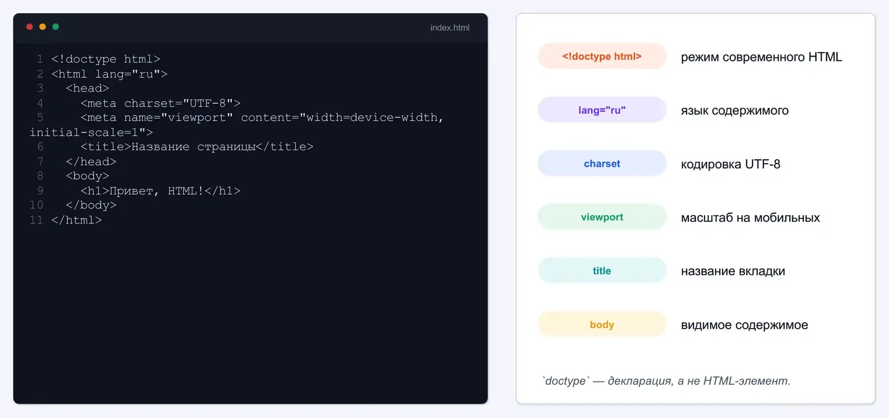

- **`<!DOCTYPE html>`** — инструкция браузеру, что всё, что встретится дальше, является HTML5-документом, то есть как это парсить и обрабатывать. Сейчас это скорее исторический пережиток: на заре интернета первые браузеры (Netscape Navigator и прочие) использовались не только для просмотра HTML, по сети скачивались документы разных форматов, и этот тег говорил, что дальше именно HTML.
- **`html`** — высокоуровневое обрамление всего контента страницы. В его атрибутах браузеру даются дополнительные инструкции: в примере это `lang="ru"`, который говорит, что содержимое на русском языке. Исходя из этого браузер определённым образом строит контент — например, для языков с написанием right-to-left вроде арабского он сразу понимает, что строить нужно справа налево.

У `html` два потомка: `head` и `body`.

**`body`** — основное содержимое страницы: всё, что там указано, пользователь потом видит.

**`head`** — служебная информация для браузера о том, как со страницей работать:

- `meta` с кодировкой страницы;
- `meta` с инструкцией о масштабировании: атрибут `content` со значением `width=device-width` говорит, что ширина страницы должна соответствовать ширине девайса. Одну и ту же страницу смотрят с разных устройств, и браузер будет перестраивать контент под соответствующую ширину;
- `title` — название таба в браузере;
- `script` — подключение скриптов. Здесь нужно быть осторожным: из-за того, как браузер парсит HTML и работает с ресурсами, скрипт может заблокировать загрузку остальных ресурсов и отрисовку страницы, поэтому браузеру подсказывают атрибутом, как именно этот скрипт загружать.

## Пробелы и форматирование текста

Все пробелы и переносы строк в исходнике по умолчанию схлопываются и на странице видны не будут. Чтобы гарантированно получить нужное форматирование, используются специальные символы — у каждого символа и у неразрывного пробела есть своё обозначение. Если нужно наверняка развести части текста, лучше использовать их, а не полагаться на пробелы в исходнике: на разных браузерах это не будет работать гарантированно.

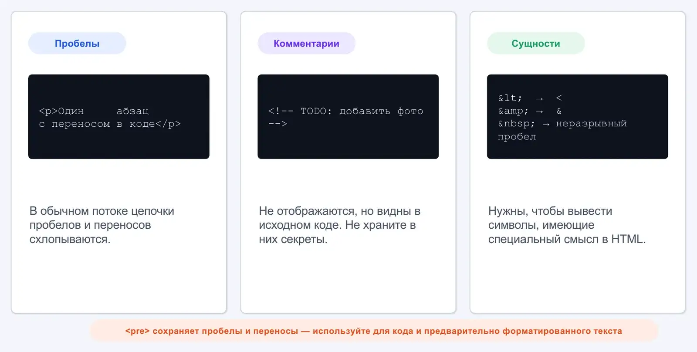

## Атрибуты

Атрибуты — дополнительные настройки элементов. На примере тега `img`:

- `src` — обязательный, адрес ресурса;
- `alt` — технически необязательный, но лучшие практики требуют его использования. Содержит текст, который отображается, если изображение не загрузилось (плохая сеть и так далее). Кроме того, он используется скринридерами — специальными устройствами, которые помогают людям с ограниченными возможностями пользоваться страницами: такой пользователь не видит картинку, а слышит замещающий текст;
- `loading` — появился не так давно, стандарт определяет, каким образом браузер будет загружать картинку. `loading="lazy"` означает, что картинка загрузится только когда соответствующий элемент попадёт в область просмотра. Если картинка внизу страницы и изначально не видна, она не будет загружена вовсе — в ресурсах страницы её не будет; когда пользователь доскроллит, она подгрузится. Это помогает быстрее загружать страницы и экономить трафик.

Отдельно про кэширование: сохранится ли уже загруженная ленивая картинка на потом — зависит от многих вещей, от кэша на уровне браузера и сервера и их настроек. `loading` — это примитивная оптимизация и инструкция браузеру в рамках конкретной сессии; по умолчанию кэширования тут не происходит, но настроить сохранение в браузере можно.

Размеры картинки (`width`, `height`) можно задать и на уровне HTML — браузер сделает контейнер соответствующего размера и при необходимости отмасштабирует изображение. Но указывать размеры в разметке — не лучшая практика, в основном это делается стилями.

Тег `figure` вместе с `figcaption` обрамляет картинку и подпись к ней — с точки зрения правильной разметки картинку с её описанием нужно объединять.

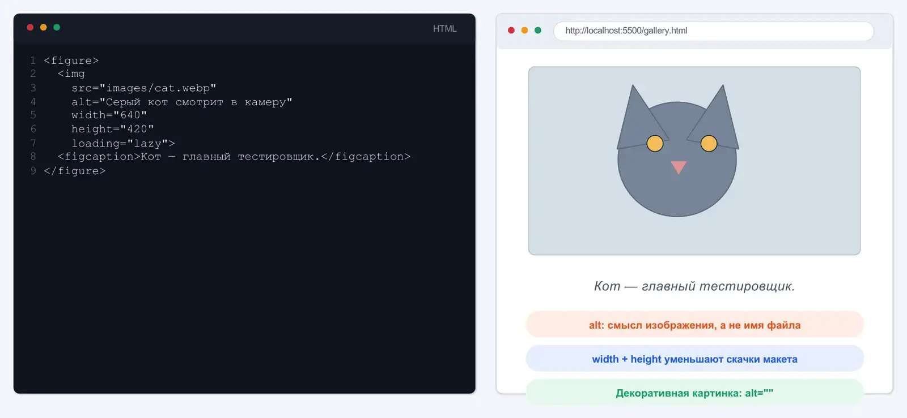

### Глобальные атрибуты

Это атрибуты, которые можно использовать с любым тегом:

- `id` — уникальный идентификатор, позволяющий быстро и эффективно находить элементы страницы. Ключевое здесь — уникальность, двух одинаковых `id` быть не должно;
- `lang` — можно задать любому тегу, но применять его ко всем элементам странно: как правило, указывается на самом верху и наследуется остальными элементами;
- остальные глобальные атрибуты позволяют скрыть элемент, сделать его редактируемым, сделать так, чтобы элемент участвовал в фокусе при клавиатурной навигации, или наоборот убрать его из неё — например, скрыть какие-то элементы формы от навигации с клавиатуры.

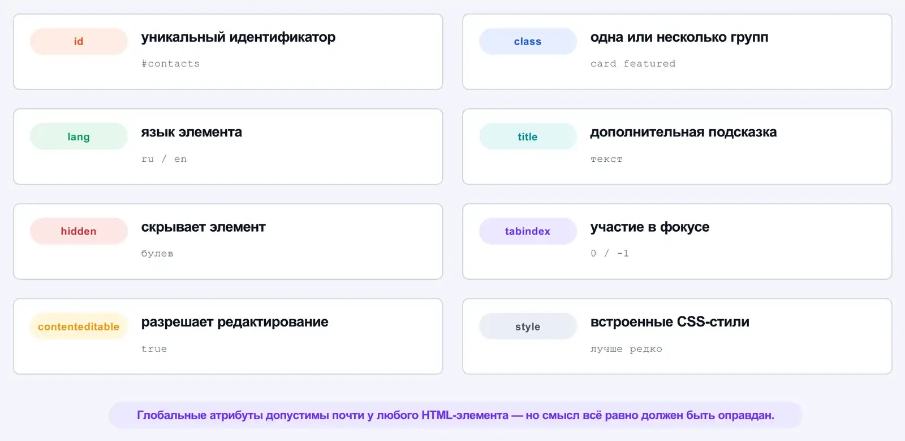

### Булевые атрибуты

Принимают значения `true` или `false`. Как правило, такие атрибуты пишут только тогда, когда значение `true`, потому что значение по умолчанию — `false`. Пример — `required` у поля ввода: показывает, что поле обязательное и форму без него не отправить. Само указание атрибута уже устанавливает его в `true`, поэтому писать значение явно не принято.

### data-атрибуты

Помимо стандартных атрибутов любому элементу можно добавлять свои собственные — через `data-` и произвольное имя.

Зачем это нужно: когда мы пишем кастомный интерфейс и нам нужно взаимодействовать с элементами из JavaScript, можно навесить, например, `data-id` и по нему потом понимать, с каким элементом страницы работает пользователь. При этом мы не полагаемся на стандартные атрибуты, а имеем свои кастомные идентификаторы, привязанные к бизнес-логике приложения.

История с data-атрибутами очень полезна для аналитики, а также, например, для интерфейсов вроде табличного редактора, где много однотипных ячеек, которые тяжело идентифицировать из JavaScript.

### aria-атрибуты

Помогают вспомогательным устройствам лучше обрабатывать страницы. С их помощью задаётся дополнительная информация, связанная с доступностью — с возможностями для людей с проблемами зрения, слуха и так далее.

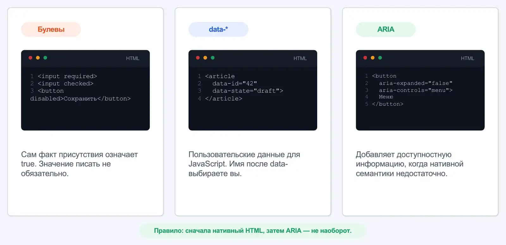

## Основные теги

### Заголовки и абзацы

Самое первое, для чего нужны теги, — разбить сплошной текст на смысловые блоки: заголовки и абзацы.

- `h1` — heading 1, заголовок первого уровня, определяющий, о чём вообще документ. По всем правилам он должен быть один на странице;
- `p` — сокращение от paragraph, осмысленный блок текста;
- заголовков всего 6 уровней, с первого по шестой, седьмого не существует. Количество заголовков уровней ниже первого не ограничено, но их структура должна передавать структуру страницы: два больших раздела — два заголовка второго уровня, внутри подразделы — заголовки следующего уровня.

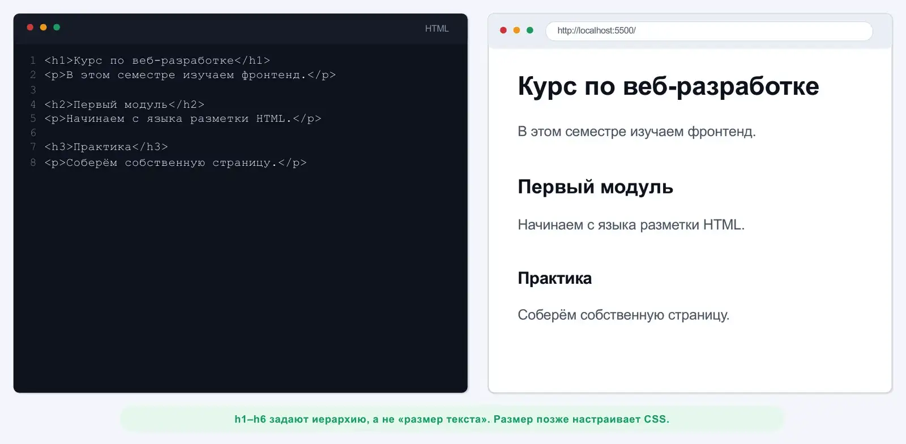

Это стандартная структура любого документа, та же самая, что и в Markdown, — Markdown, кстати, сейчас приходится писать даже больше, чем HTML, потому что на нём пишутся всякие инструкции для агентов, и он дешевле с точки зрения токенов.

### Смысловое выделение

Тегами можно выделять текст по смыслу: `strong` делает шрифт жирным и одновременно показывает важность, и эту важность может подчеркнуть скринридер при чтении страницы.

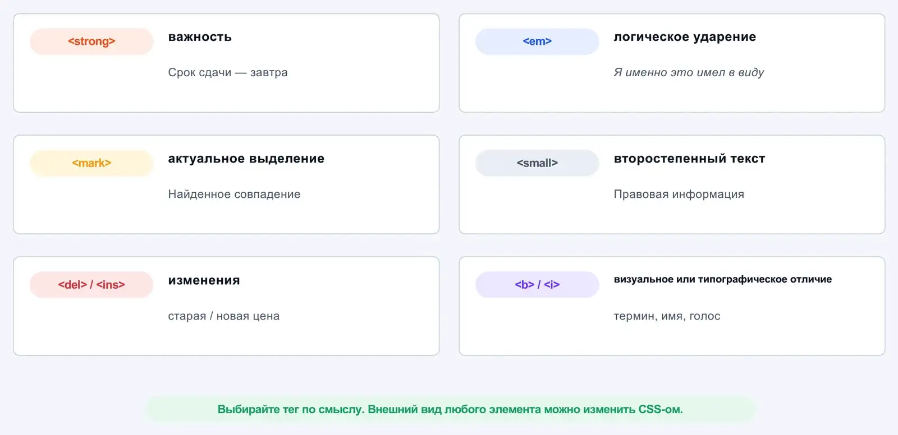

На практике теги смыслового выделения внутри текста в современной разработке используются довольно редко: визуальные изменения текста делаются через CSS. Но если говорить про исходную идеологию HTML, то самый правильный способ выделять текст — именно теги, потому что помимо визуальной составляющей каждый тег приносит семантику.

Тегами также вставляются цитаты, фрагменты и всевозможные дополнительные блоки, оформление которых отличается от обычного текста.

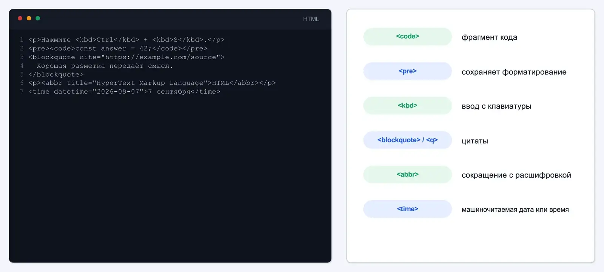

Запоминать все эти теги смысла нет: они используются редко, а когда возникнет необходимость, достаточно поискать, какой тег лучше подходит под цель. Набор тегов постоянно расширяется — совсем недавно появились теги, с помощью которых можно сделать модальное окно: контент появляется и закрывается штатными средствами, тогда как раньше это было возможно только через JavaScript. Следить за такими изменениями полезно.

### Списки

- `ul` — маркированный, немаркированный список;
- `ol` — order list, список с заданным порядком;
- `li` — элемент списка, используется внутри.

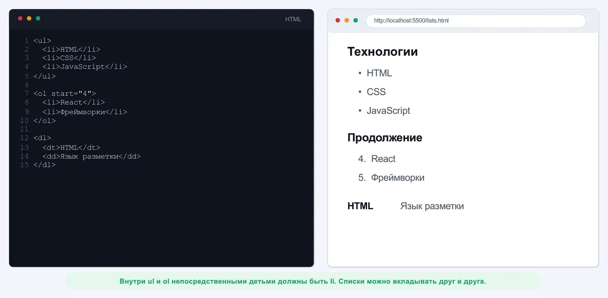

### Тег `a`

Один из основных элементов зари интернета: именно он позволил связать разные документы и обеспечить навигацию от одного документа к другому. Сейчас это воспринимается как само собой разумеющееся, а много лет назад было cutting edge изобретением.

В `href` можно зашить не только ссылку на другую страницу или раздел документа:

- ссылку, которая подскажет браузеру открыть почтовый клиент, чтобы отправить письмо;
- ссылку с номером телефона: телефон поймёт, что это номер, и по клику откроет приложение «Телефон» с предложением позвонить.

Атрибут `target="_blank"` подсказывает браузеру, что ссылку нужно открыть в новом окне, а не в том же самом, — предыдущая страница остаётся в том же положении.

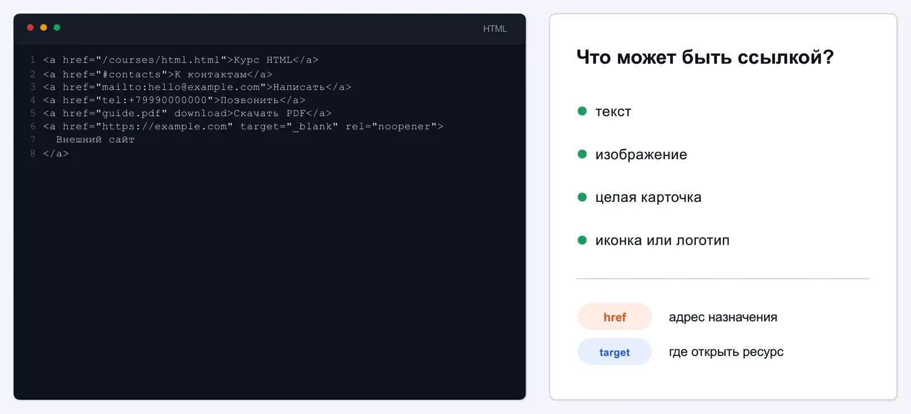

Про `href` нужно помнить, как ресурсы в интернете связаны друг с другом: ссылки бывают абсолютными и относительными — от корня сайта, от текущего файла и так далее.

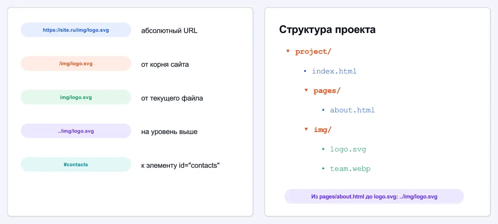

На первых лабораторных всё будет просто: файлы лежат в одной папочке рядом, плюс для удобства используется веб-сервер. Но когда работа идёт с большим приложением, среда разработки и то место, где сайт потом хостится, будут отличаться, и об этом забывать нельзя. Иначе получится так: локально всё работает, картинки подгружаются, а после деплоя на сервер картинки грузиться перестали, потому что браузер ищет их не по тому пути — относительно текущего файла вместо нужного каталога.

С картинками механизм тот же, только вместо `href` используется `src`.

## Семантика

Семантика — дополнительный смысл, который несёт каждый тег на странице.

Чисто технически, с точки зрения визуала, любую страницу можно сверстать на одних `div`, и это будет работать. Но с точки зрения семантики это неправильно, потому что именно использование специфичных тегов для разных разделов страницы делает интернет таким, каким мы его знаем:

- **доступность.** Некоторые теги скринридер может пропускать в зависимости от настроек: пользователь не хочет читать весь контент страницы, ему нужно только самое главное, и что здесь главное, скринридер понимает из семантики;
- **SEO-оптимизация** — механизм, позволяющий поднять сайт в поисковой выдаче. Роботы и автоматические сканеры, которые обходят интернет и ранжируют страницы, тоже смотрят на семантику.

Семантический каркас добавляет каждому элементу дополнительный смысл, и благодаря этому понятно, где основной контент страницы, а где, например, футер, в котором ничего супер важного нет, но есть информация, которая тоже может пригодиться.

### Структурные теги

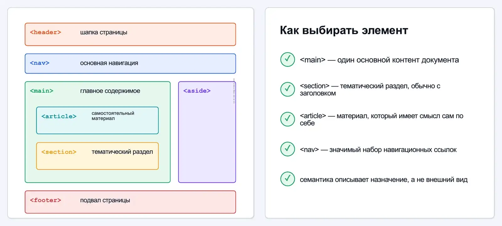

- `header` — шапка страницы. Как правило, переиспользуемая из страницы в страницу, с одинаковыми элементами: логотип компании и прочее;
- `nav` — навигация по страницам сайта, обычно в верхней части;
- `main` — основной контент страницы;
- `aside` — вспомогательный контент рядом с основным: относится к странице, но главным не является. Хороший пример — поисковая выдача: сами результаты и `aside` справа с рекламой и дополнительными ссылками. Википедия как пример не очень: это очень старый ресурс, переживший времена, когда не было ни флексбоксов, ни гридов, и сайты верстали таблицами — распределение контента по горизонтали и вертикали задавалось через таблицы;
- `article` — статья, самостоятельный блок контента. Представьте блог, в котором несколько статей идут друг за другом лентой: каждая такая статья или её превью — отдельный `article`;
- `section` — тематический раздел, смысловая группировка. Например, секция «топ-3 статьи» в самом верху страницы, внутри которой три `article`, а дальше отдельный `section` с другими статьями. Или лендинг: hero banner, потом блок преимуществ — это могут быть отдельные секции, при этом `article` не используется вовсе;
- `footer` — подвал страницы, тоже переиспользуемый.

Использование всех этих тегов не обязательно и не всегда уместно: в макете может просто не быть отдельных разделов.

### div и span

Элементы без семантики.

- `div` — блочный элемент, формирует блок со своей высотой и шириной;
- `span` — строчный элемент, выстраивает содержимое в одну строчку до тех пор, пока хватает ширины, а дальше переносит.

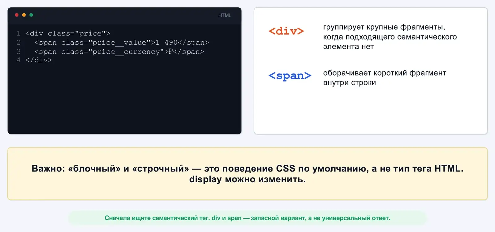

Важный момент: блочность и строчность — это не часть HTML, а поведение CSS по умолчанию. Эта характеристика определяет только то, как элемент расположен на странице относительно других. Подробнее — на следующей лекции.

### Таблицы

Для таблиц есть специальные теги, и хорошей практикой сейчас является использовать их только для таблиц. Но был период в развитии интернета, когда создателям сайтов хотелось визуально разделить контент, расположить его в несколько колонок, а стандартных средств для этого не было — и использовались таблицы: фактически вся страница представлялась большой таблицей, в ячейках которой располагались блоки вроде `article` и `aside`. Сейчас так, естественно, не делают.

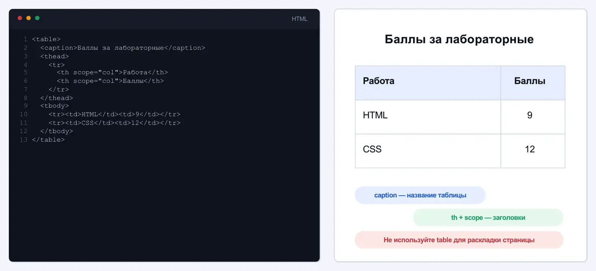

## Формы

`form` и набор дочерних тегов используются для сбора пользовательских данных. Формы — привычная часть интернета, и за всеми современными формами стоит не только HTML, но и JavaScript: он валидирует поля, собирает форму, реализует пошаговые формы, где на разных шагах собираются разные данные. Но и на уровне самого HTML возможности довольно обширные.

У самого тега `form` два атрибута:

- `action` — на чистом HTML обязательный. Указывает endpoint, URL, куда отправить собранные данные после сабмита. Это какой-то адрес, который эти данные ожидает; в примере форма отправляет данные относительно корня своего же сайта, то есть сайт отвечает не только за отображение страницы, но и за приём данных. Отправить во внешний адрес тоже возможно;
- `method` — необязательный, без него работает поведение по умолчанию. Здесь используется протокол HTTP, и мы просто говорим браузеру, каким методом отправлять данные.

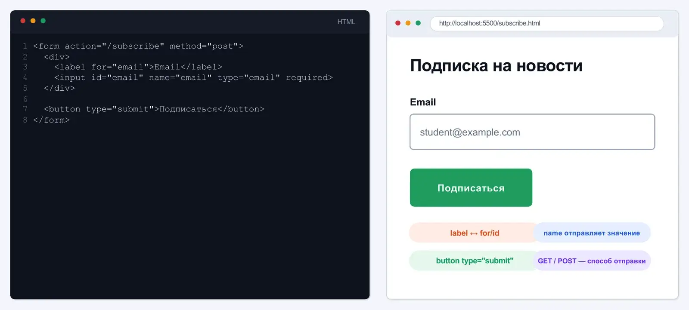

Внутри формы располагаются элементы ввода: `input`, `button`, чекбоксы и так далее.

В современном стандарте у этих элементов очень обширные настройки, задающие базовое поведение, и их стоит использовать:

- `type` у `input` задаёт тип поля, и браузер применяет базовые правила по умолчанию, без нашего кода. Указан `type="email"` — браузер будет ожидать в этой строке собачку и точку, валидация заработает сама. `type="password"` — при вводе символы скрываются стандартным значком. Переопределить это, естественно, можно, но базовое поведение уже задано;
- `required` — поле обязательное, без заполнения форму нельзя отправить;
- `autocomplete` и прочие атрибуты задают дополнительное поведение.

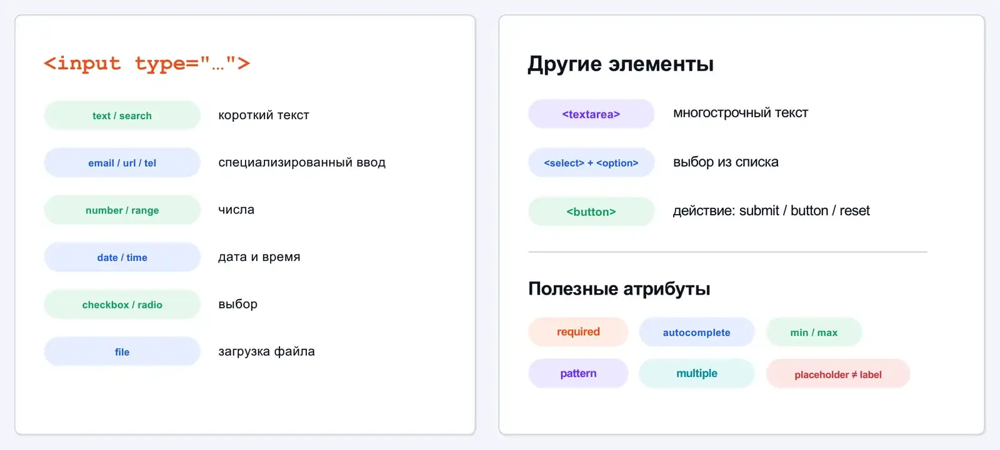

Интересный момент: когда в форму ставится кнопка с типом submit, браузеру подсказывается, что по нажатию нужно собрать данные из всех полей формы и выполнить `action`, то есть отправить их. Таким образом интерактивность и отправка данных получаются вообще без пользовательского JavaScript.

Куда попадут собранные данные, зависит от метода: при `post` — в тело запроса, при `get` — в query-параметры.

## Медиа

HTML позволяет встраивать в страницу потоковый контент — аудио и видео. Есть встроенные элементы управления, которые позволяют этот поток декодировать и показывать: стандартный плеер для видео, проигрывание аудиофайлов. Работает это не по HTTP, за этим стоят свои технологии, но сами элементы `video`, `audio` — уже часть стандарта.

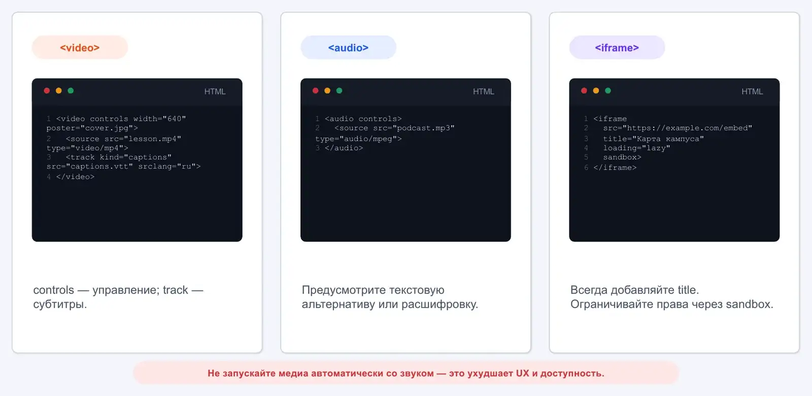

Много лет назад для этого приходилось строить костыли: когда появился YouTube, это был технологический прорыв, за которым стояло что-то невообразимое. Сейчас достаточно поставить элемент на страницу, выставить ссылку на ресурс — и всё работает, никаких сверхглубоких познаний не требуется.

## Доступность

Доступность — необходимость обеспечить удобство пользования интерфейсами людям с ограниченными возможностями.

В России этому внимания особо не уделяют, хотя Яндекс участвует в соответствующих рейтингах; в прошлом сезоне у лектора был технопроект по повышению доступности интерфейсов Еды. В США же есть законодательное требование: сайт, у которого больше определённого числа пользователей в неделю, обязан иметь определённую оценку по доступности, а за нарушение компания платит.

На практике это выглядело так: при запуске приложения для вузов одним из глобальных этапов было тестирование с слабовидящими пользователями, которые пользовались сайтом и говорили, где навигация с клавиатуры неудобна.

Когда создаёте интерфейсы, помните, что вашими пользователями будут не только те, кто смотрит на сайт и водит мышкой или пальцем по экрану. Будут люди, использующие для навигации клавиатуру. Для этого нужны соответствующие атрибуты, правильная структура документа и правильные теги — всё это вместе и составляет доступность.

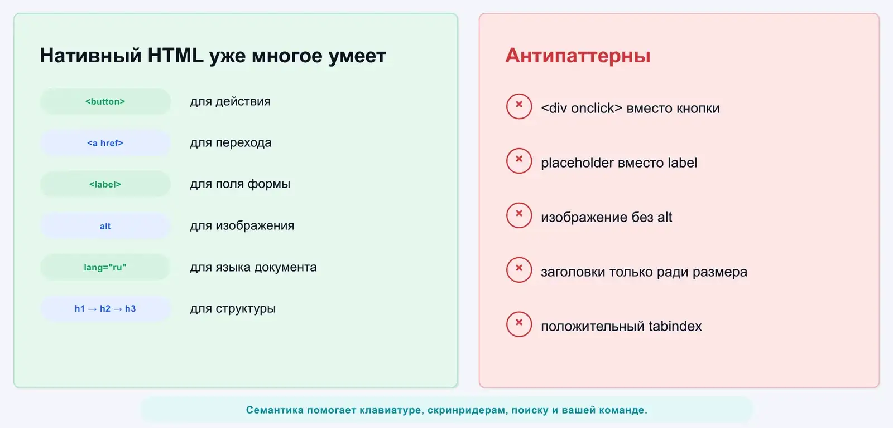

## Ошибки в разметке и инструменты

Проблема некорректной разметки сейчас уже не так актуальна: проверить структуру легко, тогда как раньше для этого использовались вспомогательные расширения для браузера. Писать каркас HTML-страницы руками в наше время тоже уже не обязательно.

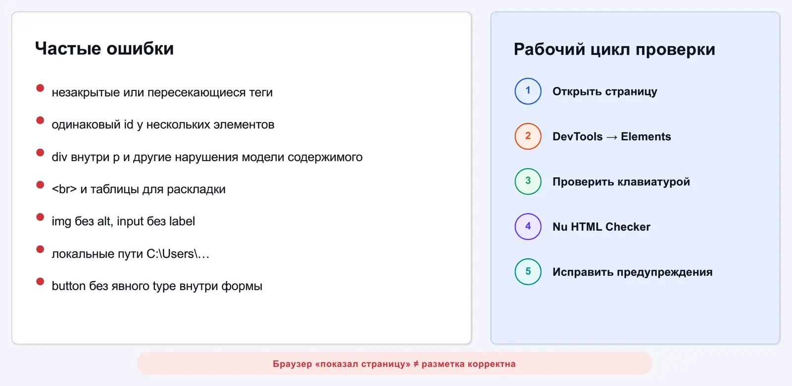

Полезные ресурсы:

- **MDN** — справочник по тегам и их возможностям;
- ресурс, который показывает, какие версии браузеров что поддерживают: вбиваете тег, который хотите проверить, и видите, можно им пользоваться или нет.

Отдельно про стандарт: есть организация — W3C, — которая создаёт стандарты, описывает, какие теги должны быть и как они должны работать. Много лет назад было решено, что появился стандарт HTML5 и дальше номерных версий не будет: HTML6 не появится, а будет просто HTML. Все новые возможности и теги входят в тот же стандарт и должны поддерживать обратную совместимость — они не должны ломать то, что уже существует; в худшем случае просто не произойдёт ничего.

## Про ИИ и вайбкодинг

Фронтенд действительно очень любят вайбкодить. Но мотивация погружаться в базу такая: разделение на фронтенд и бэкенд, скорее всего, в ближайшие годы уйдёт. Так же, как лет 10–15 назад были веб-мастера, которые делали всё сразу; потом пошла узкая специализация, потому что в каждом направлении нужно было изучить слишком много и ресурсов одного человека не хватало. А сейчас, с поддержкой агентов, один человек снова может делать и фронтенд, и бэкенд — всё идёт к фуллстеку, и в Яндексе на практике уже так.

Убедительная просьба при этом: не заменяйте свой мозг ИИшкой. Привлекать её можно, когда вы понимаете, что она делает и что там происходит. Если она будет делать всё полностью вместо вас, получится как в мультике про Тридевятое царство, где двое из ларца на просьбу «замесите, нарубите» сделали что-то совсем не то, что было нужно. С ИИшкой история такая же: прежде чем просить её что-то сделать, нужно самим разобраться и понять, как это работает.

## Первая лабораторная

Задание — сверстать страничку по макету в Figma, использовав не менее 15 разных тегов.

Задание простое: тегов существует огромное количество, и для разных нужд можно найти самый подходящий. Понятно, что всё можно сделать обычными `div`, но это будет неправильно — нужно использовать разные теги и познакомиться с ними.

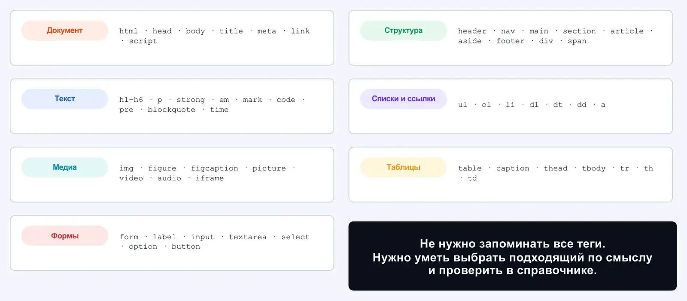

Про точность: речь не идёт о вёрстке 1:1, потому что CSS и стили ещё не проходили. Задача — создать каркас, страницу, на которую потом натягивается красивая шкурка.
