<a href="https://storage.yandexcloud.net/notakeith/web/lecture_02.pdf" class="btn rounded-full center flex">
    
    Презентация
</a>

## План

Эта лекция ещё связана с лабораторной работой, дальше курс переходит на JavaScript, но к CSS вернёмся, когда будем говорить о более продуктовых вещах и о том, как всё работает вместе.

Сегодня разбираем:

- атрибут `style` и зачем понадобились отдельные стили;
- значения CSS-свойств: цвета, размеры, функции;
- способы подключения CSS и селекторы;
- каскад, наследование и специфичность;
- блочную модель (box model);
- позиционирование и Flexbox.

## Атрибут `style`

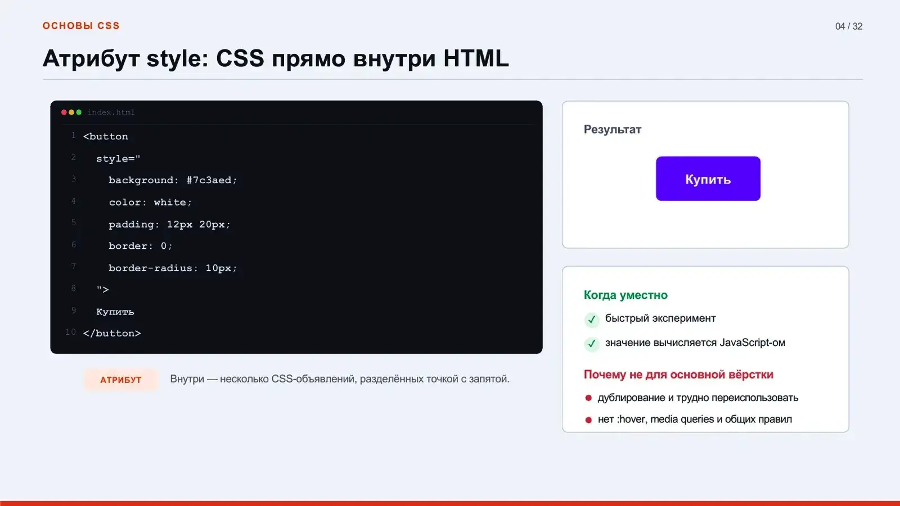

Вспомним HTML: у любого тега могут быть атрибуты. Один из глобальных атрибутов, который можно применить к любому тегу, это `style`. Через него задаётся внешний вид элемента: цвет текста, фон и так далее. Синтаксис как у любого атрибута: название, дальше в кавычках значение.

```html
<p style="color: red; background: yellow;">Текст</p>
```

Внутри значения пишем пары «свойство: значение», разделённые точкой с запятой.

У такого подхода много минусов:

1. **Не все возможности CSS доступны.** Есть вещи, которые через inline-стиль задать невозможно (например, стили для псевдоклассов, о них ниже).
2. **Код размазан по всей странице.** То, что определяет внешний вид, раскидано по разметке. Менять и поддерживать такой код на реальном проекте практически невозможно.

Для решения этой проблемы и появились отдельные таблицы стилей — CSS.

## Значения свойств

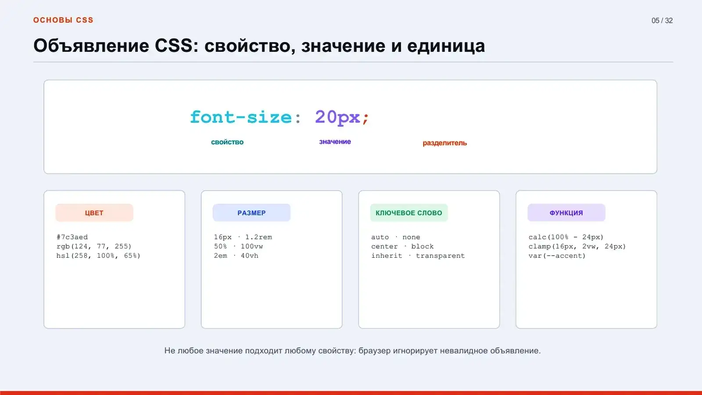

Вариантов значений очень много, запоминать все смысла нет. Разберём основные группы.

### Цвета

- **Именованные цвета** — `red` и т. д. В CSS определено довольно много цветов с названиями.
- **Шестнадцатеричная запись** — `#ff0000`. Историческая основа — три канала: красный, зелёный, синий. Для каждого указываем интенсивность, каналы смешиваются, и получается итоговый цвет.
- **`rgb()`** — то же самое, но значения каналов записываются в десятичном виде.
- **HSL** — цвет задаётся через оттенок, насыщенность и яркость.

Также есть более новые нотации, которые дают более предсказуемый результат. Старые способы (в том числе HSL) не всегда дают тот цвет, которого ожидаешь.

### Размеры

Чаще всего размеры задают в пикселях (`px`), но с ними много проблем. Вообще это одна из главных проблем, которую пытаются решить, расширяя спецификацию CSS: у пользователей огромный набор устройств. Раньше был, условно, один вариант — экран компьютера, а сейчас устройства разные по размеру, по работе с цветом, и хочется, чтобы страница более-менее одинаково отображалась везде.

Пиксели — абсолютная величина. На современных устройствах плотность пикселей может быть в два раза выше, и элемент размером 16 px там будет выглядеть гораздо меньше, чем на обычном экране.

Поэтому есть **относительные величины**:

- **`rem`** — относительно размера шрифта по умолчанию. Если базовый размер шрифта, скажем, 14 px, то `1.2rem` означает «в 1,2 раза больше стандартного».
- **Проценты и единицы относительно экрана** — размер можно считать от размеров родителя или окна (например, от ширины экрана).

> Если указать свойству недопустимое значение, ничего страшного не произойдёт: правило просто не применится, и это сразу будет видно.

### CSS-функции

Отдельный вид значений — функции. Их набор постоянно расширяется. Они нужны для динамических значений, которые заранее неизвестны и вычисляются при рендеринге страницы.

**`calc()`** — вычисляет размер и позволяет смешивать на первый взгляд несовместимые величины. Например, взять 50 % ширины экрана и вычесть 24 пикселя — на разных экранах результат будет разным:

```css
.block {
  width: calc(50vw - 24px);
}
```

**`clamp()`** — позволяет ограничить значение сверху и снизу. Принимает три аргумента: минимальное значение, желаемое и максимальное.

```css
.block {
  width: clamp(200px, 50%, 600px);
}
```

## Инструменты разработчика

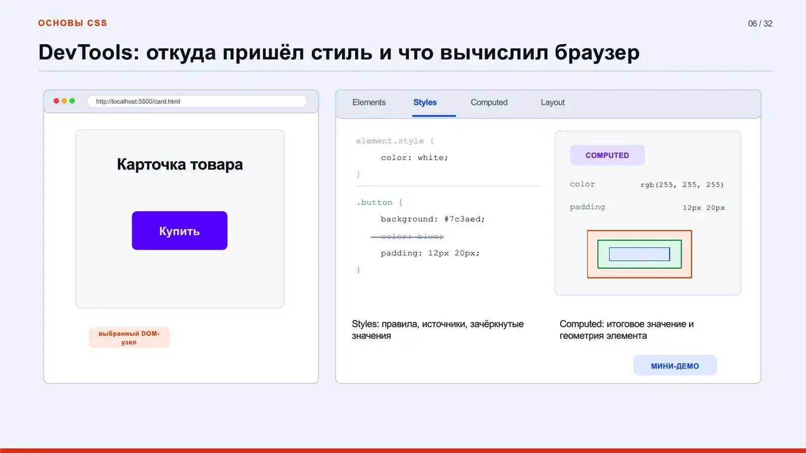

В DevTools на вкладке с элементами можно выбрать элемент и посмотреть панель стилей:

- видно все правила, которые применились к элементу, и откуда они пришли;
- часть стилей приходит из **стилей браузера по умолчанию** (user agent stylesheet);
- стили, которые были переопределены и в итоге не применились, отображаются перечёркнутыми;
- можно прямо руками менять значения и добавлять свои свойства;
- можно принудительно включить состояние элемента (например, `:hover`), чтобы посмотреть, как он выглядит.

## Способы подключения CSS

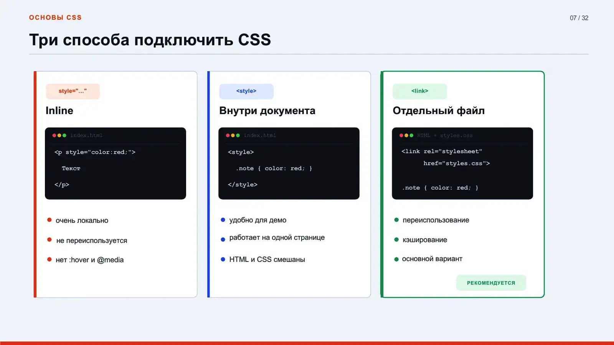

1. **Inline-стили** — атрибут `style` у элемента (см. выше).
2. **Тег `<style>`** внутри документа. Используется в редких случаях, например, когда нужна какая-то минимальная страница без отдельного файла стилей.
3. **Внешний файл через `<link>`** — самый распространённый и рекомендуемый способ:

```html
<link rel="stylesheet" href="styles.css">
```

## Синтаксис правила

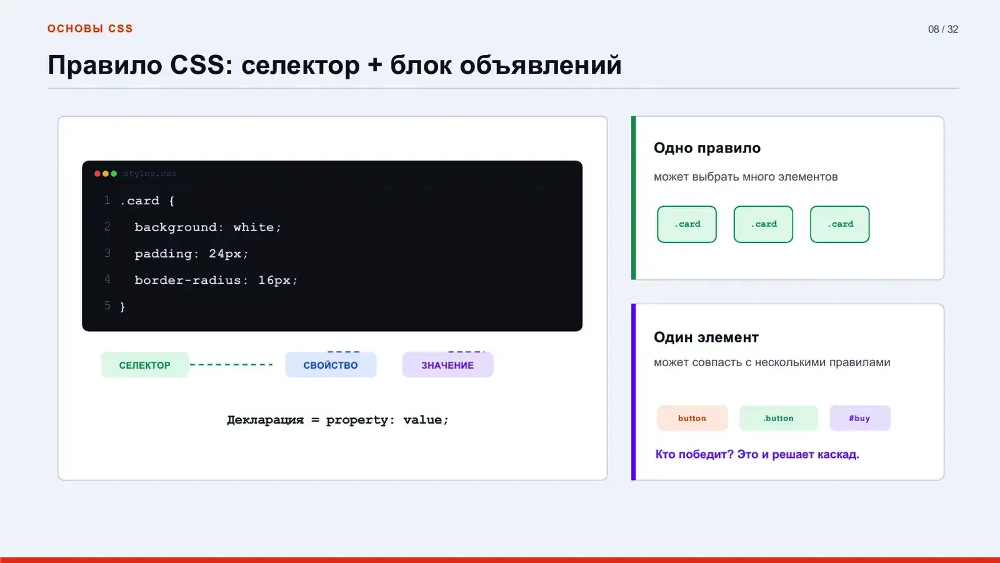

CSS-код состоит из правил. Правило — это **селектор** (способ выбрать набор элементов, к которым применяется стиль) и фигурные скобки, внутри которых пары «свойство: значение».

```css
селектор {
  свойство: значение;
  свойство: значение;
}
```

## Селекторы

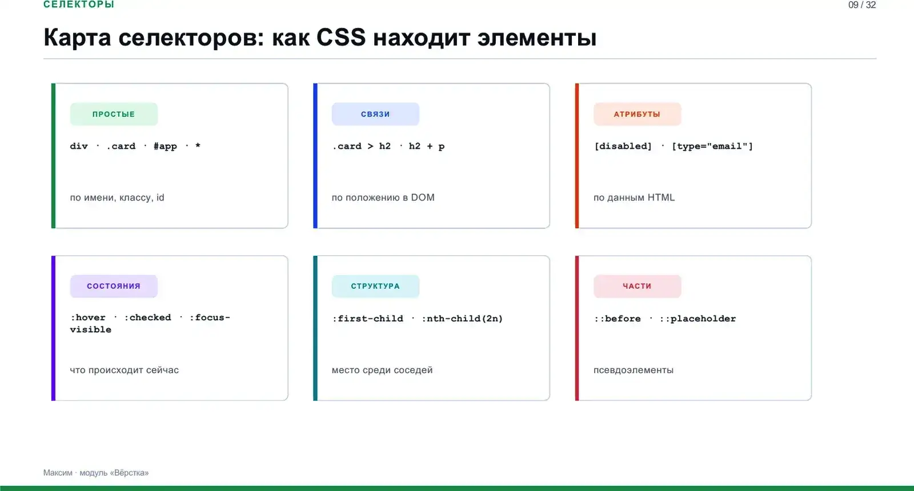
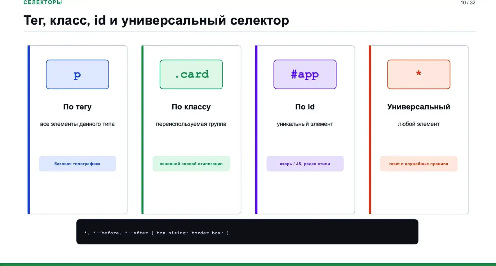

Чаще всего используются три вида: по тегу, по классу и по id.

**По тегу** — выбирает все элементы с этим тегом:

```css
p { color: gray; }
```

**По классу.** `class` — глобальный атрибут. Главное, что стоит запомнить: классов на странице может быть много, у одного элемента может быть сразу несколько классов, и один класс можно навесить на много разных элементов. Это максимально универсальный и переиспользуемый вариант.

```css
.card { padding: 16px; }
```

**По id.** Противоположность классу: `id` — уникальное имя, на странице может быть только один элемент с таким id.

```css
#header { background: white; }
```

**Универсальный селектор** `*` выбирает все элементы. Часто используется, чтобы сбросить стили браузера по умолчанию: в начале файла со стилями пишут `*` и обнуляют нужные свойства.

### Комбинаторы

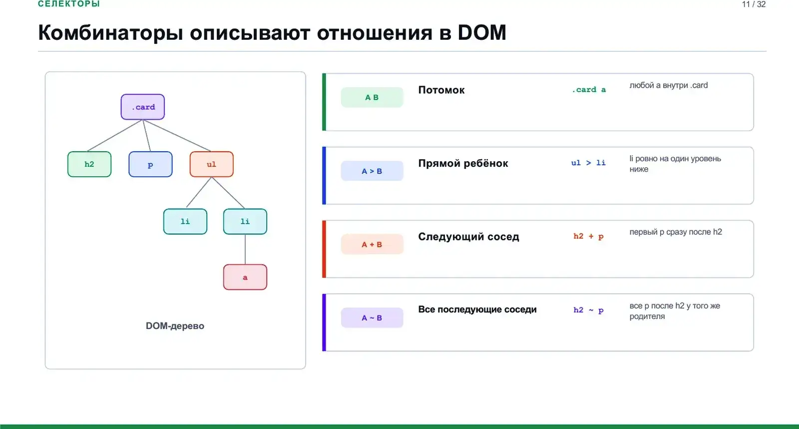

Бывает нужно применить стиль не к самому элементу, а к его потомкам, соседям и так далее. Для этого используются специальные символы-комбинаторы.

В реальной разработке они используются достаточно редко: воспринимать и отлаживать такие селекторы гораздо сложнее, чем простые. Основное правило — чем проще селекторы, тем лучше.

### Селекторы по атрибутам

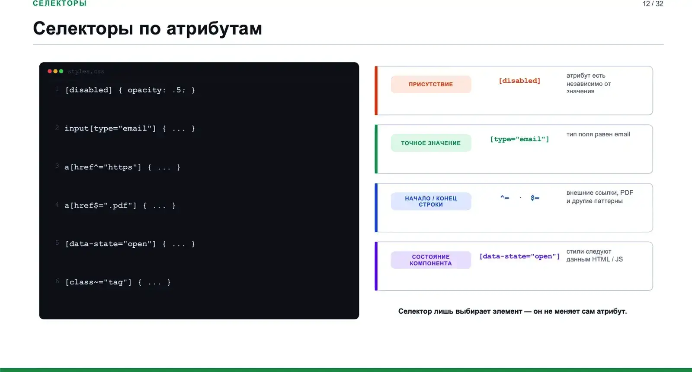

Можно выбирать элементы по наличию атрибута или по его значению. Например, в формах выбрать все поля определённого типа (скажем, поля для пароля).

### Псевдоклассы

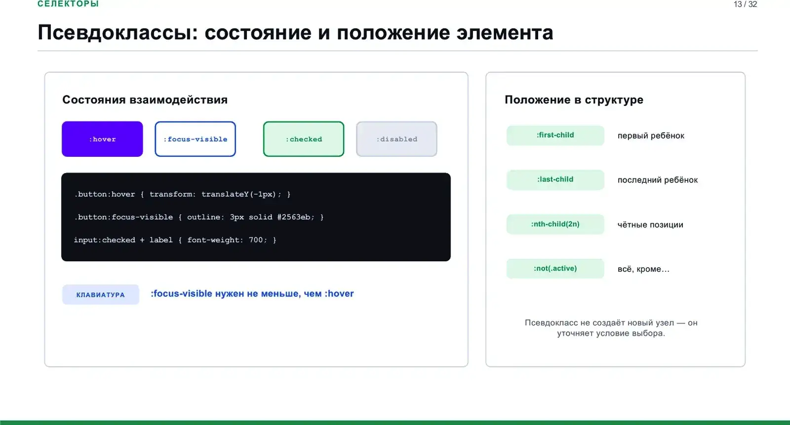

Описывают состояние элемента и взаимодействие с ним. Кроме `:hover`, самые распространённые — `:focus` и состояния элементов форм.

Именно псевдоклассы нельзя задать через inline-стиль — это одно из ограничений атрибута `style`.

### Псевдоэлементы

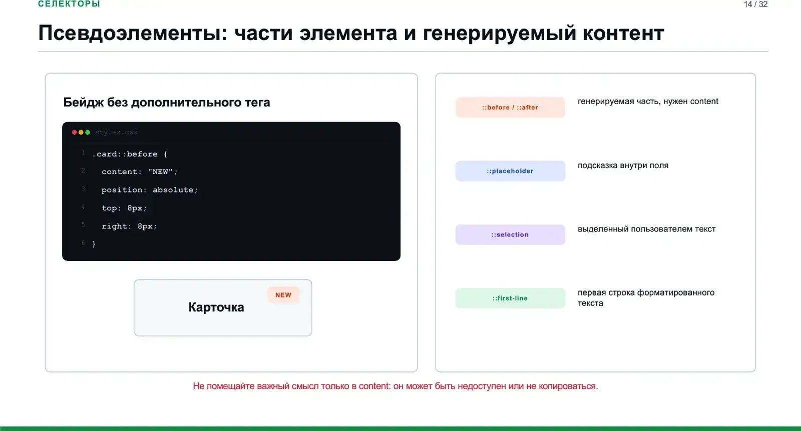

Сущности, которые добавляются на страницу средствами CSS, — `::before` и `::after`. Используются не так часто, но бывают очень полезны.

Пример: хотим добавить к элементу визуальный значок, который не должен быть частью контента, — например, знак Trade Mark рядом с названием компании. Через псевдоэлемент можно добавить блок, который **не является частью HTML**: он не учитывается для SEO и не читается скринридерами. Поэтому псевдоэлементы используются в основном для декора.

```css
.brand::after {
  content: "™";
}
```

## Каскад

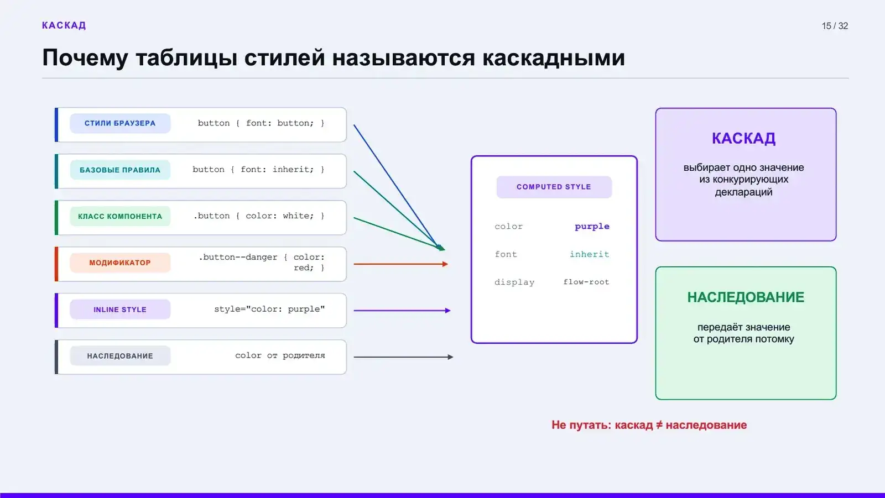

К одному элементу может подходить сразу несколько правил из разных источников, и все их значения собираются вместе. Например, селектор по тегу задаёт цвет, а селектор по классу — размер шрифта. В итоге элемент получит и цвет, и размер. Это и есть каскад.

## Наследование

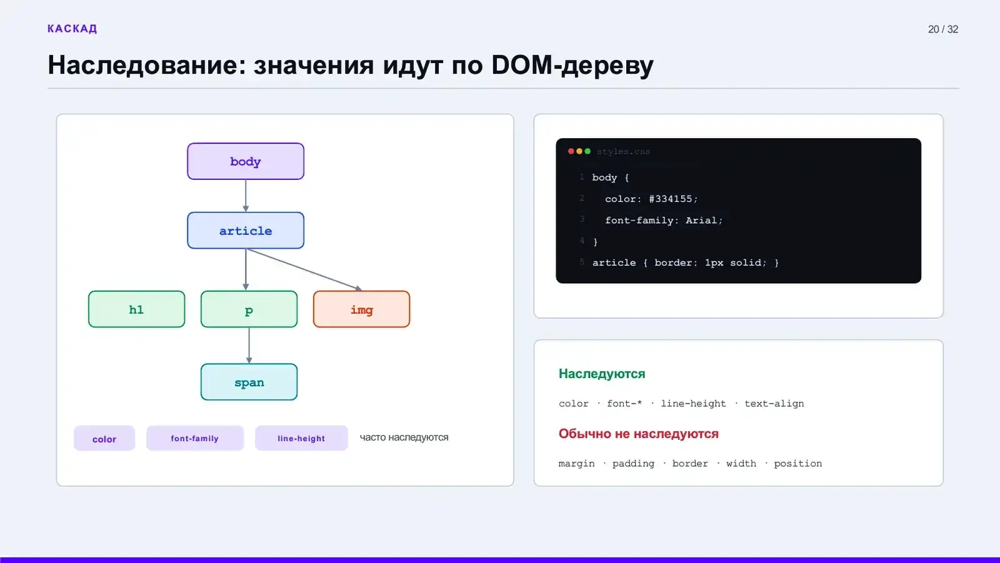
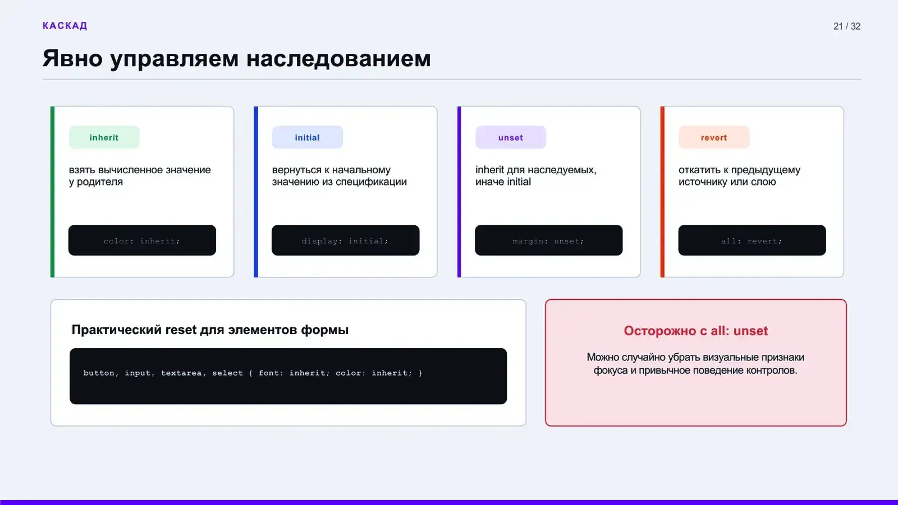

Некоторые свойства наследуются: если задать их родителю, потомки получат то же значение. Например, если задать цвет текста блоку, все потомки этого блока будут с таким же цветом текста.

Ключевое слово **`inherit`** говорит элементу взять значение свойства у родителя вместо значения по умолчанию или своего собственного. Пример применения — темы: на уровне родителя задаём цвет (светлый для одной темы, тёмный для другой), а потомки просто наследуют его от родителя, не создавая своих значений.

## Специфичность

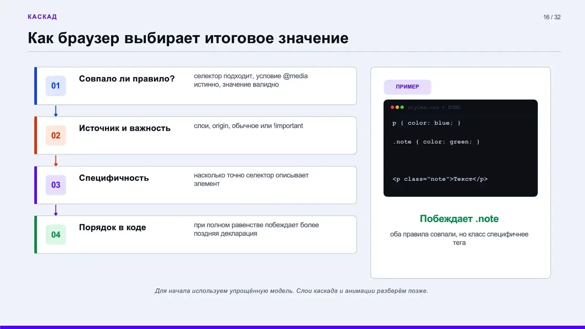
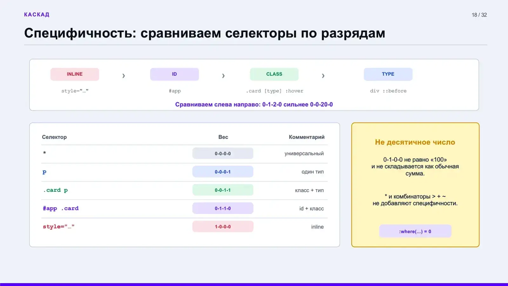
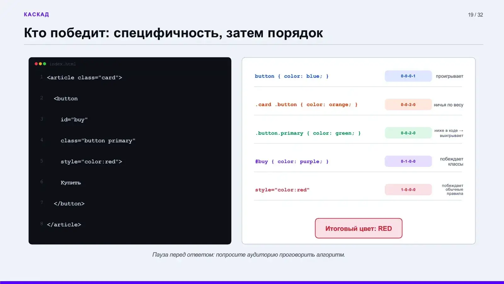

Когда несколько правил задают одно и то же свойство, браузер решает, какое применить, по **весу** (специфичности) селектора. Грубо говоря, у каждого вида селектора есть свой вес, и браузер сравнивает правила по нему — побеждает более весомое.

Иерархия от самого сильного к самому слабому:

1. inline-стили (атрибут `style`);
2. селекторы по id;
3. селекторы по классу;
4. селекторы по тегу.

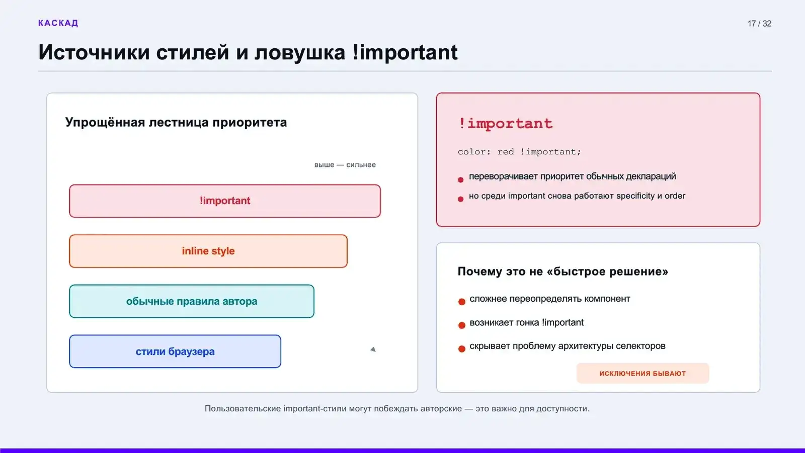

Кроме этого есть **`!important`**: на любом из уровней можно пометить значение как важное, и оно переопределит всё остальное.

### Что стоит запомнить

Вся история со специфичностью, переопределением через inline-стили, `!important` и так далее — это просто существующие возможности, а не то, чем стоит пользоваться в своём коде. Всё, что заставляет дополнительно держать в голове специфичность и переопределения, усложняет проект. Нужно бороться с этим и следовать правилу «чем проще, тем лучше».

Исключение — ситуации, когда без этого не обойтись. Например, вы встраиваете на свой сайт внешний модуль, который живёт самостоятельно и приносит свои стили, и повлиять на них напрямую нельзя. Тогда придётся переопределять его стили.

Если же необходимость в `!important` возникла внутри вашего собственного кода, скорее всего, стоит пересмотреть организацию стилей и селекторов, а не повышать вес.

## Отображение элементов

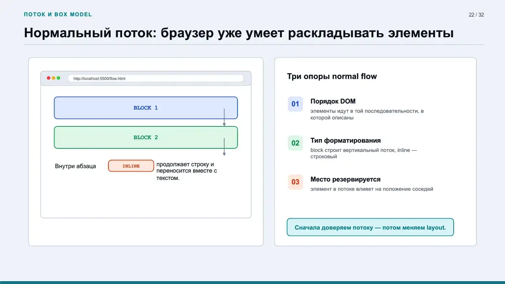
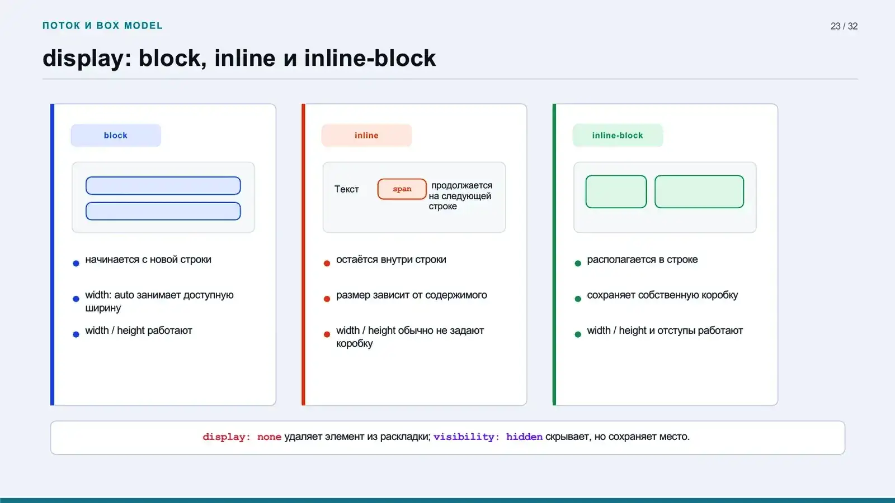

Каждый элемент отображается по своим правилам, которые задаются свойством `display`. Основные значения:

- **блочные элементы** занимают всю доступную ширину, следующий элемент начинается с новой строки;
- **строчные (inline)** элементы располагаются в строке друг за другом;
- промежуточный вариант, **inline-block**, сочетает поведение обоих.

## Блочная модель (box model)

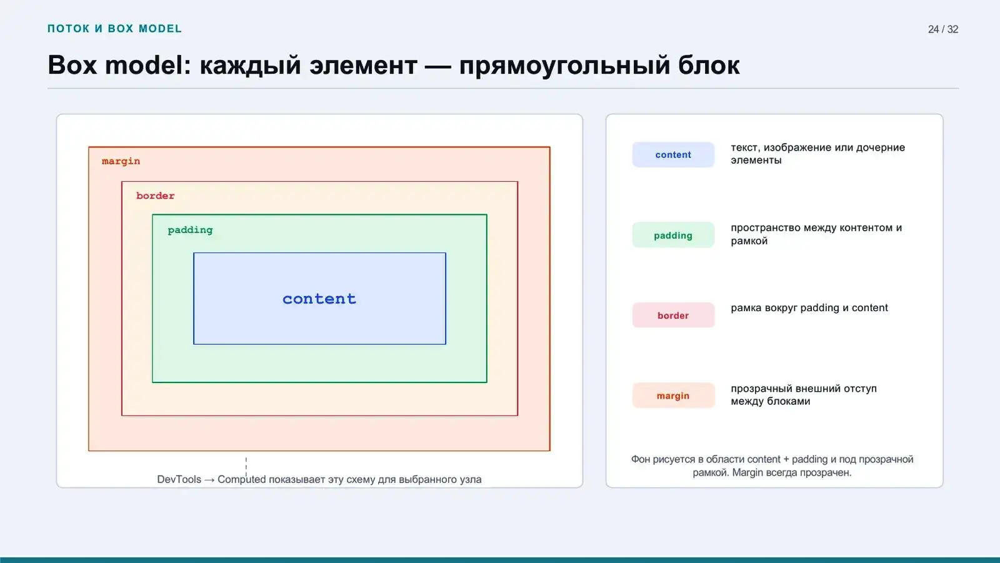

Очень важная концепция в разработке: любой элемент выстраивается в прямоугольный блок, у которого есть четыре части, определяющие его размер.

1. **Content** — непосредственно содержимое: текст, изображения.
2. **Padding** — внутренний отступ, расстояние от контента до границы.
3. **Border** — граница. Может быть невидимой, а может быть обозначена. Если у элемента граница 10 px, это влияет на его размер и, соответственно, на расположение соседних элементов.
4. **Margin** — внешний отступ, за пределами границы.

### `box-sizing`

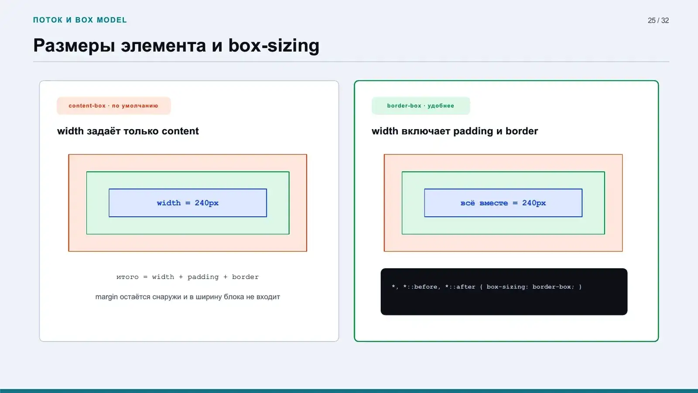

Размер задаётся свойствами `width` и `height`. Допустим, мы задали ширину 300 px. Как она будет посчитана, зависит от `box-sizing`:

- **`content-box`** (по умолчанию) — 300 px займёт только контент, а padding и border добавятся сверху. Итоговый элемент будет шире.
- **`border-box`** — 300 px включает всё вместе: контент, padding и border.

Об этом нужно помнить. Чтобы избежать неожиданностей, рекомендуется сделать глобальный сброс и указать, что все элементы используют `border-box`:

```css
* {
  box-sizing: border-box;
}
```

### Сокращённые записи отступов

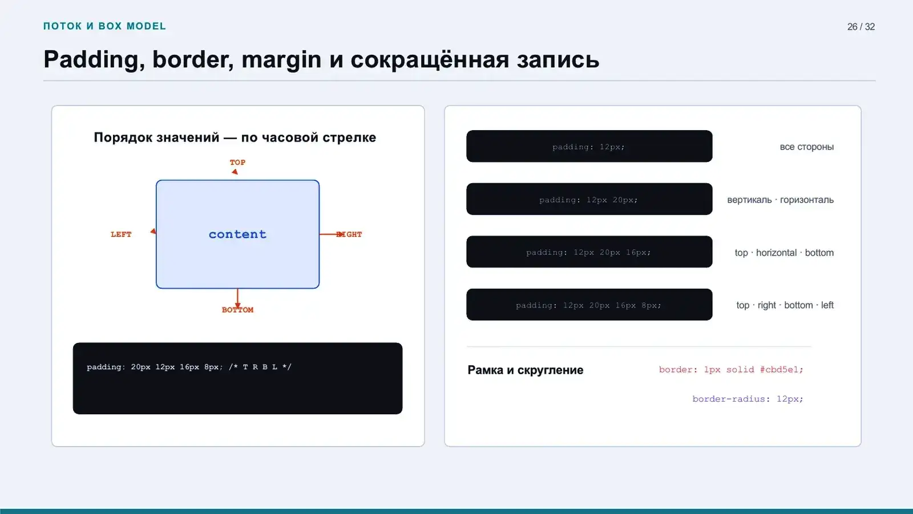

Отступы можно задавать для каждой стороны отдельно (`padding-top`, `padding-left` и т. д.) или сокращённой записью:

```css
padding: 10px;                /* одинаково со всех сторон */
padding: 10px 20px;           /* верх и низ | лево и право */
padding: 10px 20px 30px;      /* верх | лево и право | низ */
padding: 10px 20px 30px 40px; /* верх | право | низ | лево — по часовой стрелке */
```

С `margin` и с границами (`border`) всё то же самое.

### Относительные размеры и ограничения

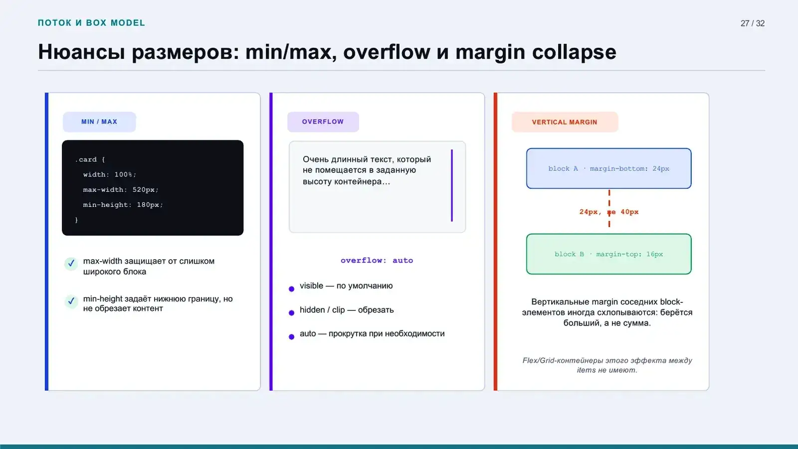

При вёрстке можно использовать относительные величины, например проценты: `width: 50%` — элемент займёт половину ширины родителя.

К этому можно добавить ограничения через `min-width` / `max-width` (и аналогично для высоты). Например: ширина 50 % от родителя, но не больше 320 px.

```css
.block {
  width: 50%;
  max-width: 320px;
}
```

### Переполнение

Бывает, что текст не помещается в размер блока, и нужно сказать, что с ним делать:

- просто обрезать то, что выходит за пределы;
- обрезать и автоматически поставить многоточие, показывая пользователю, что текст не поместился;
- добавить прокрутку.

## Позиционирование

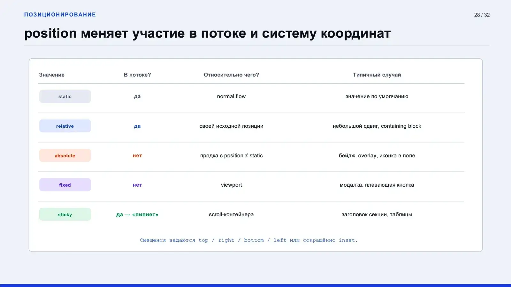
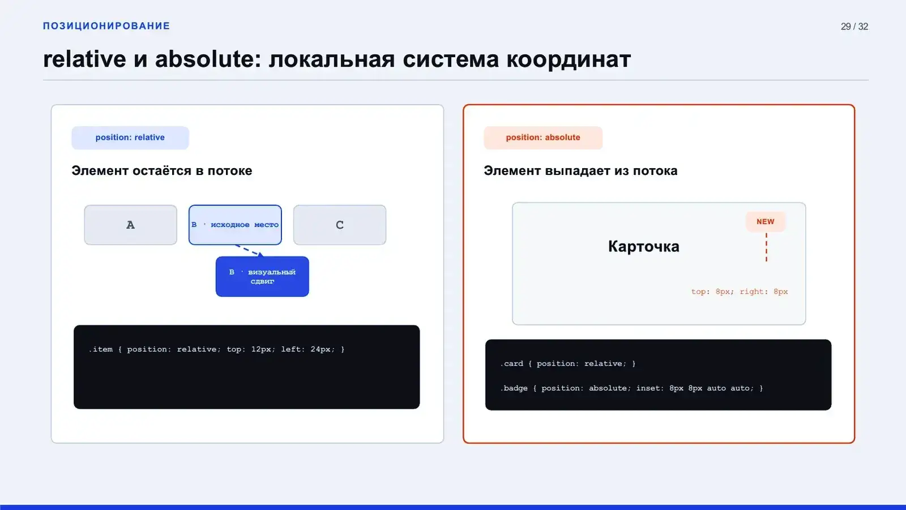

Свойство `position` определяет, как элемент располагается на странице. По умолчанию у всех элементов значение `static` — элементы идут в обычном потоке документа.

Если элементу задать позиционирование, выводящее его из потока (`absolute`), он смещается, а остальные элементы располагаются так, будто его нет.

Координаты такого элемента считаются не относительно всего документа, а относительно **ближайшего предка, у которого позиционирование отлично от `static`**.

### `z-index`

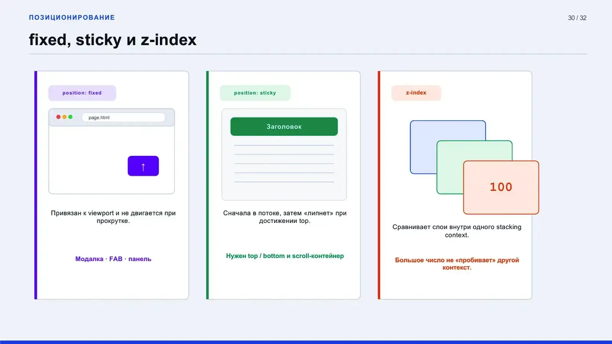

Когда элементы перекрывают друг друга, `z-index` определяет, какой из них окажется сверху. От этого зависит и то, с каким элементом пользователь сможет взаимодействовать. С `z-index` бывают неожиданные ситуации, если у разных элементов выставлены значения без системы.

## Flexbox

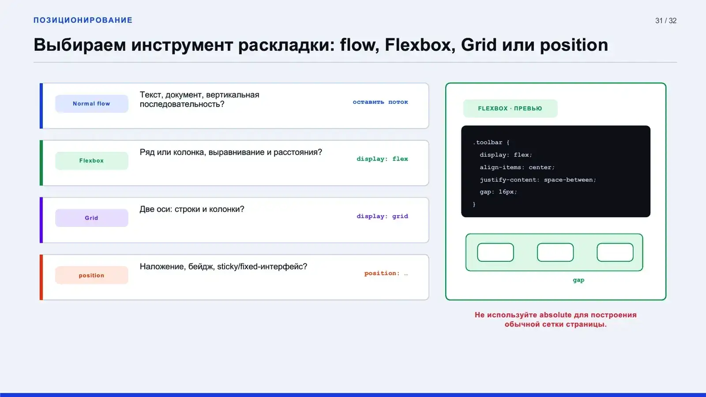

Изначально вёрстка была рассчитана на простое отображение документов. Из-за появления большого количества устройств с разными размерами экранов появились инструменты, которые позволяют верстать так, чтобы страница хорошо работала и на телефоне, и на десктопе. Один из них — Flexbox.

Идея: есть **flex-контейнер**, который может растягиваться в зависимости от экрана (такие вёрстки называют «резиновыми»), и внутри него — **flex-элементы**. В зависимости от настроек контейнера элементы ведут себя по-разному:

- пытаются занять всю доступную ширину;
- выстраиваются в ряд, а если не помещаются — переносятся на следующую строку и заполняют её;
- равномерно распределяются по доступной ширине.

Подключается максимально просто: контейнеру задаём `display: flex`, дальше настраиваем его свойствами.

```css
.container {
  display: flex;
  flex-direction: row;
  flex-wrap: wrap;
  justify-content: space-between;
}
```

### `flex-direction`

Задаёт направление основной оси:

- `row` — основная ось горизонтальная, элементы идут в строку;
- `column` — основная ось вертикальная, элементы идут столбцом.

### `flex-wrap`

Что делать, если элементы не помещаются:

- `wrap` — лишние элементы переносятся на следующую строку;
- `nowrap` — элементы остаются в одной строке и выходят за пределы контейнера.

### `justify-content`

Распределение элементов вдоль основной оси:

- `space-between` — первый и последний элементы прижаты к краям, остальные расставлены с одинаковым расстоянием между ними;
- `space-around` — похожее поведение, но пространство распределяется и вокруг крайних элементов, так что они не прижаты к краям.

Для хорошего понимания Flexbox полезно посмотреть интерактивную статью, где можно менять свойства контейнера и сразу видеть, как это влияет на элементы.
